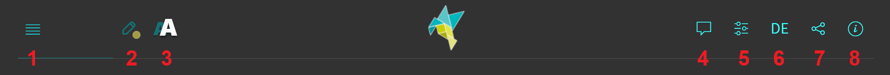

<!--
version:  0.0.1
language: de
narrator: Deutsch Female

import: https://raw.githubusercontent.com/MINT-the-GAP/Aufgabensammlung/main/imports/TafelREADME.md
import: https://raw.githubusercontent.com/MINT-the-GAP/Aufgabensammlung/main/imports/MarkerREADME.md
import: https://raw.githubusercontent.com/MINT-the-GAP/Aufgabensammlung/main/imports/FlexChildREADME.md
import: https://raw.githubusercontent.com/MINT-the-GAP/Aufgabensammlung/main/imports/DeutschREADME.md
import: https://raw.githubusercontent.com/MINT-the-GAP/Aufgabensammlung/main/imports/NavigationREADME.md
import: https://raw.githubusercontent.com/MINT-the-GAP/Aufgabensammlung/main/imports/TimerREADME.md
import: https://raw.githubusercontent.com/MINT-the-GAP/Aufgabensammlung/main/imports/CanvasREADME.md

tags: Wochenaufgabe, Deutsch, Klasse 5
comment: Dies sind die Wochenaufgaben 5 für die 5. Klasse. 
author: Martin Lommatzsch
-->

# Arbeitsblatt 5 für die 5. Klasse zum Selbstlernen

> Hier findest du die Wochenaufgaben für die 5. Woche. Damit kannst du bereits gelerntes Wissen wiederholen und den aktuellen Unterrichtsstoff üben. Am besten nimmst du dir ein Blatt Papier und arbeitest die Aufgaben Schritt für Schritt durch. Danach trägst du deine Lösungen ein und bekommst eine Musterlösung zum Vergleichen. Wenn du dich ein paar Mal vertan hast, kannst du dir bei manchen Aufgaben auch die komplette Lösung anzeigen lassen. Hin und wieder wird die Lösung erst nach einer gewissen Zeit freigeschaltet. Versuche aber bitte, ohne Hilfsmittel wie andere Apps zu arbeiten – sonst betrügst du dich nur selbst. Du kannst die Aufgaben auch auf deinem Handy, Tablet oder Laptop öffnen und jederzeit neu starten. Viel Erfolg – und wenn du Fragen oder Ideen hast, melde dich einfach bei mir! 
 - Martin Lommatzsch 

Hier hast du nochmal eine Übersicht über die Menüleiste:

> 
  

- 1. Inhaltsverzeichnis: Komme schnell zu deiner Aufgabe

- 2. Textmarker: Markiere dir wichtige Textpassagen

- 3. Schriftgrößenanpassung: Stelle dir die Schriftgröße für deinen optimalen Arbeitsmodus ein.

- 4. Darstellungsbreite: Es wird "Präsentation" empfohlen, aber probiere ruhig mal "Lehrbuch" aus.

- 5. Aussehen von LiaScript: Hier kannst du in den Dunkelmodus wechseln oder die Themefarben anpassen. Auch kannst du die Vorlesegeschwindigkeit sowie Stimmhöhe anpassen.

- 6. Automatische Übersetzung in andere Sprachen

- 7. Gruppenraum eröffnen: (Für dich wohl unwichtig, aber für LehrerInnen eventuell interessanter)

- 8. Informationen zum Kurs: Hier steht welche Version das Arbeitsblatt besitzt und wer das Arbeitsblatt erstellt hat.

Wenn du mit den Aufgaben beginnen willst, dann swipe (Wische) entweder weiter oder klicke unten neben der Seitenzahl auf den Pfeil nach rechts.

## Lesen und Verstehen

<h2>Das Achämenidenreich – ein Reich der vielen Völker</h2>

Das Achämenidenreich war vor etwa 2.500 Jahren (6.–4. Jahrhundert v. Chr.) eines der größten Reiche der Welt. Es reichte von Ägypten bis in Teile Indiens. Im Zentrum standen die persischen Könige, die sich „König der Könige“ nannten. Trotzdem lebten im Reich viele Völker mit eigenen Sprachen und Bräuchen. Um das große Gebiet zu regieren, teilten die Könige es in Provinzen, sogenannte Satrapien. Dort verwalteten Statthalter Steuern und sorgten für Ordnung. Für Nachrichten und Handel gab es gut ausgebaute Straßen; besonders bekannt ist der „Königsweg“ von Susa bis nach Sardes. An Stationen wechselten Boten ihre Pferde, damit wichtige Nachrichten schneller ankommen konnten. In vielen Ämtern nutzte man Aramäisch als gemeinsame Verwaltungssprache. In der Residenz Persepolis zeigen Reliefs, wie Abgesandte aus vielen Ländern dem König Geschenke bringen – ein Zeichen für die Vielfalt des Reiches.

Berühmt ist auch die Eroberung Babylons durch Kyros (Cyrus) im Jahr 539 v. Chr. Später nannten viele das eine „Befreiung Babylons“, weil Kyros sich als gerechter Herrscher darstellte. Er zog in die Stadt ein, ohne dass es zu einer großen Schlacht in der Stadt kam, und ließ die Tempel wieder pflegen. Auf dem sogenannten Kyros-Zylinder wird berichtet, dass er geraubte Götterstatuen an ihre Heiligtümer zurückbringen ließ und Menschen, die verschleppt worden waren, die Rückkehr erlaubte.

Unter Dareios I. entstand in Ägypten ein Wasserweg, der den Nil über das Wadi Tumilat und mehrere Seen mit dem Roten Meer verband. Dieser Kanal gilt als Vorläufer des Suezkanals, verlief aber anders als der moderne Kanal. Er erleichterte den Handel, weil Schiffe zwischen Ägypten und dem Perserreich leichter fahren konnten.

Dareios zeigte seine Macht auch mit Technik: Für einen Feldzug ließ er eine Schiffsbrücke über den Bosporus bauen – eine Brücke aus aneinandergereihten Booten. So konnte sein Heer zwischen Asien und Europa marschieren. Solche Projekte zeigen, wie gut das Reich organisiert war und wie sehr Handel, Verwaltung und Baukunst zusammenwirkten.

---

**Gib an**, ob die Aussage zu dem Text wahr oder falsch ist.

<!-- data-solution-timer="300s" data-solution-timer-start="oncheck" data-solution-timer-badge="off" -->
__$a)\;\;$__ [[(wahr)|falsch]] Das Achämenidenreich reichte laut Text von Ägypten bis in Teile Indiens.\
__$b)\;\;$__ [[(wahr)|falsch]] Im Text wird erklärt, dass das Reich in Satrapien (Provinzen) eingeteilt war.\
__$c)\;\;$__ [[wahr|(falsch)]] Der Text behauptet, dass überall im Reich nur Alt-Persisch als Verwaltungssprache benutzt wurde.\
__$d)\;\;$__ [[(wahr)|falsch]] Der „Königsweg“ führte laut Text von Susa bis nach Sardes.\
__$e)\;\;$__ [[(wahr)|falsch]] Kyros eroberte Babylon 539 v. Chr. und zog ein, ohne dass es in der Stadt zu einer großen Schlacht kam.\
__$f)\;\;$__ [[wahr|(falsch)]] Der Text sagt, Kyros habe die Tempel in Babylon zerstören lassen.\
__$g)\;\;$__ [[(wahr)|falsch]] Der Kanal unter Dareios I. verband den Nil über das Wadi Tumilat und Seen mit dem Roten Meer und gilt als Vorläufer des Suezkanals.\
__$h)\;\;$__ [[wahr|(falsch)]] Laut Text verlief dieser alte Kanal genau auf derselben Strecke wie der heutige Suezkanal.\
__$i)\;\;$__ [[(wahr)|falsch]] Die Schiffsbrücke über den Bosporus bestand aus Booten und half Dareios, zwischen Asien und Europa zu marschieren.\
__$j)\;\;$__ [[wahr|(falsch)]] Laut Text ließ Xerxes die Schiffsbrücke über den Bosporus bauen.\

## Satzglieder bestimmen

**Markiere** @markedred(das Subjekt in rot), @markedblue(das Prädikat in blau) und @markedgreen(das Objekt in grün).

<section class="dynFlex">

<!-- data-solution-timer="90s" data-solution-timer-start="oncheck" data-solution-timer-badge="off" -->
__$a)\;\;$__

@markred(Die Katze) @markblue(jagt) @markgreen(die Maus).
@TextmarkerQuiz

<!-- data-solution-timer="90s" data-solution-timer-start="oncheck" data-solution-timer-badge="off" -->
__$b)\;\;$__

Heute @markblue(baut) @markred(Tom) @markgreen(eine Burg) @markblue(aus) @markgreen(Sand).
@TextmarkerQuiz

<!-- data-solution-timer="90s" data-solution-timer-start="oncheck" data-solution-timer-badge="off" -->
__$c)\;\;$__

Nach der Schule @markblue(kauft) @markred(meine Freundin) @markgreen(ein Brot).
@TextmarkerQuiz

<!-- data-solution-timer="90s" data-solution-timer-start="oncheck" data-solution-timer-badge="off" -->
__$d)\;\;$__

Im Park @markblue(füttert) @markred(der Junge) @markgreen(die Enten).
@TextmarkerQuiz

<!-- data-solution-timer="90s" data-solution-timer-start="oncheck" data-solution-timer-badge="off" -->
__$e)\;\;$__

Am Morgen @markblue(putzt) @markred(meine Schwester) @markgreen(ihre Zähne).
@TextmarkerQuiz

<!-- data-solution-timer="90s" data-solution-timer-start="oncheck" data-solution-timer-badge="off" -->
__$f)\;\;$__

Im Garten @markblue(gießt) @markred(der Opa) @markgreen(die Blumen).
@TextmarkerQuiz

<!-- data-solution-timer="90s" data-solution-timer-start="oncheck" data-solution-timer-badge="off" -->
__$g)\;\;$__

Plötzlich @markblue(verliert) @markred(das Mädchen) @markgreen(seinen Ball).
@TextmarkerQuiz

<!-- data-solution-timer="90s" data-solution-timer-start="oncheck" data-solution-timer-badge="off" -->
__$h)\;\;$__

Am Wochenende @markblue(besucht) @markred(die Familie) @markgreen(den Zoo).
@TextmarkerQuiz

<!-- data-solution-timer="90s" data-solution-timer-start="oncheck" data-solution-timer-badge="off" -->
__$i)\;\;$__

Im Klassenzimmer @markblue(öffnet) @markred(die Lehrerin) @markgreen(das Fenster).
@TextmarkerQuiz

<!-- data-solution-timer="90s" data-solution-timer-start="oncheck" data-solution-timer-badge="off" -->
__$j)\;\;$__

Nach dem Training @markblue(zieht) @markred(der Spieler) @markgreen(seine Schuhe) @markblue(aus).
@TextmarkerQuiz

</section>

## Klein- und Großschreibung

**Schreibe** den Satz mit korrekter Klein- und Großschreibung **ab**.

<section class="dynFlex">

$a)\;\;$ DIE GESTREIFTE KATZE SITZT AUF EINER ÜBERWUCHERTEN MAUER.

<!-- data-solution-timer="120s" data-solution-timer-start="oncheck" data-solution-timer-badge="off" -->
[[    Die gestreifte Katze sitzt auf einer überwucherten Mauer.    ]]

$b)\;\;$ AM MORGEN SCHEINT DIE HELLE SONNE ÜBER DEM STILLEN SEE.

<!-- data-solution-timer="120s" data-solution-timer-start="oncheck" data-solution-timer-badge="off" -->
[[    Am Morgen scheint die helle Sonne über dem stillen See.    ]]

$c)\;\;$ MEINE FREUNDIN SCHREIBT EINEN LUSTIGEN BRIEF AN IHREN BRUDER.

<!-- data-solution-timer="120s" data-solution-timer-start="oncheck" data-solution-timer-badge="off" -->
[[    Meine Freundin schreibt einen lustigen Brief an ihren Bruder.    ]]

$d)\;\;$ IM KLASSENZIMMER HÄNGT EIN BUNTES PLAKAT AN DER WEISSEN WAND.

<!-- data-solution-timer="120s" data-solution-timer-start="oncheck" data-solution-timer-badge="off" -->
[[    Im Klassenzimmer hängt ein buntes Plakat an der weißen Wand.    ]]

$e)\;\;$ PLÖTZLICH FINDET DAS KIND SEINEN VERLORENEN SCHLÜSSEL UNTER DEM ALTEN STUHL.

<!-- data-solution-timer="120s" data-solution-timer-start="oncheck" data-solution-timer-badge="off" -->
[[    Plötzlich findet das Kind seinen verlorenen Schlüssel unter dem alten Stuhl.    ]]

$f)\;\;$ NACH DEM ESSEN RÄUMT PAUL DIE LEEREN TELLER IN DIE GROSSE KÜCHE.

<!-- data-solution-timer="120s" data-solution-timer-start="oncheck" data-solution-timer-badge="off" -->
[[    Nach dem Essen räumt Paul die leeren Teller in die große Küche.    ]]

$g)\;\;$ AM WOCHENENDE BESUCHEN WIR EINEN SPANNENDEN FILM IM NEUEN KINO.

<!-- data-solution-timer="120s" data-solution-timer-start="oncheck" data-solution-timer-badge="off" -->
[[    Am Wochenende besuchen wir einen spannenden Film im neuen Kino.    ]]

$h)\;\;$ DER KLEINE HUND RENNT DURCH DEN GROSSEN GARTEN.

<!-- data-solution-timer="120s" data-solution-timer-start="oncheck" data-solution-timer-badge="off" -->
[[    Der kleine Hund rennt durch den großen Garten.    ]]

</section>

## Kommasetzung

**Setze** die Kommata an die richtigen Stellen.

<section class="dynFlex">

__$a)\;\;$__ 
@orthography(10,`Das ist der Tag an dem ich geblitzt wurde.`,`Das ist der Tag, an dem ich geblitzt wurde.`)

__$b)\;\;$__ 
@orthography(10,`Der Bruder den ich mag.`,`Der Bruder, den ich mag.`)

__$c)\;\;$__ 
@orthography(10,`Wenn der Wecker klingelt stehe ich sofort auf.`,`Wenn der Wecker klingelt, stehe ich sofort auf.`)

__$d)\;\;$__ 
@orthography(10,`Ich hoffe dass du morgen Zeit hast.`,`Ich hoffe, dass du morgen Zeit hast.`)

__$e)\;\;$__ 
@orthography(10,`Sie sagt sie komme später nach.`,`Sie sagt, sie komme später nach.`)

__$f)\;\;$__ 
@orthography(10,`Das Buch das auf dem Tisch liegt gehört mir.`,`Das Buch, das auf dem Tisch liegt, gehört mir.`)

__$g)\;\;$__ 
@orthography(10,`Als der Film begann wurde es im Raum ganz still.`,`Als der Film begann, wurde es im Raum ganz still.`)

__$h)\;\;$__ 
@orthography(10,`Ich glaube ich habe meinen Schlüssel verloren.`,`Ich glaube, ich habe meinen Schlüssel verloren.`)

__$i)\;\;$__ 
@orthography(10,`Das Fahrrad das im Hof steht ist ganz neu.`,`Das Fahrrad, das im Hof steht, ist ganz neu.`)

__$j)\;\;$__ 
@orthography(10,`Die Schülerin die neben mir sitzt erklärt mir die Aufgabe.`,`Die Schülerin, die neben mir sitzt, erklärt mir die Aufgabe.`)

</section>

## Einen Text in die richtige Reihenfolge bringen

**Bestimme** die richtige Reihenfolge des Textes.

<!-- data-solution-timer="300s" data-solution-timer-start="oncheck" data-solution-timer-badge="off" data-randomize="true" -->
I. [->[Im alten Mesopotamien, im Land Babylon, lebten viele Menschen in großen Städten. Sie handelten, bauten Häuser, liehen Geld und stritten manchmal. Damit das Zusammenleben klappt, braucht man Regeln: Wer hat recht? Wer muss zahlen? Was passiert bei Diebstahl oder Verletzungen?]] \
II. [->[Daraufhin ließ König Hammurapi, der vor fast 3.800 Jahren über Babylon regierte (etwa um 1750 v. Chr.), Regeln für sein Reich sammeln und festschreiben. Sein Ziel war: Nicht jede Stadt soll anders entscheiden, sondern überall sollen ähnliche Maßstäbe gelten.]] \
III. [->[Diese geordnete Sammlung nennt man heute den Codex Hammurapi. „Codex“ bedeutet hier: ein Regelwerk. Der Text bestand aus vielen einzelnen Bestimmungen, also klaren Regeln für bestimmte Fälle.]] \
IV. [->[Um die Regeln sichtbar zu machen, wurden sie in Akkadisch auf eine große Stele (eine aufrecht stehende Steinplatte) gemeißelt. Oben sieht man ein Bild: Hammurapi steht vor dem Sonnengott Schamasch, der als Gott des Rechts galt.]] \
V. [->[Im nächsten Schritt wird deutlich, worum es im Alltag ging: Der Codex behandelt Handel, Schulden, Löhne, Häuserbau, Diebstahl, Körperverletzung und Familienfragen. Viele Sätze sind nach dem Muster geschrieben: Wenn etwas passiert, dann folgt eine bestimmte Strafe oder Zahlung.]] \
VI. [->[Ein bekanntes Prinzip lautet „Auge um Auge, Zahn um Zahn“. Gemeint war: Die Strafe soll zum Schaden passen und nicht viel schlimmer sein. Trotzdem machte der Codex Unterschiede: Menschen wurden je nach sozialem Stand nicht immer gleich behandelt.]] \
VII. [->[Warum war das wichtig? Der Codex sollte Ordnung schaffen und Hammurapi als gerechten Herrscher zeigen. Er war nicht das erste Gesetz der Welt, aber er ist besonders gut erhalten und zeigt, wie man damals Recht verstand.]] \
VIII. [->[Heute steht die berühmte Stele im Louvre in Paris. Für Historiker ist sie wie ein Fenster in die Vergangenheit: Man erkennt, welche Berufe es gab, wie Handel funktionierte und welche Regeln Menschen im alten Babylon kannten.]] \

## Rechtschreibtraining

**Entscheide**, ob s, ss oder ß.

<section class="dynFlex">

__$a)\;\;$__ 
@orthography(10,`Genu_`,`Genuß`)

__$b)\;\;$__ 
@orthography(10,`Me_er`,`Messer`)

__$c)\;\;$__ 
@orthography(10,`vergie_en`,`vergießen`)

__$d)\;\;$__ 
@orthography(10,`hei_en`,`heißen`)

__$e)\;\;$__ 
@orthography(10,`drau_en`,`draußen`)

__$f)\;\;$__ 
@orthography(10,`blo_`,`bloß`)

__$g)\;\;$__ 
@orthography(10,`Fa_ade`,`Fassade`)

__$h)\;\;$__ 
@orthography(10,`Ki_en`,`Kissen`)

__$i)\;\;$__ 
@orthography(10,`Mu_`,`Muss`)

__$j)\;\;$__ 
@orthography(10,`Pre_e`,`Presse`)

__$k)\;\;$__ 
@orthography(10,`a_en`,`assen`)

__$l)\;\;$__ 
@orthography(10,`spa_ig`,`spaßig`)

__$m)\;\;$__ 
@orthography(10,`Erlebni_`,`Erlebnis`)

__$n)\;\;$__ 
@orthography(10,`Grä_er`,`Gräser`)

</section>
