<!--
version:  0.5.0
language: de
narrator: Deutsch Female

mode: Presentation

import: https://raw.githubusercontent.com/MINT-the-GAP/lia-DynFlex/refs/heads/main/README.md
import: https://raw.githubusercontent.com/MINT-the-GAP/lia-timer/refs/heads/main/README.md
import: https://raw.githubusercontent.com/MINT-the-GAP/lia-board-mode/refs/heads/main/README.md
import: https://raw.githubusercontent.com/MINT-the-GAP/lia-marker/refs/heads/main/README.md
import: https://raw.githubusercontent.com/MINT-the-GAP/lia-annotation/refs/heads/main/README.md
import: https://raw.githubusercontent.com/MINT-the-GAP/lia-canvas-ocr/refs/heads/main/README.md
import: https://raw.githubusercontent.com/MINT-the-GAP/lia-orthography/refs/heads/main/README.md
import: https://raw.githubusercontent.com/MINT-the-GAP/lia-Mathe/refs/heads/main/README.md
import: https://raw.githubusercontent.com/MINT-the-GAP/lia-kachel/refs/heads/main/README.md
import: https://raw.githubusercontent.com/MINT-the-GAP/lia-navigation/refs/heads/main/README.md
import: https://raw.githubusercontent.com/MINT-the-GAP/lia-mathpath/refs/heads/master/README.md

import: https://raw.githubusercontent.com/MINT-the-GAP/lia-llm/refs/heads/main/README.md

import: https://raw.githubusercontent.com/liaTemplates/algebrite/master/README.md
import: https://raw.githubusercontent.com/liaTemplates/JSXGraph/main/README.md

import: https://raw.githubusercontent.com/MINT-the-GAP/lia-resetter/main/README.md

import: https://raw.githubusercontent.com/MINT-the-GAP/lia-coordinate/refs/heads/main/README.md
import: https://raw.githubusercontent.com/MINT-the-GAP/lia-freeze-v2/main/README.md
import: https://raw.githubusercontent.com/MINT-the-GAP/lia-loot/main/README.md

tags: Wochenaufgabe, Sachunterricht, Klasse 5, Grundschulwiederholung

comment: Dies sind die Wochenaufgaben zum Einstieg für die 5. Klasse. 

author: Martin Lommatzsch

-->

# LiaScript-Aufgaben für das "Digitale Lernen" zum Beginn der 5. Klasse - Sachunterricht

@Ressourcen(50, 50, 150)
@achievements
@Highscore(10000, 100, 250, 20, 500)

@Schatztruhe(annotation; anker)
@Diamanttruhe(boardmode)
@Energiekiste(textmarker; anker; zauberstaub)

> [!NOTE]
> Willkommen in der 5. Klasse! In dieser Wochenaufgabe wiederholst du wichtige Grundlagen aus der Grundschule und lernst typische Aufgabenformen für den Unterricht in verschiedenen Fächern kennen. Arbeite sorgfältig und nutze für Notizen ein Blatt Papier. Kontrolliere deine Eingaben, bevor du sie überprüfst. Viel Erfolg! 
– Martin Lommatzsch

> [!IMPORTANT]
> <h3>Diese Wochenaufgabe kann abgegeben werden, richte dich nach deiner Lehrkraft. Am Ende des Kurses kannst du den Kurs einfrieren. Dabei entsteht ein Link, den du über LernSax an deine Lehrerin oder deinen Lehrer sendest.</h3>

---

---

> [!CAUTION]
> <h2>Gamifizierung</h2>

<section class="dynFlex">

Du hast Ressourcen:
- `Energie` um den Prüfenbutton benutzen zu können
- `Münzen` um den Hinweisbutton benutzen zu können
- `Diamanten` um den Auflösenbutton benutzen zu können

Außerdem kannst du `Truhen` finden mit den Ressourcen. Machne Inhalte sind aber verschlossen und du musst zuvor den `Schlüssel` finden. Andere Inhalte sind `versteckt`, dafür brauchst du die Lupe. Mache versteckte Inhalte kannst du schon erahnen anderen nicht. Und mit den Portalen kannst du in andere Folien wechseln.

Schau dich gut um, denn überall könnte etwas versteckt sein. Du bekommst Erfolge, wenn du besonders viel gefunden oder die Aufgaben besonders gut gemacht hast.

<!-- style="display: block; margin-block-end: -2rem; border: 0px solid rgb(var(--color-highlight)); border-radius: 8px; max-width=500px" -->

$\,$

</section>

---

---

<section class="dynFlex">

Du kannst dir die Arbeitsbreite von einigen Aufgaben anpassen. Das erkennst du an der verschiebbaren Linie rechts: 

Viele der Bedienungsoptionen sind in kleinen gif-Animationen dargestellt.

<!-- style="display: block; margin-block-end: -2rem; border: 0px solid rgb(var(--color-highlight)); border-radius: 8px; max-width=500px" -->

$\,$

</section>

---

---

> [!CAUTION]
> <h2>Hier hast du nochmal eine Übersicht über die Menüleiste:</h2>
> 
  

$\,$

<section class="dynFlex">

- 1. Inhaltsverzeichnis: Komme schnell zu deiner Aufgabe. \
Du kannst die Folien auch wechseln, wenn du die Pfeiltasten nach links oder rechs drückst. \
Unten links kannst du auch mit der Maus die Folie wechseln.\

<!-- style="display: block; margin-block-end: -2rem; border: 0px solid rgb(var(--color-highlight)); border-radius: 8px; max-width=100px" -->

$\,$

<!-- style="display: block; margin-block-end: -2rem; border: 0px solid rgb(var(--color-highlight)); border-radius: 8px; max-width=500px" -->

$\,$

</section>

<section class="dynFlex">

- 2. Textmarker: Markiere dir wichtige Textpassagen

<!-- style="display: block; margin-block-end: -2rem; border: 0px solid rgb(var(--color-highlight)); border-radius: 8px; max-width=500px" -->

$\,$

</section>

<section class="dynFlex">

- 3. Schriftgrößenanpassung: Stelle dir die Schriftgröße für deinen optimalen Arbeitsmodus ein. \
Du kannst auch noch dazu Zoomen, indem du die Taste `strg` gedrückt hälst und das Mausrad drehst.

<!-- style="display: block; margin-block-end: -2rem; border: 0px solid rgb(var(--color-highlight)); border-radius: 8px; max-width=500px" -->

$\,$

</section>

<section class="dynFlex">

- 4. Darstellungsbreite: Es wird "Präsentation" empfohlen, aber probiere ruhig mal "Lehrbuch" aus.

</section>

<section class="dynFlex">

- 5. Aussehen von LiaScript: Hier kannst du in den Dunkelmodus wechseln oder die Themefarben anpassen. Auch kannst du die Vorlesegeschwindigkeit sowie Stimmhöhe anpassen.

<!-- style="display: block; margin-block-end: -2rem; border: 0px solid rgb(var(--color-highlight)); border-radius: 8px; max-width=500px" -->

$\,$

</section>

<section class="dynFlex">

- 6. Automatische Übersetzung in andere Sprachen. Diese Funktion kann aber auch durch die Lehrkraft blockiert sein.

<!-- style="display: block; margin-block-end: -2rem; border: 0px solid rgb(var(--color-highlight)); border-radius: 8px; max-width=500px" -->

$\,$

</section>

<section class="dynFlex">

- 7. Gruppenraum eröffnen: (Für dich wohl unwichtig, aber für Lehrkräfte eventuell interessanter)

</section>

<section class="dynFlex">

- 8. Informationen zum Kurs: Hier steht welche Version das Arbeitsblatt besitzt und wer das Arbeitsblatt erstellt hat.

</section>

---

---

> [!CAUTION]
> <h2>**Schrifterkennung**</h2>

Wenn du nicht weißt wie man eine Lösung eintippt, kannst du mit der mathematischen Schrifterkennung deine Lösungen übergeben. Wenn du die Lösung wie im Mathematikunterricht erlernt niederschreibst und dabei sauber schreibst, sollte die Schrifterkennung deine Lösungsvorschläge erkennen. Beim ersten Mal wird die Schrifterkennung etwas länger zum Laden brauchen, danach kann sie schneller aktiviert werden.

<section class="dynFlex">

<!-- style="display: block; margin-block-end: -2rem; border: 0px solid rgb(var(--color-highlight)); border-radius: 8px; max-width=400px" -->

$\,$

<!-- style="display: block; margin-block-end: -2rem; border: 0px solid rgb(var(--color-highlight)); border-radius: 8px; max-width=500px" -->

$\,$

</section>

1. Öffnet oder schließt die Schreibfläche.

2. Macht die letzte Änderung auf der Schreibfläche rückgängig.

3. Stellt das letzte "Rückgängig machen" wieder her.

4. Radierer mit Submenü für Radierergröße oder komplettes löschen.

5. Stift mit Submenü für Farbauswahl, Stiftdicke und Transparenz.

6. Legt ein Grid oder Linien in den Hintergrund.

7. Lässt ein Feld ziehen, welches mittels Schrifterkennung an das Eingabefeld als Lösung übergibt.

8. Unten rechs an der Ecke kann die Canvas verkleinert oder vergrößert werden.

9. Das klassische Eingabefeld für ein Quiz, um die Lösung einzutragen oder zu bearbeiten.

> **Steuerung mit Maus**

- Linke Maustaste: Zeichnen, Radieren, Ziehen

- Rechte Maustaste: Schreibfläche hin- und herziehen

- Mausrad: Zoom

> **Steuerung mit Touchscreen**

- Ein Finger:  Zeichnen, Radieren, Ziehen

- Zwei Finger (Abstand zwischen den Fingern gleichbleibend): Schreibfläche hin- und herziehen

- Zwei Finger (Abstand zwischen den Fingern verändern): Zoom

---

---

> [!CAUTION]
> <h2>**Annotationen**</h2>

<section class="dynFlex">

Mit der Annotationsbar am linken Rand kannst du überall hinschreiben und dir Notizen machen. Du kannst sie auch ein- und ausblenden. Auch die Schrifterkennung kann hier angewendet werden.

<!-- style="display: block; margin-block-end: -2rem; border: 0px solid rgb(var(--color-highlight)); border-radius: 8px; max-width=500px" -->

$\,$

</section>

---

---

> [!CAUTION]
> Du wirst jede Woche andere Aufgaben und auch Aufgabentypen sehen, sodass du auch neue Funktionen benutzen musst. Mal musst du Antworten auswählen, mal sie als Kachel ins Ziel ziehen.

**Wenn du mit den Aufgaben beginnen willst, dann swipe (wische) entweder weiter oder klicke unten neben der Seitenzahl auf den Pfeil nach rechts.**

---

---

## Baumbestimmung

**Ordne** jedem Baum seine Blätter **zu**, indem du die Kacheln in das passende Feld ziehst.

<!-- data-randomize="true" data-show-partial-solution="true" data-solution-timer="300s" data-solution-timer-start="oncheck" data-solution-timer-badge="off" -->

Ahorn: [->[(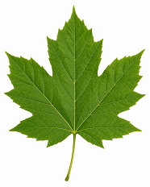)]]  $\;\qquad\,$
Birke: [->[(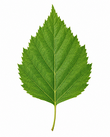)]] $\;\qquad\;\;\;$
Eberesche: [->[()]] $\;\;\quad\;\;\;$
Eiche: [->[(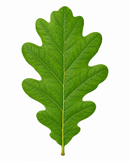)]] $\;\quad\;$ \
Kastanie: [->[()]] $\;\quad\;$
Rotbuche: [->[()]] $\;\quad\;$
Silberpappel: [->[(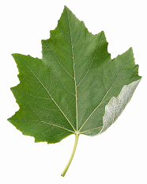)]] $\;\quad\;$
Vogelkirsche: [->[(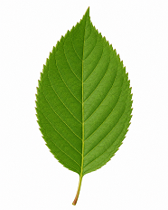)]]
 
*****************
@Energiekiste
@Energiekiste
*****************

@ADetails(BE=4;Blättern von Bäumen)

<small> <small> <small><small> Quelle: Mit einem LLM generiert. </small></small></small></small>

## Elektrizität

__Aufgabe 1:__ Mias Lampe leuchtet nicht. Batterie, Lampe, Schalter und Kabel sind verbunden. Mia verändert immer nur eine Sache und notiert das Ergebnis.

<!--  data-type="none" data-sortable="false"  -->
| Versuch | Veränderung | Beobachtung |
|:--:|:--|:--|
| 0 | ursprünglicher Aufbau | Lampe leuchtet nicht |
| 1 | neue Batterie eingesetzt | Lampe leuchtet nicht |
| 2 | wieder alte Batterie, aber neue Lampe eingesetzt | Lampe leuchtet nicht |
| 3 | wieder ursprünglicher Aufbau, einen lockeren Kabelkontakt festgedrückt | Lampe leuchtet |

**Werte** die Versuche **aus**. Nutze für die Ursache einen Begriff aus der Tabelle.

<!-- data-solution-timer="300s" data-solution-timer-start="oncheck" data-solution-timer-badge="off" data-show-partial-solution="true"  data-type="none" data-sortable="false" -->
| Frage | Antwort |
|:--|:--:|
| War die Batterie die Ursache? Antworte mit *ja* oder *nein*. | [[ nein ]] |
| War die Lampe die Ursache? Antworte mit *ja* oder *nein*. | [[ nein ]] |
| Ergänze mit einem Begriff aus Versuch 3: Locker war der ... | [[ Kabelkontakt ]] |
| War der Stromkreis vor dem Festdrücken *offen* oder *geschlossen*? | [[ offen ]] |
*****************
@Lupe
@Schluessel(gelb)
*****************

@ADetails(BE=4;Fehlersuche im Stromkreis)

---

---

__Aufgabe 2:__ Der Kontrollversuch

Eine Gruppe prüft drei unbekannte Gegenstände in einem einfachen Stromkreis. Vor und nach jedem Gegenstand setzt sie eine Büroklammer aus Stahl als bekannten Leiter ein. So kann die Gruppe kontrollieren, ob der Stromkreis noch funktioniert. **Sortiere** die Arbeitsschritte für eine zuverlässige Untersuchung.

<!-- data-solution-timer="240s" data-solution-timer-start="oncheck" data-solution-timer-badge="off" data-show-partial-solution="true" data-randomize="true" -->
[->[(Stromkreis mit dem bekannten Leiter prüfen)]] [->[(unbekannten Gegenstand einsetzen und beobachten)]] [->[(Stromkreis erneut mit dem bekannten Leiter prüfen)]] [->[(Beobachtungen vergleichen und Schlussfolgerung ziehen)]]
*****************
@Energiekiste
@Energiekiste
*****************

@ADetails(BE=2;Kontrollversuch)

## Magnetismus

__Aufgabe 1:__ Bei Magnet A sind die Pole bekannt. Die Magnete B und C sind nicht beschriftet.

- Der rechte Pol von Magnet A ist ein **Südpol**.
- Der rechte Pol von A und der linke Pol von B **stoßen sich ab**.
- Der rechte Pol von B und der linke Pol von C **ziehen sich an**.

__$a)\;\;$__ **Erschließe** die fehlenden Pole. Trage *Nord* oder *Süd* ein.

<!-- data-solution-timer="300s" data-solution-timer-start="oncheck" data-solution-timer-badge="off" data-show-partial-solution="true"  data-type="none" data-sortable="false" -->
| Magnet | linker Pol | rechter Pol |
|:--:|:--:|:--:|
| A | Nord | Süd |
| B | [[ Süd ]] | [[ Nord ]] |
| C | [[ Süd ]] | [[ Nord ]] |
*****************
@Schluessel(blau; unsichtbar)
@Einwegportal(7)
@Schloss(portal, gelb)
*****************

@ADetails(BE=2;Magnetpole erschließen)

__$b)\;\;$__ **Sage** die Magnetwirkung **voraus**. Nutze *anziehen* oder *abstoßen*.

<!-- data-solution-timer="180s" data-solution-timer-start="oncheck" data-solution-timer-badge="off" data-show-partial-solution="true"  data-type="none" data-sortable="false"-->
| Begegnung | Wirkung |
|:--|:--:|
| rechter Pol von B trifft auf linken Pol von C | [[ anziehen ]] |
| rechter Pol von B trifft auf rechten Pol von C | [[ abstoßen ]] |
*****************
@Energiekiste
@Schluessel(lila; zauberstaub)
*****************

@ADetails(BE=2;Magnetwirkung vorhersagen)

---

---

__Aufgabe 2:__ Noah untersucht drei Magnete. Er zählt, wie viele gleichartige Büroklammern jeder Magnet anheben kann. Jeden Versuch führt er dreimal durch.

__$a)\;\;$__ **Sortiere** die Schritte eines fairen und zuverlässigen Vergleichs.

<!-- data-solution-timer="240s" data-solution-timer-start="oncheck" data-solution-timer-badge="off" data-show-partial-solution="true" data-randomize="true"  data-type="none" data-sortable="false"  -->
[->[(gleichartige Büroklammern bereitlegen)]] [->[(alle drei Magnete auf dieselbe Weise einmal testen)]] [->[(jede Messung mehrfach wiederholen)]] [->[(Messwerte vergleichen und Auffälligkeiten prüfen)]]
*****************
@Energiekiste
@Energiekiste
*****************

@ADetails(BE=2;Magnet-Experiment planen)

Anschließend erhält Noah diese Messwerte:

| Magnet | 1. Messung | 2. Messung | 3. Messung |
|:--:|:--:|:--:|:--:|
| A | 7 | 8 | 7 |
| B | 9 | 4 | 9 |
| C | 6 | 6 | 6 |

__$b)\;\;$__ **Werte** die Messreihe **aus**. Nutze nur die Buchstaben *A*, *B*, *C*, *ja*, *nein* oder eine Zahl.

<!-- data-solution-timer="300s" data-solution-timer-start="oncheck" data-solution-timer-badge="off" data-show-partial-solution="true"  data-type="none" data-sortable="false" -->
| Frage | Antwort |
|:--|:--:|
| Welcher einzelne Messwert fällt besonders auf? | [[ 4 ]] |
| Bei welchem Magneten sollte Noah weitere Messungen durchführen? | [[ B ]] |
| Welcher Magnet lieferte dreimal genau denselben Wert? | [[ C ]] |
| Kann Noah schon sicher entscheiden, ob A oder B stärker ist? | [[ nein ]] |
*****************
@Diamanttruhe(unsichtbar)
@Portal(2; hinundher)
@Schloss(portal, lila)
*****************

@ADetails(BE=4;Messwerte auswerten)

## Beobachtungen mit Wasser

Lina stellt eine dicht verschlossene, kalte Trinkflasche auf den Tisch. Nach einigen Minuten bilden sich außen Wassertropfen. Lina vermutet zunächst, dass Wasser durch die Flaschenwand dringt.

__$a)\;\;$__ **Sortiere** die Beobachtungen und Erklärungen zu einer sinnvollen Ursache-Wirkungs-Kette.

<!-- data-solution-timer="300s" data-solution-timer-start="oncheck" data-solution-timer-badge="off" data-show-partial-solution="true" data-randomize="true" -->
[->[(Die Luft enthält unsichtbaren Wasserdampf.)]] [->[(Die Luft an der kalten Flasche kühlt sich ab.)]] [->[(Wasserdampf kondensiert zu flüssigem Wasser.)]] [->[(Außen an der Flasche werden Wassertropfen sichtbar.)]]
*****************
@Energiekiste
@Energiekiste
*****************

@ADetails(BE=4;Kondensation erklären)

__$b)\;\;$__ **Benenne** die Zustandsänderung. 

<!-- data-solution-timer="240s" data-solution-timer-start="oncheck" data-solution-timer-badge="off" data-show-partial-solution="true"  data-type="none" data-sortable="false" -->
| Beobachtung | Zustandsänderung |
|:--|:--:|
| An der kalten Flasche entstehen aus Wasserdampf Wassertropfen. | [->[ (Kondensieren) ]] |
| Eine Pfütze wird an einem warmen Tag immer kleiner. | [->[ (Verdampfen) ]] |
| Ein Eiswürfel wird zu flüssigem Wasser. | [->[ (Schmelzen) ]] |
| Wasser wird im Gefrierfach zu Eis. | [->[ (Gefrieren) ]] |
*****************
@Schluessel(gruen; anker; 15s)
@Einbahnportal(10)
@Schloss(portal, blau)
*****************

@ADetails(BE=2;Zustandsänderungen anwenden)

## Jahreszeiten

Eine Wetterstation in Sachsen hat vier Beobachtungstage notiert. Die Namen der Jahreszeiten fehlen.

| Tag | Tageslänge | Schatten eines gleich hohen Stabes am Mittag | Beobachtung an Laubbäumen |
|:--:|:--:|:--:|:--|
| A | etwa 8 Stunden | sehr lang | Äste sind kahl |
| B | etwa 13 Stunden | mittellang | Knospen öffnen sich |
| C | etwa 16 Stunden | sehr kurz | Bäume tragen dichtes grünes Laub |
| D | etwa 10 Stunden | lang | Blätter verfärben sich und fallen ab |

__$a)\;\;$__ **Bestimme** für jeden Beobachtungstag die Jahreszeit.

<!-- data-solution-timer="300s" data-solution-timer-start="oncheck" data-solution-timer-badge="off" data-show-partial-solution="true"  data-type="none" data-sortable="false" -->
| Tag | Jahreszeit |
|:--:|:--:|
| A | [[ Winter ]] |
| B | [[ Frühling ]] |
| C | [[ Sommer ]] |
| D | [[ Herbst ]] |
*****************
@Schatztruhe(zauberstaub)
@Portal(9)
@Schloss(portal, gruen)
*****************

@ADetails(BE=4;Jahreszeiten aus Beobachtungen bestimmen)

__$b)\;\;$__ **Leite** aus der Tabelle weitere Zusammenhänge **ab**.

<!-- data-solution-timer="240s" data-solution-timer-start="oncheck" data-solution-timer-badge="off" data-show-partial-solution="true"  data-type="none" data-sortable="false" -->
| Frage | Antwort |
|:--|:--:|
| An welchem Tag steht die Sonne mittags vermutlich am höchsten? | [->[(C)|B|D|stärker|schwächer]] |
| An welchem Tag steht die Sonne mittags vermutlich am niedrigsten? | [->[(A)]] |
| Je höher die Sonne steht, desto ... ist der Schatten. | [->[(kürzer)]] |
| Vom Frühling zum Sommer werden die Tage zunächst ... | [->[(länger)]] |
*****************
@Energiekiste
@Energiekiste
*****************

@ADetails(BE=4;Sonnenstand und Tageslänge)

## Wind

Auf einem Versuchstisch werden eine dunkle Fläche und eine helle Fläche von einer Lampe bestrahlt. Die dunkle Fläche erwärmt sich schneller. Ein leichter Papierstreifen zeigt eine Luftbewegung zur wärmeren Fläche.

__$a)\;\;$__ **Sortiere** die Vorgänge zu einer Ursache-Wirkungs-Kette.

<!-- data-solution-timer="300s" data-solution-timer-start="oncheck" data-solution-timer-badge="off" data-show-partial-solution="true" data-randomize="true" -->
[->[(Flächen werden von der Sonne unterschiedlich stark erwärmt.)]] [->[(Die Luft über der wärmeren Fläche erwärmt sich.)]] [->[(Die wärmere Luft dehnt sich aus und steigt auf.)]] [->[(Kühlere Luft strömt zur wärmeren Fläche nach.)]] [->[(Die strömende Luft nehmen wir als Wind wahr.)]]
*****************
@Energiekiste
@Energiekiste
*****************

@ADetails(BE=5;Windentstehung)

__$b)\;\;$__ **Übertrage** die Erklärung auf die Küste. 

<!-- data-solution-timer="240s" data-solution-timer-start="oncheck" data-solution-timer-badge="off" data-show-partial-solution="true"  data-type="none" data-sortable="false" -->
| Beobachtung | Woher strömt die kühlere Luft? |
|:--|:--:|
| Am Mittag ist das Land deutlich wärmer als das Meer. | vom [[ Meer ]] |
| In der Nacht ist das Meer wärmer als das stark abgekühlte Land. | vom [[ Land ]] |
| Rauch zieht genau nach Osten. | aus dem [[ Westen ]] |
*****************
@Energiekiste(anker; 10s)
*****************

@ADetails(BE=3;Windrichtung erschließen)

## Wettervorhersage

Die Klasse plant verschiedene Untersuchungen im Freien. Sie hat folgende Vorhersage:

<!--  data-type="none" data-sortable="false" -->
| Tag | Temperatur | Niederschlag | Wind | Gewittergefahr |
|:--:|:--:|:--:|:--:|:--:|
| Montag | $22\,^{\circ}\text{C}$ | $0\,\text{mm}$ | $5\,\dfrac{\text{km}}{\text{h}}$ | nein |
| Dienstag | $17\,^{\circ}\text{C}$ | $0\,\text{mm}$ | $18\,\dfrac{\text{km}}{\text{h}}$ | nein |
| Mittwoch | $13\,^{\circ}\text{C}$ | $12\,\text{mm}$ | $10\,\dfrac{\text{km}}{\text{h}}$ | nein |
| Donnerstag | $25\,^{\circ}\text{C}$ | $4\,\text{mm}$ | Böen bis $45\,\dfrac{\text{km}}{\text{h}}$ | ja |

__$a)\;\;$__ **Ordne** jedem Vorhaben den geeignetsten Tag **zu**.

<!-- data-solution-timer="300s" data-solution-timer-start="oncheck" data-solution-timer-badge="off" data-show-partial-solution="true"  data-type="none" data-sortable="false"-->
- [(Montag)   (Dienstag)   (Mittwoch)   (Donnerstag)]
- [    (X)          ( )            ( )             ( )        ] Wolken im Freien zeichnen, ohne dass Papier vom Wind verweht oder nass wird
- [    ( )          (X)            ( )             ( )        ] einen Drachen bei mäßigem Wind steigen lassen
- [    ( )          ( )            (X)             ( )        ] mit einem Regenmesser eine größere Niederschlagsmenge untersuchen
- [    ( )          ( )            ( )             (X)        ] den geplanten Ausflug wegen Gewitter und starker Böen absagen
*****************
@Energiekiste
@Energiekiste
*****************

@ADetails(BE=2;Wettervorhersage anwenden)

__$b)\;\;$__ **Berechne** oder **bestimme** mithilfe der Vorhersage.

<!-- data-solution-timer="240s" data-solution-timer-start="oncheck" data-solution-timer-badge="off" data-show-partial-solution="true"  data-type="none" data-sortable="false"-->
| Frage | Antwort |
|:--|:--:|
| Unterschied zwischen höchster und niedrigster Temperatur | [[ 12 ]] $\,^{\circ}\text{C}$ |
| vorhergesagte Niederschlagsmenge aller vier Tage zusammen | [[ 16 ]] $\,\text{mm}$ |
| Tag mit der höchsten vorhergesagten Windgeschwindigkeit | [[ Donnerstag ]] |
*****************
@Diamanttruhe
*****************

@ADetails(BE=3;Wettervorhersage auswerten)

## Straßenverkehr

__Aufgabe 1:__ Verkehrszeichen als Hinweise

**Untersuche** die Zeichen und **trage** jeweils den passenden Buchstaben A bis F **ein**.

<!-- data-solution-timer="300s" data-solution-timer-start="oncheck" data-solution-timer-badge="off" data-show-partial-solution="true"  data-type="none" data-sortable="false"  data-randomize="true"  -->
| Verkehrssituation | Zeichen |
|:--|:--:|
| Ich muss anderen die Vorfahrt gewähren, aber nur anhalten, wenn es nötig ist. | [->[ 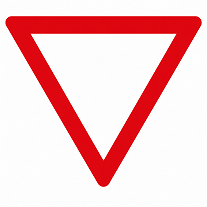 ]] |
| Ich muss an der Haltlinie vollständig anhalten und danach Vorfahrt gewähren. | [->[ 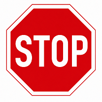 ]] |
| Hier befindet sich ein besonders gekennzeichneter Übergang für Fußgängerinnen und Fußgänger. | [->[ 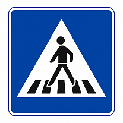 ]] |
| Hier beginnt ein beschilderter Weg für Fahrräder. | [->[ 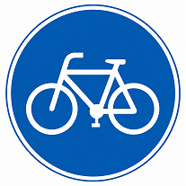 ]] |
| Hier muss ich besonders mit Kindern auf oder neben der Fahrbahn rechnen. | [->[ 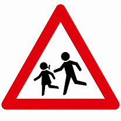 ]] |
| In diese Straße darf ich aus dieser Richtung nicht hineinfahren. | [->[ 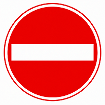 ]] |
*****************
@Energiekiste
@Energiekiste
*****************

@ADetails(BE=6;Verkehrszeichen anwenden)

<small> <small> <small><small> Quelle: Mit einem LLM generiert. </small></small></small></small>

---

---

__Aufgabe 2:__  **Sortiere** die Schritte für ein sicheres Überqueren.

<!-- data-solution-timer="300s" data-solution-timer-start="oncheck" data-solution-timer-badge="off" data-show-partial-solution="true" data-randomize="true" -->
[->[(Am Fahrbahnrand stehen bleiben.)]] [->[(Nach links, rechts und erneut nach links schauen.)]] [->[(Warten, bis herannahende Fahrzeuge erkennbar anhalten.)]] [->[(Zügig überqueren und den Verkehr weiter beobachten.)]]
*****************
@Energiekiste
@Energiekiste
*****************

@ADetails(BE=4;Fahrbahn sicher überqueren)

---

---

__Aufgabe 3:__  Bei einem Versuch wurden diese Anhaltewege gemessen:

<!--  data-type="none" data-sortable="false"  -->
| Geschwindigkeit | trockene Fahrbahn | nasse Fahrbahn |
|:--:|:--:|:--:|
| $10\,\dfrac{\text{km}}{\text{h}}$ | $3\,\text{m}$ | $5\,\text{m}$ |
| $20\,\dfrac{\text{km}}{\text{h}}$ | $8\,\text{m}$ | $13\,\text{m}$ |
| $30\,\dfrac{\text{km}}{\text{h}}$ | $14\,\text{m}$ | $24\,\text{m}$ |

__$a)\;\;$__ **Entscheide** mithilfe der Tabelle, ob das Fahrzeug vor dem Hindernis zum Stehen kommt.

<!-- data-solution-timer="300s" data-solution-timer-start="oncheck" data-solution-timer-badge="off" data-show-partial-solution="true"  data-type="none" data-sortable="false" -->
- [(kommt vorher zum Stehen)   (kommt nicht vorher zum Stehen)]
- [             (X)                          ( )                ] $10\,\dfrac{\text{km}}{\text{h}}$, trocken, Hindernis in $4\,\text{m}$ Entfernung
- [             ( )                          (X)                ] $20\,\dfrac{\text{km}}{\text{h}}$, nass, Hindernis in $12\,\text{m}$ Entfernung
- [             (X)                          ( )                ] $30\,\dfrac{\text{km}}{\text{h}}$, trocken, Hindernis in $18\,\text{m}$ Entfernung
- [             ( )                          (X)                ] $30\,\dfrac{\text{km}}{\text{h}}$, nass, Hindernis in $18\,\text{m}$ Entfernung
*****************
@Energiekiste
@Energiekiste
*****************

@ADetails(BE=4;Anhalteweg beurteilen)

__$b)\;\;$__ **Werte** die Messwerte weiter **aus**. Nutze Zahlen oder die Wörter *länger* und *kürzer*.

<!-- data-solution-timer="240s" data-solution-timer-start="oncheck" data-solution-timer-badge="off" data-show-partial-solution="true"  data-type="none" data-sortable="false"  -->
| Frage | Antwort |
|:--|:--:|
| Auf nasser Fahrbahn ist der Anhalteweg ... als auf trockener. | [[ länger ]] |
| Um wie viel Meter verlängert Nässe den Anhalteweg bei $30\,\dfrac{\text{km}}{\text{h}}$? | [[ 10 ]] $\,\text{m}$ |
| Welche höchste Geschwindigkeit aus der Tabelle erlaubt auf nasser Fahrbahn einen Anhalteweg von höchstens $12\,\text{m}$? | [[ 10 ]] $\,\dfrac{\text{km}}{\text{h}}$ |
| Bei höherer Geschwindigkeit wird der Anhalteweg ... | [[ länger ]] |
*****************
@Schatztruhe
*****************

@ADetails(BE=4;Anhaltewege auswerten)

## Gesellschaftliches Miteinander

__Aufgabe 1:__ Eine Klasse sammelt Vorschläge für neue Klassenregeln.

| Regel | Vorschlag |
|:--:|:--|
| A | Im Gespräch sorgt ein Redestein dafür, dass immer nur eine Person spricht. |
| B | Nur Kinder mit sehr guten Noten dürfen über Klassenfeste mitentscheiden. |
| C | Niemand darf jemals einen Fehler machen. |
| D | Ausgeliehene Materialien werden nach der Benutzung zurückgelegt. |

__$a)\;\;$__ **Beurteile** jeden Vorschlag nach seinem wichtigsten Merkmal.

<!-- data-solution-timer="300s" data-solution-timer-start="oncheck" data-solution-timer-badge="off" data-show-partial-solution="true"  data-type="none" data-sortable="false" -->
- [(fair und umsetzbar)   (umsetzbar, aber unfair)   (nicht umsetzbar)]
- [          (X)                    ( )                     ( )       ] Regel A
- [          ( )                    (X)                     ( )       ] Regel B
- [          ( )                    ( )                     (X)       ] Regel C
- [          (X)                    ( )                     ( )       ] Regel D
*****************
@Energiekiste
@Energiekiste
*****************

@ADetails(BE=4;Regeln beurteilen)

__$b)\;\;$__ Die Klasse überarbeitet Regel B. **Vervollständige** die Sätze.

<!-- data-solution-timer="240s" data-solution-timer-start="oncheck" data-solution-timer-badge="off" data-show-partial-solution="true"  data-type="none" data-sortable="false"  data-randomize="true" -->
[->[ (Alle)|Keine|Ausgewählte ]] Kinder dürfen [->[ (Vorschläge)|Regeln|Gesetze ]] machen. Bevor abgestimmt wird, werden die unterschiedlichen Meinungen [->[ (angehört) ]]. Danach entscheidet [->[ (die Mehrheit)|der Klassensprecher|die Klassensprecherin|die laute Gruppe|die coole Gruppe ]] was gilt.
*****************
@Energiekiste
@Energiekiste
*****************

@ADetails(BE=4;Faire Regeln formulieren)

---

---

Aufgabe 2: Entscheidung im Klassenrat

Der Klassenrat entscheidet, wofür ein gemeinsamer Geldbetrag verwendet wird. Jedes Kind hat genau eine Stimme.

| Vorschlag | Stimmen |
|:--|:--:|
| neue Bücher für die Leseecke | 7 |
| Spielekiste für die Pause | 12 |
| Pflanzen für den Klassenraum | 5 |

**Werte** die Abstimmung **aus**.

<!-- data-solution-timer="300s" data-solution-timer-start="oncheck" data-solution-timer-badge="off" data-show-partial-solution="true"  data-type="none" data-sortable="false"  data-randomize="true" -->
| Frage | Antwort |
|:--|:--:|
| Wie viele Kinder haben abgestimmt? | [[ 24 ]] |
| Wie viele Stimmen mehr erhielt die Spielekiste als die Leseecke? | [[ 5 ]] |
| Wie viele Kinder stimmten für einen anderen Vorschlag als die Spielekiste? | [[ 12 ]] |
*****************
@Energiekiste
@Energiekiste
*****************

@ADetails(BE=3;Abstimmung auswerten)

---

---

__Aufgabe 3:__ **Ordne** jeder Situation das Kinderrecht **zu**, das besonders betroffen ist. 

<!-- data-solution-timer="300s" data-solution-timer-start="oncheck" data-solution-timer-badge="off" data-show-partial-solution="true"  data-type="none" data-sortable="false"  data-randomize="true"  -->
| Situation | betroffenes Kinderrecht |
|:--|:--:|
| Ein Kind darf nicht zur Schule gehen, weil es stattdessen arbeiten soll. | [->[ (Bildung) ]] |
| Ein krankes Kind erhält keine notwendige medizinische Hilfe. | [->[ (Gesundheit) ]] |
| Ein privates Foto eines Kindes wird ohne Zustimmung veröffentlicht. | [->[ (Privatsphäre) ]] |
| Bei der Planung des Spielplatzes werden Kinder überhaupt nicht angehört. | [->[ (Mitbestimmung) ]] |
| Ein Kind wird wegen seiner Herkunft oder Religion ausgeschlossen. | [->[ (Gleichbehandlung) ]] |
*****************
@Energiekiste
@Energiekiste
*****************

@ADetails(BE=5;Kinderrechte anwenden)

## Abschluss: Selbsteinschätzung

Wie sicher fühlst du dich bei der Bedienung von LiaScript nach diesen Wochenaufgaben?

[[ sehr sicher | meistens sicher | teilweise sicher | noch unsicher ]]

Wie war der Anspruch in diesen Wochenaufgaben für dich?

[[ einfach | einige Schwierigkeiten | schwer ]]

> Wenn du noch unsicher bist, notiere dir das Thema, bei dem du Hilfe brauchst. Fehler sind Hinweise darauf, was du als Nächstes üben kannst.

# Abgabe

> <h3>Kontrolliere noch einmal, ob du alle Aufgaben bearbeitet hast. Friere dann den Kurs ein und sende den entstandenen Link über LernSax an deine Lehrkraft.</h3>

@Abgabe

@Auswertung(F12;Tab;Time)
