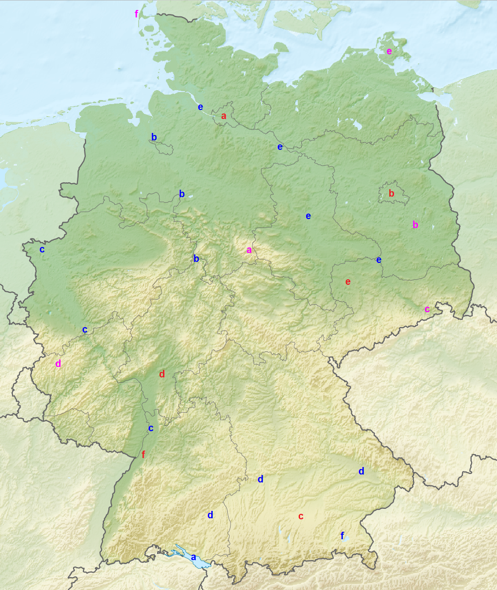
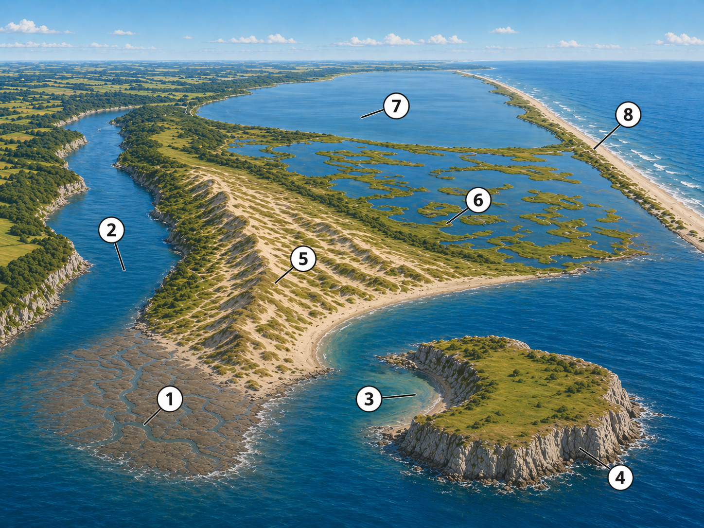
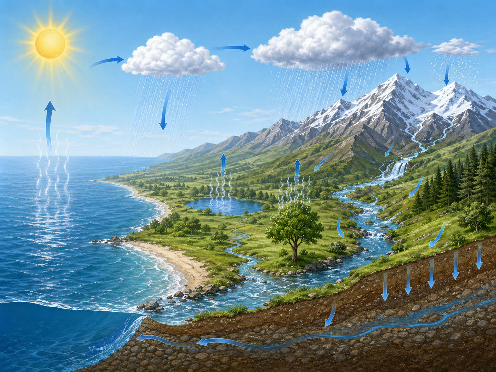

<!--
version:  0.0.1
language: de

mode: Presentation

import: https://raw.githubusercontent.com/MINT-the-GAP/Aufgabensammlung/main/imports/TafelREADME.md
import: https://raw.githubusercontent.com/MINT-the-GAP/Aufgabensammlung/main/imports/MarkerREADME.md
import: https://raw.githubusercontent.com/MINT-the-GAP/Aufgabensammlung/main/imports/FlexChildREADME.md
import: https://raw.githubusercontent.com/MINT-the-GAP/Aufgabensammlung/main/imports/DeutschREADME.md
import: https://raw.githubusercontent.com/MINT-the-GAP/Aufgabensammlung/main/imports/NavigationREADME.md
import: https://raw.githubusercontent.com/MINT-the-GAP/Aufgabensammlung/main/imports/TimerREADME.md
import: https://raw.githubusercontent.com/MINT-the-GAP/Aufgabensammlung/main/imports/FreezeREADME.md

author: Martin Lommatzsch
-->

# Aufgaben für die Prüfungstage - Geographie: Klasse 5

> Wenn du diese Aufgaben bearbeitest, solltest du nicht in ein anderes Fenster oder einen anderen Tab wechseln, sondern dich nur auf diese Aufgaben konzentrieren. Hole dir alle Materialien, die du zum Bearbeiten dieser Aufgaben brauchst. In deinem Fall solltest du dir Stifte und Papier holen, um dir zur Not Notizen machen zu können. Am Ende der Bearbeitung sendest du diese bearbeiteten Aufgaben an deinen Lehrer oder deine Lehrerin, sodass die Lehrkräfte sehen können, was du gemacht hast. 
 - Martin Lommatzsch 

> HINWEIS 1: <h3>Diese Aufgaben werden abgegeben. Am Ende des Kurses kann der Kurs eingefroren werden. Dadurch entsteht ein Link, versende diesen Link via LernSax an deinen Lehrer oder deine Lehrerin. </h3>

> HINWEIS 2: <h3> Das Anzahl wie oft du auf "Prüfen" drückst, wird auch erfasst. </h3>

> HINWEIS 3: <h3> Falls du eine Aufgabe gerade nicht bearbeiten möchtest, kannst du zu nächsten wechseln. Du kannst zu jeder Zeit zu dieser Aufgabe zurückkehren. Bearbeite am besten alle Aufgaben bevor du alles einfrierst. </h3>

Hier hast du nochmal eine Übersicht über die Menüleiste:

> 
  

- 1. Inhaltsverzeichnis: Komme schnell zu deiner Aufgabe

- 2. Textmarker: Markiere dir wichtige Textpassagen

- 3. Schriftgrößenanpassung: Stelle dir die Schriftgröße für deinen optimalen Arbeitsmodus ein.

- 4. Darstellungsbreite: Es wird "Präsentation" empfohlen, aber probiere ruhig mal "Lehrbuch" aus.

- 5. Aussehen von LiaScript: Hier kannst du in den Dunkelmodus wechseln oder die Themefarben anpassen. Auch kannst du die Vorlesegeschwindigkeit sowie Stimmhöhe anpassen.

- 6. Automatische Übersetzung in andere Sprachen

- 7. Gruppenraum eröffnen: (Für dich wohl unwichtig, aber für LehrerInnen eventuell interessanter)

- 8. Informationen zum Kurs: Hier steht welche Version das Arbeitsblatt besitzt und wer das Arbeitsblatt erstellt hat.

Wenn du mit den Aufgaben beginnen willst, dann swipe (Wische) entweder weiter oder klicke unten neben der Seitenzahl auf den Pfeil nach rechts.

## Flaggen

**Benenne** die Bundesländer hinter den dargestellten Flaggen.

<section class="dynFlex">

__$a)\;\;$__ 

<!-- style="max-width:300px" -->

<!-- data-randomize="true" data-solution-timer="600s" data-solution-timer-start="oncheck" data-solution-timer-badge="off" -->
- [(X)] Baden-Württemberg
- [( )] Thüringen
- [( )] Saarland
- [( )] Bremen

__$b)\;\;$__ 

<!-- style="max-width:300px" -->

<!-- data-randomize="true" data-solution-timer="600s" data-solution-timer-start="oncheck" data-solution-timer-badge="off" -->
- [(X)] Brandenburg
- [( )] Nordrhein-Westphalen
- [( )] Mecklenburg-Vorpommern
- [( )] Bayern

__$c)\;\;$__ 

<!-- style="max-width:300px" -->

<!-- data-randomize="true" data-solution-timer="600s" data-solution-timer-start="oncheck" data-solution-timer-badge="off" -->
- [(X)] Hamburg
- [( )] Berlin
- [( )] Rheinland-Pfalz
- [( )] Hessen

__$d)\;\;$__ 

<!-- style="max-width:300px" -->

<!-- data-randomize="true" data-solution-timer="600s" data-solution-timer-start="oncheck" data-solution-timer-badge="off" -->
- [(X)] Mecklenburg-Vorpommern
- [( )] Thüringen
- [( )] Rheinland-Pfalz
- [( )] Hessen

__$e)\;\;$__ 

<!-- style="max-width:300px" -->

<!-- data-randomize="true" data-solution-timer="600s" data-solution-timer-start="oncheck" data-solution-timer-badge="off" -->
- [(X)] Schleswig-Holstein
- [( )] Niedersachsen
- [( )] Saarland
- [( )] Sachsen-Anhalt

__$f)\;\;$__ 

<!-- style="max-width:300px" -->

<!-- data-randomize="true" data-solution-timer="600s" data-solution-timer-start="oncheck" data-solution-timer-badge="off" -->
- [(X)] Sachsen-Anhalt
- [( )] Thüringen
- [( )] Sachsen
- [( )] Brandenburg

__$g)\;\;$__ 

<!-- style="max-width:300px" -->

<!-- data-randomize="true" data-solution-timer="600s" data-solution-timer-start="oncheck" data-solution-timer-badge="off" -->
- [(X)] Saarland
- [( )] Niedersachsen
- [( )] Rheinland-Pfalz
- [( )] Brandenburg

__$h)\;\;$__ 

<!-- style="max-width:300px" -->

<!-- data-randomize="true" data-solution-timer="600s" data-solution-timer-start="oncheck" data-solution-timer-badge="off" -->
- [(X)] Hessen
- [( )] Thüringen
- [( )] Sachsen
- [( )] Bayern

</section>

@ADetails(BE=8;Flaggen)

## Topographie

<small><small><small><small><small>
Quelle: Wikimedia Commons, Datei „Relief Map of Germany.png“, erstellt von Виктор В, 28.08.2010, Lizenz: Creative Commons Attribution-Share Alike 3.0 Unported (CC BY-SA 3.0), https://commons.wikimedia.org/w/index.php?curid=11315263, abgerufen am 23.04.2026.
</small></small></small></small></small>

---

**_Aufgabe 1:_** Benenne alle Städte, die mit roten Buchstaben gekennzeichnet sind.

<section class="dynFlex">

<!-- data-solution-timer="600s" data-solution-timer-start="oncheck" data-solution-timer-badge="off" -->
__$a)\;\;$__ [[    Hamburg    ]]

@ADetails(BE=1;Topographie)

<!-- data-solution-timer="600s" data-solution-timer-start="oncheck" data-solution-timer-badge="off" -->
__$b)\;\;$__ [[    Berlin    ]]

@ADetails(BE=1;Topographie)

<!-- data-solution-timer="600s" data-solution-timer-start="oncheck" data-solution-timer-badge="off" -->
__$c)\;\;$__ [[    München    ]]

@ADetails(BE=1;Topographie)

<!-- data-solution-timer="600s" data-solution-timer-start="oncheck" data-solution-timer-badge="off" -->
__$d)\;\;$__ [[    Frankfurt am Main    ]]

@ADetails(BE=1;Topographie)

<!-- data-solution-timer="600s" data-solution-timer-start="oncheck" data-solution-timer-badge="off" -->
__$e)\;\;$__ [[    Leipzig    ]]

@ADetails(BE=1;Topographie)

<!-- data-solution-timer="600s" data-solution-timer-start="oncheck" data-solution-timer-badge="off" -->
__$f)\;\;$__ [[    Karlsruhe    ]]

@ADetails(BE=1;Topographie)

</section>

---

--- 

**_Aufgabe 2:_** Benenne alle Gewässer, die mit blauen Buchstaben gekennzeichnet sind.

<section class="dynFlex">

<!-- data-solution-timer="600s" data-solution-timer-start="oncheck" data-solution-timer-badge="off" -->
__$a)\;\;$__ [[    Bodensee    ]]

@ADetails(BE=1;Topographie)

<!-- data-solution-timer="600s" data-solution-timer-start="oncheck" data-solution-timer-badge="off" -->
__$b)\;\;$__ [[    Chiemsee    ]]

@ADetails(BE=1;Topographie)

<!-- data-solution-timer="600s" data-solution-timer-start="oncheck" data-solution-timer-badge="off" -->
__$c)\;\;$__ [[    Rhein    ]]

@ADetails(BE=1;Topographie)

<!-- data-solution-timer="600s" data-solution-timer-start="oncheck" data-solution-timer-badge="off" -->
__$d)\;\;$__ [[    Donau    ]]

@ADetails(BE=1;Topographie)

<!-- data-solution-timer="600s" data-solution-timer-start="oncheck" data-solution-timer-badge="off" -->
__$e)\;\;$__ [[    Elbe    ]]

@ADetails(BE=1;Topographie)

<!-- data-solution-timer="600s" data-solution-timer-start="oncheck" data-solution-timer-badge="off" -->
__$f)\;\;$__ [[    Weser    ]]

@ADetails(BE=1;Topographie)

</section>

---

--- 

**_Aufgabe 3:_** Benenne alle Regionen, die mit pinken Buchstaben gekennzeichnet sind.

<section class="dynFlex">

<!-- data-solution-timer="600s" data-solution-timer-start="oncheck" data-solution-timer-badge="off" -->
__$a)\;\;$__ [[    Harz    ]]

@ADetails(BE=1;Topographie)

<!-- data-solution-timer="600s" data-solution-timer-start="oncheck" data-solution-timer-badge="off" -->
__$b)\;\;$__ [[    Spreewald    ]]

@ADetails(BE=1;Topographie)

<!-- data-solution-timer="600s" data-solution-timer-start="oncheck" data-solution-timer-badge="off" -->
__$c)\;\;$__ [[    Sächsische Schweiz    ]]

@ADetails(BE=1;Topographie)

<!-- data-solution-timer="600s" data-solution-timer-start="oncheck" data-solution-timer-badge="off" -->
__$d)\;\;$__ [[    Eiffel    ]]

@ADetails(BE=1;Topographie)

<!-- data-solution-timer="600s" data-solution-timer-start="oncheck" data-solution-timer-badge="off" -->
__$e)\;\;$__ [[    Rügen    ]]

@ADetails(BE=1;Topographie)

<!-- data-solution-timer="600s" data-solution-timer-start="oncheck" data-solution-timer-badge="off" -->
__$f)\;\;$__ [[    Sylt    ]]

@ADetails(BE=1;Topographie)

</section>

## Küste

**_Aufgabe 1:_** **Benenne** die Küstenformationen.

<!-- data-randomize="true" data-show-partial-solution="true" data-solution-timer="600s" data-solution-timer-start="oncheck" data-solution-timer-badge="off" -->
__$1)\;\;$__ [->[(Watt)]]  $\;\;\quad\;\;$ 
__$2)\;\;$__ [->[(Förde)]]  $\;\;\quad\;\;$ 
__$3)\;\;$__ [->[(Bucht)]]  $\;\;\quad\;\;$ 
__$4)\;\;$__ [->[(Klippen)]]  $\;\;\quad\;\;$ \
__$5)\;\;$__ [->[(Dünen)]]  $\;\;\quad\;\;$ 
__$6)\;\;$__ [->[(Bodden)]]  $\;\;\quad\;\;$ 
__$7)\;\;$__ [->[(Haff)]]  $\;\;\quad\;\;$ 
__$8)\;\;$__ [->[(Nehrung)|Halbinsel]]

@ADetails(BE=8;Küste)

## Wetter und Klima

**_Aufgabe 1:_** **Lies** den Text den Text aufmerksam und **ergänze** die fehlenden Begriffe.

---

---

<h2> Der Wasserkreislauf </h2> 

<!-- data-randomize="true" data-show-partial-solution="true" data-solution-timer="600s" data-solution-timer-start="oncheck" data-solution-timer-badge="off" -->
Der natürliche Wasserkreislauf wird vor allem von der [->[(Sonne)|Mond]] angetrieben. Sie erwärmt das Wasser im Meer, in Seen, Flüssen und auf feuchten Böden. Dabei geht flüssiges Wasser in unsichtbaren Wasserdampf über. Diesen Vorgang nennt man [->[(Verdunstung)]]. Auch Pflanzen geben Wasser an die Luft ab. Dieser Vorgang heißt [->[(Transpiration)]]. \
Der Wasserdampf steigt nach oben. In höheren Luftschichten ist es kälter, deshalb kühlt sich der Wasserdampf ab. Dabei entstehen winzige Wassertröpfchen. So bilden sich [->[(Wolken)|Nebel]]. Werden die Tröpfchen in den Wolken zu schwer, fallen sie als [->[(Niederschlag)|Schnee]] auf die Erde zurück. Das kann als Regen, Schnee oder Hagel geschehen. \
Ein Teil des Wassers fließt über die Erdoberfläche als [->[(Oberflächenabfluss)]] in Bäche, Flüsse und schließlich ins Meer. Ein anderer Teil versickert im Boden. Diesen Vorgang nennt man [->[(Versickerung)]]. Das Wasser sammelt sich dann als [->[(Grundwasser)|See]] unter der Erdoberfläche. Von dort kann es langsam weiterfließen und später wieder in Flüsse, Seen oder Meere gelangen. \
In den Bergen fällt Niederschlag oft als Schnee. Wenn es wärmer wird, schmilzt er. Das [->[(Schmelzwasser)|Meerwasser]] fließt hangabwärts in Bäche und Flüsse. Am Ende gelangt das Wasser wieder in das [->[(Meer)|Berge]], wo der Kreislauf von Neuem beginnt.

@ADetails(BE=10;Wasserkreislauf)

## Jahres- und Tageszeiten

**_Aufgabe 1:_** **Entscheide**, ob die Behauptungen "wahr" oder "falsch" sind.

<!-- data-randomize="true" data-show-partial-solution="true" data-solution-timer="600s" data-solution-timer-start="oncheck" data-solution-timer-badge="off" -->
- [(wahr)   (falsch)]
- [ ( )       (X)    ]  Die Jahreszeiten entstehen, weil die Erde im Sommer näher an der Sonne ist als im Winter.
- [ (X)       ( )    ]  Tag und Nacht entstehen durch die Drehung der Erde um ihre eigene Achse.
- [ ( )       (X)    ]  Auf der ganzen Erde sind Tag und Nacht immer gleich lang.
- [ (X)       ( )    ]  Wenn auf der Nordhalbkugel Sommer ist, ist auf der Südhalbkugel Winter.
- [ ( )       (X)    ]  Die Sonne geht immer genau im Osten auf und immer genau im Westen unter.
- [ (X)       ( )    ]  Im Sommer sind die Tage in Deutschland länger als im Winter.
- [ ( )       (X)    ]  Die Erde braucht einen Tag, um einmal um die Sonne zu kreisen.
- [ (X)       ( )    ]  Mittags steht die Sonne meist höher am Himmel als morgens oder abends.
- [ ( )       (X)    ]  Die Tageszeiten hängen davon ab, ob die Erde gerade besonders schnell fliegt.
- [ (X)       ( )    ]  Die Erdachse ist geneigt, und das ist ein wichtiger Grund für die Jahreszeiten.
- [ ( )       (X)    ]  Am Äquator gibt es überhaupt keinen Wechsel von Tag und Nacht.
- [ (X)       ( )    ]  Wenn die Sonne flach auf die Erdoberfläche scheint, erwärmt sie den Boden schwächer.
- [ ( )       (X)    ]  Im Winter dauert eine Erdumdrehung länger als im Sommer.
- [ (X)       ( )    ]  Frühling und Herbst nennt man auch Übergangsjahreszeiten.
- [ ( )       (X)    ]  Auf beiden Polen gibt es jeden Tag genau zwölf Stunden Sonnenlicht.
- [ (X)       ( )    ]  Morgens und abends sind die Schatten oft länger als zur Mittagszeit.
- [ ( )       (X)    ]  Die Mitternachtssonne bedeutet, dass die Sonne nur im Winter nicht untergeht.
- [ (X)       ( )    ]  Ein Jahr dauert ungefähr 365 Tage, weil die Erde so lange für einen Umlauf um die Sonne braucht.
- [ ( )       (X)    ]  Die Tageszeiten heißen Frühling, Sommer, Herbst und Winter.
- [ (X)       ( )    ]  Zur gleichen Uhrzeit kann die Sonne an verschiedenen Orten der Erde unterschiedlich hoch stehen.

@ADetails(BE=10;Tages- und Jahreszeiten)

# Abgabe

@Abgabe

@Auswertung(F12;Tab)