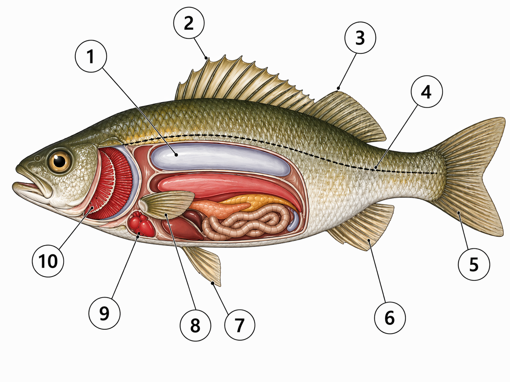
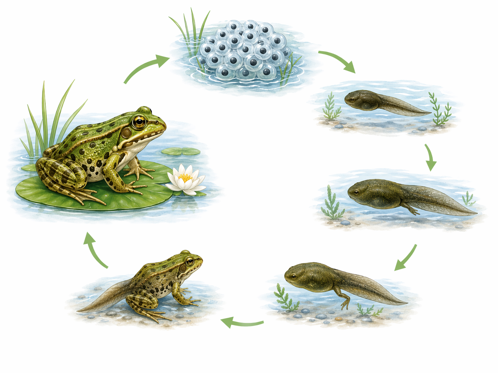
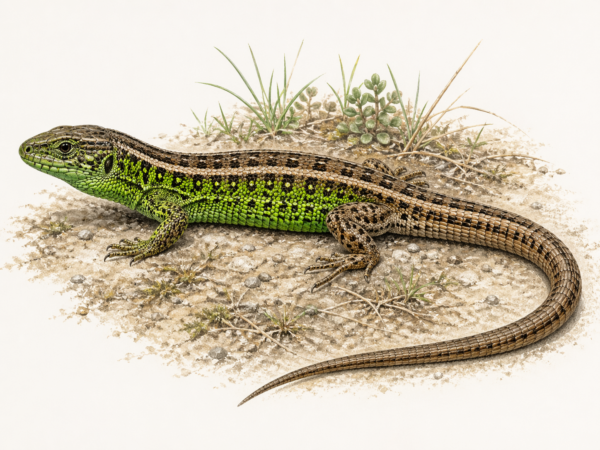
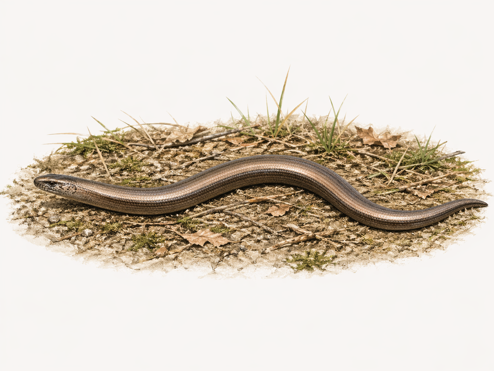
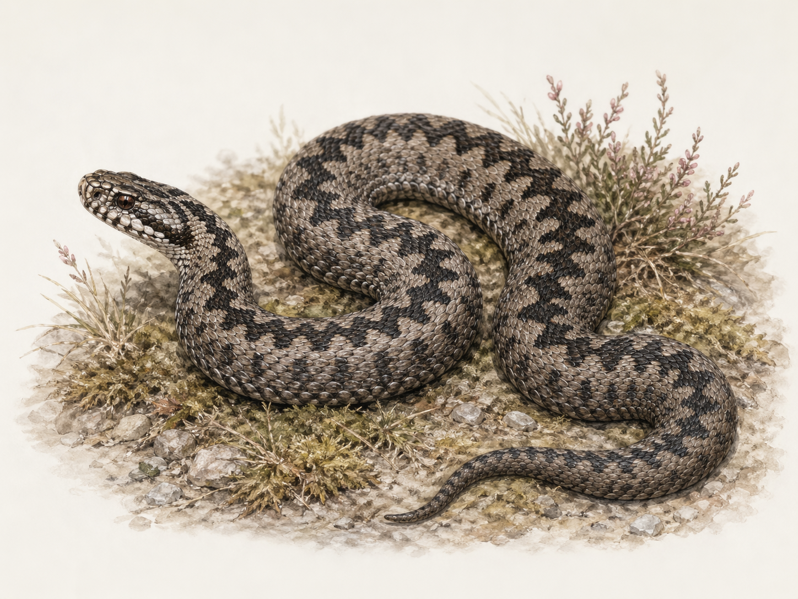
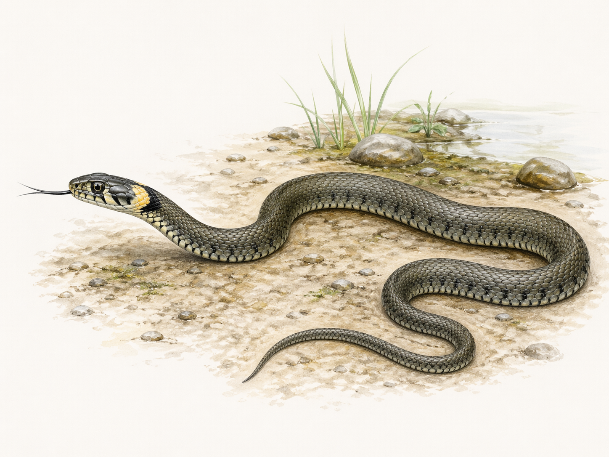
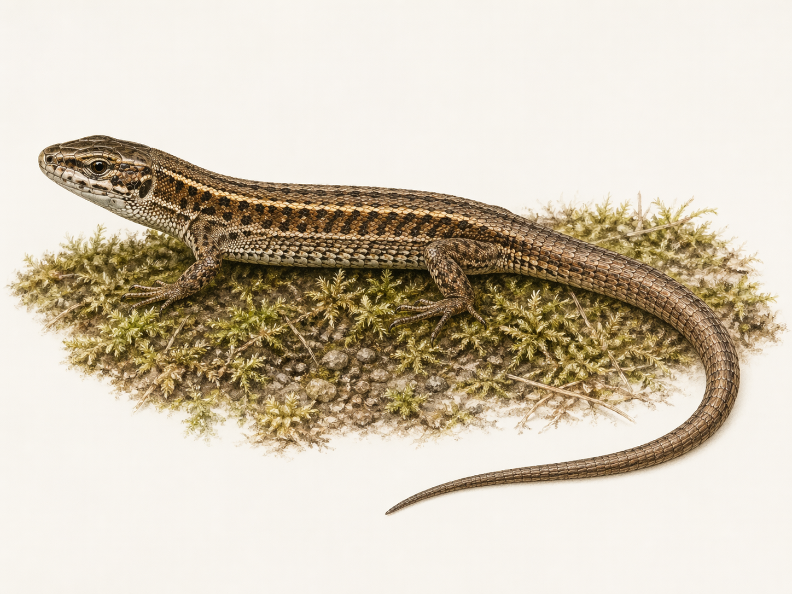

<!--
version:  0.0.1
language: de

mode: Presentation

import: https://raw.githubusercontent.com/MINT-the-GAP/Aufgabensammlung/main/imports/TafelREADME.md
import: https://raw.githubusercontent.com/MINT-the-GAP/Aufgabensammlung/main/imports/MarkerREADME.md
import: https://raw.githubusercontent.com/MINT-the-GAP/Aufgabensammlung/main/imports/FlexChildREADME.md
import: https://raw.githubusercontent.com/MINT-the-GAP/Aufgabensammlung/main/imports/DeutschREADME.md
import: https://raw.githubusercontent.com/MINT-the-GAP/Aufgabensammlung/main/imports/NavigationREADME.md
import: https://raw.githubusercontent.com/MINT-the-GAP/Aufgabensammlung/main/imports/TimerREADME.md
import: https://raw.githubusercontent.com/MINT-the-GAP/Aufgabensammlung/main/imports/FreezeREADME.md

author: Martin Lommatzsch
-->

# Aufgaben für die Prüfungstage - Biologie: Klasse 5

> [!NOTE]
> Wenn du diese Aufgaben bearbeitest, solltest du nicht in ein anderes Fenster oder einen anderen Tab wechseln, sondern dich nur auf diese Aufgaben konzentrieren. Hole dir alle Materialien, die du zum Bearbeiten dieser Aufgaben brauchst. In deinem Fall solltest du dir Stifte und Papier holen, um dir zur Not Notizen machen zu können. Am Ende der Bearbeitung sendest du diese bearbeiteten Aufgaben an deinen Lehrer oder deine Lehrerin, sodass die Lehrkräfte sehen können, was du gemacht hast. 
 - Martin Lommatzsch 

> [!CAUTION]
> HINWEIS 1: <h3>Diese Aufgaben können abgegeben werden. Am Ende des Kurses kann der Kurs eingefroren werden. Dadurch entsteht ein Link, speichere diesen Link ab. Versende diesen Link via LernSax an deinen Lehrer oder deine Lehrerin, wenn deine Lehrkraft dies möchte. WICHTIG: Die Absprachen mit den jeweiligen Lehrkräften gelten. </h3>

> [!TIP]
> HINWEIS 2: <h3> Die Anzahl, wie oft du auf "Prüfen" drückst, wird auch erfasst. </h3>

> [!IMPORTANT]
> HINWEIS 3: <h3> Falls du eine Aufgabe gerade nicht bearbeiten möchtest, kannst du zur nächsten wechseln. Du kannst zu jeder Zeit zu dieser Aufgabe zurückkehren. Bearbeite am besten alle Aufgaben, bevor du alles einfrierst. </h3>

Hier hast du nochmal eine Übersicht über die Menüleiste:

> 
  

- 1. Inhaltsverzeichnis: Komme schnell zu deiner Aufgabe

- 2. Textmarker: Markiere dir wichtige Textpassagen

- 3. Schriftgrößenanpassung: Stelle dir die Schriftgröße für deinen optimalen Arbeitsmodus ein.

- 4. Darstellungsbreite: Es wird "Präsentation" empfohlen, aber probiere ruhig mal "Lehrbuch" aus.

- 5. Aussehen von LiaScript: Hier kannst du in den Dunkelmodus wechseln oder die Themefarben anpassen. Auch kannst du die Vorlesegeschwindigkeit sowie Stimmhöhe anpassen.

- 6. Automatische Übersetzung in andere Sprachen

- 7. Gruppenraum eröffnen: (für dich wohl unwichtig, aber für LehrerInnen eventuell interessanter)

- 8. Informationen zum Kurs: Hier steht, welche Version das Arbeitsblatt besitzt und wer das Arbeitsblatt erstellt hat.

Wenn du mit den Aufgaben beginnen willst, dann swipe (wische) entweder weiter oder klicke unten neben der Seitenzahl auf den Pfeil nach rechts.

## Fische

__$a)\;\;$__ **Sortiere** die Fischarten nach ihrem Lebensraum und nach ihrer maximalen Größe (Länge).

<!-- data-randomize="true" data-show-partial-solution="true"  data-solution-timer="600s" data-solution-timer-start="oncheck" data-solution-timer-badge="off" -->
Süßwasserfische: [->[(Wels)]] $>$ [->[(Hecht)]] $>$ [->[(Karpfen)]] $>$ [->[(Regenbogenforelle)]] $>$ [->[(Rotfeder)|Buckelwal]] \
Salzwasserfische: [->[(Heilbutt)]] $>$ [->[(Kabeljau)]] $>$ [->[(Scholle)]] $>$ [->[(Makrele)]] $>$ [->[(Hering)|Tümmler]] \

@ADetails(BE=5;Fische)

---

---

__$b)\;\;$__ **Benenne** die Körperteile des Fisches.

<!-- style="max-width:1000px" -->

<!-- data-show-partial-solution="true"  data-solution-timer="600s" data-solution-timer-start="oncheck" data-solution-timer-badge="off" -->
 1:  [[   Schwimmblase   ]] $\;\;\quad\;\;$ 
 2:  [[   Rückenflosse   ]] $\;\;\quad\;\;$ 
 3:  [[   Fettflosse     ]] $\;\;\quad\;\;$ 
 4:  [[   Seitenlinie    ]] $\;\;\quad\;\;$ 
 5:  [[   Schwanzflosse  ]] $\;\;\quad\;\;$ \
 6:  [[   Afterflosse    ]] $\;\;\quad\;\;$ 
 7:  [[   Bauchflosse    ]] $\;\;\quad\;\;$ 
 8:  [[   Brustflosse    ]] $\;\;\quad\;\;$ 
 9:  [[   Herz           ]] $\;\;\quad\;\;$ 
 10: [[   Kiemen         ]]

@ADetails(BE=5;Fische)

## Lurche

**Setze** die passenden Wörter in die Lücken **ein**.

---

<!-- style="max-width:1000px" -->

<h2>Der Lebenszyklus der Lurche</h2>

<!-- data-show-partial-solution="true"  data-solution-timer="600s" data-solution-timer-start="oncheck" data-solution-timer-badge="off" -->
Viele Lurche beginnen ihr Leben im [[Wasser      ]].  
Dort legt das Weibchen seine [[Eier      ]] ab, die man auch [[Laich      ]] nennt.  
Aus den Eiern schlüpfen nach einiger Zeit kleine [[Kaulquappen      ]].  
Diese leben zunächst nur im Wasser und atmen mit [[Kiemen      ]].  
Später wachsen ihnen zuerst die hinteren und dann die vorderen [[Beine      ]].  
Außerdem entwickeln sie [[Lungen      ]], damit sie an Land atmen können.  
Nach und nach bildet sich ausschließlich beim Froschlurch auch der [[Schwanz      ]] zurück.  
Nun kann das Tier nicht nur im Wasser, sondern auch an [[Land      ]] leben.  
Die starke Verwandlung vom Jungtier zum erwachsenen Tier nennt man [[Metamorphose      ]].  
Am Ende der Entwicklung wird aus der Kaulquappe ein erwachsener [[Lurch      ]].

@ADetails(BE=5;Lurche)

## Kriechtiere

__$a)\;\;$__ **Gib** für Sachsen die passende Zuschreibung **an**.

<!-- data-show-partial-solution="true"  data-solution-timer="600s" data-solution-timer-start="oncheck" data-solution-timer-badge="off" -->
Blindschleiche: [[(heimisch)|exotisch]] \
Krokodil: [[heimisch|(exotisch)]] \
Zauneidechse: [[(heimisch)|exotisch]] \
Chamäleon: [[heimisch|(exotisch)]] \
Ringelnatter: [[(heimisch)|exotisch]] \
Königspython: [[heimisch|(exotisch)]] \
Kreuzotter: [[(heimisch)|exotisch)]] \
Gecko: [[heimisch|(exotisch)]]

@ADetails(BE=4;Kriechtiere)

---

---

__$b)\;\;$__ **Gib** den passenden Lebensraum **an**.

<!-- data-randomize="true" data-show-partial-solution="true"  data-solution-timer="600s" data-solution-timer-start="oncheck" data-solution-timer-badge="off" -->
Blindschleiche: [->[(Gärten, Wiesen, Waldränder)]] \
Zauneidechse: [->[(sonnige Trockenrasen, Wegränder)]] \
Waldeidechse: [->[(feuchte Wiesen, Waldränder, Moore)]] \
Ringelnatter: [->[(Gewässernähe, Feuchtgebiete)]] \
Kreuzotter: [->[(Heiden, Moore, Waldränder)|trockene Wiesen, Brachen]]

@ADetails(BE=5;Kriechtiere)

---

---

__$c)\;\;$__ **Benenne** die abgebildeten einheimischen Kriechtiere.

<section class="dynFlex">

__$a)\;\;$__ 

<!-- style="max-width:400px" -->

<!-- data-solution-timer="600s" data-solution-timer-start="oncheck" data-solution-timer-badge="off" -->
[[    Waldeidechse    ]]

__$b)\;\;$__ 

<!-- style="max-width:400px" -->

<!-- data-solution-timer="600s" data-solution-timer-start="oncheck" data-solution-timer-badge="off" -->
[[    Blindschleiche  ]]

__$c)\;\;$__ 

<!-- style="max-width:400px" -->

<!-- data-solution-timer="600s" data-solution-timer-start="oncheck" data-solution-timer-badge="off" -->
[[    Kreuzotter      ]]

__$d)\;\;$__ 

<!-- style="max-width:400px" -->

<!-- data-solution-timer="600s" data-solution-timer-start="oncheck" data-solution-timer-badge="off" -->
[[    Ringelnatter    ]]

__$e)\;\;$__ 

<!-- style="max-width:400px" -->

<!-- data-solution-timer="600s" data-solution-timer-start="oncheck" data-solution-timer-badge="off" -->
[[    Zauneidechse    ]]

</section>

@ADetails(BE=5;Kriechtiere)

---

---

__$c)\;\;$__ **Ordne** den Tiergruppen die passende Körperbedeckung **zu**.

<!-- data-randomize="true" data-show-partial-solution="true"  data-solution-timer="600s" data-solution-timer-start="oncheck" data-solution-timer-badge="off" -->
Fische [->[(Schuppen mit Schleimschicht)]]  \
Lurche [->[(feuchte Haut)]] \
Kriechtiere [->[(Hornschuppen)]]  \
Vögel [->[(Federn)|trockene Haut|Fell|Chitin-Panzer]]  \

@ADetails(BE=4;Kriechtiere)

## Vögel

**Ordne** die Tonspuren der Vogelart **zu**.

<!-- data-show-partial-solution="true" data-randomize="true"  data-solution-timer="600s" data-solution-timer-start="oncheck" data-solution-timer-badge="off" -->
Blaumeise: [->[(?)]]  \
Gartenrotschwanz: [->[(?)]]\
Amsel: [->[(?)]]\
Elster: [->[(?)]]\
Turmfalke: [->[(?)]]\

@ADetails(BE=5;Vögel)

<small><small><small><small>

Quellen: \

- „Cyanistes caeruleus - Eurasian Blue Tit XC131316.ogg“ von Dan Stowell, Quelle: Wikimedia Commons / Xeno-Canto, Lizenz: CC BY-SA 3.0 \
- „Buteo buteo - Common Buzzard XC538678.mp3“ von Benoît Van Hecke, Quelle: Wikimedia Commons / Xeno-canto, Lizenz: CC BY-SA 4.0\
- „Phoenicurus phoenicurus.ogg“ von Oona Räisänen (Mysid), Quelle: Wikimedia Commons, gemeinfrei / Public Domain\
- „Turdus merula 2.ogg“ von Oona Räisänen (Mysid), Quelle: Wikimedia Commons, gemeinfrei / Public Domain\
- „Pica pica.ogg“ von Oona Räisänen (Mysid), Quelle: Wikimedia Commons, gemeinfrei / Public Domain\

</small></small></small></small>

---

---

## Sender-Empfänger

**Sortiere** die Kacheln passend zu Sender-Signal-Empfänger-Reaktion.

<!-- data-randomize="true" data-show-partial-solution="true"  data-solution-timer="600s" data-solution-timer-start="oncheck" data-solution-timer-badge="off" -->
Der Pfau [->[(Federkleid)]]   [->[(Weibchen)]]   [->[(aufmerksam)]]  \
Das Brot [->[(Sichtbarkeit)]]   [->[(Möwe)]]   [->[(frisst)]]  \
Der Star [->[(Warnruf)]]   [->[(Stare)]]   [->[(fliehen)]]  \
Die Ente [->[(Locklaut)]]   [->[(Küken)]]   [->[(folgen)]]  \

@ADetails(BE=6;Vögel)

## Säugetiere

**Lies** den Text und **entscheide** danach, ob die Aussagen "wahr" oder "falsch" sind.

--- 

--- 

Säugetiere sind eine Tiergruppe der Wirbeltiere. Zu ihnen gehören zum Beispiel der Hund, die Katze, das Pferd, der Igel, der Wal und auch der Mensch. Säugetiere kommen fast überall auf der Erde vor. Manche leben an Land, andere im Wasser und wieder andere können sogar fliegen. Fledermäuse sind die einzigen Säugetiere, die aktiv fliegen können.

Ein wichtiges Merkmal der Säugetiere ist, dass ihr Körper Haare oder Fell besitzt. Bei manchen Arten ist das Fell dicht und schützt gut vor Kälte, zum Beispiel beim Bären oder beim Fuchs. Bei anderen ist es nur wenig sichtbar. Auch Wale zählen zu den Säugetieren, obwohl sie fast keine Haare besitzen. Säugetiere atmen mit Lungen. Außerdem haben sie eine gleichbleibende Körpertemperatur. Das bedeutet, dass ihr Körper auch dann warm bleibt, wenn die Umgebung kälter ist.

Die meisten Säugetiere bringen ihre Jungen lebend zur Welt. Nach der Geburt werden die Jungen von der Mutter mit Milch ernährt. Daher stammt auch der Name „Säugetiere“. Viele Jungtiere werden in den ersten Wochen oder Monaten geschützt, gewärmt und versorgt. In dieser Zeit lernen sie oft wichtige Verhaltensweisen, etwa Nahrung zu suchen oder sich vor Feinden zu schützen.

Es gibt aber auch besondere Säugetiere. Das Schnabeltier lebt in Australien. Es legt Eier, obwohl es ein Säugetier ist. Nach dem Schlüpfen werden die Jungen trotzdem mit Milch ernährt. Das Schnabeltier zeigt also, dass nicht alle Säugetiere ihre Jungen lebend zur Welt bringen.

Eine weitere Besonderheit sind die Beuteltiere. Zu ihnen gehören zum Beispiel Kängurus und Koalas. Ihre Jungen werden nach einer sehr kurzen Entwicklungszeit geboren. Sie sind dann noch sehr klein und kaum entwickelt. Danach kriechen sie in den Beutel der Mutter. Dort trinken sie Milch und wachsen weiter.

Säugetiere haben sich sehr unterschiedlich an ihre Lebensweise angepasst. Ein Maulwurf gräbt im Boden, ein Delfin schwimmt geschickt im Wasser, ein Eichhörnchen klettert auf Bäume und eine Fledermaus orientiert sich auch in der Dunkelheit. Trotz dieser Unterschiede haben Säugetiere wichtige Gemeinsamkeiten: Sie atmen mit Lungen, ernähren ihre Jungen mit Milch, haben eine gleichbleibende Körpertemperatur und besitzen Fell, was auch Haut mit Haaren sein kann.

--- 

--- 

<!-- data-randomize="true" data-show-partial-solution="true"  data-solution-timer="600s" data-solution-timer-start="oncheck" data-solution-timer-badge="off" -->
- [(wahr)   (falsch)]
- [ (X)       ( )    ]  Säugetiere können in sehr unterschiedlichen Lebensräumen vorkommen.
- [ ( )       (X)    ]  Alle Säugetiere bringen ihre Jungen lebend zur Welt.
- [ (X)       ( )    ]  Das Schnabeltier zeigt, dass es Ausnahmen bei der Fortpflanzung der Säugetiere gibt.
- [ ( )       (X)    ]  Wale sind nach dem Text keine echten Säugetiere, weil ihr Körper fast keine Haare besitzt.
- [ (X)       ( )    ]  Beuteltiere versorgen ihre Jungen nach der Geburt noch längere Zeit mit Milch.
- [ (X)       ( )    ]  Der Text nennt Merkmale, die viele Säugetiere gemeinsam haben, obwohl sie sehr unterschiedlich leben.
- [ ( )       (X)    ]  Fledermäuse und Vögel gehören nach dem Text zur gleichen Tiergruppe, weil beide fliegen können.
- [ (X)       ( )    ]  Der Text macht deutlich, dass nicht bei allen Säugetieren die Haare gleich gut zu erkennen sind.
- [ ( )       (X)    ]  Das Schnabeltier ist kein Säugetier, weil es Eier legt.
- [ (X)       ( )    ]  Nach dem Text kann man ein Tier nicht allein danach beurteilen, ob es an Land, im Wasser oder in der Luft lebt.

@ADetails(BE=5;Säugetiere)

# Abgabe

@Abgabe

@Auswertung(F12;Tab;Time)