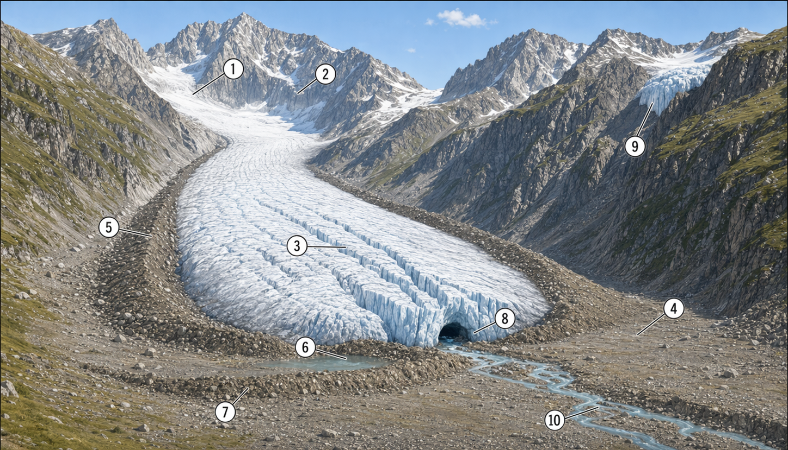

<!--
version:  0.0.1
language: de

mode: Presentation

import: https://raw.githubusercontent.com/MINT-the-GAP/Aufgabensammlung/main/imports/TafelREADME.md
import: https://raw.githubusercontent.com/MINT-the-GAP/Aufgabensammlung/main/imports/MarkerREADME.md
import: https://raw.githubusercontent.com/MINT-the-GAP/Aufgabensammlung/main/imports/FlexChildREADME.md
import: https://raw.githubusercontent.com/MINT-the-GAP/Aufgabensammlung/main/imports/DeutschREADME.md
import: https://raw.githubusercontent.com/MINT-the-GAP/Aufgabensammlung/main/imports/NavigationREADME.md
import: https://raw.githubusercontent.com/MINT-the-GAP/Aufgabensammlung/main/imports/TimerREADME.md
import: https://raw.githubusercontent.com/MINT-the-GAP/Aufgabensammlung/main/imports/FreezeREADME.md

author: Martin Lommatzsch
-->

# Aufgaben für die Prüfungstage - Geographie: Klasse 6

> Wenn du diese Aufgaben bearbeitest, solltest du nicht in ein anderes Fenster oder einen anderen Tab wechseln, sondern dich nur auf diese Aufgaben konzentrieren. Hole dir alle Materialien, die du zum Bearbeiten dieser Aufgaben brauchst. In deinem Fall solltest du dir Stifte und Papier holen, um dir zur Not Notizen machen zu können. Am Ende der Bearbeitung sendest du diese bearbeiteten Aufgaben an deinen Lehrer oder deine Lehrerin, sodass die Lehrkräfte sehen können, was du gemacht hast. 
 - Martin Lommatzsch 

> HINWEIS 1: <h3>Diese Aufgaben werden abgegeben. Am Ende des Kurses kann der Kurs eingefroren werden. Dadurch entsteht ein Link, versende diesen Link via LernSax an deinen Lehrer oder deine Lehrerin. </h3>

> HINWEIS 2: <h3> Das Anzahl wie oft du auf "Prüfen" drückst, wird auch erfasst. </h3>

> HINWEIS 3: <h3> Falls du eine Aufgabe gerade nicht bearbeiten möchtest, kannst du zu nächsten wechseln. Du kannst zu jeder Zeit zu dieser Aufgabe zurückkehren. Bearbeite am besten alle Aufgaben bevor du alles einfrierst. </h3>

Hier hast du nochmal eine Übersicht über die Menüleiste:

> 
  

- 1. Inhaltsverzeichnis: Komme schnell zu deiner Aufgabe

- 2. Textmarker: Markiere dir wichtige Textpassagen

- 3. Schriftgrößenanpassung: Stelle dir die Schriftgröße für deinen optimalen Arbeitsmodus ein.

- 4. Darstellungsbreite: Es wird "Präsentation" empfohlen, aber probiere ruhig mal "Lehrbuch" aus.

- 5. Aussehen von LiaScript: Hier kannst du in den Dunkelmodus wechseln oder die Themefarben anpassen. Auch kannst du die Vorlesegeschwindigkeit sowie Stimmhöhe anpassen.

- 6. Automatische Übersetzung in andere Sprachen

- 7. Gruppenraum eröffnen: (Für dich wohl unwichtig, aber für LehrerInnen eventuell interessanter)

- 8. Informationen zum Kurs: Hier steht welche Version das Arbeitsblatt besitzt und wer das Arbeitsblatt erstellt hat.

Wenn du mit den Aufgaben beginnen willst, dann swipe (Wische) entweder weiter oder klicke unten neben der Seitenzahl auf den Pfeil nach rechts.

## Flaggen

**Benenne** die Staaten hinter den dargestellten Flaggen.

<section class="dynFlex">

__$a)\;\;$__ 

<!-- style="max-width:300px" -->

<!-- data-randomize="true" data-solution-timer="600s" data-solution-timer-start="oncheck" data-solution-timer-badge="off" -->
- [(X)] Luxemburg
- [( )] Niederlande
- [( )] Russland
- [( )] Tschechien

__$b)\;\;$__ 

<!-- style="max-width:300px" -->

<!-- data-randomize="true" data-solution-timer="600s" data-solution-timer-start="oncheck" data-solution-timer-badge="off" -->
- [(X)] Slowakai
- [( )] Slowenien
- [( )] Serbien
- [( )] Bosnien und Herzegowina

__$c)\;\;$__ 

<!-- style="max-width:300px" -->

<!-- data-randomize="true" data-solution-timer="600s" data-solution-timer-start="oncheck" data-solution-timer-badge="off" -->
- [(X)] Estland
- [( )] Lettland
- [( )] Litauen
- [( )] Belarus

__$d)\;\;$__ 

<!-- style="max-width:300px" -->

<!-- data-randomize="true" data-solution-timer="600s" data-solution-timer-start="oncheck" data-solution-timer-badge="off" -->
- [(X)] Island
- [( )] Norwegen
- [( )] Schweden
- [( )] Dänemark

__$e)\;\;$__ 

<!-- style="max-width:300px" -->

<!-- data-randomize="true" data-solution-timer="600s" data-solution-timer-start="oncheck" data-solution-timer-badge="off" -->
- [(X)] Rumänien
- [( )] Moldau
- [( )] Belgien
- [( )] Zypern

__$f)\;\;$__ 

<!-- style="max-width:300px" -->

<!-- data-randomize="true" data-solution-timer="600s" data-solution-timer-start="oncheck" data-solution-timer-badge="off" -->
- [(X)] Montenegro
- [( )] Nordmazedonien
- [( )] Albanien
- [( )] Lichtenstein

__$g)\;\;$__ 

<!-- style="max-width:300px" -->

<!-- data-randomize="true" data-solution-timer="600s" data-solution-timer-start="oncheck" data-solution-timer-badge="off" -->
- [(X)] Bulgarien
- [( )] Ungarn
- [( )] Italien
- [( )] Irland

__$h)\;\;$__ 

<!-- style="max-width:300px" -->

<!-- data-randomize="true" data-solution-timer="600s" data-solution-timer-start="oncheck" data-solution-timer-badge="off" -->
- [( )] Bulgarien
- [( )] Ungarn
- [( )] Italien
- [(X)] Irland

</section>

@ADetails(BE=8;Flaggen)

## Topographie

**Gib** die Antwort auf die Fragen **an**.

<section class="dynFlex">

<!-- data-solution-timer="600s" data-solution-timer-start="oncheck" data-solution-timer-badge="off" -->
__$a)\;\;$__ Wie viele Nachbarstaaten hat die Bundesrepublik Deutschland? \
[[     9     ]]

@ADetails(BE=1;Topographie)

<!-- data-solution-timer="600s" data-solution-timer-start="oncheck" data-solution-timer-badge="off" -->
__$b)\;\;$__ Wie heißt die Hauptstadt von Portugal? \
[[     Lissabon     ]]

@ADetails(BE=1;Topographie)

<!-- data-solution-timer="600s" data-solution-timer-start="oncheck" data-solution-timer-badge="off" -->
__$c)\;\;$__ Wie heißt die Hauptstadt von Kroatien? \
[[     Zagreb     ]]

@ADetails(BE=1;Topographie)

<!-- data-solution-timer="600s" data-solution-timer-start="oncheck" data-solution-timer-badge="off" -->
__$d)\;\;$__ Grönland gehört zu welchem Staat? \
[[     Dänemark     ]]

@ADetails(BE=1;Topographie)

<!-- data-solution-timer="600s" data-solution-timer-start="oncheck" data-solution-timer-badge="off" -->
__$e)\;\;$__ Wie heißt das Meer zwischen Italien und dem Balkan?\
[[     Adria     ]]

@ADetails(BE=1;Topographie)

<!-- data-solution-timer="600s" data-solution-timer-start="oncheck" data-solution-timer-badge="off" -->
__$f)\;\;$__ Wie heißt die Halbinsel, auf der Spanien und Portugal liegen?\
[[     Iberien     ]]

@ADetails(BE=1;Topographie)

<!-- data-solution-timer="600s" data-solution-timer-start="oncheck" data-solution-timer-badge="off" -->
__$g)\;\;$__ Wie heißt das Gebirge zwischen Schwarzem und Kaspischem Meer?\
[[     Kaukasus     ]]

@ADetails(BE=1;Topographie)

<!-- data-solution-timer="600s" data-solution-timer-start="oncheck" data-solution-timer-badge="off" -->
__$h)\;\;$__ Wie heißt das Gebirge zwischen Deutschland und Tschechien, in dem die Schneekoppe liegt? \
[[     Riesengebirge     ]]

@ADetails(BE=1;Topographie)

<!-- data-solution-timer="600s" data-solution-timer-start="oncheck" data-solution-timer-badge="off" -->
__$i)\;\;$__ Wie heißt das Gebirge zwischen Frankreich und Spanien?\
[[     Pyrenäen     ]]

@ADetails(BE=1;Topographie)

<!-- data-solution-timer="600s" data-solution-timer-start="oncheck" data-solution-timer-badge="off" -->
__$j)\;\;$__ Wie heißt die größte Insel im Mittelmeer?\
[[     Sizilien     ]]

@ADetails(BE=1;Topographie)

<!-- data-solution-timer="600s" data-solution-timer-start="oncheck" data-solution-timer-badge="off" -->
__$k)\;\;$__ Wie heißt das Gebirge in Norwegen und Schweden?\
[[     Skanden     ]]

@ADetails(BE=1;Topographie)

<!-- data-solution-timer="600s" data-solution-timer-start="oncheck" data-solution-timer-badge="off" -->
__$l)\;\;$__ Wie heißt die größte Insel Griechenlands?\
[[     Kreta     ]]

@ADetails(BE=1;Topographie)

</section>

## Wetter und Klima

**_Aufgabe 1:_** **Lies** den Text und **entscheide**, ob die Behauptungen "wahr" oder "falsch" sind.

---

---

<h2> Wetter und Klima </h2> 

Wetter und Klima haben miteinander zu tun, bedeuten aber nicht dasselbe. Das Wetter beschreibt den Zustand der Atmosphäre an einem bestimmten Ort zu einer bestimmten Zeit. Dazu gehören zum Beispiel die Temperatur, der Wind, die Bewölkung, der Niederschlag und die Sonneneinstrahlung. Wenn es heute in Leipzig regnet, morgen sonnig ist und übermorgen starker Wind weht, dann beschreibt man damit das Wetter. Das Wetter kann sich schnell ändern – manchmal sogar innerhalb weniger Stunden.

Das Klima betrachtet dagegen einen viel längeren Zeitraum. Es beschreibt, wie das Wetter in einer Region im Durchschnitt über viele Jahre hinweg ist. Fachleute untersuchen dafür Wetterdaten aus mindestens 30 Jahren. So können sie erkennen, welche Bedingungen für einen Ort typisch sind. In Sachsen sind zum Beispiel warme Sommer, kühlere Winter und Niederschläge zu verschiedenen Jahreszeiten typisch. Das gehört zum Klima dieser Region.

Wetter und Klima beeinflussen einander. Das Klima gibt einen Rahmen vor, welches Wetter in einer Region häufig vorkommt. In trockenen Gebieten gibt es zum Beispiel seltener Regen als in feuchten Gebieten. In kalten Klimazonen sind Schnee und Frost wahrscheinlicher als in tropischen Gebieten. Das Klima bestimmt also, welche Wetterlagen in einem Gebiet typisch sind.

Gleichzeitig entsteht das Klima aus vielen einzelnen Wetterbeobachtungen. Nur weil man über viele Jahre hinweg Temperatur, Niederschlag und Wind misst, kann man Aussagen über das Klima machen. Einzelne heiße oder kalte Tage sagen noch nichts Sicheres über das Klima aus. Erst viele Beobachtungen über lange Zeit ergeben ein verlässliches Bild.

Verändert sich das Klima, dann kann sich auch das Wetter verändern. Wenn es über viele Jahre wärmer wird, können Hitzetage häufiger auftreten. Auch lange Trockenzeiten oder starke Regenfälle können zunehmen. Deshalb ist es wichtig, Wetter und Klima klar zu unterscheiden. Das Wetter zeigt, was gerade passiert. Das Klima zeigt, was in einer Region über lange Zeit typisch ist.

---

<!-- data-randomize="true" data-show-partial-solution="true" data-solution-timer="600s" data-solution-timer-start="oncheck" data-solution-timer-badge="off" -->
- [(wahr)   (falsch)]
- [ (X)       ( )    ]  Das Wetter beschreibt den Zustand der Atmosphäre an einem bestimmten Ort zu einer bestimmten Zeit.
- [ ( )       (X)    ]  Das Klima kann man schon nach wenigen Tagen sicher bestimmen.
- [ (X)       ( )    ]  Zum Wetter gehören Temperatur, Wind, Bewölkung und Niederschlag.
- [ (X)       ( )    ]  Das Klima beschreibt typische Wetterverhältnisse über viele Jahre.
- [ ( )       (X)    ]  Einzelne heiße Tage reichen aus, um das Klima einer Region zu bestimmen.
- [ (X)       ( )    ]  Fachleute untersuchen für das Klima Wetterdaten aus langen Zeiträumen.
- [ (X)       ( )    ]  Das Klima gibt vor, welche Wetterlagen in einer Region häufig vorkommen.
- [ ( )       (X)    ]  Wetter und Klima haben nichts miteinander zu tun.
- [ (X)       ( )    ]  Wenn sich das Klima verändert, kann sich auch das Wetter verändern.
- [ ( )       (X)    ]  Das Wetter bleibt an einem Ort immer über viele Wochen gleich.

@ADetails(BE=10;Wetter und Klima)

## Gletscher

**_Aufgabe 1:_** **Ordne** die Begriffe richtig **zu**.

<!-- data-randomize="true" data-show-partial-solution="true" data-solution-timer="600s" data-solution-timer-start="oncheck" data-solution-timer-badge="off" -->
__$1)\;\;$__ [->[(Firn)]]  $\;\;\quad\;\;$ 
__$2)\;\;$__ [->[(Kar)]]  $\;\;\quad\;\;$ 
__$3)\;\;$__ [->[(Gletscherspalen)]]  $\;\;\quad\;\;$ 
__$4)\;\;$__ [->[(Schotterfläche)]]  $\;\;\quad\;\;$ 
__$5)\;\;$__ [->[(Seitenmoräne)]]  $\;\;\quad\;\;$ \
__$6)\;\;$__ [->[(Staumoräne)]]  $\;\;\quad\;\;$ 
__$7)\;\;$__ [->[(Endmoräne)]]  $\;\;\quad\;\;$ 
__$8)\;\;$__ [->[(Gletschertor)]]  $\;\;\quad\;\;$ 
__$9)\;\;$__ [->[(Hängegletscher)]]  $\;\;\quad\;\;$ 
__$10)\;\;$__ [->[(Schmelzwasserbach)]]

@ADetails(BE=5;Gletscher)

## Klimazonen

<!-- data-randomize="true" data-show-partial-solution="true" data-solution-timer="600s" data-solution-timer-start="oncheck" data-solution-timer-badge="off"  data-type="none" data-sortable="false"  -->
|       | Klimazone / Vegetationszone | typische Fauna | typische Flora |
| ---: | :----: | :----: | :----: |
| 1. | [->[Polare Kältewüste]] | [->[Eisbären, Robben, Polarfüchse, Pinguine]] | [->[fast keine Pflanzen, nur vereinzelt Moose und Flechten]] |
| 2. | [->[Tundra]] | [->[Rentiere, Lemminge, Polarfüchse, Schneehasen, Zugvögel]] | [->[Moose, Flechten, Gräser, Zwergsträucher]] |
| 3. | [->[Borealer Nadelwald (Taiga)]] | [->[Elche, Braunbären, Wölfe, Luchse, Eichhörnchen]] | [->[Fichten, Kiefern, Tannen, Lärchen]] |
| 4. | [->[Sommergrüner Laub- und Mischwald]] | [->[Rehe, Füchse, Wildschweine, Dachse, viele Singvögel]] | [->[Buchen, Eichen, Ahorn, Birken, Wiesenpflanzen]] |
| 5. | [->[Steppe]] | [->[Ziesel, Antilopen, Wildpferde, Wölfe, Greifvögel]] | [->[Gräser, Kräuter, kaum Bäume]] |
| 6. | [->[Hartlaubvegetation / Zone der Hartlaubgewächse]] | [->[Eidechsen, Ziegen, Schafe, Hasen, Insekten]] | [->[Olivenbäume, Korkeichen, Zypressen, Macchia]] |
| 7. | [->[Wüste und Halbwüste]] | [->[Kamele, Skorpione, Schlangen, Wüstenfüchse]] | [->[Dornensträucher, Sukkulenten, spärliche Gräser]] |
| 8. | [->[Savanne]] | [->[Zebras, Giraffen, Elefanten, Löwen, Antilopen]] | [->[hohe Gräser, Akazien, Baobabs]] |
| 9. | [->[Tropischer Regenwald]] | [->[Affen, Papageien, Faultiere, Schlangen, viele Insekten]] | [->[immergrüne Bäume, Lianen, Farne, Palmen]] |

@ADetails(9=BE;Klimazonen)

# Abgabe

@Abgabe

@Auswertung(F12;Tab;Time)