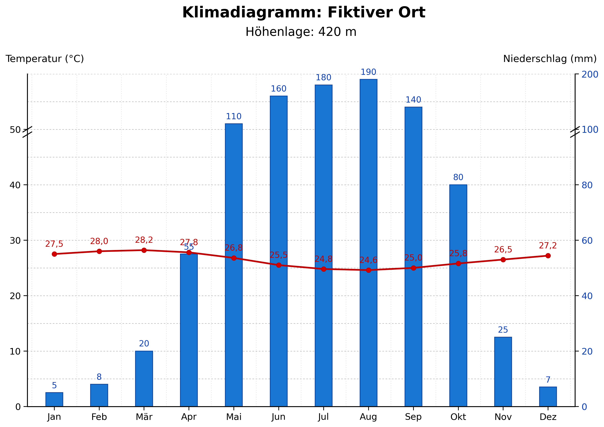
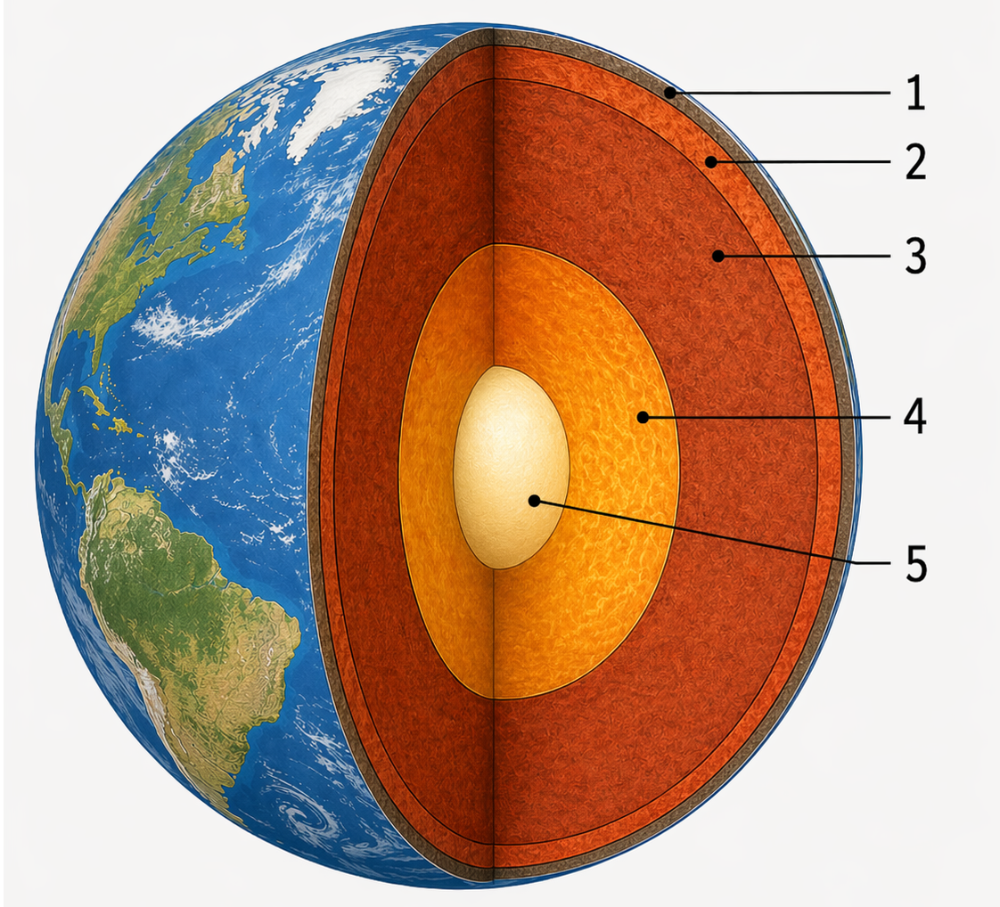
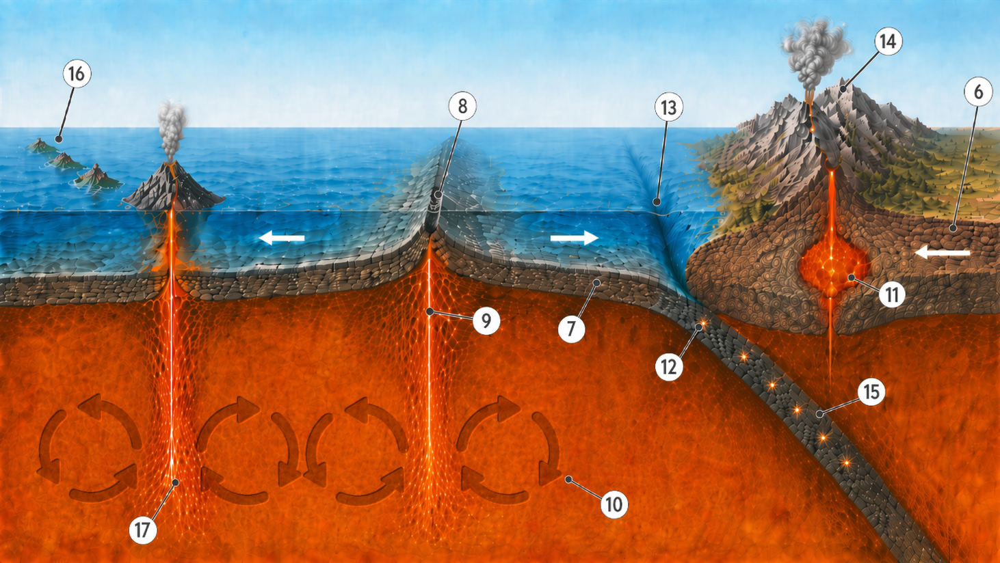

<!--
version:  0.0.1
language: de

mode: Presentation

import: https://raw.githubusercontent.com/MINT-the-GAP/Aufgabensammlung/main/imports/TafelREADME.md
import: https://raw.githubusercontent.com/MINT-the-GAP/Aufgabensammlung/main/imports/MarkerREADME.md
import: https://raw.githubusercontent.com/MINT-the-GAP/Aufgabensammlung/main/imports/FlexChildREADME.md
import: https://raw.githubusercontent.com/MINT-the-GAP/Aufgabensammlung/main/imports/DeutschREADME.md
import: https://raw.githubusercontent.com/MINT-the-GAP/Aufgabensammlung/main/imports/NavigationREADME.md
import: https://raw.githubusercontent.com/MINT-the-GAP/Aufgabensammlung/main/imports/TimerREADME.md
import: https://raw.githubusercontent.com/MINT-the-GAP/Aufgabensammlung/main/imports/FreezeREADME.md

author: Martin Lommatzsch
-->

# Aufgaben für die Prüfungstage - Geographie: Klasse 7

> Wenn du diese Aufgaben bearbeitest, solltest du nicht in ein anderes Fenster oder einen anderen Tab wechseln, sondern dich nur auf diese Aufgaben konzentrieren. Hole dir alle Materialien, die du zum Bearbeiten dieser Aufgaben brauchst. In deinem Fall solltest du dir Stifte und Papier holen, um dir zur Not Notizen machen zu können. Am Ende der Bearbeitung sendest du diese bearbeiteten Aufgaben an deinen Lehrer oder deine Lehrerin, sodass die Lehrkräfte sehen können, was du gemacht hast. 
 - Martin Lommatzsch 

> HINWEIS 1: <h3>Diese Aufgaben werden abgegeben. Am Ende des Kurses kann der Kurs eingefroren werden. Dadurch entsteht ein Link, versende diesen Link via LernSax an deinen Lehrer oder deine Lehrerin. </h3>

> HINWEIS 2: <h3> Das Anzahl, wie oft du auf "Prüfen" drückst, wird auch erfasst. </h3>

> HINWEIS 3: <h3> Falls du eine Aufgabe gerade nicht bearbeiten möchtest, kannst du zur nächsten wechseln. Du kannst zu jeder Zeit zu dieser Aufgabe zurückkehren. Bearbeite am besten alle Aufgaben, bevor du alles einfrierst. </h3>

Hier hast du nochmal eine Übersicht über die Menüleiste:

> 
  

- 1. Inhaltsverzeichnis: Komme schnell zu deiner Aufgabe

- 2. Textmarker: Markiere dir wichtige Textpassagen

- 3. Schriftgrößenanpassung: Stelle dir die Schriftgröße für deinen optimalen Arbeitsmodus ein.

- 4. Darstellungsbreite: Es wird "Präsentation" empfohlen, aber probiere ruhig mal "Lehrbuch" aus.

- 5. Aussehen von LiaScript: Hier kannst du in den Dunkelmodus wechseln oder die Themefarben anpassen. Auch kannst du die Vorlesegeschwindigkeit sowie Stimmhöhe anpassen.

- 6. Automatische Übersetzung in andere Sprachen

- 7. Gruppenraum eröffnen: (für dich wohl unwichtig, aber für LehrerInnen eventuell interessanter)

- 8. Informationen zum Kurs: Hier steht, welche Version das Arbeitsblatt besitzt und wer das Arbeitsblatt erstellt hat.

Wenn du mit den Aufgaben beginnen willst, dann swipe (wische) entweder weiter oder klicke unten neben der Seitenzahl auf den Pfeil nach rechts.

## Flaggen

**Benenne** die Staaten hinter den dargestellten Flaggen.

<section class="dynFlex">

__$a)\;\;$__ 

<!-- style="max-width:300px" -->

<!-- data-randomize="true" data-solution-timer="600s" data-solution-timer-start="oncheck" data-solution-timer-badge="off" -->
- [(X)] Botswana
- [( )] Namibia
- [( )] Nigeria
- [( )] Tschad

__$b)\;\;$__ 

<!-- style="max-width:300px" -->

<!-- data-randomize="true" data-solution-timer="600s" data-solution-timer-start="oncheck" data-solution-timer-badge="off" -->
- [(X)] Togo
- [( )] Sudan
- [( )] Ruanda
- [( )] Lesotho

__$c)\;\;$__ 

<!-- style="max-width:300px" -->

<!-- data-randomize="true" data-solution-timer="600s" data-solution-timer-start="oncheck" data-solution-timer-badge="off" -->
- [(X)] Kenia
- [( )] Libyen
- [( )] Mali
- [( )] Tansania

__$d)\;\;$__ 

<!-- style="max-width:300px" -->

<!-- data-randomize="true" data-solution-timer="600s" data-solution-timer-start="oncheck" data-solution-timer-badge="off" -->
- [(X)] Madagaskar
- [( )] Benin
- [( )] Gabun
- [( )] Eritrea

__$e)\;\;$__ 

<!-- style="max-width:300px" -->

<!-- data-randomize="true" data-solution-timer="600s" data-solution-timer-start="oncheck" data-solution-timer-badge="off" -->
- [(X)] Kamerun
- [( )] Guinea
- [( )] Guinea-Bissau
- [( )] Elfenbeinküste

__$f)\;\;$__ 

<!-- style="max-width:300px" -->

<!-- data-randomize="true" data-solution-timer="600s" data-solution-timer-start="oncheck" data-solution-timer-badge="off" -->
- [(X)] Demokratische Republik Kongo
- [( )] Republik Kongo
- [( )] Namibia
- [( )] Somalia

__$g)\;\;$__ 

<!-- style="max-width:300px" -->

<!-- data-randomize="true" data-solution-timer="600s" data-solution-timer-start="oncheck" data-solution-timer-badge="off" -->
- [(X)] Tunesien
- [( )] Algerien
- [( )] Ägyption
- [( )] Libyen

__$h)\;\;$__ 

<!-- style="max-width:300px" -->

<!-- data-randomize="true" data-solution-timer="600s" data-solution-timer-start="oncheck" data-solution-timer-badge="off" -->
- [(X)] Zentralafrikanische Republik
- [( )] Uganda
- [( )] Simbabwe
- [( )] Liberia

</section>

@ADetails(BE=8;Flaggen)

## Topographie

**Gib** die Antwort auf die Fragen **an**.

<section class="dynFlex">

<!-- data-solution-timer="600s" data-solution-timer-start="oncheck" data-solution-timer-badge="off" -->
__$a)\;\;$__ Wie heißt der längste Fluss Afrikas?\
[[     Nil     ]]

@ADetails(BE=1;Topographie)

<!-- data-solution-timer="600s" data-solution-timer-start="oncheck" data-solution-timer-badge="off" -->
__$b)\;\;$__ Wie heißt das Gebirge im Nordwesten Afrikas?\
[[     Atlas     ]]

@ADetails(BE=1;Topographie)

<!-- data-solution-timer="600s" data-solution-timer-start="oncheck" data-solution-timer-badge="off" -->
__$c)\;\;$__ Wie heißt die größte Insel Afrikas?\
[[     Madagaskar     ]]

@ADetails(BE=1;Topographie)

<!-- data-solution-timer="600s" data-solution-timer-start="oncheck" data-solution-timer-badge="off" -->
__$d)\;\;$__ Wie heißt der höchste Berg Afrikas?\
[[     Kilimandscharo     ]]

@ADetails(BE=1;Topographie)

<!-- data-solution-timer="600s" data-solution-timer-start="oncheck" data-solution-timer-badge="off" -->
__$e)\;\;$__ Wie heißt die Wüste an der Küste Namibias?\
[[     Namib     ]]

@ADetails(BE=1;Topographie)

<!-- data-solution-timer="600s" data-solution-timer-start="oncheck" data-solution-timer-badge="off" -->
__$f)\;\;$__ Wie heißt der große See im Osten Afrikas?\
[[     Victoriasee     ]]

@ADetails(BE=1;Topographie)

<!-- data-solution-timer="600s" data-solution-timer-start="oncheck" data-solution-timer-badge="off" -->
__$g)\;\;$__ Wie heißt das Binnenmeer zwischen Afrika und Asien?\
[[     Rotes Meer     ]]

@ADetails(BE=1;Topographie)

<!-- data-solution-timer="600s" data-solution-timer-start="oncheck" data-solution-timer-badge="off" -->
__$h)\;\;$__ Wie heißt das Gebirge, in dem der Tafelberg liegt?\
[[     Kapgebirge     ]]

@ADetails(BE=1;Topographie)

<!-- data-solution-timer="600s" data-solution-timer-start="oncheck" data-solution-timer-badge="off" -->
__$i)\;\;$__ Wie heißt die Hauptstadt von Kenia?\
[[     Nairobi     ]]

@ADetails(BE=1;Topographie)

<!-- data-solution-timer="600s" data-solution-timer-start="oncheck" data-solution-timer-badge="off" -->
__$j)\;\;$__ Wie heißt der Fluss, der durch den Regenwald im Zentrum Afrikas fließt?\
[[     Kongo     ]]

@ADetails(BE=1;Topographie)

<!-- data-solution-timer="600s" data-solution-timer-start="oncheck" data-solution-timer-badge="off" -->
__$k)\;\;$__ Wie heißt die Meerenge zwischen Afrika und Europa im Westen des Mittelmeers?\
[[     Gibraltar     ]]

@ADetails(BE=1;Topographie)

<!-- data-solution-timer="600s" data-solution-timer-start="oncheck" data-solution-timer-badge="off" -->
__$l)\;\;$__ Wie heißt die große Wüste im Süden Afrikas?\
[[     Kalahari     ]]

@ADetails(BE=1;Topographie)

</section>

## Klimadiagramm

Gegeben sei das fiktive Klimadiagramm.

<!-- style="max-width:700px" -->

<section class="dynFlex">

__$a)\;\;$__ **Gib** die Jahresdurchschnittstemperatur **an**.

<!-- data-solution-timer="600s" data-solution-timer-start="oncheck" data-solution-timer-badge="off" -->
$\bar{T} = $ [[  26,475    ]] $^\circ C$

@ADetails(BE=1;Klimadiagramm)

__$b)\;\;$__ **Gib** die Gesamtniederschlagsmenge **an**.

<!-- data-solution-timer="600s" data-solution-timer-start="oncheck" data-solution-timer-badge="off" -->
[[  980       ]] $mm$

@ADetails(BE=1;Klimadiagramm)

__$c)\;\;$__ **Gib** die Anzahl der ariden Monate **an**.

<!-- data-solution-timer="600s" data-solution-timer-start="oncheck" data-solution-timer-badge="off" -->
[[  6       ]] Monate

@ADetails(BE=1;Klimadiagramm)

__$d)\;\;$__ **Gib** die größte Temperaturdifferenz **an**.

<!-- data-solution-timer="600s" data-solution-timer-start="oncheck" data-solution-timer-badge="off" -->
$\bar{T} = $ [[  3,6    ]] $^\circ C$

@ADetails(BE=1;Klimadiagramm)

__$e)\;\;$__ **Gib** die Niederschlagsdifferenz zwischen August und April **an**.

<!-- data-solution-timer="600s" data-solution-timer-start="oncheck" data-solution-timer-badge="off" -->
[[    135     ]] $mm$

@ADetails(BE=1;Klimadiagramm)

__$f)\;\;$__ **Benenne** die Art des Klimas.

<!-- data-solution-timer="600s" data-solution-timer-start="oncheck" data-solution-timer-badge="off" -->
[[  wechselfeuchte Tropen  ]]

@ADetails(BE=1;Klimadiagramm)

</section>

## Aufbau der Erde

**Ordne** den Zahlen in den Abbildungen ihre korrekten Fachbegriffe **zu**.

<section class="dynFlex"  data-basis="45">

<!-- style="max-width:500px" -->

<!-- style="max-width:1000px" -->

</section>

<!-- data-randomize="true" data-show-partial-solution="true" data-solution-timer="600s" data-solution-timer-start="oncheck" data-solution-timer-badge="off" -->
1: [->[(Lithosphäre)]] $\;\;\quad\;\;$ 
2: [->[(Astenosphäre)]] $\;\;\quad\;\;$ 
3: [->[(Mesosphäre)]] $\;\;\quad\;\;$ 
4: [->[(Äußerer Kern)]] $\;\;\quad\;\;$ 
5: [->[(Innerer Kern)]] $\;\;\quad\;\;$ 
6: [->[(Kontinentalplatte)]] $\;\;\quad\;\;$  \
7: [->[(Ozeanische Platte)]] $\;\;\quad\;\;$ 
8: [->[(Mittelozeanischer Rücken)]] $\;\;\quad\;\;$ 
9: [->[(Magmaaufstieg)]] $\;\;\quad\;\;$ 
10: [->[(Konvektionsstrom)]] $\;\;\quad\;\;$ 
11: [->[(Magmakammer)]] $\;\;\quad\;\;$ 
12: [->[(Subduktionszone)]] $\;\;\quad\;\;$  \
13: [->[(Tiefseegraben)]] $\;\;\quad\;\;$ 
14: [->[(Vulkangebirge)]] $\;\;\quad\;\;$ 
15: [->[(Erdbebenzone)]] $\;\;\quad\;\;$ 
16: [->[(Erloschene Vulkane)]] $\;\;\quad\;\;$ 
17: [->[(Hotspot)|Nebenvulkan]] $\;\;\quad\;\;$ 

@ADetails(17=BE;Erdaufbau)

## Bodenschätze

**Lies** den Sachtext aufmerksam und **ordne** die fehlenden Begriffe korrekt **zu**.

---

---

<h2> Rohstoffe und Konflikte in Afrika</h2> 

<!-- data-randomize="true" data-show-partial-solution="true" data-solution-timer="600s" data-solution-timer-start="oncheck" data-solution-timer-badge="off" -->
Afrika ist ein Kontinent mit großen Vorräten an wertvollen [->[(Rohstoffen)]]. Dazu gehören zum Beispiel Erdöl, Erdgas, Gold, Diamanten, Kupfer und [->[(Kobalt)]]. Viele dieser Stoffe werden weltweit benötigt. Kobalt spielt heute eine wichtige Rolle bei der Herstellung von [->[(Batterien)]], zum Beispiel für Elektroautos, Smartphones und Laptops. Auch [->[(Coltan)]] ist wichtig, weil daraus Metalle gewonnen werden, die in moderner Elektronik verwendet werden. \
Eigentlich könnte der Reichtum an Bodenschätzen vielen Ländern beim [->[(Aufbau)]] ihrer Wirtschaft helfen. Einnahmen aus dem Rohstoffverkauf könnten in Straßen, Schulen, Krankenhäuser und die [->[(Versorgung)]] der Bevölkerung investiert werden. Doch Rohstoffe führen nicht automatisch zu Wohlstand. In manchen Regionen verschärfen sie sogar bestehende Probleme. \
Ein bekanntes Beispiel ist die Demokratische Republik [->[(Kongo)]]. Vor allem im [->[(Osten)]] des Landes kommt es seit vielen Jahren zu gewaltsamen Auseinandersetzungen. Dort versuchen bewaffnete Gruppen, wichtige [->[(Minen)]] und Handelswege zu kontrollieren. Wer diese Gebiete beherrscht, kann Rohstoffe verkaufen und damit Waffen, Ausrüstung und Kämpfer [->[(finanzieren)]]. Deshalb spricht man oft davon, dass Bodenschätze Konflikte anheizen können. \
Trotzdem wäre es zu einfach, nur die Rohstoffe für die Gewalt verantwortlich zu machen. Auch schwache staatliche [->[(Strukturen)]], Machtkämpfe, Armut, Fluchtbewegungen und Streit um [->[(Land)]] und Wasser spielen eine wichtige Rolle. Häufig fehlt es an Sicherheit, an funktionierenden Behörden und an gerechter [->[(Verteilung)]] der Einnahmen. So profitieren oft nur wenige Menschen, während viele andere in [->[(Armut)]] leben. \
Für die Geographie ist deshalb wichtig: Rohstoffe sind weder nur ein Fluch noch nur ein Segen. Entscheidend ist, wie sie genutzt werden. Werden sie unter fairen Regeln gefördert, können sie zur [->[(Entwicklung)]] eines Landes beitragen. Werden sie jedoch unter Gewalt, [->[(Korruption)]] und Ausbeutung gewonnen, verschärfen sie bestehende [->[(Konflikte)]]. Rohstoffreichtum ist also eine große [->[(Chance)]], aber auch eine politische und gesellschaftliche [->[(Herausforderung)]]. \
Besonders problematisch ist dabei, dass viele afrikanische Staaten ihre Rohstoffe zwar [->[(exportieren)]], aber nur einen kleinen Teil der Weiterverarbeitung selbst übernehmen. Dadurch entsteht oft weniger Wertschöpfung im eigenen [->[(Land)]], als eigentlich möglich wäre.

@ADetails(10=BE;Bodenschätze)

# Abgabe

@Abgabe

@Auswertung(F12;Tab;Time)