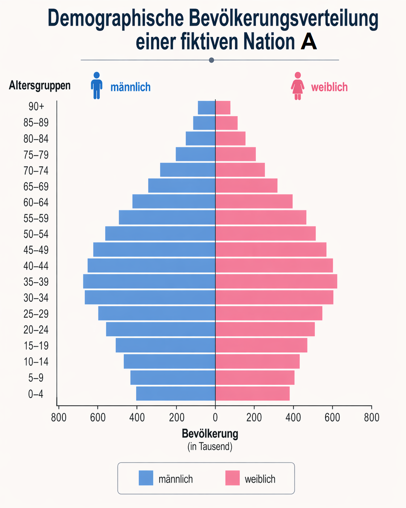
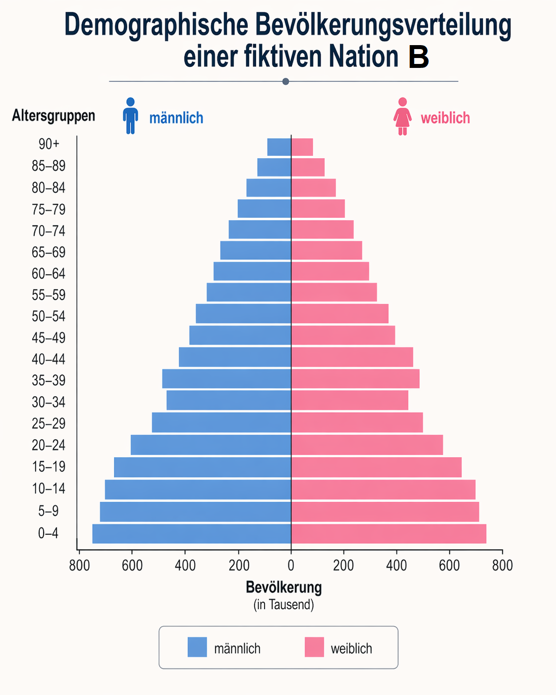
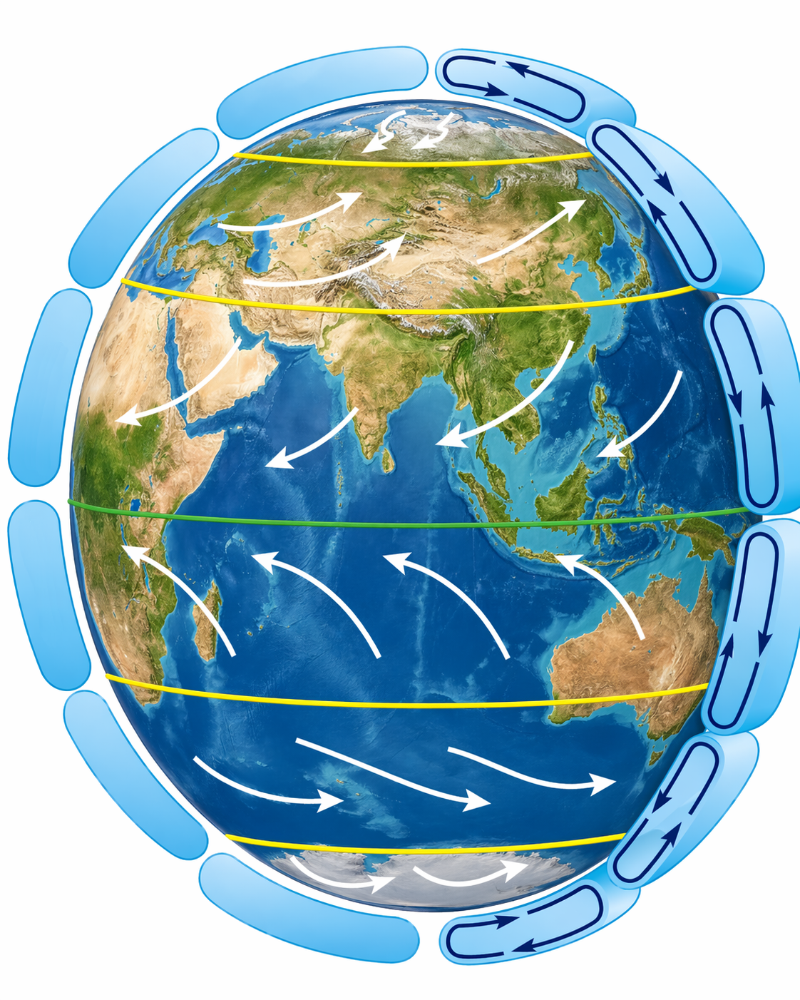

<!--
version:  0.0.1
language: de

mode: Presentation

import: https://raw.githubusercontent.com/MINT-the-GAP/Aufgabensammlung/main/imports/TafelREADME.md
import: https://raw.githubusercontent.com/MINT-the-GAP/Aufgabensammlung/main/imports/MarkerREADME.md
import: https://raw.githubusercontent.com/MINT-the-GAP/Aufgabensammlung/main/imports/FlexChildREADME.md
import: https://raw.githubusercontent.com/MINT-the-GAP/Aufgabensammlung/main/imports/DeutschREADME.md
import: https://raw.githubusercontent.com/MINT-the-GAP/Aufgabensammlung/main/imports/NavigationREADME.md
import: https://raw.githubusercontent.com/MINT-the-GAP/Aufgabensammlung/main/imports/TimerREADME.md
import: https://raw.githubusercontent.com/MINT-the-GAP/Aufgabensammlung/main/imports/FreezeREADME.md

author: Martin Lommatzsch
-->

# Aufgaben für die Prüfungstage - Geographie: Klasse 8

> Wenn du diese Aufgaben bearbeitest, solltest du nicht in ein anderes Fenster oder einen anderen Tab wechseln, sondern dich nur auf diese Aufgaben konzentrieren. Hole dir alle Materialien, die du zum Bearbeiten dieser Aufgaben brauchst. In deinem Fall solltest du dir Stifte und Papier holen, um dir zur Not Notizen machen zu können. Am Ende der Bearbeitung sendest du diese bearbeiteten Aufgaben an deinen Lehrer oder deine Lehrerin, sodass die Lehrkräfte sehen können, was du gemacht hast. 
 - Martin Lommatzsch 

> HINWEIS 1: <h3>Diese Aufgaben werden abgegeben. Am Ende des Kurses kann der Kurs eingefroren werden. Dadurch entsteht ein Link, versende diesen Link via LernSax an deinen Lehrer oder deine Lehrerin. </h3>

> HINWEIS 2: <h3> Das Anzahl, wie oft du auf "Prüfen" drückst, wird auch erfasst. </h3>

> HINWEIS 3: <h3> Falls du eine Aufgabe gerade nicht bearbeiten möchtest, kannst du zur nächsten wechseln. Du kannst zu jeder Zeit zu dieser Aufgabe zurückkehren. Bearbeite am besten alle Aufgaben, bevor du alles einfrierst. </h3>

Hier hast du nochmal eine Übersicht über die Menüleiste:

> 
  

- 1. Inhaltsverzeichnis: Komme schnell zu deiner Aufgabe

- 2. Textmarker: Markiere dir wichtige Textpassagen

- 3. Schriftgrößenanpassung: Stelle dir die Schriftgröße für deinen optimalen Arbeitsmodus ein.

- 4. Darstellungsbreite: Es wird "Präsentation" empfohlen, aber probiere ruhig mal "Lehrbuch" aus.

- 5. Aussehen von LiaScript: Hier kannst du in den Dunkelmodus wechseln oder die Themefarben anpassen. Auch kannst du die Vorlesegeschwindigkeit sowie Stimmhöhe anpassen.

- 6. Automatische Übersetzung in andere Sprachen

- 7. Gruppenraum eröffnen: (für dich wohl unwichtig, aber für LehrerInnen eventuell interessanter)

- 8. Informationen zum Kurs: Hier steht, welche Version das Arbeitsblatt besitzt und wer das Arbeitsblatt erstellt hat.

Wenn du mit den Aufgaben beginnen willst, dann swipe (wische) entweder weiter oder klicke unten neben der Seitenzahl auf den Pfeil nach rechts.

## Flaggen

**Benenne** die Staaten hinter den dargestellten Flaggen.

<section class="dynFlex">

__$a)\;\;$__ 

<!-- style="max-width:300px" -->

<!-- data-randomize="true" data-solution-timer="600s" data-solution-timer-start="oncheck" data-solution-timer-badge="off" -->
- [(X)] Usbekistan
- [( )] Tadschikistan
- [( )] Turkmenistan
- [( )] Kirgisistan

__$b)\;\;$__ 

<!-- style="max-width:300px" -->

<!-- data-randomize="true" data-solution-timer="600s" data-solution-timer-start="oncheck" data-solution-timer-badge="off" -->
- [(X)] Jemen
- [( )] Irak
- [( )] Ägypten
- [( )] Syrien

__$c)\;\;$__ 

<!-- style="max-width:300px" -->

<!-- data-randomize="true" data-solution-timer="600s" data-solution-timer-start="oncheck" data-solution-timer-badge="off" -->
- [(X)] Bahrain
- [( )] Katar
- [( )] Vereinite Arabische Emirate
- [( )] Oman

__$d)\;\;$__ 

<!-- style="max-width:300px" -->

<!-- data-randomize="true" data-solution-timer="600s" data-solution-timer-start="oncheck" data-solution-timer-badge="off" -->
- [(X)] Brunei
- [( )] Bhutan
- [( )] Osttimor
- [( )] Sri Lanka

__$e)\;\;$__ 

<!-- style="max-width:300px" -->

<!-- data-randomize="true" data-solution-timer="600s" data-solution-timer-start="oncheck" data-solution-timer-badge="off" -->
- [(X)] Philippinen
- [( )] Kambodscha
- [( )] Indonesien
- [( )] Malediven

__$f)\;\;$__ 

<!-- style="max-width:300px" -->

<!-- data-randomize="true" data-solution-timer="600s" data-solution-timer-start="oncheck" data-solution-timer-badge="off" -->
- [(X)] Laos
- [( )] Myanmar
- [( )] Thailand
- [( )] Vietnam

__$g)\;\;$__ 

<!-- style="max-width:300px" -->

<!-- data-randomize="true" data-solution-timer="600s" data-solution-timer-start="oncheck" data-solution-timer-badge="off" -->
- [(X)] Armenien
- [( )] Georgien
- [( )] Aserbaidschan
- [( )] Jordanien

__$h)\;\;$__ 

<!-- style="max-width:300px" -->

<!-- data-randomize="true" data-solution-timer="600s" data-solution-timer-start="oncheck" data-solution-timer-badge="off" -->
- [(X)] Kasachstan
- [( )] Mongolei
- [( )] Kirgisistan
- [( )] Afghanistan

</section>

@ADetails(BE=8;Flaggen)

## Topographie

**Gib** die Antwort auf die Fragen **an**.

<section class="dynFlex">

<!-- data-solution-timer="600s" data-solution-timer-start="oncheck" data-solution-timer-badge="off" -->
__$a)\;\;$__ Wie heißt das Binnenmeer zwischen Europa und Asien? \
[[     Kaspisches Meer     ]]

@ADetails(BE=1;Topographie)

<!-- data-solution-timer="600s" data-solution-timer-start="oncheck" data-solution-timer-badge="off" -->
__$b)\;\;$__ Wie heißt die große Wüste in der Mongolei und in Nordchina?\
[[     Gobi     ]]

@ADetails(BE=1;Topographie)

<!-- data-solution-timer="600s" data-solution-timer-start="oncheck" data-solution-timer-badge="off" -->
__$c)\;\;$__ Wie heißt der längste Fluss Chinas?\
[[     Jangtsekiang     ]]

@ADetails(BE=1;Topographie)

<!-- data-solution-timer="600s" data-solution-timer-start="oncheck" data-solution-timer-badge="off" -->
__$d)\;\;$__ Wie heißt der tiefste See der Erde?\
[[     Baikalsee     ]]

@ADetails(BE=1;Topographie)

<!-- data-solution-timer="600s" data-solution-timer-start="oncheck" data-solution-timer-badge="off" -->
__$e)\;\;$__ Welcher Fluss bildet mit dem Ganges ein riesiges Delta in Bangladesch? \
[[     Brahmaputra     ]]

@ADetails(BE=1;Topographie)

<!-- data-solution-timer="600s" data-solution-timer-start="oncheck" data-solution-timer-badge="off" -->
__$f)\;\;$__ Wie heißt die Meerenge am Eingang zum Persischen Golf?\
[[     Straße von Hormus     ]]

@ADetails(BE=1;Topographie)

<!-- data-solution-timer="600s" data-solution-timer-start="oncheck" data-solution-timer-badge="off" -->
__$g)\;\;$__ Wie heißt die Hauptstadt der Mongolei?\
[[     Ulaanbaatar     ]]

@ADetails(BE=1;Topographie)

<!-- data-solution-timer="600s" data-solution-timer-start="oncheck" data-solution-timer-badge="off" -->
__$h)\;\;$__ Wie heißt die größte Insel Asiens?\
[[     Borneo     ]]

@ADetails(BE=1;Topographie)

<!-- data-solution-timer="600s" data-solution-timer-start="oncheck" data-solution-timer-badge="off" -->
__$i)\;\;$__ Wie heißt die Meerenge zwischen Asien und Nordamerika?\
[[     Beringstraße     ]]

@ADetails(BE=1;Topographie)

<!-- data-solution-timer="600s" data-solution-timer-start="oncheck" data-solution-timer-badge="off" -->
__$j)\;\;$__ Wie heißt die Meerenge zwischen Sumatra und der Malaiischen Halbinsel?\
[[     Straße von Malakka     ]]

@ADetails(BE=1;Topographie)

<!-- data-solution-timer="600s" data-solution-timer-start="oncheck" data-solution-timer-badge="off" -->
__$k)\;\;$__ Wie heißt der große See zwischen Kasachstan und Usbekistan, der stark geschrumpft ist?\
[[     Aralsee     ]]

@ADetails(BE=1;Topographie)

<!-- data-solution-timer="600s" data-solution-timer-start="oncheck" data-solution-timer-badge="off" -->
__$l)\;\;$__ Wie heißt der Fluss, der durch Bagdad fließt?\
[[     Tigris     ]]

@ADetails(BE=1;Topographie)

</section>

## Demographie

Gegeben seien die beiden Bevölkerungsverteilungen der fiktiven Nationen A und B.

<section class="dynFlex" data-basis="40">

<!-- style="max-width:500px" -->

<!-- style="max-width:500px" -->

</section>

<section class="dynFlex">

<!-- data-solution-timer="600s" data-solution-timer-start="oncheck" data-solution-timer-badge="off" -->
__$a)\;\;$__ **Gib** die Art der Bevölkerungsverteilung von Nation A **an**.
[[   Urnenform   ]]

@ADetails(BE=1;Demographie)

<!-- data-solution-timer="600s" data-solution-timer-start="oncheck" data-solution-timer-badge="off" -->
__$b)\;\;$__ **Gib** die Art der Bevölkerungsverteilung von Nation B **an**.
[[   Pyramidenform   ]]

@ADetails(BE=1;Demographie)

__$c)\;\;$__ **Entscheide**, in welcher Nation mehr Wohlstand und eine bessere medizinische Versorgung vorherrscht.

<!-- data-randomize="true" data-solution-timer="600s" data-solution-timer-start="oncheck" data-solution-timer-badge="off" -->
- [(x)] Nation A
- [( )] Nation B
- [( )] Beide gleichermaßen
- [( )] Nicht aussagbar

@ADetails(BE=1;Demographie)

__$d)\;\;$__ **Entscheide**, vor wie vielen Jahren gab es in der Nation B eine schwere Krise.

<!-- data-randomize="true" data-solution-timer="600s" data-solution-timer-start="oncheck" data-solution-timer-badge="off" -->
- [( )] vor 0 bis 4 Jahren
- [( )] vor 5 bis 9 Jahren
- [( )] vor 10 bis 14 Jahren
- [( )] vor 15 bis 19 Jahren
- [( )] vor 20 bis 24 Jahren
- [( )] vor 25 bis 29 Jahren
- [(X)] vor 30 bis 34 Jahren
- [( )] vor 35 bis 39 Jahren
- [( )] vor 40 bis 44 Jahren
- [( )] vor 45 bis 49 Jahren
- [( )] vor 50 bis 54 Jahren
- [( )] vor 55 bis 59 Jahren

@ADetails(BE=1;Demographie)

__$e)\;\;$__ In den höchsten Altersgruppen sind die weiblichen Balken teilweise etwas länger. **Entscheide**, welche Erklärung fachlich am besten passt.  

<!-- data-randomize="true" data-solution-timer="600s" data-solution-timer-start="oncheck" data-solution-timer-badge="off" -->
[->[Frauen werden grundsätzlich immer doppelt so alt wie Männer|(Frauen erreichen häufig etwas höhere Lebensalter als Männer)|Männer fehlen im Diagramm|Mädchen werden häufiger geboren]]

@ADetails(BE=1;Demographie)

__$f)\;\;$__ **Entscheide**, in welcher Nation die Finanzierung von Renten, Pflege und Gesundheitsversorgung langfristig stärker zum Problem werden könnte.  

<!-- data-randomize="true" data-solution-timer="600s" data-solution-timer-start="oncheck" data-solution-timer-badge="off" -->
- [(x)] Nation A
- [( )] Nation B
- [( )] Beide gleichermaßen
- [( )] Nicht aussagbar

@ADetails(BE=1;Demographie)

__$g)\;\;$__  **Entscheide**, in welcher Nation der Ausbau von Grundschulen und weiterführenden Schulen besonders wichtig werden könnte.

<!-- data-randomize="true" data-solution-timer="600s" data-solution-timer-start="oncheck" data-solution-timer-badge="off" -->
- [( )] Nation A
- [(x)] Nation B
- [( )] Beide gleichermaßen
- [( )] Nicht aussagbar

@ADetails(BE=1;Demographie)

__$h)\;\;$__  **Entscheide**, welche Information man aus den Diagrammen nicht sicher entnehmen kann.  

<!-- data-randomize="true" data-solution-timer="600s" data-solution-timer-start="oncheck" data-solution-timer-badge="off" -->
[->[welche Altersgruppen stark vertreten sind|ob es mehr junge oder alte Menschen gibt|ob Nation A oder B eine jüngere Altersstruktur hat|(welche politischen Ursachen die Bevölkerungsstruktur genau hat)]]

@ADetails(BE=1;Demographie)

</section>

## Chinas Rohstoffe

**Lies** den Text und **entscheide**, ob die Behauptungen "wahr" oder "falsch" sind.

---

---

<h2> Chinas Marktmacht durch Rohstoffhandel </h2>

China ist nicht nur ein großes Industrieland, sondern auch ein besonders wichtiger Akteur im weltweiten Rohstoffhandel. Viele moderne Produkte brauchen Rohstoffe, die nicht überall gleichmäßig vorkommen. Dazu gehören zum Beispiel Lithium, Kobalt, Nickel, Graphit, Kupfer und Seltene Erden. Sie werden für Smartphones, Computerchips, Elektroautos, Batterien, Windkraftanlagen, Solaranlagen und viele andere technische Geräte benötigt.

China besitzt bei einigen dieser Rohstoffe selbst große Vorkommen. Noch wichtiger ist aber: China verarbeitet viele Rohstoffe weiter. Das bedeutet, dass Rohstoffe nach dem Abbau gereinigt, getrennt, veredelt oder zu Vorprodukten verarbeitet werden. Genau in diesem Bereich ist China besonders stark. Viele Länder fördern zwar Rohstoffe, aber die Weiterverarbeitung findet häufig in China statt. Dadurch entsteht eine besondere Abhängigkeit: Selbst wenn ein Rohstoff in Afrika, Südamerika oder Australien abgebaut wird, kann er für die Industrie erst dann wirklich nutzbar sein, wenn er verarbeitet wurde.

Ein gutes Beispiel sind Seltene Erden. Der Name ist etwas missverständlich, denn diese Metalle sind nicht immer wirklich „selten“. Schwierig ist aber ihre Gewinnung und Trennung. Seltene Erden werden zum Beispiel für starke Magnete gebraucht. Solche Magnete stecken in Elektromotoren, Windkraftanlagen und vielen technischen Geräten. Wenn ein Land bei solchen Stoffen eine starke Stellung hat, kann es Einfluss auf Preise, Lieferzeiten und industrielle Produktion nehmen.

Auch Graphit ist wichtig. Graphit wird unter anderem für Batterien benötigt, besonders für Elektroautos. Wenn viele Staaten gleichzeitig Elektroautos, Stromspeicher und erneuerbare Energien ausbauen wollen, steigt die Nachfrage nach solchen Rohstoffen. Wer dann große Teile der Verarbeitung kontrolliert, besitzt Marktmacht.

Marktmacht bedeutet: Ein Staat oder Unternehmen kann durch seine starke Stellung auf einem Markt andere beeinflussen. China kann zum Beispiel durch Exportregeln bestimmen, ob bestimmte Rohstoffe oder Vorprodukte leicht ins Ausland geliefert werden dürfen oder ob dafür besondere Genehmigungen nötig sind. Solche Regeln können andere Länder unter Druck setzen, weil ihre Firmen auf diese Lieferungen angewiesen sind.

Diese Marktmacht ist nicht automatisch „gut“ oder „böse“. Für China ist sie ein wirtschaftlicher und politischer Vorteil. Für andere Länder ist sie ein Risiko, wenn sie zu abhängig von einem einzigen Lieferanten werden. Deshalb versuchen die Europäische Union, die USA, Japan und andere Staaten, neue Lieferketten aufzubauen. Sie wollen Rohstoffe aus verschiedenen Ländern beziehen, Recycling verbessern und eigene Verarbeitungsanlagen errichten.

Für die Geographie ist daran besonders interessant: Rohstoffe sind nicht nur Naturvorkommen. Sie hängen auch mit Handel, Technik, Politik, Transportwegen und Macht zusammen. Ein Land ist also nicht nur dann mächtig, wenn es viele Rohstoffe besitzt. Es kann auch mächtig sein, wenn es kontrolliert, wie Rohstoffe verarbeitet und weiterverkauft werden. Genau deshalb spielt China im globalen Rohstoffhandel eine so große Rolle.

---

<!-- data-randomize="true" data-show-partial-solution="true" data-solution-timer="600s" data-solution-timer-start="oncheck" data-solution-timer-badge="off" -->
- [(wahr)   (falsch)]
- [ (X)       ( )    ]  China ist im weltweiten Rohstoffhandel besonders wichtig, weil es viele Rohstoffe verarbeitet und weiterverkauft.
- [ ( )       (X)    ]  Seltene Erden werden nur für Schmuck und Münzen benötigt.
- [ (X)       ( )    ]  Seltene Erden werden unter anderem für starke Magnete in moderner Technik gebraucht.
- [ (X)       ( )    ]  Ein Land kann auch dann Marktmacht besitzen, wenn es Rohstoffe vor allem weiterverarbeitet.
- [ ( )       (X)    ]  Rohstoffe werden nach dem Abbau immer sofort ohne weitere Verarbeitung in Smartphones oder Batterien eingebaut.
- [ (X)       ( )    ]  Graphit ist für Batterien, zum Beispiel in Elektroautos, wichtig.
- [ (X)       ( )    ]  Exportregeln können beeinflussen, ob bestimmte Rohstoffe leicht ins Ausland geliefert werden.
- [ ( )       (X)    ]  Wenn viele Länder von nur einem Lieferanten abhängig sind, entsteht für sie kein Risiko.
- [ (X)       ( )    ]  Andere Staaten versuchen, ihre Abhängigkeit von China durch neue Lieferketten, Recycling und eigene Verarbeitung zu verringern.
- [ (X)       ( )    ]  Rohstoffhandel hat nicht nur mit Naturvorkommen zu tun, sondern auch mit Politik, Technik, Transport und wirtschaftlicher Macht.

@ADetails(BE=10;China)

## Windsystem

<!-- style="max-width:500px" -->

<section class="dynFlex">

<!-- data-solution-timer="600s" data-solution-timer-start="oncheck" data-solution-timer-badge="off" -->
__$a)\;\;$__ Gib an, welches Gebirge im Norden von Indien existiert. \
[[   Himalaya   ]]

@ADetails(BE=1;Windsystem)

__$b)\;\;$__ **Entscheide** wohin sich das typische erdnahe Hochdruckgebiet am Äquator bewegt.

<!--data-randomize="true" data-solution-timer="600s" data-solution-timer-start="oncheck" data-solution-timer-badge="off" -->
- [(x)] nach Norden
- [( )] nach Süden
- [( )] nach Osten
- [( )] nach Westen
- [( )] nicht vorhersagbar
- [( )] es bleibt am Äquator

@ADetails(BE=1;Windsystem)

<!-- data-solution-timer="600s" data-solution-timer-start="oncheck" data-solution-timer-badge="off" -->
__$c)\;\;$__ **Gib** die Kraft **an**, die dafür sorgt, dass sich Tiefdruckgebiete auf der Nordhalbkugel gegen den Uhrzeigersinn drehen. \
[[  Corioliskraft  ]]

@ADetails(BE=1;Windsystem)

__$d)\;\;$__ **Gib an**, wodurch der Monsun hauptsächlich entsteht. \

<!--data-randomize="true" data-solution-timer="600s" data-solution-timer-start="oncheck" data-solution-timer-badge="off" -->
- [( )] durch die Erdrotation
- [( )] durch die Höhe der umliegenden Gebirge
- [(X)] durch die unterschiedliche Erwärmung von Land und Meer
- [( )] durch die Entfernung zum Äquator

@ADetails(BE=1;Windsystem)

__$e)\;\;$__ **Gib an**, was mit der Luft ungefähr bei 30° Breite passiert. \

<!--data-randomize="true" data-solution-timer="600s" data-solution-timer-start="oncheck" data-solution-timer-badge="off" -->
- [( )] Sie steigt auf.
- [( )] Sie verschwindet.
- [(X)] Sie sinkt ab.
- [( )] Sie dreht sich im Kreis.

@ADetails(BE=1;Windsystem)

__$f)\;\;$__ **Gib an**, Welche Windzone zwischen etwa 30° und 60° nördlicher Breite liegt.  

<!--data-randomize="true" data-solution-timer="600s" data-solution-timer-start="oncheck" data-solution-timer-badge="off" -->
- [( )] Polarostwindzone
- [( )] Passatzone
- [(X)] Westwindzone
- [( )] Monsunzone

@ADetails(BE=1;Windsystem)

</section>

# Abgabe

@Abgabe

@Auswertung(F12;Tab;Time)