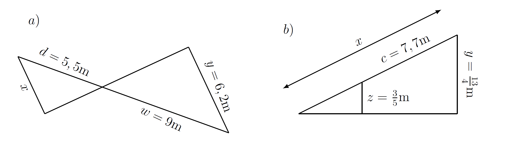

<!--
version:  0.0.1
language: de

@style
  .ts-wrap svg {
    max-width: 100%;
    height: auto;
    display: block;
    margin: 0.5rem auto 1rem auto;
    color: inherit;
  }

  .ts-line {
    stroke: currentColor;
    stroke-width: 2.6;
    fill: none;
    stroke-linecap: round;
    stroke-linejoin: round;
  }

  .ts-thin {
    stroke: currentColor;
    stroke-width: 1.8;
    fill: none;
    stroke-linecap: round;
    stroke-linejoin: round;
  }

  .ts-point {
    fill: currentColor;
  }

  .ts-label {
    fill: currentColor;
    font-family: Arial, Helvetica, sans-serif;
    font-size: 15px;
  }

  .ts-small {
    fill: currentColor;
    font-family: Arial, Helvetica, sans-serif;
    font-size: 13px;
  }

  .ts-title {
    fill: currentColor;
    font-family: Arial, Helvetica, sans-serif;
    font-size: 16px;
    font-weight: bold;
  }
@end

import: https://cdn.jsdelivr.net/gh/LiaTemplates/algebrite@master/README.md
import: https://cdn.jsdelivr.net/gh/LiaTemplates/JSXGraph@main/README.md

import: https://raw.githubusercontent.com/MINT-the-GAP/Aufgabensammlung/main/README.md

import: https://raw.githubusercontent.com/MINT-the-GAP/Aufgabensammlung/main/imports/KoordREADME.md

author: Martin Lommatzsch
-->

# Probeklassenarbeit für Mathematik - Klasse 8: Funktionaler Zusammenhang

 

> [!NOTE]
> Letztes Update am 01.05.2026 gegen 10 Uhr

 

Hier hast du nochmal eine Übersicht über die Menüleiste:

> 
  

- 1. Inhaltsverzeichnis: Komme schnell zu deiner Aufgabe

- 2. Textmarker: Markiere dir wichtige Textpassagen

- 3. Schriftgrößenanpassung: Stelle dir die Schriftgröße für deinen optimalen Arbeitsmodus ein.

- 4. Darstellungsbreite: Es wird "Präsentation" empfohlen, aber probiere ruhig mal "Lehrbuch" aus.

- 5. Aussehen von LiaScript: Hier kannst du in den Dunkelmodus wechseln oder die Themefarben anpassen. Auch kannst du die Vorlesegeschwindigkeit sowie Stimmhöhe anpassen.

- 6. Automatische Übersetzung in andere Sprachen

- 7. Gruppenraum eröffnen: (für dich wohl unwichtig, aber für LehrerInnen eventuell interessanter)

- 8. Informationen zum Kurs: Hier steht, welche Version das Arbeitsblatt besitzt und wer das Arbeitsblatt erstellt hat.

Wenn du mit den Aufgaben beginnen willst, dann swipe (wische) entweder weiter oder klicke unten neben der Seitenzahl auf den Pfeil nach rechts.

---

---

<h2>**Schrifterkennung**</h2>

<!-- style="width:200px" -->

1. Öffnet oder schließt die Schreibfläche.

2. Macht die letzte Änderung auf der Schreibfläche rückgängig.

3. Stellt das letzte "Rückgängig machen" wieder her.

4. Radierer mit Submenü für Radierergröße oder komplettes löschen.

5. Stift mit Submenü für Farbauswahl, Stiftdicke und Transparenz.

6. Legt ein Grid oder Linien in den Hintergrund.

7. Lässt ein Feld ziehen, welches mittels Schrifterkennung an das Eingabefeld als Lösung übergibt.

Die Schreibfläche kann unten links oder rechts an den Ecke in der Größe beliebig verändert werden.

> **Steuerung mit Maus**

- Linke Maustaste: Zeichnen, Radieren, Ziehen

- Rechte Maustaste: Schreibfläche hin- und herziehen

- Mausrad: Zoom

> **Steuerung mit Touchscreen**

- Ein Finger:  Zeichnen, Radieren, Ziehen

- Zwei Finger (Abstand zwischen den Fingern gleichbleibend): Schreibfläche hin- und herziehen

- Zwei Finger (Abstand zwischen den Fingern verändern): Zoom

## Teil ohne Taschenrechner - Funktionen

<section class="dynFlex">

__$a)\;\;$__ **Berechne** den Funktionswert an der Stelle $x=-2$ von $ f(x)= -\dfrac{3}{4} x + \dfrac{5}{6} $.

<!-- data-solution-timer="450s" data-solution-timer-start="oncheck" data-solution-timer-badge="off" -->
$f(-2) =$ [[  7/3  ]] @canvas
@Algebrite.check(7/3)
************
$$
\begin{align*}
f(x=-2) &= -\dfrac{3}{4} \cdot (-2) + \dfrac{5}{6} = \dfrac{3}{2} + \dfrac{5}{6} = \dfrac{7}{3} \\
\end{align*}
$$
************

__$b)\;\;$__ **Berechne** den Variablenwert für den Funktionswert $f(x)=-1$ von $ f(x)= -\dfrac{3}{4} x + \dfrac{5}{6} $.

<!-- data-solution-timer="450s" data-solution-timer-start="oncheck" data-solution-timer-badge="off" -->
$x =$ [[  22/9  ]] @canvas
@Algebrite.check(22/9)
************
$$
\begin{align*}
-1 &= -\dfrac{3}{4} x + \dfrac{5}{6} \quad \left| - \dfrac{5}{6} \right. \\
-\dfrac{11}{6} &= -\dfrac{3}{4} x  \quad \left| \cdot \left(-\dfrac{4}{3}\right) \right. \\
\dfrac{22}{9} &=  x
\end{align*}
$$
************

__$c)\;\;$__ **Berechne** die Nullstelle von $ f(x)= -\dfrac{3}{4} x + \dfrac{5}{6} $.

<!-- data-solution-timer="450s" data-solution-timer-start="oncheck" data-solution-timer-badge="off" -->
$x_N =$ [[  10/9  ]] @canvas
@Algebrite.check(10/9)
************
$$
\begin{align*}
f(x) \stackrel{!}{=} 0 &= -\dfrac{3}{4} x + \dfrac{5}{6}  \quad \left| + \dfrac{3}{4}x \right. \\
\dfrac{3}{4}x &= \dfrac{5}{6}  \quad \left| \cdot \dfrac{4}{3} \right. \\
x &= \dfrac{10}{9}
\end{align*}
$$
************

__$d)\;\;$__ **Berechne** die Nullstelle von $ g(x)= \dfrac{3}{2} x - \dfrac{7}{12} $.

<!-- data-solution-timer="450s" data-solution-timer-start="oncheck" data-solution-timer-badge="off" -->
$x_N =$ [[  7/18  ]] @canvas
@Algebrite.check(7/18)
************
$$
\begin{align*}
g(x) \stackrel{!}{=} 0 &= \dfrac{3}{2} x - \dfrac{7}{12} \quad \left| +\dfrac{7}{12} \right. \\
\dfrac{3}{2}x &= \dfrac{7}{12}  \quad \left| \cdot \dfrac{2}{3} \right. \\
x &= \dfrac{7}{18}
\end{align*}
$$
************

__$e)\;\;$__ **Berechne** die Schnittstelle von  $f(x)= -\dfrac{3}{4} x + \dfrac{5}{6}$ und $g(x) = \dfrac{3}{2} x - \dfrac{7}{12}$.

<!-- data-solution-timer="450s" data-solution-timer-start="oncheck" data-solution-timer-badge="off" -->
$x_S =$ [[  17/27  ]] @canvas
@Algebrite.check(17/27)
************
$$
\begin{align*}
-\dfrac{3}{4} x + \dfrac{5}{6} &\stackrel{!}{=} \dfrac{3}{2} x - \dfrac{7}{12} \quad \left| +\dfrac{3}{4}x \right. \\
\dfrac{5}{6} &= \dfrac{9}{4}x - \dfrac{7}{12} \quad \left| +\dfrac{7}{12} \right. \\
\dfrac{17}{12} &= \dfrac{9}{4}x \quad \left|  \cdot \dfrac{4}{9} \right. \\
\dfrac{17}{27} &= x  
\end{align*}
$$
************

__$f)\;\;$__ Der Graph der Funktion $h$ schneidet den Graph der Funktion $g$ an der Stelle $x=\dfrac{1}{2}$ und ist orthogonal zu $g(x) = \dfrac{3}{2} x - \dfrac{7}{12}$. **Berechne** den Funktionsterm von $ h(x) $. 

<!-- data-solution-timer="450s" data-solution-timer-start="oncheck" data-solution-timer-badge="off" -->
$h(x)=$ [[     -2/3*x+1/2     ]] @canvas
@Algebrite.check(-2/3*x+1/2)
************
$$
\begin{align*}
g\left( x = \dfrac{1}{2} \right) = \dfrac{3}{2} \cdot \dfrac{1}{2} - \dfrac{7}{12} = \dfrac{3}{4} - \dfrac{7}{12} = \dfrac{1}{6}
\end{align*}
$$
$$
\begin{align*}
m_g \cdot m_h = -1 \;\;\Rightarrow\;\; m_h = -\dfrac{2}{3}
\end{align*}
$$
$$
\begin{align*}
h(x) & = m_h x + n_h \\
 \dfrac{1}{6} & = -\dfrac{2}{3} \cdot \dfrac{1}{2} + n_h  \quad \left| + \dfrac{1}{3} \right. \\
 \dfrac{1}{2} & = n_h  \\
\Rightarrow\;\; h(x) & = -\dfrac{2}{3}x + \dfrac{1}{2}
\end{align*}
$$
************

__$g)\;\;$__ Der Graph der Funktion $k$ verläuft durch die Punkte $P(-3|4)$ und $Q(2|-5)$. **Berechne** den Funktionsterm von $ k(x) $. 

<!-- data-solution-timer="450s" data-solution-timer-start="oncheck" data-solution-timer-badge="off" -->
$k(x)=$ [[     -9/5*x-7/5     ]] @canvas
@Algebrite.check(-9/5*x-7/5)
************
$$
\begin{align*}
m_k &= \dfrac{y_Q-y_P}{x_Q-x_P} \\
    &= \dfrac{-5-4}{2-(-3)} \\
    &= \dfrac{-9}{5}
\end{align*}
$$
$$
\begin{align*}
k(x) &= m_k x + n_k \\
4 &= -\dfrac{9}{5} \cdot (-3) + n_k \\
4 &= \dfrac{27}{5} + n_k \quad \left| - \dfrac{27}{5} \right. \\
-\dfrac{7}{5} &= n_k
\end{align*}
$$
$$
\begin{align*}
\Rightarrow\;\; k(x) &= -\dfrac{9}{5}x - \dfrac{7}{5}
\end{align*}
$$
************

__$h)\;\;$__  **Berechne** die Nullstelle der Funktion von $ p(n) = 3(n-4) + 2n - 8 $. 

<!-- data-solution-timer="450s" data-solution-timer-start="oncheck" data-solution-timer-badge="off" -->
$n_N =$ [[  4  ]] @canvas
@Algebrite.check(4)
************
$$
\begin{align*}
p(n) \stackrel{!}{=} 0 &= 3(n-4) + 2n - 8 \\
0 &= 3n - 12 + 2n - 8 \\
0 &= 5n - 20 \quad \left| +20 \right. \\
20 &= 5n \quad \left| :5 \right. \\
4 &= n
\end{align*}
$$
************

__$i)\;\;$__ **Berechne** die Nullstelle der Funktion $ z(x) = \dfrac{2}{5-3x}+7 $. 

<!-- data-solution-timer="450s" data-solution-timer-start="oncheck" data-solution-timer-badge="off" -->
$x_N =$ [[  37/21  ]] @canvas
@Algebrite.check(37/21)
************
$$
\begin{align*}
z(x) \stackrel{!}{=} 0 &= \dfrac{2}{5-3x}+7 \quad \left| -7 \right. \\
-7 &= \dfrac{2}{5-3x} \quad \left| \cdot (5-3x) \right. \\
-7(5-3x) &= 2 \\
-35 + 21x &= 2 \quad \left| +35 \right. \\
21x &= 37 \quad \left| :21 \right. \\
x &= \dfrac{37}{21}
\end{align*}
$$
************

__$j)\;\;$__ **Berechne** den Ordinatenabschnitt der Funktion $ z(x) = \dfrac{2}{5-3x}+7 $. 

<!-- data-solution-timer="450s" data-solution-timer-start="oncheck" data-solution-timer-badge="off" -->
$z(0) =$ [[  37/5  ]] @canvas
@Algebrite.check(37/5)
************
$$
\begin{align*}
z(0) &= \dfrac{2}{5-3 \cdot 0}+7 \\
     &= \dfrac{2}{5}+7 \\
     &= \dfrac{2}{5}+\dfrac{35}{5} \\
     &= \dfrac{37}{5}
\end{align*}
$$
Der Ordinatenabschnitt liegt also bei $S_y\left(0\middle|\dfrac{37}{5}\right)$.
************

__$k)\;\;$__ **Berechne** die Polstelle der Funktion $ z(x) = \dfrac{2}{5-3x}+7 $. 

<!-- data-solution-timer="450s" data-solution-timer-start="oncheck" data-solution-timer-badge="off" -->
$x_P =$ [[  5/3  ]] @canvas
@Algebrite.check(5/3)
************
$$
\begin{align*}
5-3x &\stackrel{!}{=} 0 \quad \left| +3x \right. \\
5 &= 3x \quad \left| :3 \right. \\
\dfrac{5}{3} &= x
\end{align*}
$$
Die Funktion hat also bei $x=\dfrac{5}{3}$ eine Polstelle.
************

__$l)\;\;$__ **Berechne** die Schnittstelle von $g(x) = \dfrac{3}{2} x - \dfrac{7}{12}$ mit $-g(x+2)-1$.

<!-- data-solution-timer="450s" data-solution-timer-start="oncheck" data-solution-timer-badge="off" -->
$x_S =$ [[  -17/18  ]] @canvas
@Algebrite.check(-17/18)
************
$$
\begin{align*}
g(x) &= -g(x+2)-1
\end{align*}
$$

$$
\begin{align*}
\dfrac{3}{2}x-\dfrac{7}{12} &= -\left(\dfrac{3}{2}(x+2)-\dfrac{7}{12}\right)-1 \\
\dfrac{3}{2}x-\dfrac{7}{12} &= -\left(\dfrac{3}{2}x+3-\dfrac{7}{12}\right)-1 \\
\dfrac{3}{2}x-\dfrac{7}{12} &= -\left(\dfrac{3}{2}x+\dfrac{29}{12}\right)-1 \\
\dfrac{3}{2}x-\dfrac{7}{12} &= -\dfrac{3}{2}x-\dfrac{29}{12}-1 \\
\dfrac{3}{2}x-\dfrac{7}{12} &= -\dfrac{3}{2}x-\dfrac{41}{12}
\end{align*}
$$

$$
\begin{align*}
\dfrac{3}{2}x-\dfrac{7}{12} &= -\dfrac{3}{2}x-\dfrac{41}{12} \quad \left| +\dfrac{3}{2}x \right. \\
3x-\dfrac{7}{12} &= -\dfrac{41}{12} \quad \left| +\dfrac{7}{12} \right. \\
3x &= -\dfrac{34}{12} \\
3x &= -\dfrac{17}{6} \quad \left| :3 \right. \\
x &= -\dfrac{17}{18}
\end{align*}
$$

$$
\begin{align*}
g\left(-\dfrac{17}{18}\right)
&= \dfrac{3}{2}\cdot\left(-\dfrac{17}{18}\right)-\dfrac{7}{12} \\
&= -\dfrac{17}{12}-\dfrac{7}{12} \\
&= -2
\end{align*}
$$

$$
\begin{align*}
\Rightarrow\;\; S\left(-\dfrac{17}{18}\middle|-2\right)
\end{align*}
$$
************

</section>

## Teil ohne Taschenrechner - Allgemeineres

**_Aufgabe 1:_** **Berechne** die Länge der gesuchten Strecke. (Hier könnte man auch den Taschenrechner benutzen, da die Zahlen nicht so toll sind.)

<!-- style="max-width: 1000px" -->

<section class="dynFlex">

<!-- data-solution-timer="450s" data-solution-timer-start="oncheck" data-solution-timer-badge="off" -->
__$a)\;\;$__  
$x \approx$  [[  341/90  ]] $\text{cm}$ @canvas
@Algebrite.check2(341/90,0.01)
************
$$
\begin{align*}
\frac{x}{y} &= \frac{d}{w}\\[4pt]
\frac{x}{6{,}2} &= \frac{5{,}5}{9}\\[4pt]
x &= 6{,}2 \cdot \frac{5{,}5}{9}\\[4pt]
x &= \frac{341}{90}\\[4pt]
\end{align*}
$$
************

<!-- data-solution-timer="450s" data-solution-timer-start="oncheck" data-solution-timer-badge="off" -->
__$b)\;\;$__  
$x \approx$  [[  1001/106  ]] $\text{cm}$ @canvas
@Algebrite.check2(1001/106,0.01)
************
$$
\begin{align*}
\frac{x-c}{z} &= \frac{x}{y} \\[4pt]
\left(x-7{,}7\right)\cdot \frac{13}{4} &= x \cdot \frac{3}{5}\\[4pt]
\frac{13}{4}x-\frac{13}{4}\cdot 7{,}7 &= \frac{3}{5}x\\[4pt]
\frac{13}{4}x-\frac{3}{5}x &= \frac{13}{4}\cdot 7{,}7\\[4pt]
\frac{65}{20}x-\frac{12}{20}x &= \frac{13}{4}\cdot \frac{77}{10}\\[4pt]
\frac{53}{20}x &= \frac{1001}{40}\\[4pt]
x &= \frac{1001}{40}\cdot \frac{20}{53}\\[4pt]
x &= \frac{1001}{106}\\[4pt]
\end{align*}
$$
************

</section>

---

---

**_Aufgabe 2:_** **Berechne** die Lösungen des gegebenen Gleichungssystems.

<section class="dynFlex">

<!-- data-solution-timer="450s" data-solution-timer-start="oncheck" data-solution-timer-badge="off" -->
__$a)\;\;$__  
$$
\begin{align*}
I.& \qquad 3x + y = 14 \\  
II.& \qquad x + 2y = 10  
\end{align*}
$$  
$x$ = [[  2  ]]  und  $y$ = [[  4  ]]
************
$$
\begin{align*}
I. &\qquad 3x + y = 14 \quad \left| -3x \right. \\
II. &\qquad x + 2y = 10 \\ \hline
I. &\qquad y = 14 - 3x \\
I. \cap II. &\qquad x + 2(14 - 3x) = 10 \\
&\qquad x + 28 - 6x = 10 \quad \left| -28 \right. \\
&\qquad -5x = -18 \quad \left| :(-5) \right. \\
&\qquad x = 2 \\
x \cap I. &\qquad 3\cdot 2 + y = 14 \\
&\qquad 6 + y = 14 \quad \left| -6 \right. \\
&\qquad y = 8
\end{align*}
$$
************

<!-- data-solution-timer="450s" data-solution-timer-start="oncheck" data-solution-timer-badge="off" -->
__$b)\;\;$__  
$$
\begin{align*}
I.& \qquad 4x - y = 7 \\  
II.& \qquad x + 3y = 19  
\end{align*}
$$  
$x$ = [[  4  ]]  und  $y$ = [[  5  ]]
************
$$
\begin{align*}
I. &\qquad 4x - y = 7 \quad \left| -4x \right. \\
II. &\qquad x + 3y = 19 \\ \hline
I. &\qquad -y = 7 - 4x \quad \left| \cdot(-1) \right. \\
I. &\qquad y = 4x - 7 \\
I. \cap II. &\qquad x + 3(4x - 7) = 19 \\
&\qquad x + 12x - 21 = 19 \\
&\qquad 13x - 21 = 19 \quad \left| +21 \right. \\
&\qquad 13x = 40 \quad \left| :13 \right. \\
&\qquad x = 4 \\
x \cap I. &\qquad 4\cdot 4 - y = 7 \\
&\qquad 16 - y = 7 \quad \left| -16 \right. \\
&\qquad -y = -9 \quad \left| \cdot(-1) \right. \\
&\qquad y = 9
\end{align*}
$$
************

<!-- data-solution-timer="450s" data-solution-timer-start="oncheck" data-solution-timer-badge="off" -->
__$c)\;\;$__  
$$
\begin{align*}
I.& \qquad 2x + 3y = 18 \\  
II.& \qquad x - y = 1  
\end{align*}
$$  
$x$ = [[  3  ]]  und  $y$ = [[  2  ]]
************
$$
\begin{align*}
II. &\qquad x - y = 1 \quad \left| -x \right. \\
I.  &\qquad 2x + 3y = 18 \\ \hline
II. &\qquad -y = 1 - x \quad \left| \cdot(-1) \right. \\
II. &\qquad y = x - 1 \\
I. \cap II. &\qquad 2x + 3(x - 1) = 18 \\
&\qquad 2x + 3x - 3 = 18 \\
&\qquad 5x - 3 = 18 \quad \left| +3 \right. \\
&\qquad 5x = 21 \quad \left| :5 \right. \\
&\qquad x = 3 \\
x \cap II. &\qquad y = 3 - 1 \\
&\qquad y = 2
\end{align*}
$$
************

<!-- data-solution-timer="450s" data-solution-timer-start="oncheck" data-solution-timer-badge="off" -->
__$d)\;\;$__  
$$
\begin{align*}
I.& \qquad 5x + 2y = 20 \\  
II.& \qquad 3x - y = 4  
\end{align*}
$$  
$x$ = [[  2  ]]  und  $y$ = [[  5  ]]
************
$$
\begin{align*}
II. &\qquad 3x - y = 4 \quad \left| -3x \right. \\
I.  &\qquad 5x + 2y = 20 \\ \hline
II. &\qquad -y = 4 - 3x \quad \left| \cdot(-1) \right. \\
II. &\qquad y = 3x - 4 \\
I. \cap II. &\qquad 5x + 2(3x - 4) = 20 \\
&\qquad 5x + 6x - 8 = 20 \\
&\qquad 11x - 8 = 20 \quad \left| +8 \right. \\
&\qquad 11x = 28 \quad \left| :11 \right. \\
&\qquad x = 2 \\
x \cap II. &\qquad y = 3\cdot 2 - 4 \\
&\qquad y = 6 - 4 = 2
\end{align*}
$$
************

<!-- data-solution-timer="450s" data-solution-timer-start="oncheck" data-solution-timer-badge="off" -->
__$e)\;\;$__  
$$
\begin{align*}
I.& \qquad 2x + y = 10 \\  
II.& \qquad 4x - y = 6  
\end{align*}
$$  
$x$ = [[  2  ]]  und  $y$ = [[  6  ]]
************
$$
\begin{align*}
I. &\qquad 2x + y = 10 \quad \left| -2x \right. \\
II. &\qquad 4x - y = 6 \\ \hline
I. &\qquad y = 10 - 2x \\
I. \cap II. &\qquad 4x - (10 - 2x) = 6 \\
&\qquad 4x - 10 + 2x = 6 \\
&\qquad 6x - 10 = 6 \quad \left| +10 \right. \\
&\qquad 6x = 16 \quad \left| :6 \right. \\
&\qquad x = 2 \\
x \cap I. &\qquad 2\cdot 2 + y = 10 \\
&\qquad 4 + y = 10 \quad \left| -4 \right. \\
&\qquad y = 6
\end{align*}
$$
************

<!-- data-solution-timer="450s" data-solution-timer-start="oncheck" data-solution-timer-badge="off" -->
__$f)\;\;$__  
$$
\begin{align*}
I.& \qquad 3x + 2y = 22 \\  
II.& \qquad x + y = 7  
\end{align*}
$$  
$x$ = [[  4  ]]  und  $y$ = [[  3  ]]
************
$$
\begin{align*}
II. &\qquad x + y = 7 \quad \left| -x \right. \\
I.  &\qquad 3x + 2y = 22 \\ \hline
II. &\qquad y = 7 - x \\
I. \cap II. &\qquad 3x + 2(7 - x) = 22 \\
&\qquad 3x + 14 - 2x = 22 \\
&\qquad x + 14 = 22 \quad \left| -14 \right. \\
&\qquad x = 8 \\
x \cap II. &\qquad 8 + y = 7 \quad \left| -8 \right. \\
&\qquad y = -1
\end{align*}
$$
************

</section>

---

---

**_Aufgabe 3:_** Gegeben sei die folgende Ergebnismenge: \
$\{ 83,46,55,64,91,75,61,39,84,55,47 \}$

<section class="dynFlex">

__$a)\;\;$__ **Gib** die Spannweite **an**.\
$R=$ [[ 52  ]]
*******************
$R = x_{max} - x_{min} = 91 - 39 = 52$
*******************

__$b)\;\;$__ **Gib** den Median **an**.\
$\tilde{x}=$ [[  61  ]]
*******************
$\{ 39,46,47,55,55,\textcolor{red}{61},64,75,83,84,91 \}$
*******************

__$c)\;\;$__ **Gib** das arithmetische Mittel gerundet auf drei Nachkommastellen **an**.\
$\bar{x}=$ [[  63,636  ]]

 

</section>

---

---

**_Aufgabe 4:_** In den dargestellten Gefäßen befinden sich Kugeln unterschiedlicher Farben. 

<section class="dynFlex">

__$a)\;\;$__ 

<!-- style="width:350px" -->

**Gib** die absolute Häufigkeit der roten Kugeln **an**.\
$\#(R)=$ [[  8  ]]

**Gib** die relative Häufigkeit der blauen Kugeln **an**.\
$p(B)=$ [[ 11/23  ]] @canvas
@Algebrite.check(11/23)

**Gib** die Wahrscheinlichkeit **an**, eine grüne Kugel zu ziehen.\
$P(G)=$ [[ 4/23  ]] @canvas
@Algebrite.check(4/23)

**Gib** die Chance **an**, eine rote Kugel im Vergleich zu den anderen Kugeln zu ziehen.\
$R(R)=$ [[  8:15  ]]

</section>

---

<section class="dynFlex">

__$b)\;\;$__ 

<!-- style="width:350px" -->

**Gib** die absolute Häufigkeit der grünen Kugeln **an**.\
$\#(G)=$ [[  4  ]]

**Gib** die relative Häufigkeit der blauen Kugeln **an**.\
$p(B)=$ [[  4/10  ]] @canvas
@Algebrite.check(4/10)

**Gib** die Wahrscheinlichkeit **an**, eine grüne Kugel zu ziehen.\
$P(G)=$ [[  4/10  ]] @canvas
@Algebrite.check(4/10)

**Gib** die Chance **an**, eine rote Kugel im Vergleich zu den anderen Kugeln zu ziehen.\
$R(R)=$ [[  2:8  ]]

</section>

## Komplexaufgabe 1

@Koordinatensystem(`xmin=-10;xmax=10;ymin=-10;ymax=10;width=700;id=A2`)

@AchsenBeschriftung(`id=A2;xlabel=$x$;ylabel=$y$`)

**_Aufgabe 1:_** Gegeben sei das obrige Koordinatensystem. 

<section class="dynFlex">

__$a)\;\;$__ **Gib** die Koordinaten des Punktes $A$ **an**.

@Punkt(`A2;A;-4;2;fix`)

<!-- data-solution-timer="120s" data-solution-timer-start="oncheck" data-solution-timer-badge="off" -->
$A \left(\right.$ [[  -4  ]] $\left.\right| $ [[  2  ]] $\left.\right)$
@Algebrite.check([-4;2])

__$b)\;\;$__ **Gib** die Koordinaten des Punktes $C$ **an**, sodass das Parallelogramm $\Box ABCD$ entsteht. (Der Punkt $C$ ist zu Hilfe beweglich.)

@Punkt(`A2;B;3;1;fix`)
@Punkt(`A2;D;-1;7;fix`)
@Punkt(`A2;C;5;-7.5`)

<!-- data-solution-timer="120s" data-solution-timer-start="oncheck" data-solution-timer-badge="off" -->
$C \left(\right.$ [[  6  ]] $\left.\right| $ [[  6  ]] $\left.\right)$
@Algebrite.check([6;6])

__$c)\;\;$__ **Gib** die Koordinaten des Schnittpunktes $M$ der Diagonalen des Parallelogramms $\Box ABCD$ **an**. (Der Punkt $M$ ist zu Hilfe beweglich.)

@Punkt(`A2;M;-2;-7.5`)

<!-- data-solution-timer="120s" data-solution-timer-start="oncheck" data-solution-timer-badge="off" -->
$M \left(\right.$ [[  1  ]] $\left.\right| $ [[  4  ]] $\left.\right)$
@Algebrite.check([1;4])

__$d)\;\;$__ **Gib** die Koordinaten des Punktes $F$ **an**, sodass ein symmetrisches Drachenviereck $\Box AEFG$ mit dem Flächeninhalt von $A=27\,FE$ entsteht. (Der Punkt $F$ ist zu Hilfe beweglich.)

@Punkt(`A2;E;-1;-1;fix`)
@Punkt(`A2;G;-7;-1;fix`)
@Punkt(`A2;F;-3;-7.5`)

<!-- data-solution-timer="120s" data-solution-timer-start="oncheck" data-solution-timer-badge="off" -->
$F \left(\right.$ [[  -4  ]] $\left.\right| $ [[  -7  ]] $\left.\right)$
@Algebrite.check([-4;-7])

__$e)\;\;$__ Die Punkte $G$, $E$ und $D$ beschreiben ein Rechteck. **Gib** den Umfang dieses Rechtecks **an**.

<!-- data-solution-timer="120s" data-solution-timer-start="oncheck" data-solution-timer-badge="off" -->
$u =$ [[  28  ]] $LE$ @canvas
@Algebrite.check(28)

__$f)\;\;$__ **Gib** die Länge der Strecke $\overline{PB}$ **an**.

@Punkt(`A2;P;0;5;fix`)

<!-- data-solution-timer="120s" data-solution-timer-start="oncheck" data-solution-timer-badge="off" -->
$\left| \overline{PB} \right| =$ [[  5  ]] $LE$ @canvas
@Algebrite.check(5)

__$g)\;\;$__ **Gib** die korrekte Winkelart **an**.

<!-- data-solution-timer="450s" data-solution-timer-start="oncheck" data-solution-timer-badge="off" -->
$\measuredangle GAE$ ist ein [[Nullwinkel|spitzer Winkel|(rechter Winkel)|stumpfer Winkel|gestreckter Winkel|überstumpfer Winkel|voller Winkel]]

__$h)\;\;$__ **Gib** die korrekte Winkelart **an**.

<!-- data-solution-timer="450s" data-solution-timer-start="oncheck" data-solution-timer-badge="off" -->
$\measuredangle GBD$ ist ein [[Nullwinkel|spitzer Winkel|rechter Winkel|stumpfer Winkel|gestreckter Winkel|(überstumpfer Winkel)|voller Winkel]]

__$i)\;\;$__ **Gib** die korrekte Winkelart **an**.

<!-- data-solution-timer="450s" data-solution-timer-start="oncheck" data-solution-timer-badge="off" -->
$\measuredangle EDP$ ist ein [[Nullwinkel|(spitzer Winkel)|rechter Winkel|stumpfer Winkel|gestreckter Winkel|überstumpfer Winkel|voller Winkel]]

__$j)\;\;$__ **Gib** die korrekte Winkelart **an**.

<!-- data-solution-timer="450s" data-solution-timer-start="oncheck" data-solution-timer-badge="off" -->
$\measuredangle GAB$ ist ein [[Nullwinkel|spitzer Winkel|rechter Winkel|(stumpfer Winkel)|gestreckter Winkel|überstumpfer Winkel|voller Winkel]]

__$k)\;\;$__ **Gib** den Flächeninhalt des Dreiecks $\Delta GPE$ **an**.

<!-- data-solution-timer="450s" data-solution-timer-start="oncheck" data-solution-timer-badge="off" -->
$A =$ [[  18  ]] $FE$ @canvas
@Algebrite.check(18)

__$l)\;\;$__ **Gib** den Flächeninhalt des Dreiecks $\Delta EBD$ **an**.

<!-- data-solution-timer="450s" data-solution-timer-start="oncheck" data-solution-timer-badge="off" -->
$A =$ [[   16   ]] $FE$ @canvas
@Algebrite.check(16)

</section>

---

--- 

**_Aufgabe 2:_** Durch die Punkte $E$ und $B$ verläuft eine lineare Funktion $f$. An der Stelle $x=6$ schneidet die Gerade $g$ den Graphen der Funktion $f$ orthogonal. **Berechne** die Funktionsgleichung von $g(x)$.

<!-- data-solution-timer="180s" data-solution-timer-start="oncheck" data-solution-timer-badge="off" -->
$g(x) =$ [[  -2*x+29/2  ]] @canvas
@Algebrite.check(-2*x+29/2)
************
Zuerst wird die Steigung von $f$ berechnet.

$$
\begin{align*}
m_f &= \dfrac{y_B-y_E}{x_B-x_E} \\
    &= \dfrac{1-(-1)}{3-(-1)} \\
    &= \dfrac{2}{4} \\
    &= \dfrac{1}{2}
\end{align*}
$$

Da $g$ orthogonal zu $f$ verläuft, gilt:

$$
\begin{align*}
m_f \cdot m_g &= -1 \\
\dfrac{1}{2} \cdot m_g &= -1 \quad \left| \cdot 2 \right. \\
m_g &= -2
\end{align*}
$$

Nun wird der Funktionsterm von $f$ bestimmt.

$$
\begin{align*}
f(x) &= \dfrac{1}{2}x+n_f \\
-1 &= \dfrac{1}{2}\cdot(-1)+n_f \\
-1 &= -\dfrac{1}{2}+n_f \quad \left|+\dfrac{1}{2}\right. \\
-\dfrac{1}{2} &= n_f
\end{align*}
$$

Damit gilt:

$$
\begin{align*}
f(x)&=\dfrac{1}{2}x-\dfrac{1}{2}
\end{align*}
$$

Da $g$ den Graphen von $f$ an der Stelle $x=6$ schneidet, wird der zugehörige Funktionswert berechnet.

$$
\begin{align*}
f(6)&=\dfrac{1}{2}\cdot 6-\dfrac{1}{2} \\
    &=3-\dfrac{1}{2} \\
    &=\dfrac{5}{2}
\end{align*}
$$

Der Schnittpunkt liegt also bei:

$$
\begin{align*}
S\left(6\middle|\dfrac{5}{2}\right)
\end{align*}
$$

Nun wird der Funktionsterm von $g$ bestimmt.

$$
\begin{align*}
g(x)&=m_gx+n_g \\
g(x)&=-2x+n_g
\end{align*}
$$

Der Punkt $S\left(6\middle|\dfrac{5}{2}\right)$ wird eingesetzt.

$$
\begin{align*}
\dfrac{5}{2} &= -2\cdot 6+n_g \\
\dfrac{5}{2} &= -12+n_g \quad \left|+12\right. \\
\dfrac{29}{2} &= n_g
\end{align*}
$$

Damit lautet die Funktionsgleichung:

$$
\begin{align*}
\Rightarrow\;\; g(x)&=-2x+\dfrac{29}{2}
\end{align*}
$$
************

---

--- 

**_Aufgabe 3:_** Durch die Punkte $G$ und $D$ verläuft eine lineare Funktion $h$. **Berechne** die Koordinaten des Schnittpunkts mit der Funktion $g(x)$.

<!-- data-solution-timer="450s" data-solution-timer-start="oncheck" data-solution-timer-badge="off" -->
$S \left(\right.$ [[  37/20  ]]  @canvas $\left.\right| $ [[  54/5  ]]  @canvas  $\left.\right)$
@Algebrite.check([37/20;54/5])
************
Zuerst wird die Funktionsgleichung von $h$ bestimmt. Die Gerade $h$ verläuft durch die Punkte $G(-7|-1)$ und $D(-1|7)$.

$$
\begin{align*}
m_h &= \dfrac{7-(-1)}{-1-(-7)} \\
    &= \dfrac{8}{6} \\
    &= \dfrac{4}{3}
\end{align*}
$$

Damit gilt:

$$
\begin{align*}
h(x)&=\dfrac{4}{3}x+n_h
\end{align*}
$$

Nun wird der Punkt $D(-1|7)$ eingesetzt.

$$
\begin{align*}
7 &= \dfrac{4}{3}\cdot(-1)+n_h \\
7 &= -\dfrac{4}{3}+n_h \quad \left|+\dfrac{4}{3}\right. \\
\dfrac{25}{3} &= n_h
\end{align*}
$$

Damit lautet die Funktionsgleichung:

$$
\begin{align*}
h(x)&=\dfrac{4}{3}x+\dfrac{25}{3}
\end{align*}
$$

Nun wird der Schnittpunkt von $h$ und $g$ berechnet.

$$
\begin{align*}
h(x)&=g(x)
\end{align*}
$$

$$
\begin{align*}
\dfrac{4}{3}x+\dfrac{25}{3} &= -2x+\dfrac{29}{2}
\end{align*}
$$

$$
\begin{align*}
8x+50 &= -12x+87 \quad \left|+12x-50\right. \\
20x &= 37 \quad \left|:20\right. \\
x &= \dfrac{37}{20}
\end{align*}
$$

Nun wird der zugehörige Funktionswert berechnet.

$$
\begin{align*}
g\left(\dfrac{37}{20}\right)
&= -2\cdot\dfrac{37}{20}+\dfrac{29}{2} \\
&= -\dfrac{37}{10}+\dfrac{145}{10} \\
&= \dfrac{108}{10} \\
&= \dfrac{54}{5}
\end{align*}
$$

Damit lautet der Schnittpunkt:

$$
\begin{align*}
\Rightarrow\;\; S\left(\dfrac{37}{20}\middle|\dfrac{54}{5}\right)
\end{align*}
$$
************

## Komplexaufgabe 2

Gegeben seien die Punkte $A(4|-2)$ und $B(-3|2)$ durch die die Funktion $f$ verläuft. Berechne den Flächeninhalt eines Vierecks, dass durch die Nullstelle und Polstelle von $g(x)=\dfrac{-1}{4-\frac{5}{4}x}+0,2$ und dem Schnittpunkt von $f$ mit $h(x)=\dfrac{2}{3} x + \dfrac{7}{4}$ beschrieben wird. Bei dem Viereck handelt es sich um ein Parallelogramm.

<!-- data-solution-timer="900s" data-solution-timer-start="oncheck" data-solution-timer-badge="off" -->
$A =$ [[  50/13  ]] FE @canvas
@Algebrite.check(50/13)
************
Zuerst wird der Funktionsterm von $f$ bestimmt.

$$
\begin{align*}
m_f &= \dfrac{2-(-2)}{-3-4} \\
    &= \dfrac{4}{-7} \\
    &= -\dfrac{4}{7}
\end{align*}
$$

$$
\begin{align*}
f(x) &= -\dfrac{4}{7}x+n \\
-2 &= -\dfrac{4}{7}\cdot 4+n \\
-2 &= -\dfrac{16}{7}+n \quad \left|+\dfrac{16}{7}\right. \\
\dfrac{2}{7} &= n
\end{align*}
$$

$$
\begin{align*}
\Rightarrow\;\; f(x)&=-\dfrac{4}{7}x+\dfrac{2}{7}
\end{align*}
$$

Nun wird der Schnittpunkt von $f$ und $h$ berechnet.

$$
\begin{align*}
-\dfrac{4}{7}x+\dfrac{2}{7} &= \dfrac{2}{3}x+\dfrac{7}{4}
\end{align*}
$$

$$
\begin{align*}
-48x+24 &= 56x+147 \quad \left| -56x-24 \right. \\
-104x &= 123 \quad \left| :(-104) \right. \\
x &= -\dfrac{123}{104}
\end{align*}
$$

$$
\begin{align*}
h\left(-\dfrac{123}{104}\right)
&= \dfrac{2}{3}\cdot\left(-\dfrac{123}{104}\right)+\dfrac{7}{4} \\
&= -\dfrac{41}{52}+\dfrac{91}{52} \\
&= \dfrac{25}{26}
\end{align*}
$$

Damit gilt:

$$
\begin{align*}
S\left(-\dfrac{123}{104}\middle|\dfrac{25}{26}\right)
\end{align*}
$$

Nun werden Nullstelle und Polstelle von $g$ berechnet.

$$
\begin{align*}
g(x) &= \dfrac{-1}{4-\frac{5}{4}x}+\dfrac{1}{5}
\end{align*}
$$

Nullstelle:

$$
\begin{align*}
0 &= \dfrac{-1}{4-\frac{5}{4}x}+\dfrac{1}{5}
\quad \left|-\dfrac{1}{5}\right. \\
-\dfrac{1}{5} &= \dfrac{-1}{4-\frac{5}{4}x}
\end{align*}
$$

$$
\begin{align*}
-\left(4-\dfrac{5}{4}x\right) &= -5 \\
-4+\dfrac{5}{4}x &= -5 \quad \left| +4 \right. \\
\dfrac{5}{4}x &= -1 \quad \left| \cdot \dfrac{4}{5} \right. \\
x &= -\dfrac{4}{5}
\end{align*}
$$

Also gilt:

$$
\begin{align*}
N\left(-\dfrac{4}{5}\middle|0\right)
\end{align*}
$$

Polstelle:

$$
\begin{align*}
4-\dfrac{5}{4}x &\stackrel{!}{=} 0 \\
4 &= \dfrac{5}{4}x \quad \left| \cdot \dfrac{4}{5} \right. \\
\dfrac{16}{5} &= x
\end{align*}
$$

Für das Parallelogramm wird die Polstelle als Punkt auf der $x$-Achse verwendet:

$$
\begin{align*}
P\left(\dfrac{16}{5}\middle|0\right)
\end{align*}
$$

Die Grundseite des Parallelogramms liegt auf der $x$-Achse.

$$
\begin{align*}
a &= \dfrac{16}{5}-\left(-\dfrac{4}{5}\right) \\
  &= \dfrac{20}{5} \\
  &= 4
\end{align*}
$$

Die Höhe entspricht dem Abstand des Schnittpunktes $S$ von der $x$-Achse.

$$
\begin{align*}
h_a &= \dfrac{25}{26}
\end{align*}
$$

Damit ergibt sich der Flächeninhalt:

$$
\begin{align*}
A &= a \cdot h_a \\
  &= 4 \cdot \dfrac{25}{26} \\
  &= \dfrac{100}{26} \\
  &= \dfrac{50}{13}
\end{align*}
$$

$$
\begin{align*}
\Rightarrow\;\; A &= \dfrac{50}{13}\;\text{FE}
\end{align*}
$$
************

## Komplexaufgabe 3

Auf dem Schulhof soll eine trapezförmige Fläche gepflastert werden. In einer Planzeichnung entspricht eine Längeneinheit einem Meter.

Die untere linke Ecke der Fläche wird durch die Nullstelle der Funktion  
$g(x)=\dfrac{-2}{3-4x}+\dfrac{1}{3}$  
festgelegt. Die untere rechte Ecke liegt auf der $x$-Achse genau unter der Polstelle von $g$.

Die obere linke Ecke entsteht durch den Schnittpunkt der Funktion $f$ mit  
$h(x)=\dfrac{3}{2}x+1$.

Der Graph von $f$ verläuft durch die Punkte $A\left(-1\middle|\dfrac{17}{8}\right)$ und $B\left(3\middle|-\dfrac{7}{8}\right)$.  
Die obere rechte Ecke liegt senkrecht über der Polstelle von $g$ auf gleicher Höhe wie der Schnittpunkt von $f$ und $h$.

**Berechne** den Flächeninhalt der trapezförmigen Fläche.

<!-- data-solution-timer="900s" data-solution-timer-start="oncheck" data-solution-timer-badge="off" -->
$A =$ [[  125/96  ]] $\mathrm{m}^2$ @canvas
@Algebrite.check(125/96)
************
Zuerst wird der Funktionsterm von $f$ bestimmt.

$$
\begin{align*}
m_f &= \dfrac{-\dfrac{7}{8}-\dfrac{17}{8}}{3-(-1)} \\
    &= \dfrac{-\dfrac{24}{8}}{4} \\
    &= \dfrac{-3}{4} \\
    &= -\dfrac{3}{4}
\end{align*}
$$

$$
\begin{align*}
f(x) &= -\dfrac{3}{4}x+n \\
\dfrac{17}{8} &= -\dfrac{3}{4}\cdot(-1)+n \\
\dfrac{17}{8} &= \dfrac{3}{4}+n \\
\dfrac{17}{8} &= \dfrac{6}{8}+n \quad \left|-\dfrac{6}{8}\right. \\
\dfrac{11}{8} &= n
\end{align*}
$$

Damit gilt:

$$
\begin{align*}
f(x)&=-\dfrac{3}{4}x+\dfrac{11}{8}
\end{align*}
$$

Nun wird der Schnittpunkt von $f$ und $h$ berechnet.

$$
\begin{align*}
-\dfrac{3}{4}x+\dfrac{11}{8} &= \dfrac{3}{2}x+1
\end{align*}
$$

$$
\begin{align*}
-\dfrac{3}{4}x+\dfrac{11}{8} &= \dfrac{3}{2}x+1 \quad \left| \cdot 8 \right. \\
-6x+11 &= 12x+8 \quad \left| -12x-11 \right. \\
-18x &= -3 \quad \left| :(-18) \right. \\
x &= \dfrac{1}{6}
\end{align*}
$$

$$
\begin{align*}
h\left(\dfrac{1}{6}\right)
&= \dfrac{3}{2}\cdot\dfrac{1}{6}+1 \\
&= \dfrac{3}{12}+1 \\
&= \dfrac{1}{4}+1 \\
&= \dfrac{5}{4}
\end{align*}
$$

Der Schnittpunkt ist also:

$$
\begin{align*}
S\left(\dfrac{1}{6}\middle|\dfrac{5}{4}\right)
\end{align*}
$$

Nun werden Nullstelle und Polstelle von $g$ berechnet.

$$
\begin{align*}
g(x)&=\dfrac{-2}{3-4x}+\dfrac{1}{3}
\end{align*}
$$

Nullstelle:

$$
\begin{align*}
0 &= \dfrac{-2}{3-4x}+\dfrac{1}{3} \quad \left|-\dfrac{1}{3}\right. \\
-\dfrac{1}{3} &= \dfrac{-2}{3-4x}
\end{align*}
$$

$$
\begin{align*}
-\dfrac{1}{3}(3-4x)&=-2 \quad \left| \cdot (-3) \right. \\
3-4x&=6 \quad \left| -3 \right. \\
-4x&=3 \quad \left| :(-4) \right. \\
x&=-\dfrac{3}{4}
\end{align*}
$$

Damit ist die untere linke Ecke:

$$
\begin{align*}
N\left(-\dfrac{3}{4}\middle|0\right)
\end{align*}
$$

Polstelle:

$$
\begin{align*}
3-4x &\stackrel{!}{=} 0 \\
3 &= 4x \quad \left| :4 \right. \\
\dfrac{3}{4} &= x
\end{align*}
$$

Die untere rechte Ecke liegt also bei:

$$
\begin{align*}
P\left(\dfrac{3}{4}\middle|0\right)
\end{align*}
$$

Die obere rechte Ecke liegt senkrecht über $P$ auf gleicher Höhe wie $S$:

$$
\begin{align*}
R\left(\dfrac{3}{4}\middle|\dfrac{5}{4}\right)
\end{align*}
$$

Damit besitzt das Trapez die Eckpunkte:

$$
\begin{align*}
N\left(-\dfrac{3}{4}\middle|0\right),\quad
P\left(\dfrac{3}{4}\middle|0\right),\quad
R\left(\dfrac{3}{4}\middle|\dfrac{5}{4}\right),\quad
S\left(\dfrac{1}{6}\middle|\dfrac{5}{4}\right)
\end{align*}
$$

Die untere Grundseite ist:

$$
\begin{align*}
a &= \dfrac{3}{4}-\left(-\dfrac{3}{4}\right) \\
  &= \dfrac{6}{4} \\
  &= \dfrac{3}{2}
\end{align*}
$$

Die obere Grundseite ist:

$$
\begin{align*}
c &= \dfrac{3}{4}-\dfrac{1}{6} \\
  &= \dfrac{9}{12}-\dfrac{2}{12} \\
  &= \dfrac{7}{12}
\end{align*}
$$

Die Höhe beträgt:

$$
\begin{align*}
h &= \dfrac{5}{4}
\end{align*}
$$

Nun wird der Flächeninhalt des Trapezes berechnet.

$$
\begin{align*}
A &= \dfrac{a+c}{2}\cdot h \\
  &= \dfrac{\dfrac{3}{2}+\dfrac{7}{12}}{2}\cdot\dfrac{5}{4} \\
  &= \dfrac{\dfrac{18}{12}+\dfrac{7}{12}}{2}\cdot\dfrac{5}{4} \\
  &= \dfrac{\dfrac{25}{12}}{2}\cdot\dfrac{5}{4} \\
  &= \dfrac{25}{24}\cdot\dfrac{5}{4} \\
  &= \dfrac{125}{96}
\end{align*}
$$

$$
\begin{align*}
\Rightarrow\;\; A &= \dfrac{125}{96}\;\mathrm{m}^2
\end{align*}
$$
************

