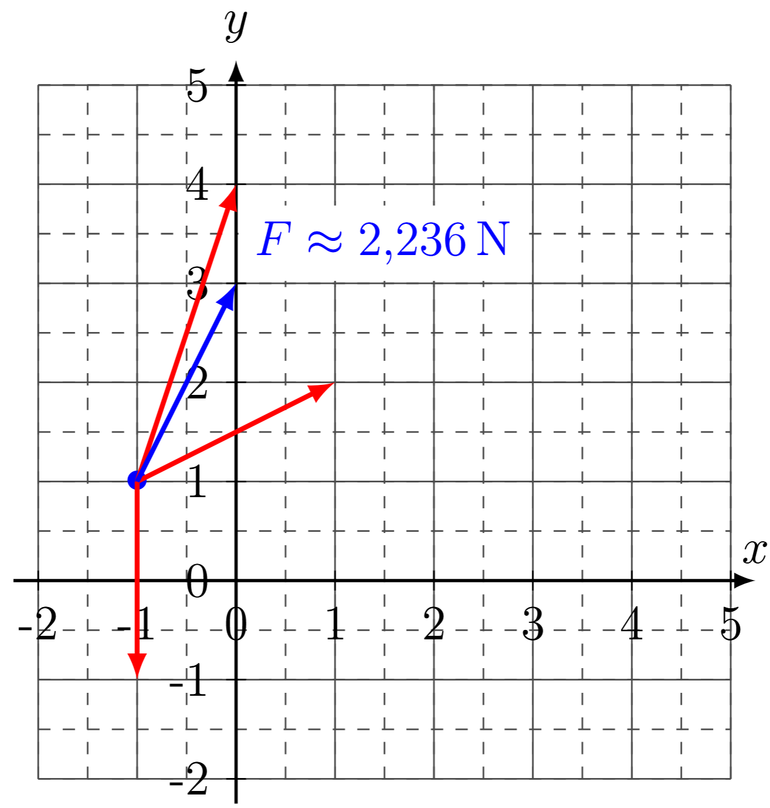
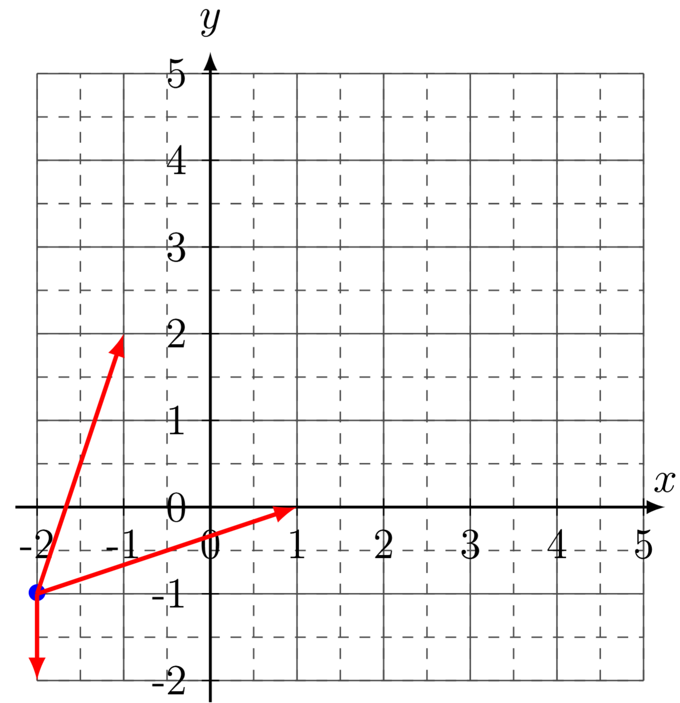
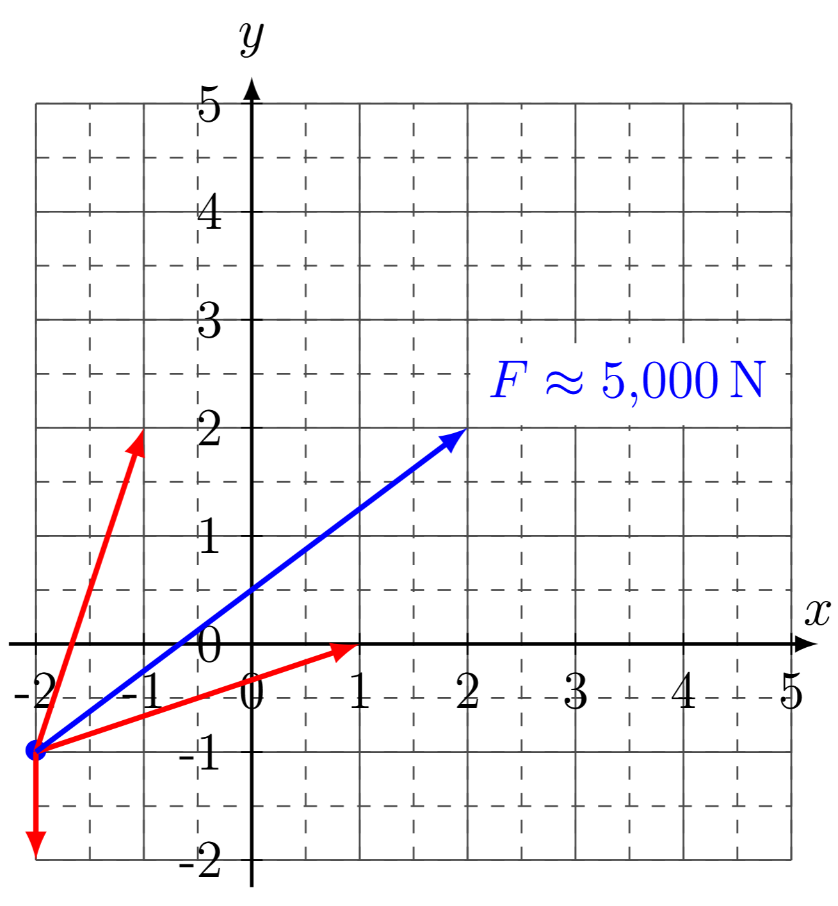
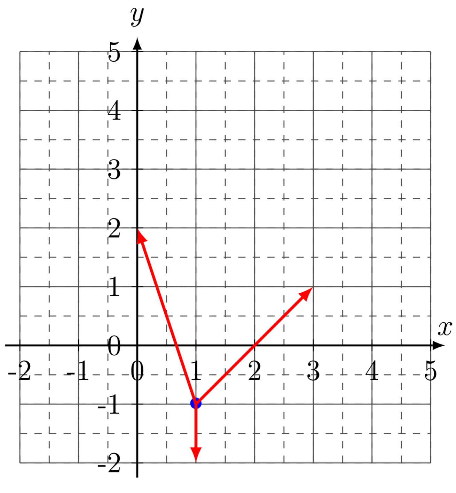

<!--
version:  0.0.1

language: de

@style
input {
    text-align: center;
}

.flex-container {
    display: flex;
    flex-wrap: wrap;
    align-items: stretch;
    gap: 20px;
}

.flex-child {
    flex: 1;
    min-width: 350px;
    margin-right: 20px;
}

@media (max-width: 400px) {
    .flex-child {
        flex: 100%;
        margin-right: 0;
    }
}
@end

formula: \carry   \textcolor{red}{\scriptsize #1}
formula: \digit   \rlap{\carry{#1}}\phantom{#2}#2
formula: \permil  \text{‰}

import: https://raw.githubusercontent.com/liaTemplates/algebrite/master/README.md
import: https://raw.githubusercontent.com/LiaTemplates/Tikz-Jax/main/README.md
import: https://raw.githubusercontent.com/LiaTemplates/mermaid_template/0.1.4/README.md

script: https://cdn.jsdelivr.net/gh/LiaTemplates/Tikz-Jax@main/dist/index.js

-->

# Probeleistungskontrolle für Physik - Klasse 11: Mechanik

 

Swipe (Wische) entweder weiter oder klicke unten links auf neben der Seitenzahl auf den Pfeil nach rechts.

 

Diese Probearbeit hat mehr Aufgaben als die richtige Arbeit, damit du genug zum Üben hast. Es sind viele verschiedene Aufgabentypen abgebildet, sodass du alles nochmal bei der Bearbeitung dieser Aufgaben wiederholst.

 

## Aufgabe 1

__$a)\;\;$__ Ein Pferd zieht einen Karren mit einer Masse von $75\,$kg einen Anstieg von $8\%$ mit konstanter Geschwindigkeit hinauf. Dabei wirkt eine Rollreibungskraft von $45\,$N auf den Karren.  
Berechne die aufgebrachte Zugkraft des Pferdes.  

$F_\text{Zug}=$[[  103,86  ]]N
@Algebrite.check(75*9.81*0.08 + 45)
************
$$
\begin{align*}
\text{Gegeben:}\quad 
m &= 75\,\text{kg}, \quad F_R = 45\,\text{N}, \quad \text{Steigung} = 8\% \\[4pt]
\tan\alpha &= 0{,}08 \;\;\Rightarrow\;\;\alpha \approx 4,574^\circ \\[6pt]
F_{G,\parallel} &= m \cdot g \cdot \sin\alpha 
\approx 75\,\text{kg} \cdot 9{,}81\,\frac{\text{m}}{\text{s}^2} \cdot 0{,}08 \\[4pt]
&\approx 58{,}86\,\text{N} \\[6pt]
\text{Konstante Geschwindigkeit:}\quad
0 &= F_\text{Zug} - F_R - F_{G,\parallel} \\[4pt]
F_\text{Zug} &= F_R + F_{G,\parallel} \\[4pt]
&= 45\,\text{N} + 58{,}86\,\text{N} \\[4pt]
&\approx 103{,}86\,\text{N} \approx 1{,}0\cdot 10^2\,\text{N}
\end{align*}
$$
************

---

---

__$b)\;\;$__ Eine Person schiebt einen Einkaufwagen mit einer Masse von $50\,$kg eine Rampe mit einer Steigung von $10\%$ hinauf. Der Wagen bewegt sich mit konstanter Geschwindigkeit. Die Rollreibungskraft beträgt $30\,$N.  
Berechne die aufgebrachte Schubkraft der Person.  

$F_\text{Schub}=$[[  79,05  ]]N
@Algebrite.check(50*9.81*0.10 + 30)
************
$$
\begin{align*}
\text{Gegeben:}\quad 
m &= 50\,\text{kg}, \quad F_R = 30\,\text{N}, \quad \text{Steigung} = 10\% \\[4pt]
\tan\alpha &= 0{,}10 \;\;\Rightarrow\;\;\alpha \approx 5,711^\circ \\[6pt]
F_{G,\parallel} &= m \cdot g \cdot \sin\alpha 
\approx 50\,\text{kg} \cdot 9{,}81\,\frac{\text{m}}{\text{s}^2} \cdot 0{,}10 \\[4pt]
&\approx 49{,}05\,\text{N} \\[6pt]
\text{Konstante Geschwindigkeit:}\quad
0 &= F_\text{Schub} - F_R - F_{G,\parallel} \\[4pt]
F_\text{Schub} &= F_R + F_{G,\parallel} \\[4pt]
&= 30\,\text{N} + 49{,}05\,\text{N} \\[4pt]
&\approx 79{,}05\,\text{N}
\end{align*}
$$
************

## Aufgabe 2

__$a)\;\;$__  
Eine Person steht auf einem Skateboard (Masse Person + Skateboard zusammen $80\,$kg) und hält einen schweren Rucksack mit der Masse $15\,$kg in den Händen. Die Person wirft den Rucksack kräftig nach vorne weg.  

**Begründe** mithilfe der Newtonschen Axiome, warum und in welche Richtung sich die Person auf dem Skateboard bewegt. Erkläre dabei insbesondere, welche Kräfte auftreten und warum sich das System so verhält.

[[!]]

******************

Zunächst betrachten wir das System „Person + Skateboard + Rucksack“:

1. **Vor dem Wurf**  
   - Alle stehen (noch) relativ zum Boden still.  
   - Die Gesamtimpuls des Systems ist Null.  
   - Nach dem I. Newton'schen Axiom (Trägheitsprinzip) bleibt der Zustand erhalten, solange keine äußere Kraft wirkt, die den Gesamtimpuls ändert.

2. **Beim Wegwerfen des Rucksacks**  
   - Die Person übt auf den Rucksack eine Kraft $F$ nach vorne aus.  
   - Nach **Newtons III. Axiom (Actio = Reactio)** wirkt gleichzeitig eine gleich große, entgegengesetzt gerichtete Kraft $-F$ auf die Person.  
   - Diese Kraft beschleunigt die Person (mit Skateboard) nach hinten.

3. **Bewegungsrichtung**  
   - Der Rucksack erhält einen Impuls nach vorne.  
   - Nach **Impulserhaltung** (Folge aus dem II. und III. Newton'schen Axiom bei fehlenden äußeren Kräften) muss der Gesamtimpuls des Systems weiterhin Null bleiben.  
   - Daher bekommt die Person einen gleich großen Impuls in entgegengesetzter Richtung: Sie bewegt sich **nach hinten**.

3. **Bezug zu II. Newton'schen Axiom**  
   - Für die Person gilt: $\vec{F} = m \cdot \vec{a}$.  
   - Die Reaktionskraft des Rucksacks ist die resultierende Kraft auf die Person.  
   - Da die Masse der Person größer ist als die des Rucksacks, ist ihre Beschleunigung zwar kleiner, aber sie wird deutlich merklich zurückrollen.

**Kurzfassung:**  
Durch den Wurf des Rucksacks nach vorne wirkt nach III. Newton'schen Axiom eine gleich große Gegenkraft auf die Person. Da keine horizontalen äußeren Kräfte auf das Gesamtsystem wirken, bleibt der Gesamtimpuls erhalten: Der Rucksack erhält Impuls nach vorne, die Person (mit Skateboard) Impuls nach hinten und rollt daher rückwärts.

******************

---

---

__$b)\;\;$__  
Ein Auto fährt mit konstanter Geschwindigkeit auf einer geraden Landstraße. Der Fahrer lässt plötzlich das Lenkrad los. Kurz darauf fährt das Auto nach rechts von der Fahrbahn, weil der rechte Vorderreifen deutlich weniger Luftdruck hat als der linke.  

**Begründe** mithilfe der Newton'schen Axiome, warum sich das Auto trotz „Loslassen des Lenkrads“ von der Geraden weg bewegt. Gehe insbesondere auf wirkenden Kräfte an den Rädern ein.

[[!]]

************

1. **Idealfall ohne Störungen (I. Newton'schen Axiom)**  
   - Nach dem I. Newton'schen Axiom (Trägheitsprinzip) würde sich ein Körper ohne resultierende Kraft geradlinig und gleichförmig weiterbewegen.  
   - Wenn auf das Auto keine seitlich wirkenden Kräfte wirken würden, bliebe es auf einer geraden Bahn, auch wenn der Fahrer das Lenkrad loslässt.

2. **Reale Situation: Unterschiedlicher Reifendruck**  
   - Der rechte Vorderreifen hat deutlich weniger Luftdruck.  
   - Dadurch verformt sich der Reifen stärker und rollt schlechter.  
   - Es wirken am rechten Reifen größere Rollwiderstände und Reibkräfte als am linken Vorderreifen.

3. **Warum reicht „Loslassen des Lenkrads“ nicht, um die Gerade zu halten?**  
   - Das Loslassen des Lenkrads entfernt nur den aktiven Eingriff des Fahrers, ändert aber nichts an den physikalischen Kräften am Fahrzeug.  
   - Da die Kräfte an den Rädern nicht symmetrisch sind, wirkt eine seitliche resultierende Kraft bzw. ein Drehmoment.  
   - Nach Newton I würde das Auto nur dann geradeaus weiterfahren, wenn die seitlichen Kräfte sich gegenseitig aufheben – das tun sie hier aber nicht.

**Kurzfassung:**  
Nach dem I. Newton'schen Axiom würde das Auto ohne resultierende Kraft geradeaus fahren. Durch den unterschiedlich aufgepumpten Reifen entstehen jedoch ungleiche Reib- und Rollwiderstandskräfte an den Rädern. Diese erzeugen eine seitliche resultierende Kraft bzw. ein Drehmoment, sodass das Auto nach II. Newton'schen Axiom seine Geschwindigkeit in Richtung und Betrag ändert und nach rechts von der Fahrbahn abgelenkt wird – unabhängig davon, ob die Fahrerin/der Fahrer das Lenkrad festhält oder loslässt.
************

## Aufgabe 3

__$a)\;\;$__  **Bestimme** die Stärke der resultierenden Kraft und gib diese auf drei Nachkommastellen gerundet an.

<!-- style="width:400px" -->

$F_\text{Res}\approx$[[  2,236  ]]N
@Algebrite.check(2.236)
************

<!-- style="width:400px" -->

************

---

---

__$b)\;\;$__  **Bestimme** die Stärke der resultierenden Kraft und gib diese auf drei Nachkommastellen gerundet an.

<!-- style="width:400px" -->

$F_\text{Res}\approx$[[  5,000  ]]N
@Algebrite.check(5.000)
************

<!-- style="width:400px" -->

************

---

---

__$c)\;\;$__  **Bestimme** die Stärke der resultierenden Kraft und gib diese auf drei Nachkommastellen gerundet an.

<!-- style="width:400px" -->

$F_\text{Res}\approx$[[  4,123  ]]N
@Algebrite.check(4.123)
************

<!-- style="width:400px" -->

************

## Aufgabe 4

Eine Industriewaschmaschine schleudert Wäsche in einem runden Trommelbehälter. Der Radius der Trommel beträgt $0{,}30\,$m. Im Schleudergang dreht sich die Trommel mit $900$ Umdrehungen pro Minute. In der Trommel befindet sich unter anderem ein nasses Handtuch mit der Masse $0{,}40\,$kg. 

$a)\;\;$ **Bestimme** zunächst die Umlauffrequenz $f$ in $\text{Hz}$. 

<!-- data-solution-button="5"-->
$f=$ [[  15  ]] Hz
@Algebrite.check([15])
******************
$$
\begin{align*}
\text{Gegeben:}\quad n &= 900~\frac{\text{Umdrehungen}}{\text{min}}, \quad r = 0{,}30~\text{m} \\[4pt]
\text{Zuerst in Hz (Umdrehungen pro Sekunde):}\quad
f &= \frac{n}{60} = \frac{900}{60} = 15~\text{Hz} \\[6pt]
\end{align*}
$$
******************

$b)\;\;$ **Berechne** die Bahngeschwindigkeit $v$ des Handtuchs am Trommelrand. 
Gib die Geschwindigkeit gerundet auf drei Nachkommastellen in $\dfrac{\text{m}}{\text{s}}$ an. 

<!-- data-solution-button="5"-->
$v\approx$ [[  28,274  ]] $\dfrac{\text{m}}{\text{s}}$
@Algebrite.check(28.274)
******************
$$
\begin{align*}
v &= \omega \cdot r = 30\pi \cdot 0{,}30~\text{m} \\[4pt]
  &= 9\pi~\frac{\text{m}}{\text{s}} \\[4pt]
  &\approx 28{,}274~\frac{\text{m}}{\text{s}}
\end{align*}
$$
******************

$c)\;\;$ **Berechne** die auf das Handtuch wirkende Zentripetalkraft während des Schleudergangs. 
Gib das Ergebnis in Newton an und runde auf drei Nachkommastellen. 

<!-- data-solution-button="5"-->
$F_\text{Z}=$ [[  1065,917  ]] N
@Algebrite.check(1065.917)
******************
$$
F_\text{Z} = m \cdot \frac{v^2}{r}
$$

Mit $m = 0{,}40~\text{kg}$, $v = 9\pi~\dfrac{\text{m}}{\text{s}}$ und $r = 0{,}30~\text{m}$:

$$
\begin{align*}
F_\text{Z} 
&= 0{,}40~\text{kg} \cdot \frac{(9\pi)^2}{0{,}30~\text{m}} \\[4pt]
&= 0{,}40 \cdot \frac{81\pi^2}{0{,}30} \\[4pt]
&= \frac{0{,}40}{0{,}30} \cdot 81\pi^2 \\[4pt]
&= \frac{4}{3} \cdot 81\pi^2 \\[4pt]
&= 108\pi^2~\text{N} \\[4pt]
&\approx 1065,917~\text{N}
\end{align*}
$$

Die Zentripetalkraft auf das Handtuch beträgt also ungefähr $1{,}07\cdot 10^3\,\text{N}$.
******************

## Aufgabe 5

Eine Radfahrerin fährt mit ihrem Fahrrad einen längeren Anstieg hinauf.  
Der Anstieg kann näherungsweise als **schiefe Ebene** mit dem Neigungswinkel  
$\alpha = 10^\circ$ zur Horizontalen betrachtet werden.  
Zusammen mit ihrem Fahrrad hat sie eine Masse von $m = 80\,$kg.  
Verwende $g = 9{,}81\,\dfrac{\text{m}}{\text{s}^2}$ und vernachlässige Luftwiderstand, sofern nicht anders angegeben.

---

$a)\;\;$ **Bestimme** die Gewichtskraft $F_\text{G}$ der Radfahrerin samt Fahrrad.  

<!-- data-solution-button="5"-->
$F_\text{G}=$ [[  784,8  ]] N
@Algebrite.check(784.8)
******************
$$
\begin{align*}
\text{Gegeben:}\quad m &= 80~\text{kg},\quad g = 9{,}81~\frac{\text{m}}{\text{s}^2} \\[4pt]
F_\text{G} &= m \cdot g \\[4pt]
&= 80~\text{kg} \cdot 9{,}81~\frac{\text{m}}{\text{s}^2} \\[4pt]
&= 784{,}8~\text{N}
\end{align*}
$$

Die Gewichtskraft der Radfahrerin mit Fahrrad beträgt also etwa $784{,}8\,\text{N}$.
******************

---

$b)\;\;$ **Berechne** die Hangabtriebskraft $F_\text{H}$ auf die Radfahrerin.  
Gib das Ergebnis in Newton an (auf drei Nachkommastellen gerundet).

<!-- data-solution-button="5"-->
$F_\text{H}\approx$ [[  136,279  ]] N
@Algebrite.check(136.279)
******************
Auf einer schiefen Ebene zerlegt man die Gewichtskraft in zwei Komponenten:

- **Hangabtriebskraft** entlang der Ebene:
  $$F_\text{H} = F_\text{G} \cdot \sin(\alpha)$$
- **Normalkraft** senkrecht zur Ebene:
  $$F_\text{N} = F_\text{G} \cdot \cos(\alpha)$$

Mit $F_\text{G} = 784{,}8~\text{N}$ und $\alpha = 10^\circ$:

$$
\begin{align*}
F_\text{H} &= 784{,}8~\text{N} \cdot \sin(10^\circ) \\[4pt]
&\approx 784{,}8~\text{N} \cdot 0{,}1736 \\[4pt]
&\approx 136{,}279~\text{N}
\end{align*}
$$

Zur Vollständigkeit (für Teil c)) noch die Normalkraft:
$$
\begin{align*}
F_\text{N} &= 784{,}8~\text{N} \cdot \cos(10^\circ) \\[4pt]
&\approx 784{,}8~\text{N} \cdot 0{,}9848 \\[4pt]
&\approx 772{,}877~\text{N}
\end{align*}
$$

Die Hangabtriebskraft beträgt also etwa $136{,}279\,\text{N}$.
******************

---

$c)\;\;$ Beim Bergauffahren wirkt zusätzlich eine Rollreibung mit dem Reibungskoeffizienten  
$\mu_\text{R} = 0{,}02$ (bezogen auf die Normalkraft).  
Die Radfahrerin fährt den Berg mit konstanter Geschwindigkeit hinauf.  

**Berechne** die notwendige Antriebskraft $F_\text{A}$ des Fahrrads.  
Gib das Ergebnis in Newton an (auf drei Nachkommastellen gerundet).

<!-- data-solution-button="5"-->
$F_\text{A}\approx$ [[  151,737  ]] N
@Algebrite.check(151.737)
******************
Zuerst die Rollreibungskraft:
$$
F_\text{R} = \mu_\text{R} \cdot F_\text{N}
$$

Mit $\mu_\text{R} = 0{,}02$ und $F_\text{N} \approx 772{,}877~\text{N}$:

$$
\begin{align*}
F_\text{R} &= 0{,}02 \cdot 772{,}877~\text{N} \\[4pt]
&\approx 15{,}458~\text{N}
\end{align*}
$$

Für **konstante Geschwindigkeit** muss die Antriebskraft $F_\text{A}$ die Summe aus Hangabtriebskraft und Rollreibungskraft ausgleichen:

$$
F_\text{A} = F_\text{H} + F_\text{R}
$$

Mit $F_\text{H} \approx 136{,}279~\text{N}$:

$$
\begin{align*}
F_\text{A} &= 136{,}279~\text{N} + 15{,}458~\text{N} \\[4pt]
&\approx 151{,}737~\text{N}
\end{align*}
$$

Die notwendige Antriebskraft beträgt also etwa $151{,}737\,\text{N}$.
******************

---

$d)\;\;$ Die Radfahrerin hält beim Bergauffahren eine konstante Geschwindigkeit von $v = 5{,}0\,\dfrac{\text{m}}{\text{s}}$.  

**Berechne** die dafür notwendige mechanische Leistung $P$.  
Gib das Ergebnis in Watt an, auf ganze Watt gerundet.

<!-- data-solution-button="5"-->
$P\approx$ [[  759  ]] W
@Algebrite.check(759)
******************
Die mechanische Leistung beim gleichförmigen Bergauffahren ergibt sich aus

$$
P = F_\text{A} \cdot v
$$

Mit $F_\text{A} \approx 151{,}737~\text{N}$ und $v = 5{,}0~\dfrac{\text{m}}{\text{s}}$:

$$
\begin{align*}
P &\approx 151{,}737~\text{N} \cdot 5{,}0~\frac{\text{m}}{\text{s}} \\[4pt]
&\approx 758{,}7~\text{W}
\end{align*}
$$

Gerundet auf ganze Watt ergibt sich:

$$
P \approx 759~\text{W}
$$

Die Radfahrerin muss also eine Leistung von ungefähr $759\,\text{W}$ aufbringen.
******************

## Aufgabe 6

Bei einem Seifenkistenrennen startet eine Seifenkiste von einer Startrampe.  
Die Rampe kann näherungsweise als schiefe Ebene mit der Länge  
$s = 8{,}0\,$m und dem Neigungswinkel $\alpha = 12^\circ$ zur Horizontalen  
betrachtet werden. Fahrer*in samt Seifenkiste haben zusammen eine Masse  
von $m = 70\,$kg. Es gilt $g = 9{,}81\,\dfrac{\text{m}}{\text{s}^2}$.

Nach der Startrampe durchfährt die Seifenkiste zunächst eine waagerechte Kurve  
und rollt anschließend auf einer geraden Ebene aus.

---

$a)\;\;$ **Berechne** die Hangabtriebskraft $F_\text{H}$, die die Seifenkiste  
beim Start die Rampe hinunterbeschleunigt. Vernachlässige Reibungskräfte.  
Gib das Ergebnis in Newton an (auf drei Nachkommastellen gerundet).

<!-- data-solution-button="5"-->
$F_\text{H}\approx$ [[  142,773  ]] N
@Algebrite.check(142.773)
******************
Auf der schiefen Ebene wird die Gewichtskraft $F_\text{G}$ in eine Komponente
entlang der Ebene (Hangabtriebskraft) und eine senkrecht zur Ebene (Normalkraft)
zerlegt.

Zunächst die Gewichtskraft:
$$
\begin{align*}
\text{Gegeben:}\quad m &= 70~\text{kg},\quad g = 9{,}81~\frac{\text{m}}{\text{s}^2} \\[4pt]
F_\text{G} &= m \cdot g \\[4pt]
&= 70~\text{kg} \cdot 9{,}81~\frac{\text{m}}{\text{s}^2} \\[4pt]
&= 686{,}7~\text{N}
\end{align*}
$$

Die Hangabtriebskraft entlang der Ebene ist
$$
F_\text{H} = F_\text{G} \cdot \sin(\alpha).
$$

Mit $\alpha = 12^\circ$ gilt näherungsweise
$$
\sin(12^\circ) \approx 0{,}2079.
$$

Also:
$$
\begin{align*}
F_\text{H} &= 686{,}7~\text{N} \cdot \sin(12^\circ) \\[4pt]
&\approx 686{,}7~\text{N} \cdot 0{,}2079 \\[4pt]
&\approx 142{,}773~\text{N}
\end{align*}
$$

Die Hangabtriebskraft beträgt also ungefähr $142{,}773\,\text{N}$.
******************

---

$b)\;\;$ Durch Reibung in den Rädern und Luftwiderstand wird nur  
$\eta = 85\%$ der ursprünglich vorhandenen potentiellen Energie beim  
Herunterrollen in kinetische Energie der Seifenkiste umgewandelt.  

**Bestimme** die Geschwindigkeit $v$ am Ende der Rampe.  
Gib die Geschwindigkeit in $\dfrac{\text{m}}{\text{s}}$ an, gerundet auf drei Nachkommastellen.

<!-- data-solution-button="5"-->
$v\approx$ [[  5,267  ]] $\dfrac{\text{m}}{\text{s}}$
@Algebrite.check(5.267)
******************
Zunächst bestimmen wir die Höhendifferenz $h$ der Rampe über
$$
h = s \cdot \sin(\alpha).
$$

Mit $s = 8{,}0~\text{m}$ und $\sin(12^\circ) \approx 0{,}2079$:
$$
\begin{align*}
h &= 8{,}0~\text{m} \cdot \sin(12^\circ) \\[4pt]
&\approx 8{,}0~\text{m} \cdot 0{,}2079 \\[4pt]
&\approx 1{,}663~\text{m}
\end{align*}
$$

Die potentielle Energie am Start:
$$
E_\text{pot} = m \cdot g \cdot h.
$$

Mit $m = 70~\text{kg}$, $g = 9{,}81~\dfrac{\text{m}}{\text{s}^2}$ und $h \approx 1{,}663~\text{m}$:
$$
\begin{align*}
E_\text{pot} &\approx 70~\text{kg} \cdot 9{,}81~\frac{\text{m}}{\text{s}^2} \cdot 1{,}663~\text{m} \\[4pt]
&\approx 1142{,}184~\text{J}
\end{align*}
$$

Nur $\eta = 0{,}85$ davon wird in kinetische Energie umgewandelt:
$$
E_\text{kin} = \eta \cdot E_\text{pot}.
$$

Also:
$$
\begin{align*}
E_\text{kin} &\approx 0{,}85 \cdot 1142{,}184~\text{J} \\[4pt]
&\approx 970{,}856~\text{J}
\end{align*}
$$

Die kinetische Energie ist
$$
E_\text{kin} = \frac{1}{2} m v^2.
$$

Damit:
$$
\begin{align*}
\frac{1}{2} m v^2 &= E_\text{kin} \\[4pt]
v^2 &= \frac{2 E_\text{kin}}{m} \\[4pt]
v &= \sqrt{\frac{2 E_\text{kin}}{m}} \\[4pt]
&\approx \sqrt{\frac{2 \cdot 970{,}856~\text{J}}{70~\text{kg}}} \\[4pt]
&\approx \sqrt{150{,}0} ~\frac{\text{m}}{\text{s}} \\[4pt]
&\approx 5{,}267~\frac{\text{m}}{\text{s}}
\end{align*}
$$

Die Seifenkiste erreicht am Ende der Rampe etwa  
$v \approx 5{,}267\,\dfrac{\text{m}}{\text{s}}$.
******************

---

$c)\;\;$ Direkt nach der Rampe fährt die Seifenkiste mit der Geschwindigkeit aus Teil b)  
in eine waagerechte Kurve mit dem Radius $r = 10{,}0\,$m.  
Reibungskräfte werden in der Kurve vernachlässigt.

**Berechne** die auf die Seifenkiste wirkende Zentripetalkraft $F_\text{Z}$  
in der Kurve. Gib das Ergebnis in Newton an (auf drei Nachkommastellen gerundet).

<!-- data-solution-button="5"-->
$F_\text{Z}\approx$ [[  194,171  ]] N
@Algebrite.check(194.171)
******************
In der waagerechten Kurve wirkt auf die Seifenkiste die Zentripetalkraft
$$
F_\text{Z} = m \cdot \frac{v^2}{r}.
$$

Mit $m = 70~\text{kg}$, $r = 10{,}0~\text{m}$ und $v \approx 5{,}267~\dfrac{\text{m}}{\text{s}}$ aus Teil b):

Zuerst $v^2$:
$$
v^2 \approx (5{,}267~\tfrac{\text{m}}{\text{s}})^2 \approx 27{,}75~\tfrac{\text{m}^2}{\text{s}^2}.
$$

Dann:
$$
\begin{align*}
F_\text{Z} &= 70~\text{kg} \cdot \frac{27{,}75~\tfrac{\text{m}^2}{\text{s}^2}}{10{,}0~\text{m}} \\[4pt]
&\approx 70~\text{kg} \cdot 2{,}775~\frac{\text{m}}{\text{s}^2} \\[4pt]
&\approx 194{,}171~\text{N}
\end{align*}
$$

Die Zentripetalkraft in der Kurve beträgt also ungefähr $194{,}171\,\text{N}$.
******************

---

$d)\;\;$ Nach der Kurve folgt eine waagerechte Gerade.  
Auf dieser wirkt eine Rollreibung mit dem Reibungskoeffizienten $\mu_\text{R} = 0{,}03$  
(bezogen auf die Normalkraft). Die Seifenkiste verlässt die Kurve mit der  
Geschwindigkeit aus Teil b) und rollt dann nur noch durch die Rollreibung gebremst aus,  
bis sie zum Stillstand kommt.

**Berechne**, wie weit die Seifenkiste auf der Geraden noch rollt.  
Gib die Strecke $s_\text{gerade}$ in Metern an (auf drei Nachkommastellen gerundet).

<!-- data-solution-button="5"-->
$s_\text{gerade}\approx$ [[  47,127  ]] m
@Algebrite.check(47.127)
******************
Auf der waagerechten Geraden ist die Normalkraft
$$
F_\text{N} = m \cdot g.
$$

Die Rollreibungskraft lautet:
$$
F_\text{R} = \mu_\text{R} \cdot F_\text{N} = \mu_\text{R} \cdot m \cdot g.
$$

Die Seifenkiste besitzt zu Beginn der Geraden die kinetische Energie
$$
E_\text{kin} = \frac{1}{2} m v^2,
$$
wobei $v \approx 5{,}267~\tfrac{\text{m}}{\text{s}}$ aus Teil b) ist.

Die Rollreibung verrichtet negative Arbeit:
$$
W_\text{R} = -F_\text{R} \cdot s_\text{gerade}.
$$

Beim Ausrollen gilt Energieerhaltung:
$$
E_\text{kin} + W_\text{R} = 0.
$$

Also:
$$
\begin{align*}
E_\text{kin} - F_\text{R} \cdot s_\text{gerade} &= 0 \\[4pt]
F_\text{R} \cdot s_\text{gerade} &= E_\text{kin} \\[4pt]
s_\text{gerade} &= \frac{E_\text{kin}}{F_\text{R}}.
\end{align*}
$$

Einsetzen von $F_\text{R} = \mu_\text{R} m g$ und $E_\text{kin} = \tfrac{1}{2} m v^2$:
$$
\begin{align*}
s_\text{gerade} &= \frac{\tfrac{1}{2} m v^2}{\mu_\text{R} m g} \\[4pt]
&= \frac{v^2}{2 \mu_\text{R} g}
\end{align*}
$$

Mit $\mu_\text{R} = 0{,}03$, $g = 9{,}81~\tfrac{\text{m}}{\text{s}^2}$ und  
$v \approx 5{,}267~\tfrac{\text{m}}{\text{s}}$:

$$
\begin{align*}
s_\text{gerade} &\approx \frac{(5{,}267~\tfrac{\text{m}}{\text{s}})^2}{2 \cdot 0{,}03 \cdot 9{,}81~\tfrac{\text{m}}{\text{s}^2}} \\[4pt]
&\approx \frac{27{,}75~\tfrac{\text{m}^2}{\text{s}^2}}{0{,}5886~\tfrac{\text{m}}{\text{s}^2}} \\[4pt]
&\approx 47{,}127~\text{m}
\end{align*}
$$

Die Seifenkiste rollt auf der Geraden noch etwa $47{,}127\,$m, bevor sie zum Stillstand kommt.
******************

