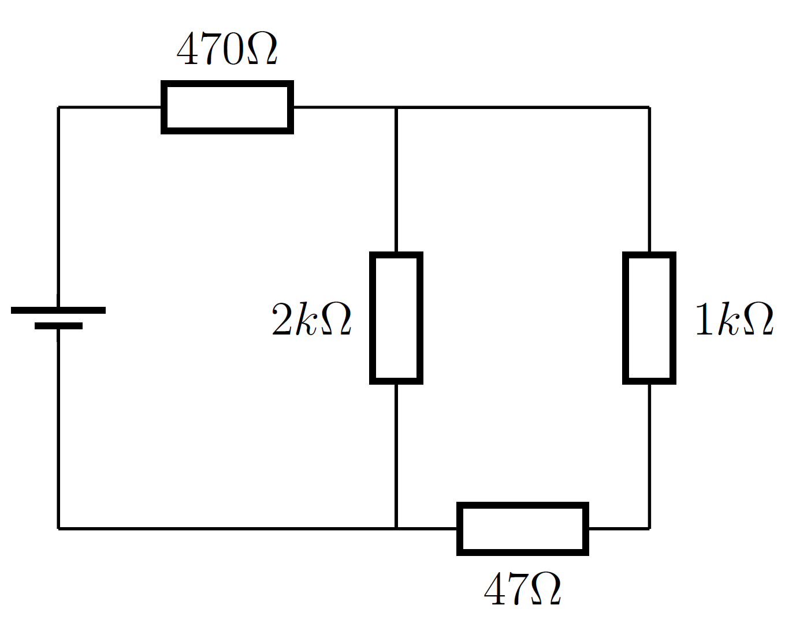
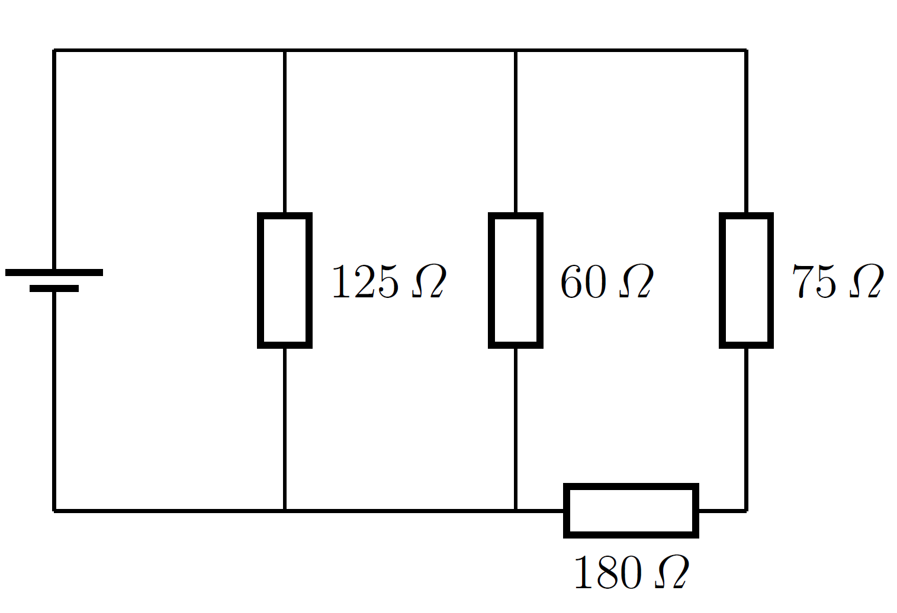

<!--
version:  0.0.1

language: de

@style
input {
    text-align: center;
}

.flex-container {
    display: flex;
    flex-wrap: wrap;
    align-items: stretch;
    gap: 20px;
}

.flex-child {
    flex: 1;
    min-width: 350px;
    margin-right: 20px;
}

@media (max-width: 400px) {
    .flex-child {
        flex: 100%;
        margin-right: 0;
    }
}
@end

formula: \carry   \textcolor{red}{\scriptsize #1}
formula: \digit   \rlap{\carry{#1}}\phantom{#2}#2
formula: \permil  \text{‰}

import: https://raw.githubusercontent.com/liaTemplates/algebrite/master/README.md
import: https://raw.githubusercontent.com/LiaTemplates/Tikz-Jax/main/README.md
import: https://raw.githubusercontent.com/LiaTemplates/mermaid_template/0.1.4/README.md

script: https://cdn.jsdelivr.net/gh/LiaTemplates/Tikz-Jax@main/dist/index.js

-->

# Probeleistungskontrolle für Physik - Klasse 8: Elektrik

 

> Letztes Update am 05.12.2025 gegen 21:30 Uhr

 

Swipe (Wische) entweder weiter oder klicke unten links auf neben der Seitenzahl auf den Pfeil nach rechts.

 

Diese Probearbeit hat mehr Aufgaben als die richtige Arbeit, damit du genug zum Üben hast. Es sind viele verschiedene Aufgabentypen abgebildet, sodass du alles nochmal bei der Bearbeitung dieser Aufgaben wiederholst.

## Aufgabe 1

$a)\;\;$ **Berechne** den Gesamtwiderstand der dargestellten Schaltung.

<!-- style="width:400px" -->

<!-- data-solution-button="10" -->
$R_{Gesamt} \approx$ [[  1157,233  ]]$\,\Omega$
@Algebrite.check2(1157.233,0.01)
*****************************

1. Schritt: Serienschaltung rechts zusammenfassen

Rechts unten liegen $1\,\text{k}\Omega$ und $47\,\Omega$ in Reihe:

$$
\begin{align*} 
R_{\text{rechts}} = R_3 + R_4 
= 1000\,\Omega + 47\,\Omega 
= 1047\,\Omega
\end{align*}
$$

---

2. Schritt: Parallelschaltung bilden

Der $2\,\text{k}\Omega$–Widerstand liegt parallel zu diesem rechten Zweig ($1047\,\Omega$).

Parallelschaltung zweier Widerstände:

$$
\begin{align*} 
\frac{1}{R_\parallel}
= \frac{1}{R_2} + \frac{1}{R_{\text{rechts}}}
= \frac{1}{2000\,\Omega} + \frac{1}{1047\,\Omega}
\end{align*}
$$

Rechnen:

$$
\begin{align*} 
R_\parallel 
= \frac{R_2 \cdot R_{\text{rechts}}}{R_2 + R_{\text{rechts}}}
= \frac{2000 \cdot 1047}{2000 + 1047}\,\Omega
\approx 687{,}233\,\Omega
\end{align*}
$$

---

3. Schritt: Gesamte Serienschaltung

Der $470\,\Omega$–Widerstand liegt in Reihe mit dem gesamten Parallelnetzwerk:

$$
\begin{align*} 
R_\text{ges} = R_1 + R_\parallel
= 470\,\Omega + 687{,}233\,\Omega
\approx 1157{,}233\,\Omega
\end{align*}
$$

*****************************

$b)\;\;$ An der darstellten Schaltung liegt eine Spannung von $24\,$V an. **Berechne** die resultierende Stromstärke.

<!-- data-solution-button="10" -->
$I_{Gesamt} \approx$ [[  20,739  ]]$\,$mA
@Algebrite.check2(20.739,0.01)
*****************************
$$
\begin{align*} 
U & = R_\text{ges}I \quad \left| : R_\text{ges} \right. \\
I &= \frac{U}{R_\text{ges}}\\
&= \frac{24\,\text{V}}{1157{,}233\,\Omega}\\
&\approx 0{,}020739\,\text{A}\\
&\approx 20{,}739\,\text{mA}
\end{align*}
$$

*****************************

$c)\;\;$ **Kreuze an**, ob die Aussage "wahr", "falsch" oder "nicht entscheidbar" ist.

<!-- data-randomize="true" data-show-partial-solution="true"  data-solution-button="10" -->
- [[wahr]   (falsch)    [nicht entscheidbar]]
- [ [X]       [ ]             [ ]     ]  Durch den rechten Leiter fließt ungefähr ein Drittel des Stroms.
- [ ( )       (X)             ( )     ]  Wenn man an der Stelle des $470\,\Omega$-Widerstandes ein Amperemeter schalten würde, würde die Gesamtstromstärke sinken.
- [ [X]       [ ]             [ ]     ]  Die Spannung am $2k\,\Omega$-Widerstand ist größer als am $1k\,\Omega$-Widerstand.
- [ ( )       (X)             ( )     ]  Würde man eine Lampe vor dem $2k\,\Omega$-Widerstand bzw. dem $1k\,\Omega$-Widerstand schalten, wäre die am $2k\,\Omega$-Widerstand heller.

## Aufgabe 2

$a)\;\;$ **Berechne** den Gesamtwiderstand der dargestellten Schaltung.

<!-- style="width:400px" -->

<!-- data-solution-button="10" -->
$R_{Gesamt} \approx$ [[  34,979  ]]$\,\Omega$
@Algebrite.check2(8500/243,0.01)
*****************************

$$
\begin{align*}
     R_{12} & = R_1 + R_2 = 180\,\Omega + 75\,\Omega = 255\,\Omega \\
		 \frac{1}{R_{ges}} & =  \frac{1}{R_{12}} + \frac{1}{R_{3}} + \frac{1}{R_{4}}  \\
		 \frac{1}{R_{ges}} & =  \frac{1}{255\,\Omega } + \frac{1}{60\,\Omega } + \frac{1}{125\,\Omega }  \\
		 \frac{1}{R_{ges}} & =  \frac{243}{8500\,\Omega }   \\
		 R_{ges} & =  \frac{8500}{243} \,\Omega
\end{align*} 
$$

*****************************

$b)\;\;$ Bei der darstellten Schaltung liegt eine Gesamtstromstärke von $0,7\,$A an. **Berechne** die anliegende Spannung.

<!-- data-solution-button="10" -->
$U \approx$ [[  24,4856  ]]$\,$V
@Algebrite.check2(24.4856,0.01)
*****************************
$$
\begin{align*}
U &= R_\text{ges} \cdot I \\
  &= \frac{8500}{243}\,\Omega \cdot 0{,}7\,\text{A} \\
  &= \frac{5950}{243}\,\text{V} \\
  &\approx 24{,}4856\,\text{V} \\
\end{align*}
$$
*****************************

## Aufgabe 3

Ein Widerstand aus Konstantan mit $\rho = 0{,}49\,\Omega \,\dfrac{\text{mm}^2}{\text{m}}$  
hat eine Länge von $l = 0{,}85\,\text{m}$ und eine rechteckige Querschnittsfläche  
mit den Kantenlängen $2{,}0\,\text{mm}$ und $3{,}0\,\text{mm}$. In einer Schaltung fließt durch diesen Widerstand eine Stromstärke von $I = 0{,}45\,\text{A}$.  
Berechne, wie groß die anliegende Spannung $U$ an diesem Widerstand ist.  

<!-- data-solution-button="10" -->
$U \approx$ [[  31,238  ]]$\,$mV
@Algebrite.check2(31.238,0.01)
*******************************

$$
\begin{align*} 
A &= a \cdot b \\
  &= 2{,}0\,\text{mm} \cdot 3{,}0\,\text{mm} \\
  &= 6{,}0\,\text{mm}^2
\end{align*}
$$

$$
\begin{align*} 
R &= \rho \cdot \frac{l}{A} \\
&= 0{,}49\,\Omega\,\frac{\text{mm}^2}{\text{m}}
    \cdot \frac{0{,}85\,\text{m}}{6{,}0\,\text{mm}^2} \\
  &= \frac{0{,}49 \cdot 0{,}85}{6{,}0}\,\Omega \\
  &\approx 0{,}069417\,\Omega \\
\end{align*}
$$

$$
\begin{align*} 
U &= R \cdot I
  &= 0{,}069417\,\Omega \cdot 0{,}45\,\text{A}
  \approx 0{,}031238\,\text{V}
\end{align*}
$$

*******************************

## Aufgabe 4

Bei einem Versuch wird ein Zylinder aus Graphit als Widerstand verwendet.  
Es liegt eine Spannung von $U = 18\,\text{V}$ an und es wird eine Stromstärke  
von $I = 0{,}60\,\text{A}$ gemessen. Der Zylinder ist $l = 0{,}12\,\text{m}$ lang und hat einen Durchmesser von  
$d = 2{,}5\,\text{mm}$. **Bestimme** den spezifischen Widerstand $\rho$ des Graphits.

<!-- data-solution-button="10" -->
$\rho \approx $ [[  1227,5  ]]$\,\dfrac{\Omega\,\text{mm}^2}{\text{m}}$
@Algebrite.check2(1227.5,0.01)
*******************************

$$
\begin{align*} 
R &= \frac{U}{I}  = \frac{18\,\text{V}}{0{,}60\,\text{A}} = 30\,\Omega
\end{align*}
$$

$$
\begin{align*} 
r = \frac{d}{2} = \frac{2{,}5\,\text{mm}}{2} = 1{,}25\,\text{mm}
\end{align*}
$$

$$
\begin{align*} 
\rho &= R \cdot \frac{A}{l} \\
&= 30\,\Omega \cdot \frac{4{,}91\,\text{mm}^2}{0{,}12\,\text{m}} \\
    &= 1227,5\,\Omega\,\frac{\text{mm}^2}{\text{m}}
\end{align*}
$$

*******************************

## Aufgabe 5

Ein quaderförmiger Metallwiderstand wird in einem Stromkreis verwendet.  
Er besteht aus einem Material mit dem spezifischen Widerstand $\rho = 1{,}2\,\Omega\,\dfrac{\text{mm}^2}{\text{m}}.$
Der Widerstand ist $l = 2{,}0\,\text{m}$ lang. Sein rechteckiger Querschnitt hat eine bekannte Seitenlänge $a = 2{,}0\,\text{mm}$ und eine unbekannte Seitenlänge $b$. Beim Messen des Bauteils erhält man für den elektrischen Widerstand den Wert $R = 0{,}80\,\Omega.$
**Berechne** die unbekannte Querschnittsseite $b$.

<!-- data-solution-button="10" -->
$\rho \approx $ [[  1,5  ]]$\,$mm
@Algebrite.check2(1.5,0.01)
*******************************

$$
\begin{align*} 
R &= \rho \cdot \frac{l}{A} \quad \left| \cdot \dfrac{A}{R}  \right.   \\
A &= \rho \cdot \frac{l}{R} \quad \\
  &= 1{,}2\,\Omega\,\frac{\text{mm}^2}{\text{m}}
\cdot \frac{2{,}0\,\text{m}}{0{,}80\,\Omega} \\
  &= 3{,}0\,\text{mm}^2 \\  
A &= a \cdot b  \\ 
\Rightarrow\quad b &= \frac{A}{a} \\
& = \frac{3{,}0\,\text{mm}^2}{2{,}0\,\text{mm}} 
& = 1{,}5\,\text{mm}
\end{align*}
$$

*******************************
