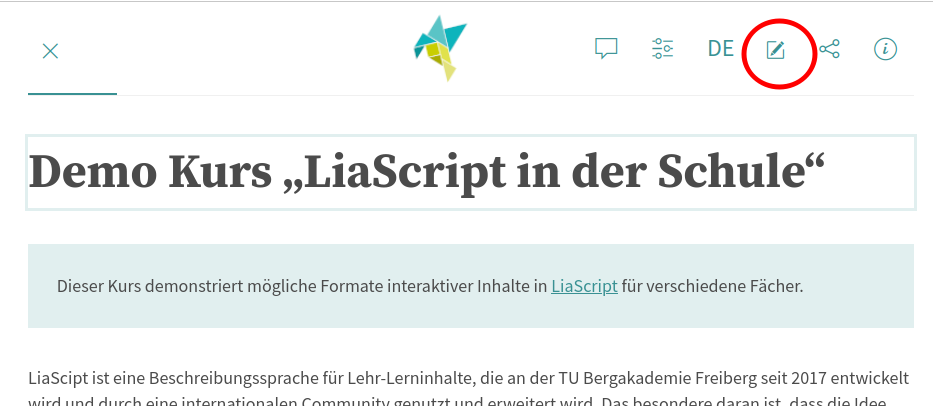

<!--
version:  0.0.2
language: de

tags: Demo
comment: Fächerbezogener Beispielkurs mit interaktiven Elemente in LiaScript für den Schulunterricht
author: Martin Lommatzsch, André Dietrich, Sebastian Zug


@style
main > *:not(:last-child) {
  margin-bottom: 3rem;
}

input {
    text-align: center;
}

.flex-container {
    display: flex;
    flex-wrap: wrap;
    align-items: stretch;
    gap: 20px;
}

.flex-child {
    flex: 1;
    min-width: 350px;
    margin-right: 20px;
}

@media (max-width: 400px) {
    .flex-child {
        flex: 100%;
        margin-right: 0;
    }
}
@end

formula: \carry   \textcolor{red}{\scriptsize #1}
formula: \digit   \rlap{\carry{#1}}\phantom{#2}#2
formula: \permil  \text{‰}

import: https://raw.githubusercontent.com/liaTemplates/algebrite/master/README.md
import: https://raw.githubusercontent.com/LiaTemplates/Tikz-Jax/main/README.md
import: https://raw.githubusercontent.com/LiaTemplates/mermaid_template/0.1.4/README.md

script: https://cdn.jsdelivr.net/gh/LiaTemplates/Tikz-Jax@main/dist/index.js


import: https://raw.githubusercontent.com/liaTemplates/ABCjs/main/README.md
        https://raw.githubusercontent.com/LiaTemplates/Speech-Recognition-Quiz/refs/heads/main/README.md
        https://raw.githubusercontent.com/liaTemplates/AVR8js/main/README.md
        https://raw.githubusercontent.com/liaTemplates/JSXGraph/main/README.md
        https://raw.githubusercontent.com/LiaTemplates/mec2/main/README.md
        https://raw.githubusercontent.com/LiaTemplates/CollaborativeDrawing/main/README.md
        https://raw.githubusercontent.com/LiaTemplates/SpreadSheet/refs/heads/main/README.md
        https://github.com/LiaTemplates/PeriodicTable/blob/main/README.md

persistent: true

edit: true

eingabe: <script input="number" input-always-active modify="false" value="0" default="0">@input</script>

-->


[](https://liascript.github.io/course/?https://raw.githubusercontent.com/MINT-the-GAP/Wochenaufgabe/refs/heads/main/Sandkasten.md)

# Demo Kurs "LiaScript in der Schule"

> Dieser Kurs demonstriert mögliche Formate interaktiver Inhalte in [LiaScript](https://liascript.github.io/) für verschiedene Fächer.

LiaScipt ist eine Beschreibungssprache für Lehr-Lerninhalte, die an der TU Bergakademie Freiberg seit 2017 entwickelt und durch eine internationalen Community genutzt und erweitert wird. Das besondere daran ist, dass die Idee einer einfachen Syntax wie Markdown mit der Möglichkeit kombiniert wird, interaktive Elemente wie Quiz, Simulationen, Programmierumgebungen, Formeleditoren, Tabellenkalkulationen und vieles mehr einzubinden [Link](https://open-educational-resources.de/warum-braucht-offene-bildung-eine-eigene-sprache-warum-liascript/). Bislang werden diese Möglichkeiten aber eher in der universitären Lehre eingesetzt.

Ich, Martin Lommatzsch, bin Fachlehrer am Geschwister-Scholl-Gymnasium in Freiberg und nutze LiaScript intensiv in meinem Unterricht. Eine umfangreiche Aufgabensammlung, die natürlich beliebig genutzt, kopiert und angepasst werden darf, findet sich unter [https://mint-the-gap.github.io/Aufgabensammlung/].

> Mit dem hier vorliegenden Kurs möchte ich eine Brücke schlagen und die Potentiale für andere Fächer aufzeigen. Werfen Sie gern einen Blick auf den "Code" dahinter. Klicken Sie im Kurs einfach auf den "Edit" Button, den ich im Bild markiert habe.



> ***(Einige Beispiele sind mehr oder weniger zufällig Fächern zugeordnet und können mit anderen Beispielen auch verknüpft werden. Ein Blick in jeden Fachbereich lohnt sich.)***

Ich freue mich über Rückmeldungen, Anregungen und Fragen. Kontaktieren Sie mich gern per Mail:\
`m.lommatzsch@gsg-freiberg.lernsax.de`

Viel Spaß damit!

Freiberg, August 2025

_PS: Vielen Dank bei den MitstreiterInnen aus der TU Bergakademie für die Unterstützung bei der Umsetzung!_


## Deutsch


__Aufgabe 1:__ Hör dir den Satz an und schreib ihn korrekt in das Eingabefeld.


{{|> Deutsch Female}}
<!-- style="position: absolute; left: -9999px;" -->
Anna sitzt auf einem fliegenden Teppich.

[[    Anna sitzt auf einem fliegenden Teppich.    ]]


---

---

__Aufgabe 2:__ **Gib** die passende Wortart **an**.


groß  [[(Adjektiv)|Adverb|Artikel|Interjektion|Konjunktion|Numeral|Nomen|Präposition|Pronomen|Substantiv|Verb]]  \
der  [[Adjektiv|Adverb|(Artikel)|Interjektion|Konjunktion|Numeral|Nomen|Präposition|Pronomen|Substantiv|Verb]]  \
laufen  [[Adjektiv|Adverb|Artikel|Interjektion|Konjunktion|Numeral|Nomen|Präposition|Pronomen|Substantiv|(Verb)]]  \
einige  [[Adjektiv|Adverb|Artikel|Interjektion|Konjunktion|(Numeral)|Nomen|Präposition|Pronomen|Substantiv|Verb]]  \
Haus  [[Adjektiv|Adverb|Artikel|Interjektion|Konjunktion|Numeral|(Nomen)|Präposition|Pronomen|(Substantiv)|Verb]]  \
heute  [[Adjektiv|(Adverb)|Artikel|Interjektion|Konjunktion|Numeral|Nomen|Präposition|Pronomen|Substantiv|Verb]]  \
ach  [[Adjektiv|Adverb|Artikel|(Interjektion)|Konjunktion|Numeral|Nomen|Präposition|Pronomen|Substantiv|Verb]]  \
ich  [[Adjektiv|Adverb|Artikel|Interjektion|Konjunktion|Numeral|Nomen|Präposition|(Pronomen)|Substantiv|Verb]]  \
oder  [[Adjektiv|Adverb|Artikel|Interjektion|(Konjunktion)|Numeral|Nomen|Präposition|Pronomen|Substantiv|Verb]]  \
an  [[Adjektiv|Adverb|Artikel|Interjektion|Konjunktion|Numeral|Nomen|(Präposition)|Pronomen|Substantiv|Verb]]  


---

---


__Aufgabe 3:__ Füll den Lückentext aus. (Richtige Lücken werden beim Prüfen grün markiert.)

<!-- data-show-partial-solution -->
Es war einmal ein kleines Dorf am Rande eines tiefen Waldes. Die Menschen dort lebten friedlich, doch jedes Jahr, wenn der erste Schnee fiel, verschwand ein Eimer voll goldener Äpfel aus dem Vorratshaus des Königs. Niemand wusste, wer sie stahl. \
Eines Abends beschloss die junge Magd Clara, das Geheimnis zu lüften. Mit einer Laterne in der Hand schlich sie zum Vorratshaus. Sie versteckte sich hinter einem Fass und wartete. Plötzlich hörte sie ein leises Kichern. Durch das Fenster flatterten winzige, funkelnde Gestalten: Waldelfen! Sie trugen die [[  Äpfel  ]] fort, als wären sie leicht wie Federn. \
Clara folgte ihnen in den verschneiten Wald. Dort sah sie, wie die Elfen die [[  goldenen  ]] Äpfel in einen großen [[  Korb  ]] legten, aus dem helles Licht strahlte. „Warum nehmt ihr die [[  Äpfel  ]]?“, fragte Clara mutig. \
Die Elfen erklärten: „Wir brauchen ihr Licht, um die Tiere des Waldes durch den langen Winter zu führen. Ohne sie würden viele erfrieren.“ \
[[  Clara  ]] kehrte zurück und berichtete dem [[  König  ]]. Der war zunächst zornig, doch dann verstand er. Von diesem Tag an ließ er jedes Jahr einen Teil der goldenen Äpfel für die [[  Elfen  ]] zurück – und das Dorf lebte in Harmonie mit dem geheimnisvollen Waldvolk.


## Mathematik


__Aufgabe 1:__ Auf dieser Seite werden immer wieder Aufgaben neu generiert, wenn du auf den Button klickst. Es ändert sich auch immer mal wieder die gesuchte Größe. Nutze diese Übungen zum Trainieren von einigen Aufgabentypen. **Gib** den fehlenden Wert **an**.

<script input="submit" output="Aufgabe" default="Neue Aufgabe" modify="false">
  if (!window.randomMath) { window.randomMath = 0 }
  "Neue Aufgabe " + window.randomMath++
</script>


---

<script run-once modify="false">
// @input(`Aufgabe`)
// Zufällige Prozentzahl (10 bis 990 in 2er-Schritten)
const percentage = (Math.floor(Math.random() * 99) + 1) * 2;
// Zufällige Basiszahl (zwischen 50 und 500, in 50er-Schritten)
const base = (Math.floor(Math.random() * 200) + 1) * 50;
// Berechnung des Ergebnisses
const result = Math.round((percentage / 100) * base);

// Auswahl einer Zahl zur Markierung (0 => Prozentsatz, 1 => Basis, 2 => Ergebnis)
const markedNumber = Math.floor(Math.random() * 3);
let problem = ""

if (markedNumber === 0) {
  // Prozentsatz unbekannt
  problem = `[[ ${percentage} ]] % von ${base} = ${result}`;
} else if (markedNumber === 1) {
  // Basis unbekannt
  problem = `${percentage}% von [[ ${base} ]] = ${result}`
} else {
  // Ergebnis unbekannt
  problem = `${percentage}% von ${base} = [[ ${result} ]]`
}

// Lösungsschritte vereinfacht und in einem aligned-Block
let solution = "***************\n\n";

if (markedNumber === 0) {
  // Prozentsatz x ist unbekannt: x% von base = result
  // => x/100 = result/base => x = (result * 100)/base
  const xVal = (result * 100) / base;
  solution += `$$
    \\begin{aligned}
      \\frac{x}{100} &= \\frac{${result}}{${base}} \\\\[5mm]
      x&=\\frac{${result} \\cdot 100}{${base}} \\\\[5mm]
      x&=${xVal}
    \\end{aligned}
    $$\n\n`;
} else if (markedNumber === 1) {
  // Basis x ist unbekannt: percentage% von x = result
  // => percentage/100 = result/x => x = (result * 100)/percentage
  const xVal = (result * 100) / percentage;
  solution += `$$
    \\begin{aligned}
      \\frac{${percentage}}{100}&=\\frac{${result}}{x} \\\\[5mm]
      x&=\\frac{${result} \\cdot 100}{${percentage}} \\\\[5mm]
        x&=${xVal}
    \\end{aligned}
    $$\n\n`;
} else {
  // Ergebnis x ist unbekannt: percentage% von base = x
  // => percentage/100 = x/base => x = (percentage * base)/100
  const xVal = Math.round((percentage * base) / 100);
  solution += `$$
    \\begin{aligned}
      \\frac{${percentage}}{100}&=\\frac{x}{${base}} \\\\[5mm]
      x&=\\frac{${percentage} \\cdot ${base}}{100} \\\\[5mm]
      x&=${xVal}
    \\end{aligned}
    $$\n\n`;
}

solution += "***************";

"LIASCRIPT: \n " + problem + "\n" + solution;
</script>


Platz für Notizen: Schreibe mit deinem Cursor in das Feld, um dir ein paar Notizen zu machen.

@[Collaborative.lines(640,320)](./img/example.jpg)

---

---


__Aufgabe 2:__ **Berechne** den Lösungswert für die Unbekannte. (Lösung bei der ersten Aufgabe erst nach 4 Fehlversuchen, bei der zweiten Aufgabe keine Lösungsausgabe möglich.)


<section class="flex-container">
<div class="flex-child">

<!-- data-solution-button="4" -->
__$a)\;\;$__ $  3x - 7 = \dfrac{1}{2}x + 5 $ \
$x$ = [[  24/5  ]]
@Algebrite.check(24/5)
************
$$
\begin{align*}
3x - 7 &= \dfrac{1}{2}x + 5 \quad \left| -\dfrac{1}{2}x \right. \\
\dfrac{5}{2}x - 7 &= 5 \quad \left| +7 \right. \\
\dfrac{5}{2}x &= 12 \quad \left| :\dfrac{5}{2} \right. \\
x &= \dfrac{24}{5}
\end{align*}
$$
************
</div>
<div class="flex-child">

<!-- data-solution-button="false" -->
__$b)\;\;$__ $  4x + 3 = 2x - \dfrac{5}{2} $ \
$x$ = [[  -11/4  ]]
@Algebrite.check(-11/4)
************
$$
\begin{align*}
4x + 3 &= 2x - \dfrac{5}{2} \quad \left| -2x \right. \\
2x + 3 &= -\dfrac{5}{2} \quad \left| -3 \right. \\
2x &= -\dfrac{5}{2} - \dfrac{6}{2} \\
2x &= -\dfrac{11}{2} \quad \left| :2 \right. \\
x &= -\dfrac{11}{4}
\end{align*}
$$
************
</div>

</section>


---

---


__Aufgabe 3:__ Auch mittels interaktiver Graphen können Aufgaben realisiert werden: Schiebe mit dem Schieberegler hin und her, um die Aufgabenstellungen zu bearbeiten


``` javascript @JSX.Graph
// Board
board = JXG.JSXGraph.initBoard(jxgbox, {
  axis: true,
  boundingbox: [-4, 8, 6, -4],
  keepaspectratio: false
});

// Funktionen
var f  = function(x){ return 2*x + 1; };
var g  = function(x){ return x*x - 2*x + 1; }; // (x-1)^2
var gp = function(x){ return 2*x - 2; };       // Ableitung

// Graphen
board.create('functiongraph', [f, -3, 6], { strokeWidth: 3, strokeColor: '#1f77b4' });
board.create('functiongraph', [g, -3, 6], { strokeWidth: 3, strokeColor: '#d62728' });

// Slider-Einstellungen
var tangentColor = '#2ca02c';
var sliderStart = [-3.5, -2.5];
var sliderEnd   = [ 3.5, -2.5];
var vMin = -3, vInit = 1, vMax = 6;

// Slider ohne Standard-Label/Value-Anzeige; Ticks ohne Auto-Labels
var a = board.create('slider', [sliderStart, sliderEnd, [vMin, vInit, vMax]], {
  name: '',
  withLabel: false,          // kein "a" Label des Sliders
  precision: 2,
  snapWidth: 0.01,           // fein beweglich; auf 1 setzen für nur ganze Werte
  withTicks: true,
  ticks: {
    drawLabels: false,       // wir beschriften selbst
    minorTicks: 0,
    ticksDistance: 1
  }
});
// zur Sicherheit: verstecke etwaige Label-Objekte
if (a.label) { a.label.setAttribute({ visible: false }); }

// Slider FARBE auf tangentengrün (Linie, Highline, Punkt, Ticks)
a.setAttribute({ strokeColor: tangentColor });            // Grundlinie (Fallback)
if (a.baseline)  a.baseline.setAttribute({ strokeColor: tangentColor });
if (a.highline)  a.highline.setAttribute({ strokeColor: tangentColor, strokeWidth: 3 });
if (a.point)     a.point.setAttribute({ strokeColor: tangentColor, fillColor: tangentColor });
if (a.ticks)     a.ticks.setAttribute({ strokeColor: tangentColor });

// Eigene Tick-Labels bei ganzen Zahlen -3 ... 6
function mapValueToX(v) {
  var x1 = sliderStart[0], x2 = sliderEnd[0];
  return x1 + ( (v - vMin) / (vMax - vMin) ) * (x2 - x1);
}
for (var v = vMin; v <= vMax; v++) {
  board.create('text', [mapValueToX(v), sliderStart[1] - 0.35, v.toString()], {
    anchorX: 'middle',
    anchorY: 'top',
    fontSize:  18, 
    strokeColor: tangentColor ,
    fontWeight: 'bold'    
  });
}

// Eigene Wertanzeige rechts vom Slider (groß + tangentengrün)
board.create('text', [sliderEnd[0] + 0.2, sliderEnd[1], function() {
  return 'a = ' + a.Value().toFixed(2);
}], { anchorX: 'left', 
    anchorY: 'middle', 
    fontSize: 20,
    strokeColor: tangentColor,
    fontWeight: 'bold' });

// Punkt A auf der Parabel
var A = board.create('point', [
  function(){ return a.Value(); },
  function(){ return g(a.Value()); }
], {
  name: 'A',
  size: 3,
  face: 'o',
  strokeColor: tangentColor,
  fillColor: tangentColor,
  fontWeight: 'bold'
});

// Tangente an g in x=a
var tangent = board.create('functiongraph', [
  function(x){
    var av = a.Value(), m = gp(av), ya = g(av);
    return m*(x - av) + ya;
  },
  -3, 6
], { strokeWidth: 3, 
      strokeColor: tangentColor, 
      dash: 2 });

// Labels f, g
board.create('text', [5.2, f(5), 'f'], { anchorX: 'left' });
board.create('text', [5.2, g(5), 'g'], { anchorX: 'left' });

// Tangentengleichung (groß + grün)
board.create('text', [-3.5, 7.2, function(){
  var av = a.Value(),
      m  = gp(av),
      ya = g(av),
      n  = ya - m*av;
  return 'Tangente: t(x) = ' + m.toFixed(2) + 'x + ' + n.toFixed(2);
}], {   anchorX: 'left', 
        fontSize: 18, 
        strokeColor: tangentColor ,
        fontWeight: 'bold'});

```


__$a)\;\;$__ **Gib** den Wert von $a$ **an**, sodass die Tangente parallel zum blauen Graphen ist. $a=$ [[ 2 ]]
@Algebrite.check_margin(1.95,2.05)

__$b)\;\;$__ **Gib** den Wert der Steigung des blauen Graphens **an**. $m_{\text{blau}}=$ [[ 2 ]]
@Algebrite.check_margin(1.95,2.05)

__$c)\;\;$__ **Gib** die Distanz $d$ zwischen der Tangente und dem blauen Graph **an**, wenn die Tangente parallel zum blauen Graphen ist. $d=$ [[ 4 ]]
@Algebrite.check_margin(3.95,4.05)

__$d)\;\;$__ **Gib** den Wert der Steigung der Tangente **an**, wenn die Tangente orthogonal zum blauen Graphen ist. $m_t=$ [[ -2 ]]
@Algebrite.check_margin(-1.95,-2.05)


---

---


__Aufgabe 4:__ **Gib** den ungefähren Wert der abgebildeten Objekte **an**.

<section class="flex-container">

<div class="flex-child">


__$a)\;\;$__


[[ 380  ]] Holzperlen
@Algebrite.check_margin(350,410)


</div>
<div class="flex-child">


__$b)\;\;$__


[[ 2000 ]] Reiskörner
@Algebrite.check_margin(1800,2300)


</div>
</section>


---

---


__Aufgabe 5:__ Schreibe den Term $4+5*2-7$ in das Fenster. Drück dann unten links das Symbol </>.

``` Maxima
8+9
```
@Algebrite.eval


---

---

__Aufgabe 6:__ Gib den Term `x ^ 2 - 2 * x + 1` in einer beliebigen Umformung in das Lösungsfeld ein.

[[  x ^ 2 - 2 * x + 1  ]]
@Algebrite.check(x^2-2*x+1)

---

---


__Aufgabe 7:__ Kleine Aufgaben in Tabellenkalkulationen sind auch möglich: Schreibe in zwei Zellen jeweils eine Zahl und lass diese in einer dritten Zelle mit einem beliebigen Rechenoperator verrechnen.


```json @spreadsheet
{
  "worksheets": [
    { "minDimensions": [5, 5], "worksheetName": "Sheet1" },
    { "minDimensions": [5, 5], "worksheetName": "Sheet2" }
  ]
}
```


---

---


__Aufgabe 8:__ GeoGebra


??[](https://www.bildung-bedeutet-freiheit.de/GeoGebra/Downloadbalken.html)


---

---


__Aufgabe 9:__ Eigene Lernspiele

??[](https://bildung-bedeutet-freiheit.de/viervieren/index.html)


## Englisch / Fremdsprachen

_Zunächst starten wir mit der Überprüfung des Internetbrowsers - LiaScript evaluiert, ob die von Ihnen verwendete Variante Sprachaufnahme unterstützt. Wenn der Hinweis auf einen anderen Browser erscheint, wechseln Sie bitte. Die Spracheingabe und die damit verbundenen Aufgaben werden sonst nicht funktionieren._

@SpeechRecognition.support

__Exercise 1:__ Speak out loud

<section class="flex-container">

<div class="flex-child">

__$a)\;\;$__ Say 'Good morning' in English.

<!-- data-solution-button="off" -->
[[!]]
@SpeechRecognition(en-US,`Good morning`)


</div>
<div class="flex-child">

__$b)\;\;$__ Say 'Hello' in English.

<!-- data-solution-button="off" -->
[[!]]
@SpeechRecognition(en-US,`Hello`)


</div>
<div class="flex-child">

__$c)\;\;$__ Say 'Cucumber' in English.

<!-- data-solution-button="off" -->
[[!]]
@SpeechRecognition(en-US,`Cucumber`)

</div>
<div class="flex-child">

__$d)\;\;$__ Say 'Geld' in English.

<!-- data-solution-button="off" -->
[[!]]
@SpeechRecognition(en-US,`Money`)

</div>
</section>


---

---


__Exercise 2:__ Drag the correct words into the gaps. 

> (Hinweis: Auf Touchbildschirmen bitte aktuell noch erst das Feld mit der Lücke antippen dann das gewünschte Wort.)

Ellen goes to school. [->[ He | (She) | It ]] wants to learn.  [->[ His | (Her) | Its ]] first subject today is math. 


---

---


__Exercise 3:__ Fill out the table with the regular verbs.


<!-- data-solution-button="2" data-show-partial-solution -->
|  simple present  |  simple past |  past participle |
|:----:|:-----:|:-----:|
|  put   | [[  put     ]]  | [[  put     ]]  |
|  go   | [[  went    ]]  | [[  gone    ]]  |
|  eat   | [[  ate     ]]  | [[  eaten   ]]  |
|  shake   | [[  shook   ]]  | [[  shaken  ]]  |
|  steal   | [[  stole   ]]  | [[  stolen  ]]  |


---

---


__Aufgabe 4:__ Sprich das angegebene Wort in der angegebenen Sprache.

@SpeechRecognition.support


<section class="flex-container">

<div class="flex-child">

__$a)\;\;$__ Sprich 'Danke' auf französisch.

<!-- data-solution-button="off" -->
[[!]]
@SpeechRecognition(fr-FR,`Merci`)


</div>
<div class="flex-child">


__$b)\;\;$__ Sprich 'Danke' auf spanisch.

<!-- data-solution-button="off" -->
[[!]]
@SpeechRecognition(es-ES,`Gracias`)

</div>
<div class="flex-child">

__$c)\;\;$__ Sprich 'Danke' auf russisch.

<!-- data-solution-button="off" -->
[[!]]
@SpeechRecognition(ru-RU,`Спасибо`)

</div>
</section>

Es werden noch viele weitere Sprachen unterstützt.


## Naturwissenschaften


__Aufgabe 1:__ Wähle die Reaktionsprodukt aus, dass eine vollständige Verbrennung korrekt beschreibt. 

> (Klicke auf die Glühlampe, um einen Hinweis zu erhalten, bevor die die Aufgabe überprüfst oder lösen lässt.)

$2C_3H_8 + 10 O_2 \longrightarrow$ [[$6CO+8H_2O+2O_3$|$4CO_2+2CO+8H_2O$|($6CO_2+8H_2O$)|$6CHO_2+4H_2O$|$3C_2O_4+8H_2O$]]
[[?]] Es wird wohl Kohlenstoffdioxid und Wasser übrig bleiben.
[[?]] Du hattest schon einen Tipp.
[[?]] Nun reicht es aber!
[[?]] Keine Tipps mehr!


---

---


__Aufgabe 2:__ Zieh den Gesang der Amsel in das Feld.


> (Hinweis: Auf Touchbildschirmen bitte aktuell noch erst das Feld mit der Lücke antippen dann die gewünschte Tonspur.)

[->[ ?[Song and calls uttered by a House Sparrow, recorded at Cowley, Gloucestershire, England](https://upload.wikimedia.org/wikipedia/commons/b/ba/House_Sparrows_%28Passer_domesticus%29_%28W1CDR0001537_BD13%29.ogg)<!-- style="height:100px" --> | (?[Reviergesang männliche Amsel, Juni 2020 Wien](https://upload.wikimedia.org/wikipedia/commons/8/8a/2020-06-22_Amsel_4_Uhr_fr%C3%BCh_Wien.ogg) <!-- style="height:100px" --> ) | ?[The calls of a Blue Tit, recorded at Cowley, Gloucestershire, England](https://upload.wikimedia.org/wikipedia/commons/d/d7/Blue_Tit_%28Cyanistes_caeruleus%29_%28W1CDR0001535_BD30%29.ogg)<!-- style="height:100px" --> ]]

<small><small><small><small><small> Quellen: Reviergesang männliche Amsel, Juni 2020 Wien, Song and calls uttered by a House Sparrow, recorded at Cowley, Gloucestershire, England, The calls of a Blue Tit, recorded at Cowley, Gloucestershire, England </small></small></small></small></small>

---

---

__Aufgabe 3:__ Fülle die Lücken aus. (Die Lücken sind verknüpft mit einander.)


Es gibt [[  positive  ]] und [[  negative  ]] elektrische Ladungen.
<script>
@input.map(s => s.toLowerCase()).sort().join() === "negativ,positiv"
</script>


---

---

__Aufgabe 4:__ Ein Objekt bewegt sich mit $4\,\dfrac{\text{m}}{\text{s}}$. Fülle die Tabelle aus, sortiere danach nach der Zeit und lass dir die Werte als Funktion anzeigen.

> (Kann somit auch zur Messwerterfassung genutzt werden.)

<!-- style="width:500px" -->
|  $t$ in [s]  |  $x$ in [m] |
|:----:|:-----:|
|  1   |  @eingabe   |
|  5   |  @eingabe   |
|  3   |  @eingabe   |
|  4   |  @eingabe   |
|  2   |  @eingabe   |
|  6   |  @eingabe   |
|  7   |  @eingabe   |


Musterlösungsanzeige auch ohne Eingabe ist möglich:

[[!]]
<script>true</script>
***************************

Es sollte eine lineare Ursprungsgerade zu erkennen sein, wenn alle Werte richtig berechnet wurden.

***************************


---

---


__Aufgabe 5:__ **Gib** mithilfe des Periodensystems **an**, wer Germanium entdeckt hat.

@PeriodicTable

Der Entdecker von Germanium hieß: [[   Clemens Winkler   ]].

---

---


__Aufgabe 6:__ Auch Experimente an Robotern aus der Ferne mit den Remote-Laboren durch `edrys` sind möglich. (Hier durch ein Video vorgestellt)

!?[](https://www.youtube.com/watch?v=6ZjGHorc2ds)


---

---


__Aufgabe 7:__ Untersuche das Schneckenhaus in 3D.

??[](https://sketchfab.com/3d-models/sea-snail-shell-6515f625857041ad87bb6e2e5e5f6206)


---

---

__Aufgabe 8:__ PhET-Simulationen sind einfach einzubinden.

??[](https://phet.colorado.edu/sims/html/sound-waves/latest/sound-waves_all.html)


## Informatik


__Aufgabe 1:__ Korrigiere den Fehler im Code und lass dir die Anzahl der Buchstaben der Nachricht ausgeben. Drück dazu mal unten links dieses </> Symbol.

``` js
var message = "Dies ist die Nachricht"
console.log(message)
message.leangth
```
<script>@input </script>


__Aufgabe 2:__ Schreib den Code so um, dass die LEDs von rechts nach Links blinken. Drück dazu mal unten links dieses </> Symbol.


<div id="example">
<wokwi-led color="red"   pin="13" label="13"></wokwi-led>
<wokwi-led color="green" pin="12" label="12"></wokwi-led>
<wokwi-led color="blue"  pin="11" label="11"></wokwi-led>
<wokwi-led color="blue"  pin="10" label="10"></wokwi-led>
<span id="simulation-time"></span>
</div>

``` cpp
byte leds[] = {13, 12, 11, 10};
void setup() {
  Serial.begin(115200);
  for (byte i = 0; i < sizeof(leds); i++) {
    pinMode(leds[i], OUTPUT);
  }
}

int i = 0;
void loop() {
  Serial.print("LED: ");
  Serial.println(i);
  digitalWrite(leds[i], HIGH);
  delay(250);
  digitalWrite(leds[i], LOW);
  i = (i + 1) % sizeof(leds);
}
```
@AVR8js.sketch(example)


[[!]]
<script>true</script>
***************************

Dies hier könnte eine Lösung sein:

<div id="example">
<wokwi-led color="red"   pin="13" label="13"></wokwi-led>
<wokwi-led color="green" pin="12" label="12"></wokwi-led>
<wokwi-led color="blue"  pin="11" label="11"></wokwi-led>
<wokwi-led color="blue"  pin="10" label="10"></wokwi-led>
<span id="simulation-time"></span>
</div>

``` cpp
byte leds[] = {13, 12, 11, 10};
void setup() {
  Serial.begin(115200);
  for (byte i = 0; i < sizeof(leds); i++) {
    pinMode(leds[i], OUTPUT);
  }
}

int i = 0;
void loop() {
  Serial.print("LED: ");
  Serial.println(i);
  digitalWrite(leds[i], HIGH);
  delay(250);
  digitalWrite(leds[i], LOW);
  i = (i + 3) % sizeof(leds);
}
```
@AVR8js.sketch(example)


***************************


## Musik / Kunst


<section class="flex-container">
<div class="flex-child">

__Aufgabe 1:__ Klicke auf die beiden Noten und gib die Kadenz an.

``` abc  @ABCJS.render
X: 1
L: 1/2
K: C
[|\
G  C:|
```

Kadenz: [[  Quinte  ]]

</div>
<div class="flex-child">

__Aufgabe 2:__ Klicke auf den Dreiklang und entscheide, es sich um einen Dur- oder Moll-Dreiklang handelt.

``` abc  @ABCJS.render
X: 1
L: 1/4
K: C
[|\
[ACE]:|
```

Dreiklangsart: [[Dur|(Moll)]]

</div>
</section>

---

__Aufgabe 3:__ Ziehe das Bild des Komponisten hinter seinen Namen.


> (Hinweis: Auf Touchbildschirmen bitte aktuell noch erst das Feld mit der Lücke antippen dann das gewünschte Bild.)

<!-- data-randomize="true"  -->
Bach:    [->[( <!-- style="height:150px" --> )]] \
Mozart:  [->[( <!-- style="height:150px" --> )]] \
Puccini:  [->[( <!-- style="height:150px" --> )]] \


## Geschichte / Geographie / GRW

__Aufgabe 1:__ Ordne die Kriege chronologisch. Fange links bei dem Krieg an, der am weitesten in der Vergangenheit liegt. (Quizanzeige ist jedes mal anders.)


> (Hinweis: Auf Touchbildschirmen bitte aktuell noch erst das Feld mit der Lücke antippen dann das gewünschte Wort.)

<!-- data-randomize="true"  -->
 [->[ (Punische Kriege) ]] [->[ (Dreißigjähriger Krieg) ]] [->[ (1. Weltkrieg) ]] [->[ (2. Weltkrieg) ]] [->[ (Vietnamkrieg) ]]


---


__Aufgabe 2:__ Entscheide, ob es sich bei dem Term um einen Vektor, ein Skalar oder einen nicht definierten Ausdruck handelt. (Quizanzeige ist jedes mal anders.)


<!-- data-randomize="true"  -->
- [[Exekutive]   (Legislative)    [Judikative]]
- [    [ ]           [X]             [ ]     ]  Bundestag
- [    ( )           ( )             (X)     ]  Bundesverfassungsgericht
- [    [X]           [ ]             [ ]     ]  Bundeskanzler
- [    ( )           (X)             ( )     ]  Bundesrat
- [    [X]           [ ]             [ ]     ]  Bundesregierung


---


__Aufgabe 3:__ Wer wahr der erste Bundeskanzler der Bundesrepublik Deutschland? Wähle aus. (Quizanzeige ist jedes mal anders.)

<!-- data-randomize="true"  -->
- [[ ]] Helmut Schmidt
- [[ ]] Theodor Heuss
- [[X]] Konrad Adenauer
- [[ ]] Willi Brandt


## Deutsch als Zweitsprache / Inklusion

{{0-1}}
***************************
In LiaScript kann man jeden Course automatisch übersetzen lassen:


{{|> Deutsch female}} Und man kann jeden Text vorlesen lassen. Auch in anderen Sprachen.

***************************

{{1}}
***************************
Zur besseren Fokussierung kann man auch nur den aktuellen Inhalt einblenden und den Rest ausblenden.
***************************


## Zusätzliche Informationen für Lehrkräfte

+ Ist die Versionsnummer 1.0.0 oder größer, dann werden die Eingaben, die getätigt wurden auch lokal auf dem Endgerät der Schülerinnen und Schüler abgespeichert.
+ Über Opal gibt es eine Integrationsmöglichkeit für eine Rückmeldung der Schülerinnen- und Schülerleistungen für die Lehrkräfte.
+ Dieser Kommentar sollte individuell bearbeitet immer am Anfang des Dokuments im Editor stehen.


```
<!--
version:  0.0.1
language: de
narrator: Deutsch female
comment: Beschreibung des Kurses bitte hier. 
author: Name
-->
```

