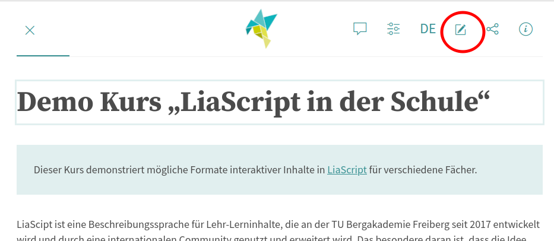

<!--
version: 0.0.1
language: de
narrator: Deutsch Female

persistent: true
edit: true

comment: Fächerbezogener Beispielkurs mit interaktiven Elemente in LiaScript für den Schulunterricht
author: Martin Lommatzsch, André Dietrich, Sebastian Zug


import: https://cdn.jsdelivr.net/gh/LiaTemplates/JSXGraph@main/README.md
import: https://cdn.jsdelivr.net/gh/LiaTemplates/algebrite@master/README.md


import: https://raw.githubusercontent.com/MINT-the-GAP/Aufgabensammlung/main/README.md

import: https://raw.githubusercontent.com/MINT-the-GAP/Aufgabensammlung/refs/heads/main/imports/KoordREADME.md


eingabe: <script input="number" input-always-active modify="false" value="0" default="0">@input</script>


-->


# Demo Kurs "LiaScript in der Schule"


[](https://liascript.github.io/course/?https://raw.githubusercontent.com/MINT-the-GAP/Wochenaufgabe/refs/heads/main/Sandkasten.md)


> Dieser Kurs demonstriert mögliche Formate interaktiver Inhalte in [LiaScript](https://liascript.github.io/) für verschiedene Fächer.

LiaScipt ist eine Beschreibungssprache für Lehr-Lerninhalte, die an der TU Bergakademie Freiberg seit 2017 entwickelt und durch eine internationalen Community genutzt und erweitert wird. Das besondere daran ist, dass die Idee einer einfachen Syntax wie Markdown mit der Möglichkeit kombiniert wird, interaktive Elemente wie Quiz, Simulationen, Programmierumgebungen, Formeleditoren, Tabellenkalkulationen und vieles mehr einzubinden [Link](https://open-educational-resources.de/warum-braucht-offene-bildung-eine-eigene-sprache-warum-liascript/). Bislang werden diese Möglichkeiten aber eher in der universitären Lehre eingesetzt.

Ich, Martin Lommatzsch, bin Fachlehrer am Geschwister-Scholl-Gymnasium in Freiberg und nutze LiaScript intensiv in meinem Unterricht. Eine umfangreiche Aufgabensammlung, die natürlich beliebig genutzt, kopiert und angepasst werden darf, findet sich unter [https://mint-the-gap.github.io/Aufgabensammlung/].

> Mit dem hier vorliegenden Kurs möchte ich eine Brücke schlagen und die Potentiale für andere Fächer aufzeigen. Werfen Sie gern einen Blick auf den "Code" dahinter. Klicken Sie im Kurs einfach auf den "Edit" Button, den ich im Bild markiert habe.



> ***(Einige Beispiele sind mehr oder weniger zufällig Fächern zugeordnet und können mit anderen Beispielen auch verknüpft werden. Ein Blick in jeden Fachbereich lohnt sich.)***

Ich freue mich über Rückmeldungen, Anregungen und Fragen. Kontaktieren Sie mich gern per Mail:\
`m.lommatzsch@gsg-freiberg.lernsax.de`

Viel Spaß damit!

Freiberg, Februar 2026

_PS: Vielen Dank bei den MitstreiterInnen aus der TU Bergakademie für die Unterstützung bei der Umsetzung!_


---

---


Auf den folgenden Seiten werden die Features von SchulLia vorgestellt.


> Import

`import: https://raw.githubusercontent.com/MINT-the-GAP/Aufgabensammlung/main/README.md`


### Mathematik


**Aufgabe 1:** **Berechne** den Wert des Terms. (DynFlex-, Canvas- und Timer-Demo)


<section class="dynFlex">


<div class="flex-child">

__$a)\;\;$__  

<!-- data-solution-timer="20s" -->
$ 14000+795= $ [[            14795           ]] @canvas
@Algebrite.check(14795)


</div>
<div class="flex-child">

__$b)\;\;$__ Gib $$\int\limits_{-\infty}^{1} 3x e^{-x^2} dx$$ mittels der Schrifterkennung ein.  \


<!-- data-solution-timer="15s" data-solution-timer-start="oncheck" -->
 [[            -0,551819            ]] 
@Algebrite.check2(-0.551819,0.01)

@canvas

</div>
<div class="flex-child">

__$c)\;\;$__ Wie viel sind $400\%$ von $125\,$€?  \


<!-- data-solution-timer="10s" data-solution-timer-start="oncheck" data-solution-timer-badge="off" -->
 [[  500  ]]€ 
@Algebrite.check(500)
************
$$
\begin{align*}
400\% \cdot 125\,\text{€}
&= 4,00 \cdot 125\,\text{€} \\
&= 500\,\text{€} 
\end{align*}
$$
************

@canvas

</div>
<div class="flex-child">

__$d)\;\;$__ Wie viel sind $7\%$ von $900\,$€?  \


<!-- data-solution-timer="10s" data-solution-timer-start="onclick" -->
 [[  63  ]]€ 
@Algebrite.check(63)
************
$$
\begin{align*}
7\% \cdot 900\,\text{€}
&= 0,07 \cdot 900\,\text{€} \\
&= 63\,\text{€} 
\end{align*}
$$
************

@canvas

</div>
<div class="flex-child">

__$e)\;\;$__ Wie viel sind $12\%$ von $750\,$€?  \


<!-- data-solution-timer="10s" data-solution-timer-start="onclick" data-solution-timer-badge="off" -->
 [[  90  ]]€ 
@Algebrite.check(90)
************
$$
\begin{align*}
12\% \cdot 750\,\text{€}
&= 0,12 \cdot 750\,\text{€} \\
&= 90\,\text{€}
\end{align*}
$$
************

@canvas

</div>
<div class="flex-child">

__$f)\;\;$__ Wie viel sind $4\%$ von $1\,250\,$€?  \


<!-- data-solution-button="5" -->
 [[  50  ]]€ 
@Algebrite.check(50)
************
$$
\begin{align*}
4\% \cdot 1\,250\,\text{€}
&= 0,04 \cdot 1\,250\,\text{€} \\
&= 50\,\text{€}
\end{align*}
$$
************

@canvas


</div>


</section>


---

---


**Aufgabe 2:** **Stelle** die passende Teilung der Fläche **ein** und **markiere** den passenden Anteil, sodass der Bruch dargestellt wird.


<section class="dynFlex">

<div class="flex-child">

__$a)\;\;$__ $\dfrac{3}{4}$

@circleQuiz(3/4)

`@circleQuiz(3/4)`

</div>

<div class="flex-child">

__$b)\;\;$__ $\dfrac{7}{10}$

@rectQuiz(7/10)

`@rectQuiz(7/10)`

</div>

</section>


---

---


__Aufgabe 3:__ Randomaufgaben gehen auch, aber hier ist aktuell ein Bug.


---

---


__Aufgabe 4:__ 


@Koordinatensystem(`xmin=-1;xmax=10;ymin=-1;ymax=10;width=700;id=A1`)

@AchsenBeschriftung(`id=A1;xlabel=$x$;ylabel=$y$`)

__$a)\;\;$__ **Ziehe** den Punkt $A$ **auf** die Koordinaten $(1|4)$.

@ErzeugePunkt(`A1;A;1;4`,`<!-- data-solution-timer="90s" data-solution-timer-start="oncheck" data-solution-timer-badge="off" -->`)


---

---


__Aufgabe 5:__ 


---

---


__Aufgabe 6:__ **Gib** 


@Koordinatensystem(`xmin=-7;xmax=7;ymin=-5;ymax=5;width=800;id=A12`)

@AchsenBeschriftung(`id=A12;xlabel=$x$;ylabel=$y$`)


@Tabelle(`n=3;x;f;P;id=A12`)


---

---


__Aufgabe 7:__ 


@Koordinatensystem(`xmin=-7;xmax=7;ymin=-5;ymax=5;width=800;id=A4`)

@AchsenBeschriftung(`id=A4;xlabel=$x$;ylabel=$y$`)

Ziehe den Punkt auf den Graphen von $f(x)=2x-4$.

@PunktGraph(`A4;A;f;2x-4;0.05`) \


---

---


__Aufgabe 8:__ **Gib** den ungefähren Wert der abgebildeten Objekte **an**.

<section class="dynFlex">

<div class="flex-child">


__$a)\;\;$__


[[ 380  ]] Holzperlen
@Algebrite.check_margin(350,410)


</div>
<div class="flex-child">


__$b)\;\;$__


[[ 2000 ]] Reiskörner
@Algebrite.check_margin(1800,2300)


</div>
</section>


---

---


__Aufgabe 9:__ Schreibe den Term $4+5*2-7$ in das Fenster. Drück dann unten links das Symbol </>.

``` Maxima
8+9
```
@Algebrite.eval


---

---

__Aufgabe 10:__ Gib den Term `x ^ 2 - 2 * x + 1` in einer beliebigen Umformung in das Lösungsfeld ein.

[[  x ^ 2 - 2 * x + 1  ]]
@Algebrite.check(x^2-2*x+1)

---

---


__Aufgabe 12:__ GeoGebra


??[](https://www.bildung-bedeutet-freiheit.de/GeoGebra/Downloadbalken.html)


---

---


__Aufgabe 13:__ Eigene Lernspiele

??[](https://bildung-bedeutet-freiheit.de/viervieren/index.html)


### Deutsch


**Aufgabe 1:** 
**Fülle** die Tabelle zu den Adjektiven **aus**.

<center>
<!-- data-solution-button="10" 
data-show-partial-solution 
data-randomize="true" 
data-type="none" 
data-sortable="false" 
style="max-width:800px;" -->
|  Positiv         |  Komparativ        |  Superlativ              |
|:----------------:|:------------------:|:------------------------:|
|  groß            | [[  größer     ]]  | [[  am größten        ]] |
|  [[ klug     ]]  | klüger             | [[  am klügsten       ]] |
|  gut             | [[  besser     ]]  | [[  am besten         ]] |
|  [[ schlecht ]]  | [[  schlechter ]]  |       am nettesten       |
</center>


---

---


**Aufgabe 2:** Hör dir den Satz an und schreib ihn korrekt in das Eingabefeld.


@diktat(Das Kind liest laut in einem neuen Buch.)


---

---


**Aufgabe 3:** Setze das Komma an die richtige Stelle.


@orthography(`<!-- data-solution-timer="15s" data-solution-timer-start="oncheck" data-solution-timer-badge="off" -->`,`Das ist der Tag an dem ich geblitzt wurde.`,`Das ist der Tag, an dem ich geblitzt wurde.`)


---

---


**Aufgabe 4:** **Markiere** @markedred(das Subjekt in rot), @markedblue(das Prädikat in blau) und @markedgreen(das Objekt in grün).


<section class="dynFlex">

<div class="flex-child">

__$a)\;\;$__
<div class="markerquiz">
@markred(Der Hund) @markblue(frisst) @markgreen(das Futter).
@TextmarkerQuiz
</div>


</div>

<div class="flex-child">

__$b)\;\;$__
<div class="markerquiz">
@markred(Die Lehrerin) @markblue(lobt) @markgreen(den Schüler).
@TextmarkerQuiz
</div>


</div>


</section>


---

---


__Aufgabe 5:__ **Gib** die passende Wortart **an**.


groß  [[(Adjektiv)|Adverb|Artikel|Interjektion|Konjunktion|Numeral|Nomen|Präposition|Pronomen|Substantiv|Verb]]  \


## Englisch / Fremdsprachen

_Zunächst starten wir mit der Überprüfung des Internetbrowsers - LiaScript evaluiert, ob die von Ihnen verwendete Variante Sprachaufnahme unterstützt. Wenn der Hinweis auf einen anderen Browser erscheint, wechseln Sie bitte. Die Spracheingabe und die damit verbundenen Aufgaben werden sonst nicht funktionieren._

@SpeechRecognition.support

__Exercise 1:__ Speak out loud

<section class="dynFlex">

<div class="flex-child">

__$a)\;\;$__ Say 'Good morning' in English.

<!-- data-solution-button="off" -->
[[!]]
@SpeechRecognition(en-US,`Good morning`)


</div>
<div class="flex-child">

__$b)\;\;$__ Say 'Hello' in English.

<!-- data-solution-button="off" -->
[[!]]
@SpeechRecognition(en-US,`Hello`)


</div>
<div class="flex-child">

__$c)\;\;$__ Say 'Cucumber' in English.

<!-- data-solution-button="off" -->
[[!]]
@SpeechRecognition(en-US,`Cucumber`)

</div>
<div class="flex-child">

__$d)\;\;$__ Say 'Geld' in English.

<!-- data-solution-button="off" -->
[[!]]
@SpeechRecognition(en-US,`Money`)

</div>
</section>


---

---


__Exercise 2:__ Drag the correct words into the gaps. 

> (Hinweis: Auf Touchbildschirmen bitte aktuell noch erst das Feld mit der Lücke antippen dann das gewünschte Wort.)

Ellen goes to school. [->[ He | (She) | It ]] wants to learn.  [->[ His | (Her) | Its ]] first subject today is math. 


---

---


__Exercise 3:__ Fill out the table with the regular verbs.


<!-- data-solution-button="2" data-show-partial-solution -->
|  simple present  |  simple past |  past participle |
|:----:|:-----:|:-----:|
|  put   | [[  put     ]]  | [[  put     ]]  |
|  go   | [[  went    ]]  | [[  gone    ]]  |
|  eat   | [[  ate     ]]  | [[  eaten   ]]  |
|  shake   | [[  shook   ]]  | [[  shaken  ]]  |
|  steal   | [[  stole   ]]  | [[  stolen  ]]  |


---

---


__Aufgabe 4:__ Sprich das angegebene Wort in der angegebenen Sprache.

@SpeechRecognition.support


<section class="dynFlex">

<div class="flex-child">

__$a)\;\;$__ Sprich 'Danke' auf französisch.

<!-- data-solution-button="off" -->
[[!]]
@SpeechRecognition(fr-FR,`Merci`)


</div>
<div class="flex-child">


__$b)\;\;$__ Sprich 'Danke' auf spanisch.

<!-- data-solution-button="off" -->
[[!]]
@SpeechRecognition(es-ES,`Gracias`)

</div>
<div class="flex-child">

__$c)\;\;$__ Sprich 'Danke' auf russisch.

<!-- data-solution-button="off" -->
[[!]]
@SpeechRecognition(ru-RU,`Спасибо`)

</div>
</section>

Es werden noch viele weitere Sprachen unterstützt.


## Naturwissenschaften


__Aufgabe 1:__ Wähle die Reaktionsprodukt aus, dass eine vollständige Verbrennung korrekt beschreibt. 

> (Klicke auf die Glühlampe, um einen Hinweis zu erhalten, bevor die die Aufgabe überprüfst oder lösen lässt.)

$2C_3H_8 + 10 O_2 \longrightarrow$ [[$6CO+8H_2O+2O_3$|$4CO_2+2CO+8H_2O$|($6CO_2+8H_2O$)|$6CHO_2+4H_2O$|$3C_2O_4+8H_2O$]]
[[?]] Es wird wohl Kohlenstoffdioxid und Wasser übrig bleiben.
[[?]] Du hattest schon einen Tipp.
[[?]] Nun reicht es aber!
[[?]] Keine Tipps mehr!


---

---


__Aufgabe 2:__ Zieh den Gesang der Amsel in das Feld.


> (Hinweis: Auf Touchbildschirmen bitte aktuell noch erst das Feld mit der Lücke antippen dann die gewünschte Tonspur.)

[->[ ?[Song and calls uttered by a House Sparrow, recorded at Cowley, Gloucestershire, England](https://upload.wikimedia.org/wikipedia/commons/b/ba/House_Sparrows_%28Passer_domesticus%29_%28W1CDR0001537_BD13%29.ogg)<!-- style="height:100px" --> | (?[Reviergesang männliche Amsel, Juni 2020 Wien](https://upload.wikimedia.org/wikipedia/commons/8/8a/2020-06-22_Amsel_4_Uhr_fr%C3%BCh_Wien.ogg) <!-- style="height:100px" --> ) | ?[The calls of a Blue Tit, recorded at Cowley, Gloucestershire, England](https://upload.wikimedia.org/wikipedia/commons/d/d7/Blue_Tit_%28Cyanistes_caeruleus%29_%28W1CDR0001535_BD30%29.ogg)<!-- style="height:100px" --> ]]

<small><small><small><small><small> Quellen: Reviergesang männliche Amsel, Juni 2020 Wien, Song and calls uttered by a House Sparrow, recorded at Cowley, Gloucestershire, England, The calls of a Blue Tit, recorded at Cowley, Gloucestershire, England </small></small></small></small></small>

---

---

__Aufgabe 3:__ Fülle die Lücken aus. (Die Lücken sind verknüpft mit einander.)


Es gibt [[  positive  ]] und [[  negative  ]] elektrische Ladungen.
<script>
@input.map(s => s.toLowerCase()).sort().join() === "negativ,positiv"
</script>


---

---

__Aufgabe 4:__ Ein Objekt bewegt sich mit $4\,\dfrac{\text{m}}{\text{s}}$. Fülle die Tabelle aus, sortiere danach nach der Zeit und lass dir die Werte als Funktion anzeigen.

> (Kann somit auch zur Messwerterfassung genutzt werden.)

<!-- style="width:500px" -->
|  $t$ in [s]  |  $x$ in [m] |
|:----:|:-----:|
|  1   |  @eingabe   |
|  5   |  @eingabe   |
|  3   |  @eingabe   |
|  4   |  @eingabe   |
|  2   |  @eingabe   |
|  6   |  @eingabe   |
|  7   |  @eingabe   |


Musterlösungsanzeige auch ohne Eingabe ist möglich:

[[!]]
<script>true</script>
***************************

Es sollte eine lineare Ursprungsgerade zu erkennen sein, wenn alle Werte richtig berechnet wurden.

***************************


---

---


__Aufgabe 5:__ **Gib** mithilfe des Periodensystems **an**, wer Germanium entdeckt hat.

@PeriodicTable

Der Entdecker von Germanium hieß: [[   Clemens Winkler   ]].

---

---


__Aufgabe 6:__ Auch Experimente an Robotern aus der Ferne mit den Remote-Laboren durch `edrys` sind möglich. (Hier durch ein Video vorgestellt)

!?[](https://www.youtube.com/watch?v=6ZjGHorc2ds)


---

---


__Aufgabe 7:__ Untersuche das Schneckenhaus in 3D.

??[](https://sketchfab.com/3d-models/sea-snail-shell-6515f625857041ad87bb6e2e5e5f6206)


---

---

__Aufgabe 8:__ PhET-Simulationen sind einfach einzubinden.

??[](https://phet.colorado.edu/sims/html/sound-waves/latest/sound-waves_all.html)


## Informatik


__Aufgabe 1:__ Korrigiere den Fehler im Code und lass dir die Anzahl der Buchstaben der Nachricht ausgeben. Drück dazu mal unten links dieses </> Symbol.

``` js
var message = "Dies ist die Nachricht"
console.log(message)
message.leangth
```
<script>@input </script>


__Aufgabe 2:__ Schreib den Code so um, dass die LEDs von rechts nach Links blinken. Drück dazu mal unten links dieses </> Symbol.


<div id="example">
<wokwi-led color="red"   pin="13" label="13"></wokwi-led>
<wokwi-led color="green" pin="12" label="12"></wokwi-led>
<wokwi-led color="blue"  pin="11" label="11"></wokwi-led>
<wokwi-led color="blue"  pin="10" label="10"></wokwi-led>
<span id="simulation-time"></span>
</div>

``` cpp
byte leds[] = {13, 12, 11, 10};
void setup() {
  Serial.begin(115200);
  for (byte i = 0; i < sizeof(leds); i++) {
    pinMode(leds[i], OUTPUT);
  }
}

int i = 0;
void loop() {
  Serial.print("LED: ");
  Serial.println(i);
  digitalWrite(leds[i], HIGH);
  delay(250);
  digitalWrite(leds[i], LOW);
  i = (i + 1) % sizeof(leds);
}
```
@AVR8js.sketch(example)


[[!]]
<script>true</script>
***************************

Dies hier könnte eine Lösung sein:

<div id="example">
<wokwi-led color="red"   pin="13" label="13"></wokwi-led>
<wokwi-led color="green" pin="12" label="12"></wokwi-led>
<wokwi-led color="blue"  pin="11" label="11"></wokwi-led>
<wokwi-led color="blue"  pin="10" label="10"></wokwi-led>
<span id="simulation-time"></span>
</div>

``` cpp
byte leds[] = {13, 12, 11, 10};
void setup() {
  Serial.begin(115200);
  for (byte i = 0; i < sizeof(leds); i++) {
    pinMode(leds[i], OUTPUT);
  }
}

int i = 0;
void loop() {
  Serial.print("LED: ");
  Serial.println(i);
  digitalWrite(leds[i], HIGH);
  delay(250);
  digitalWrite(leds[i], LOW);
  i = (i + 3) % sizeof(leds);
}
```
@AVR8js.sketch(example)


***************************


## Musik / Kunst


<section class="flex-container">
<div class="flex-child">

__Aufgabe 1:__ Klicke auf die beiden Noten und gib die Kadenz an.

``` abc  @ABCJS.render
X: 1
L: 1/2
K: C
[|\
G  C:|
```

Kadenz: [[  Quinte  ]]

</div>
<div class="flex-child">

__Aufgabe 2:__ Klicke auf den Dreiklang und entscheide, es sich um einen Dur- oder Moll-Dreiklang handelt.

``` abc  @ABCJS.render
X: 1
L: 1/4
K: C
[|\
[ACE]:|
```

Dreiklangsart: [[Dur|(Moll)]]

</div>
</section>

---

__Aufgabe 3:__ Ziehe das Bild des Komponisten hinter seinen Namen.


> (Hinweis: Auf Touchbildschirmen bitte aktuell noch erst das Feld mit der Lücke antippen dann das gewünschte Bild.)

<!-- data-randomize="true"  -->
Bach:    [->[( <!-- style="height:150px" --> )]] \
Mozart:  [->[( <!-- style="height:150px" --> )]] \
Puccini:  [->[( <!-- style="height:150px" --> )]] \


## Geschichte / Geographie / GRW

__Aufgabe 1:__ Ordne die Kriege chronologisch. Fange links bei dem Krieg an, der am weitesten in der Vergangenheit liegt. (Quizanzeige ist jedes mal anders.)


> (Hinweis: Auf Touchbildschirmen bitte aktuell noch erst das Feld mit der Lücke antippen dann das gewünschte Wort.)

<!-- data-randomize="true"  -->
 [->[ (Punische Kriege) ]] [->[ (Dreißigjähriger Krieg) ]] [->[ (1. Weltkrieg) ]] [->[ (2. Weltkrieg) ]] [->[ (Vietnamkrieg) ]]


---


__Aufgabe 2:__ Entscheide, ob es sich bei dem Term um einen Vektor, ein Skalar oder einen nicht definierten Ausdruck handelt. (Quizanzeige ist jedes mal anders.)


<!-- data-randomize="true"  -->
- [[Exekutive]   (Legislative)    [Judikative]]
- [    [ ]           [X]             [ ]     ]  Bundestag
- [    ( )           ( )             (X)     ]  Bundesverfassungsgericht
- [    [X]           [ ]             [ ]     ]  Bundeskanzler
- [    ( )           (X)             ( )     ]  Bundesrat
- [    [X]           [ ]             [ ]     ]  Bundesregierung


---


__Aufgabe 3:__ Wer wahr der erste Bundeskanzler der Bundesrepublik Deutschland? Wähle aus. (Quizanzeige ist jedes mal anders.)

<!-- data-randomize="true"  -->
- [[ ]] Helmut Schmidt
- [[ ]] Theodor Heuss
- [[X]] Konrad Adenauer
- [[ ]] Willi Brandt


## Deutsch als Zweitsprache / Inklusion

{{0-1}}
***************************
In LiaScript kann man jeden Course automatisch übersetzen lassen:


{{|> Deutsch female}} Und man kann jeden Text vorlesen lassen. Auch in anderen Sprachen.

***************************

{{1}}
***************************
Zur besseren Fokussierung kann man auch nur den aktuellen Inhalt einblenden und den Rest ausblenden.
***************************


## Zusätzliche Informationen für Lehrkräfte

+ Ist die Versionsnummer 1.0.0 oder größer, dann werden die Eingaben, die getätigt wurden auch lokal auf dem Endgerät der Schülerinnen und Schüler abgespeichert.
+ Über Opal gibt es eine Integrationsmöglichkeit für eine Rückmeldung der Schülerinnen- und Schülerleistungen für die Lehrkräfte.
+ Dieser Kommentar sollte individuell bearbeitet immer am Anfang des Dokuments im Editor stehen.


```
<!--
version:  0.0.1
language: de
narrator: Deutsch female
comment: Beschreibung des Kurses bitte hier. 
author: Name
-->
```

