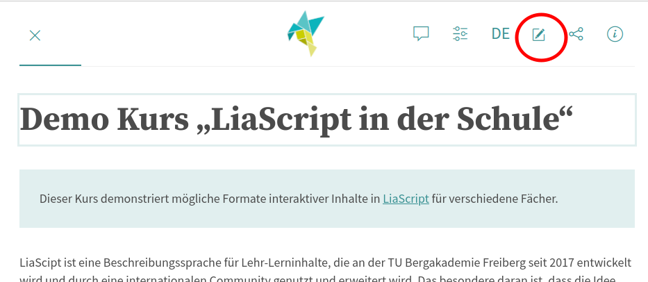

<!--
version: 0.0.1
language: de
narrator: Deutsch Female

persistent: true
edit: true

comment: Fächerbezogener Beispielkurs mit interaktiven Elemente in LiaScript für den Schulunterricht
author: Martin Lommatzsch, André Dietrich, Sebastian Zug

import: https://raw.githubusercontent.com/MINT-the-GAP/Aufgabensammlung/main/README.md


import: https://raw.githubusercontent.com/liaTemplates/algebrite/master/README.md

import: https://raw.githubusercontent.com/liaTemplates/JSXGraph/main/README.md


import: https://raw.githubusercontent.com/LiaTemplates/SpreadSheet/refs/heads/main/README.md
        https://raw.githubusercontent.com/liaTemplates/ABCjs/main/README.md
        https://raw.githubusercontent.com/LiaTemplates/Speech-Recognition-Quiz/refs/heads/main/README.md
        https://github.com/LiaTemplates/PeriodicTable/blob/main/README.md
        https://raw.githubusercontent.com/liaTemplates/AVR8js/main/README.md


@style
main > *:not(:last-child) {
  margin-bottom: 2rem;
}


/* Quiz/Check NICHT über volle Breite ziehen (nur dort, wo class="check-only" gesetzt ist) */
.check-only {
  display: inline-block !important;
  width: auto !important;
  max-width: max-content !important;
  text-align: left !important;
}

/* sehr defensiv: typische LiaScript-Wrapper ebenfalls auf "shrink" */
.check-only .lia-quiz,
.check-only .lia-input,
.check-only .lia-solution,
.check-only .lia-quiz__controls,
.check-only .lia-quiz__solution {
  display: inline-block !important;
  width: auto !important;
  max-width: max-content !important;
  float: none !important;
  text-align: left !important;
}

/* In diesem Check-Block ALLE Eingabeelemente ausblenden, nur Button bleibt */
.check-only input,
.check-only textarea,
.check-only select {
  display: none !important;
  visibility: hidden !important;
  width: 0 !important;
  height: 0 !important;
  padding: 0 !important;
  margin: 0 !important;
  border: 0 !important;
}


.check-only button {
  float: none !important;
  margin-left: 0 !important;
}


/* =========================================================
   JSXGraph Navigation: Light = schwarz, Dark = weiß
   ========================================================= */

/* Basis: Navigation übernimmt eine definierte Farbe */
.jxgbox .JXG_navigation,
.JXG_navigation{
  background: transparent !important;
}

/* LIGHTMODE */
@media (prefers-color-scheme: light){
  .jxgbox .JXG_navigation,
  .JXG_navigation{
    color: #000 !important;
  }

  .jxgbox .JXG_navigation a,
  .jxgbox .JXG_navigation span,
  .jxgbox .JXG_navigation button,
  .JXG_navigation a,
  .JXG_navigation span,
  .JXG_navigation button{
    color: #000 !important;
    border-color: #000 !important;
    background: transparent !important;
  }

  /* SVG-Icons */
  .jxgbox .JXG_navigation svg,
  .jxgbox .JXG_navigation svg *,
  .JXG_navigation svg,
  .JXG_navigation svg *{
    fill: #000 !important;
    stroke: #000 !important;
  }

  /* IMG-Icons (falls verwendet) */
  .jxgbox .JXG_navigation img,
  .JXG_navigation img{
    filter: none !important;
  }
}

/* DARKMODE */
@media (prefers-color-scheme: dark){
  .jxgbox .JXG_navigation,
  .JXG_navigation{
    color: #fff !important;
  }

  .jxgbox .JXG_navigation a,
  .jxgbox .JXG_navigation span,
  .jxgbox .JXG_navigation button,
  .JXG_navigation a,
  .JXG_navigation span,
  .JXG_navigation button{
    color: #fff !important;
    border-color: #fff !important;
    background: transparent !important;
  }

  /* SVG-Icons */
  .jxgbox .JXG_navigation svg,
  .jxgbox .JXG_navigation svg *,
  .JXG_navigation svg,
  .JXG_navigation svg *{
    fill: #fff !important;
    stroke: #fff !important;
  }

  /* IMG-Icons (falls verwendet) */
  .jxgbox .JXG_navigation img,
  .JXG_navigation img{
    filter: invert(1) !important;
  }
}

@end


@onload


// =========================================================
// Root-Window: gemeinsamer Speicher zwischen LiaScript & JSXGraph
// =========================================================
window.__ROOT = window.__ROOT || (function () {
  try {
    // In LiaScript/JSXGraph ist "parent" oft das Hauptdokument.
    // Falls es mehrere Ebenen gibt: so weit wie möglich hoch.
    let w = window;
    while (w.parent && w.parent !== w) w = w.parent;
    return w;
  } catch (e) {
    return window;
  }
})();

const ROOT = window.__ROOT;

// Gemeinsame Stores IM ROOT
ROOT.__boards  = ROOT.__boards  || {}; // id -> board
ROOT.__points  = ROOT.__points  || {}; // boardId -> { name -> point }
ROOT.__targets = ROOT.__targets || {}; // boardId -> { key -> f(x) }

// Optional: Queue, falls Buttons vor Board-Init geklickt werden
ROOT.__pendingPointSpecs = ROOT.__pendingPointSpecs || []; // ["boardId;Name", ...]


window.__boards = window.__boards || {};          // id -> board
window.__points = window.__points || {};          // boardId -> { name -> point }

window.ensurePoint = function (boardId, name) {
  const ROOT = window.__ROOT || window;
  const board = ROOT.__boards && ROOT.__boards[boardId];
  if (!board) return false;

  ROOT.__points[boardId] = ROOT.__points[boardId] || {};

  // existiert schon
  if (ROOT.__points[boardId][name] && ROOT.__points[boardId][name].elType === 'point') {
    ROOT.__points[boardId][name].setAttribute({ strokeWidth: 4 });
    setTimeout(() => ROOT.__points[boardId][name].setAttribute({ strokeWidth: 2 }), 250);
    try { window.__applyPointLabelTheme && window.__applyPointLabelTheme(boardId); } catch (e) {}
    board.update();
    return true;
  }

  const x0 = Math.random();
  const y0 = Math.random();

  const labelCol = (window.__neutralAutoColor ? window.__neutralAutoColor() : '#000');

  const pt = board.create('point', [x0, y0], {
    name: name,
    withLabel: true,                 // <- wichtig: Label aktiv halten
    label: {                         // <- Label-Farben (Text)
      strokeColor: labelCol,
      fillColor:   labelCol,
      highlightStrokeColor: labelCol,
      highlightFillColor:   labelCol
    },

    face: 'x',
    size: 6,
    strokeColor: 'purple',
    fillColor: 'purple',
    fixed: false
  });

  // sehr defensiv: manche JSXGraph-Versionen brauchen das am Label-Objekt direkt
  try {
    if (pt.label && typeof pt.label.setAttribute === 'function') {
      pt.label.setAttribute({
        strokeColor: labelCol,
        fillColor:   labelCol,
        highlightStrokeColor: labelCol,
        highlightFillColor:   labelCol
      });
    }
  } catch (e) {}


  pt.setAttribute({ showInfobox: false, showInfoBox: false });
  pt.on('over', () => { board.infobox && board.infobox.hide && board.infobox.hide(); });
  pt.on('out',  () => { board.infobox && board.infobox.hide && board.infobox.hide(); });

  ROOT.__points[boardId][name] = pt;
  try { window.__applyPointLabelTheme && window.__applyPointLabelTheme(boardId); } catch (e) {}
  board.update();
  return true;
};

window.ensurePointFromSpec = function (spec) {
  const ROOT = window.__ROOT || window;
  const parts = String(spec).split(';').map(s => String(s).trim());
  const boardId = parts[0] || '';
  const name    = parts[1] || '';
  if (!boardId || !name) return;

  // Wenn Board noch nicht da ist: merken und später flushen
  if (!ROOT.__boards || !ROOT.__boards[boardId]) {
    ROOT.__pendingPointSpecs.push(`${boardId};${name}`);
    return;
  }

  window.ensurePoint(boardId, name);
};


// ---- Theme-Farbe lesen (aus echtem .lia-btn; ggf. aus parent) ----
window.readLiaBtnColor = window.readLiaBtnColor || function (fallback = '#0b5fff') {
  // 0) Priorität: explizite Grid-Variable (für Switch gedacht)
  try {
    const cs0 = getComputedStyle(document.documentElement);
    const v0 = cs0.getPropertyValue('--grid-color').trim();
    if (v0) return v0;
  } catch (e) {}

  // 1) Buttonfarbe aus dem aktuellen Dokument lesen
  try {
    const btn = document.querySelector('.lia-btn');
    if (btn) {
      const cs = getComputedStyle(btn);
        const bg = cs.backgroundColor && cs.backgroundColor !== 'rgba(0, 0, 0, 0)' ? cs.backgroundColor : '';
        if (bg) return bg;

        // oft ist bei Buttons die Akzentfarbe am Border sichtbar
        const br = cs.borderTopColor && cs.borderTopColor !== 'rgba(0, 0, 0, 0)' ? cs.borderTopColor : '';
        if (br) return br;

        if (cs.color) return cs.color;
    }
  } catch (e) {}

  // 2) Falls JSXGraph in einem isolierten Kontext läuft: parent versuchen
  try {
    if (window.parent && window.parent.document) {
      const btn = window.parent.document.querySelector('.lia-btn');
      if (btn) {
        const cs = window.parent.getComputedStyle(btn);
            const bg = cs.backgroundColor && cs.backgroundColor !== 'rgba(0, 0, 0, 0)' ? cs.backgroundColor : '';
            if (bg) return bg;

            // oft ist bei Buttons die Akzentfarbe am Border sichtbar
            const br = cs.borderTopColor && cs.borderTopColor !== 'rgba(0, 0, 0, 0)' ? cs.borderTopColor : '';
            if (br) return br;

            if (cs.color) return cs.color;
      }
      // auch dort --grid-color probieren
      const csP = window.parent.getComputedStyle(window.parent.document.documentElement);
      const vP = csP.getPropertyValue('--grid-color').trim();
      if (vP) return vP;
    }
  } catch (e) {}

  return fallback;
};


// ---- Grid-Farbe auf einem Board aktualisieren ----
window.applyGridColor = window.applyGridColor || function (board, color) {
  if (!board || !color) return;

  // 1) Optionen setzen (für zukünftige Rebuilds)
  try {
    if (board.options && board.options.grid) {
      if (board.options.grid.major) board.options.grid.major.strokeColor = color;
      if (board.options.grid.minor) board.options.grid.minor.strokeColor = color;
    }
  } catch (e) {}

  // 2) EXISTIERENDE Grid-Objekte einfärben (das ist der entscheidende Teil)
  try {
    // Viele JSXGraph-Versionen haben board.grids (Array)
    if (board.grids && board.grids.length) {
      board.grids.forEach(g => {
        if (g && typeof g.setAttribute === 'function') {
          g.setAttribute({ strokeColor: color });
        }
      });
    }

    // Sehr defensiv: auch in objectsList nach "grid" suchen
    if (board.objectsList && board.objectsList.length) {
      board.objectsList.forEach(o => {
        if (!o || typeof o.setAttribute !== 'function') return;
        if (o.elType === 'grid' || o.type === (JXG && JXG.OBJECT_TYPE_GRID)) {
          o.setAttribute({ strokeColor: color });
        }
      });
    }
  } catch (e) {}

  // 3) Redraw
  try {
    if (typeof board.fullUpdate === 'function') board.fullUpdate();
    else board.update();
  } catch (e) {}
};


// ---- Auto-Update: Farbe regelmäßig prüfen und bei Änderung anwenden ----
window.watchGridColor = window.watchGridColor || function (board, intervalMs = 400) {
  if (!board) return;
  if (!window.__gridWatchers) window.__gridWatchers = new WeakMap();

  // nicht doppelt starten
  if (window.__gridWatchers.has(board)) return;

  let last = '';

  const timer = setInterval(() => {
    const c = window.readLiaBtnColor('#0b5fff');
    if (c && c !== last) {
      last = c;
      window.applyGridColor(board, c);
    }
  }, intervalMs);

  window.__gridWatchers.set(board, timer);
};

window.__targets = window.__targets || {}; // boardId -> { key -> f(x) }

// Ziel-Funktion registrieren (y = f(x))
window.setTargetFunction = window.setTargetFunction || function (boardId, key, fn) {
  window.__targets[boardId] = window.__targets[boardId] || {};
  window.__targets[boardId][key] = fn;
};

// Prüfen: Punkt nahe an y=f(x)
window.isPointOnTargetFunction = window.isPointOnTargetFunction || function (boardId, pointName, key, epsY = 0.15) {
  const pt = window.__points && window.__points[boardId] && window.__points[boardId][pointName];
  const fn = window.__targets && window.__targets[boardId] && window.__targets[boardId][key];
  if (!pt || typeof fn !== 'function') return false;

  const x = pt.X();
  const y = pt.Y();
  const y0 = fn(x);

  if (!isFinite(y0)) return false;
  return Math.abs(y - y0) <= epsY;
};


// =========================================================
// FIX: Target/Point-Checks konsequent über ROOT-Store
// =========================================================
window.setTargetFunction = function (boardId, key, fn) {
  const ROOT = window.__ROOT || window;
  ROOT.__targets = ROOT.__targets || {};
  ROOT.__targets[boardId] = ROOT.__targets[boardId] || {};
  ROOT.__targets[boardId][key] = fn;
};

window.isPointOnTargetFunction = function (boardId, pointName, key, epsY = 0.15) {
  const ROOT = window.__ROOT || window;

  const pt = ROOT.__points && ROOT.__points[boardId] && ROOT.__points[boardId][pointName];
  const fn = ROOT.__targets && ROOT.__targets[boardId] && ROOT.__targets[boardId][key];

  if (!pt || typeof fn !== 'function') return false;

  const x = pt.X();
  const y = pt.Y();
  const y0 = fn(x);

  if (!isFinite(y0)) return false;
  return Math.abs(y - y0) <= epsY;
};


// =========================================================
// @AutoPunkteGraph – Store + Namensgenerator + Actions
// =========================================================
ROOT.__autoPts = ROOT.__autoPts || {};             // boardId -> {counter, names:[]}
ROOT.__pendingAutoAdds = ROOT.__pendingAutoAdds || []; // falls Button vor Board klickt

function __autoLabel(i) {
  // A..Z, A',B',..Z', A'',...
  const letters = "ABCDEFGHIJKLMNOPQRSTUVWXYZ";
  const base = letters[i % 26];
  const k = Math.floor(i / 26);
  return base + (k > 0 ? "'".repeat(k) : "");
}

function __randInBBox(board) {
  // Gewünschter Startbereich: 0 <= x < 1 und 0 <= y < 1
  const x = Math.random();   // in [0,1)
  const y = Math.random();   // in [0,1)
  return [x, y];
}

// optional: wenn Punkt erzeugt wurde, aber Board war noch nicht da
ROOT.flushPendingAutoAdds = ROOT.flushPendingAutoAdds || function (boardId) {
  const board = ROOT.__boards && ROOT.__boards[boardId];
  if (!board) return;

  ROOT.__pendingAutoAdds = (ROOT.__pendingAutoAdds || []).filter(item => {
    if (item.boardId !== boardId) return true;

    // Punkt erzeugen/positionieren
    window.ensurePoint(item.boardId, item.name);
    const pt = ROOT.__points && ROOT.__points[item.boardId] && ROOT.__points[item.boardId][item.name];
    if (pt && item.xy) {
      try { pt.moveTo(item.xy, 0); } catch (e) {}
      try { board.update(); } catch (e) {}
    }
    return false;
  });
};

function __initAuto(boardId) {
  ROOT.__autoPts[boardId] = ROOT.__autoPts[boardId] || { counter: 0, names: [] };
  return ROOT.__autoPts[boardId];
}

// spec: "boardId;targetKey;eps"
window.addAutoPointFromSpec = function (spec, uid) {
  const ROOT = window.__ROOT || window;
  const parts = String(spec).split(';').map(s => String(s).trim());

  const boardId = parts[0] || '';
  if (!boardId) return;

  const state = __initAuto(boardId);
  const name = __autoLabel(state.counter++);
  state.names.push(name);

  const msg = document.getElementById('autoMsg-' + uid);

  const board = ROOT.__boards && ROOT.__boards[boardId];
  if (!board) {
    // Board noch nicht registriert -> merken
    ROOT.__pendingAutoAdds.push({ boardId, name, xy: null });
    if (msg) {
      msg.textContent = `(${name}) vorgemerkt (Board lädt noch ...)`;
      msg.style.color = __neutralAutoColor();
    }
    return;
  }

  // Punkt erzeugen (zufällige Position im Sichtfenster)
  window.ensurePoint(boardId, name);

  const pt = ROOT.__points && ROOT.__points[boardId] && ROOT.__points[boardId][name];
  if (pt) {
    const xy = __randInBBox(board);
    try { pt.moveTo(xy, 0); } catch (e) {}
    try { board.update(); } catch (e) {}
  }
  if (msg) {
    const html = state.names
      .map(n => `<span class="autoNameNeutral" style="font-weight:600; color:${window.__neutralAutoColor()};">\\(${n}\\)</span>`)
      .join(', ');

    msg.innerHTML = html;

    setTimeout(() => {
      try { ROOT.__typeset(msg); } catch (e) {}
      try { window.__recolorNeutralAutoLabels(); } catch (e) {}
    }, 0);
  }
};


window.checkAutoPointsFromSpec = function (spec, uid) {
  const ROOT = window.__ROOT || window;

  // Neue Spec-Auswertung (mit optionaler 2. Grenze)
  const parsed = (window.__parseAutoPointSpec)
    ? window.__parseAutoPointSpec(spec)
    : (function(){
        // Fallback, falls __parseAutoPointSpec aus irgendeinem Grund fehlt
        const parts = String(spec).split(';').map(s => String(s).trim());
        const boardId = parts[0] || '';
        const key     = parts[1] || '';
        let epsGreen  = parseFloat(String(parts[2] || '').replace(',', '.'));
        if (Number.isNaN(epsGreen)) epsGreen = 0.15;
        let epsOrange = parseFloat(String(parts[3] || '').replace(',', '.'));
        if (Number.isNaN(epsOrange)) epsOrange = 0.30;
        epsOrange = Math.max(epsOrange, epsGreen);
        return { boardId, key, epsGreen, epsOrange };
      })();

  const { boardId, key, epsGreen, epsOrange } = parsed;

  const msg = document.getElementById('autoMsg-' + uid);

  const state = ROOT.__autoPts && ROOT.__autoPts[boardId];
  const names = (state && state.names) ? state.names.slice() : [];

  if (!names.length) {
    if (msg) {
      msg.textContent = 'Noch keine Punkte erzeugt.';
      msg.style.color = '';
    }
    return;
  }

  if (msg) {
    const partsHtml = names.map(n => {
      const okGreen  = window.isPointOnTargetFunction(boardId, n, key, epsGreen);
      const okOrange = !okGreen && window.isPointOnTargetFunction(boardId, n, key, epsOrange);

      const col = okGreen ? 'green' : (okOrange ? 'orange' : 'red');
      return `<span style="color:${col}; font-weight:600;">\\(${n}\\)</span>`;
    });

    msg.innerHTML = partsHtml.join(', ');
    setTimeout(() => { try { ROOT.__typeset(msg); } catch (e) {} }, 0);
  }
};


// =========================================================
// MathJax helper: typeset im ROOT/parent (wichtig bei Lia/JSXGraph)
// =========================================================
ROOT.__typeset = ROOT.__typeset || function (el) {
  if (!el) return;

  // MathJax kann je nach LiaScript in parent/root hängen
  const MJ =
    (ROOT && ROOT.MathJax) ||
    (window.parent && window.parent.MathJax) ||
    window.MathJax;

  if (!MJ) return;

  try {
    // MathJax v3
    if (typeof MJ.typesetPromise === 'function') {
      if (typeof MJ.typesetClear === 'function') MJ.typesetClear([el]);
      MJ.typesetPromise([el]);
      return;
    }
    // MathJax v2 fallback
    if (MJ.Hub && typeof MJ.Hub.Queue === 'function') {
      MJ.Hub.Queue(['Typeset', MJ.Hub, el]);
    }
  } catch (e) {}
};


window.__isDarkTheme = window.__isDarkTheme || function () {
  try {
    const doc = (window.parent && window.parent.document) ? window.parent.document : document;
    const win = (window.parent && window.parent.getComputedStyle) ? window.parent : window;
    const el = doc.body || doc.documentElement;
    const bg = win.getComputedStyle(el).backgroundColor;
    const m = bg.match(/rgba?\((\d+),\s*(\d+),\s*(\d+)/i);
    if (!m) return false;
    const r = parseInt(m[1], 10), g = parseInt(m[2], 10), b = parseInt(m[3], 10);
    const lum = 0.2126 * r + 0.7152 * g + 0.0722 * b;
    return lum < 128;
  } catch (e) { return false; }
};

window.__neutralAutoColor = window.__neutralAutoColor || function () {
  return window.__isDarkTheme() ? '#fff' : '#000';
};

window.__recolorNeutralAutoLabels = window.__recolorNeutralAutoLabels || function () {
  const col = window.__neutralAutoColor();
  document.querySelectorAll('span.autoNameNeutral').forEach(el => { el.style.color = col; });
};


window.__applyPointLabelTheme = window.__applyPointLabelTheme || function (boardId) {
  const ROOT = window.__ROOT || window;
  const col  = (window.__neutralAutoColor ? window.__neutralAutoColor() : '#000');

  const pts = ROOT.__points && ROOT.__points[boardId];
  if (!pts) return;

  Object.values(pts).forEach(pt => {
    if (!pt || typeof pt.setAttribute !== 'function') return;

    // Label-Defaults am Punkt
    try {
      pt.setAttribute({
        label: {
          strokeColor: col,
          fillColor: col,
          highlightStrokeColor: col,
          highlightFillColor: col
        }
      });
    } catch (e) {}

    // Direkt am Label-Objekt (je nach JSXGraph-Version entscheidend)
    try {
      if (pt.label && typeof pt.label.setAttribute === 'function') {
        pt.label.setAttribute({
          strokeColor: col,
          fillColor: col,
          highlightStrokeColor: col,
          highlightFillColor: col
        });
      }
    } catch (e) {}
  });

  // redraw
  try {
    const b = ROOT.__boards && ROOT.__boards[boardId];
    if (b) b.update();
  } catch (e) {}
};


(function () {
  const applyAll = () => {
    const ROOT = window.__ROOT || window;
    Object.keys(ROOT.__points || {}).forEach(bid => {
      try { window.__applyPointLabelTheme(bid); } catch (e) {}
    });
  };

  applyAll(); // initial

  try {
    const mq = window.matchMedia('(prefers-color-scheme: dark)');
    if (mq && typeof mq.addEventListener === 'function') mq.addEventListener('change', applyAll);
    else if (mq && typeof mq.addListener === 'function') mq.addListener(applyAll);
  } catch (e) {}
})();


@end


@ErzeugePunkt: @ErzeugePunkt_(@uid,@0)

@ErzeugePunkt_
<button id="btn-@0" class="lia-btn" onclick="window.ensurePointFromSpec('@1')">Punkt erzeugen</button>

<script run-once="true" modify="false">
(function(){
  const btn = document.getElementById('btn-@0');
  if (!btn) return;

  const apply = () => {
    const c = (window.__neutralAutoColor ? window.__neutralAutoColor() : '#000');
    btn.style.color = c;
    // optional, aber meist sinnvoll (passt zum Text):
    btn.style.borderColor = c;
  };

  apply();

  try {
    const mq = window.matchMedia('(prefers-color-scheme: dark)');
    if (mq && typeof mq.addEventListener === 'function') mq.addEventListener('change', apply);
    else if (mq && typeof mq.addListener === 'function') mq.addListener(apply);
  } catch (e) {}
})();
</script>


<!-- class="check-only" data-solution-button="off"-->
[[ 0 ]]
<script modify="false">
  const spec = '@1';
  const parts = String(spec).split(';');

  const boardId = (parts[0] || '').trim();
  const name    = (parts[1] || '').trim();
  const tx = parseFloat((parts[2] || '').replace(',', '.'));
  const ty = parseFloat((parts[3] || '').replace(',', '.'));

  const pt = window.__points && window.__points[boardId] && window.__points[boardId][name];
  const eps = 0.05;

  const ok = !!pt
    && !Number.isNaN(tx)
    && !Number.isNaN(ty)
    && Math.abs(pt.X() - tx) < eps
    && Math.abs(pt.Y() - ty) < eps;

  ok
</script>
@end


@ErzeugePunktGraph: @ErzeugePunktGraph_(@uid,@0)

@ErzeugePunktGraph_
<button id="btnG-@0" class="lia-btn" onclick="window.ensurePointFromSpec('@1')">Punkt erzeugen</button>

<script run-once="true" modify="false">
(function(){
  const btn = document.getElementById('btnG-@0');
  if (!btn) return;

  const apply = () => {
    const c = (window.__neutralAutoColor ? window.__neutralAutoColor() : '#000');
    btn.style.color = c;
    btn.style.borderColor = c;
  };

  apply();

  try {
    const mq = window.matchMedia('(prefers-color-scheme: dark)');
    if (mq && typeof mq.addEventListener === 'function') mq.addEventListener('change', apply);
    else if (mq && typeof mq.addListener === 'function') mq.addListener(apply);
  } catch (e) {}
})();
</script>


<!-- class="check-only" data-solution-button="off"-->
[[ 0 ]]
<script modify="false">
  // @1 = "boardId;Name;targetKey;eps"
  const spec  = '@1';
  const parts = String(spec).split(';').map(s => String(s).trim());

  const boardId = parts[0] || '';
  const name    = parts[1] || '';
  const key     = parts[2] || '';

  let eps = parseFloat(String(parts[3] || '').replace(',', '.'));
  if (Number.isNaN(eps)) eps = 0.15;

  const ok = window.isPointOnTargetFunction(boardId, name, key, eps);
  ok
</script>
@end


@AutoPunkteGraph: @AutoPunkteGraph_(@uid,@0)

@AutoPunkteGraph_
<div>
  <button id="autoAdd-@0" class="lia-btn" onclick="window.addAutoPointFromSpec('@1','@0')">Punkt hinzufügen</button>
  <button id="autoChk-@0" class="lia-btn" onclick="window.checkAutoPointsFromSpec('@1','@0')">Prüfen</button>
  <span id="autoMsg-@0" style="margin-left: 12px;"></span>
</div>

<script run-once="true" modify="false">
(function(){
  const btnAdd = document.getElementById('autoAdd-@0');
  const btnChk = document.getElementById('autoChk-@0');

  const apply = () => {
    const c = (window.__neutralAutoColor ? window.__neutralAutoColor() : '#000');

    [btnAdd, btnChk].forEach(b => {
      if (!b) return;
      b.style.color = c;
      b.style.borderColor = c;
    });

    // ganz wichtig: bereits erzeugte, neutrale Labels anpassen (nicht grün/rot!)
    if (window.__recolorNeutralAutoLabels) window.__recolorNeutralAutoLabels();
  };

  apply();

  try {
    const mq = window.matchMedia('(prefers-color-scheme: dark)');
    if (mq && typeof mq.addEventListener === 'function') mq.addEventListener('change', apply);
    else if (mq && typeof mq.addListener === 'function') mq.addListener(apply);
  } catch (e) {}
})();
</script>

<script run-once="true" modify="false">
/**
 * Spec-Format:
 *   boardId;key;epsGreen;epsOrange
 *
 * Beispiele:
 *   @AutoPunkteGraph(Aufgabe1;graph1;0.15;0.3)
 *   @AutoPunkteGraph(Aufgabe1;graph1)              -> epsGreen=0.15, epsOrange=0.30
 *   @AutoPunkteGraph(Aufgabe1;graph1;0.2)          -> epsGreen=0.2,  epsOrange=0.30
 */
(function(){
  // Nur definieren, wenn nicht schon vorhanden
  if (window.__parseAutoPointSpec) return;

  window.__parseAutoPointSpec = function(spec){
    const parts = String(spec).split(';').map(s => String(s).trim());

    const boardId = parts[0] || '';
    const key     = parts[1] || '';

    let epsGreen = parseFloat(String(parts[2] || '').replace(',', '.'));
    if (Number.isNaN(epsGreen)) epsGreen = 0.15;

    let epsOrange = parseFloat(String(parts[3] || '').replace(',', '.'));
    if (Number.isNaN(epsOrange)) epsOrange = 0.30;

    // Sicherheit: Orange darf nicht strenger sein als Grün
    epsOrange = Math.max(epsOrange, epsGreen);

    return { boardId, key, epsGreen, epsOrange };
  };
})();
</script>


@end


eingabe: <script input="number" input-always-active modify="false" value="0" default="0">@input</script>


-->


# Demo Kurs "LiaScript in der Schule"


[](https://liascript.github.io/course/?https://raw.githubusercontent.com/MINT-the-GAP/Wochenaufgabe/refs/heads/main/Sandkasten.md)


> Dieser Kurs demonstriert mögliche Formate interaktiver Inhalte in [LiaScript](https://liascript.github.io/) für verschiedene Fächer.

LiaScipt ist eine Beschreibungssprache für Lehr-Lerninhalte, die an der TU Bergakademie Freiberg seit 2017 entwickelt und durch eine internationalen Community genutzt und erweitert wird. Das besondere daran ist, dass die Idee einer einfachen Syntax wie Markdown mit der Möglichkeit kombiniert wird, interaktive Elemente wie Quiz, Simulationen, Programmierumgebungen, Formeleditoren, Tabellenkalkulationen und vieles mehr einzubinden [Link](https://open-educational-resources.de/warum-braucht-offene-bildung-eine-eigene-sprache-warum-liascript/). Bislang werden diese Möglichkeiten aber eher in der universitären Lehre eingesetzt.

Ich, Martin Lommatzsch, bin Fachlehrer am Geschwister-Scholl-Gymnasium in Freiberg und nutze LiaScript intensiv in meinem Unterricht. Eine umfangreiche Aufgabensammlung, die natürlich beliebig genutzt, kopiert und angepasst werden darf, findet sich unter [https://mint-the-gap.github.io/Aufgabensammlung/].

> Mit dem hier vorliegenden Kurs möchte ich eine Brücke schlagen und die Potentiale für andere Fächer aufzeigen. Werfen Sie gern einen Blick auf den "Code" dahinter. Klicken Sie im Kurs einfach auf den "Edit" Button, den ich im Bild markiert habe.



> ***(Einige Beispiele sind mehr oder weniger zufällig Fächern zugeordnet und können mit anderen Beispielen auch verknüpft werden. Ein Blick in jeden Fachbereich lohnt sich.)***

Ich freue mich über Rückmeldungen, Anregungen und Fragen. Kontaktieren Sie mich gern per Mail:\
`m.lommatzsch@gsg-freiberg.lernsax.de`

Viel Spaß damit!

Freiberg, Februar 2026

_PS: Vielen Dank bei den MitstreiterInnen aus der TU Bergakademie für die Unterstützung bei der Umsetzung!_


---

---


Auf den folgenden Seiten werden die Features von SchulLia vorgestellt.


> Import

`import: https://raw.githubusercontent.com/MINT-the-GAP/Aufgabensammlung/main/README.md`


### Mathematik


**Aufgabe 1:** **Berechne** den Wert des Terms. (DynFlex-, Canvas- und Timer-Demo)


<section class="dynFlex">


<div class="flex-child">

__$a)\;\;$__  

<!-- data-solution-timer="20s" -->
$ 14000+795= $ [[            14795           ]] 
@Algebrite.check(14795)
************
$$
\begin{align*}
80\% \cdot 50\,\text{€}
&= 0,8 \cdot 50\,\text{€} \\
&= 40\,\text{€} 
\end{align*}
$$
************

@canvas


</div>
<div class="flex-child">

__$b)\;\;$__ Wie viel sind $125\%$ von $300\,$€?  \


<!-- data-solution-timer="15s" data-solution-timer-start="oncheck" -->
 [[  375  ]]€ 
@Algebrite.check(375)
************
$$
\begin{align*}
125\% \cdot 300\,\text{€}
&= 1,25 \cdot 300\,\text{€} \\
&= 375\,\text{€} 
\end{align*}
$$
************

@canvas

</div>
<div class="flex-child">

__$c)\;\;$__ Wie viel sind $400\%$ von $125\,$€?  \


<!-- data-solution-timer="10s" data-solution-timer-start="oncheck" data-solution-timer-badge="off" -->
 [[  500  ]]€ 
@Algebrite.check(500)
************
$$
\begin{align*}
400\% \cdot 125\,\text{€}
&= 4,00 \cdot 125\,\text{€} \\
&= 500\,\text{€} 
\end{align*}
$$
************

@canvas

</div>
<div class="flex-child">

__$d)\;\;$__ Wie viel sind $7\%$ von $900\,$€?  \


<!-- data-solution-timer="10s" data-solution-timer-start="onclick" -->
 [[  63  ]]€ 
@Algebrite.check(63)
************
$$
\begin{align*}
7\% \cdot 900\,\text{€}
&= 0,07 \cdot 900\,\text{€} \\
&= 63\,\text{€} 
\end{align*}
$$
************

@canvas

</div>
<div class="flex-child">

__$e)\;\;$__ Wie viel sind $12\%$ von $750\,$€?  \


<!-- data-solution-timer="10s" data-solution-timer-start="onclick" data-solution-timer-badge="off" -->
 [[  90  ]]€ 
@Algebrite.check(90)
************
$$
\begin{align*}
12\% \cdot 750\,\text{€}
&= 0,12 \cdot 750\,\text{€} \\
&= 90\,\text{€}
\end{align*}
$$
************

@canvas

</div>
<div class="flex-child">

__$f)\;\;$__ Wie viel sind $4\%$ von $1\,250\,$€?  \


<!-- data-solution-button="5" -->
 [[  50  ]]€ 
@Algebrite.check(50)
************
$$
\begin{align*}
4\% \cdot 1\,250\,\text{€}
&= 0,04 \cdot 1\,250\,\text{€} \\
&= 50\,\text{€}
\end{align*}
$$
************

@canvas


</div>


</section>


---

---


**Aufgabe 2:** **Stelle** die passende Teilung der Fläche **ein** und **markiere** den passenden Anteil, sodass der Bruch dargestellt wird.


<section class="dynFlex">

<div class="flex-child">

__$a)\;\;$__ $\dfrac{3}{4}$

@circleQuiz(3/4)

`@circleQuiz(3/4)`

</div>

<div class="flex-child">

__$b)\;\;$__ $\dfrac{7}{10}$

@rectQuiz(7/10)

`@rectQuiz(7/10)`

</div>

</section>


---

---


**Aufgabe 3:** **Bestimme** den Wert der dargestellten Lücke. Klicke danach gerne auf "Neue Aufgabe", um eine weitere Aufgabe zu erhalten.


<script input="submit" output="Divisionsaufgabe" default="Neue Aufgabe" modify="false">
  if (!window._div_tick) { 
    window._div_tick = 1; 
  } else { 
    window._div_tick++; 
  }
  "Neue Aufgabe " + window._div_tick
</script>

---

<script modify="false">
// @input(`Divisionsaufgabe`)

// Zufall: einstelliger Divisor 2–9, vierstelliger Quotient 1000–9999
const ri = (min, max) => Math.floor(Math.random() * (max - min + 1)) + min;
const d = ri(2, 9);          // Divisor
const q = ri(1000, 9999);    // Quotient
const N = d * q;             // Dividend, damit die Division aufgeht

// Aufgabe: Dividend : Divisor = Quotient (Eingabe im Feld)
const problem = `$${N} : ${d} = $ [[ ${q} ]]`;

// Schriftliche Division mit \hspace, farbig
function longDivisionAlign(N, d, q) {
  const digits = String(N).split('').map(x => parseInt(x, 10));
  const L      = digits.length;
  const colors = ["blue", "green", "orange", "red", "purple", "brown"];
  let colorIndex = 0;

  const lines = [];

  // Kopfzeile
  lines.push(` ${N}:${d} &= ${q} \\\\`);

  // erste Teilzahl >= d bestimmen
  let i = 0;
  let partial = digits[0];
  while (partial < d && i + 1 < L) {
    i++;
    partial = partial * 10 + digits[i];
  }

  let end        = i;        // rechter Index der aktuellen Ziffern-Gruppe
  let startBlock = 0;        // linker Index der aktuellen Ziffern-Gruppe
  const hs       = '\\hspace{0.5em}';                // „Spalten-Schritt“
  const baseHS   = '\\hspace{0.85em}\\hspace{0.5em}'; // zusätzliche globale Einrückung

  while (true) {
    const qDigit = Math.floor(partial / d);
    const sub    = qDigit * d;
    const rem    = partial - sub;

    const col = colors[colorIndex % colors.length];
    colorIndex++;

    const subStr     = String(sub);
    const subLen     = subStr.length;
    const blockWidth = end - startBlock + 1;  // wie viele Stellen bilden den aktuellen Block?

    // viele \hspace für frühe Schritte, wenige für späte
    const offsetSub = Math.max(0, (L - 1) - end);

    // internes \hspace, wenn Subtrahend kürzer als Block (z.B. 3 unter "03")
    const needsInnerHs = subLen < blockWidth;
    const innerHs      = needsInnerHs ? hs : '';

    const coloredSub = `\\textcolor{${col}}{${subStr}}`;
    const subExpr    = `\\underline{-${innerHs}${coloredSub}}`;

    // Subtraktion: Zahl, dann variable \hspace, dann Basis-\hspace, dann &
    const lineSub =
      ' ' +
      subExpr +
      hs.repeat(offsetSub) +
      baseHS +
      ' & \\\\';
    lines.push(lineSub);

    if (end + 1 < L) {
      // Es gibt noch eine Ziffer zum Runterholen
      const nextIndex = end + 1;
      const nextDigit = digits[nextIndex];

      const topStr = String(rem) + String(nextDigit);  // z.B. "0" + "3" = "03"
      const k      = nextIndex;

      const offsetTop = Math.max(0, (L - 1) - k);

      const lineTop =
        ' ' +
        `${topStr}` +
        hs.repeat(offsetTop) +
        baseHS +
        ' & \\\\';
      lines.push(lineTop);

      partial    = parseInt(topStr, 10);
      // nächster Block beginnt eine Stelle weiter rechts
      startBlock = startBlock + 1;
      end        = k;
    } else {
      // letzter Rest
      const remStr    = String(rem);
      const offsetRem = Math.max(0, (L - 1) - end);

      const lineRem =
        ' ' +
        `${remStr}` +
        hs.repeat(offsetRem) +
        baseHS +
        ' & \\\\';
      lines.push(lineRem);
      break;
    }
  }

  return `$$
\\begin{align*}
${lines.join('\n')}
\\end{align*}
$$`;
}

// Versteckte Lösung (wie bei deinem Multiplikationsbeispiel)
let solution = '***************';
solution += '\n' + longDivisionAlign(N, d, q) + '\n';
solution += '***************';

// Ausgabe für LiaScript
"LIASCRIPT:\n" + problem + "\n" + solution;
</script>


---

---


__Aufgabe 4:__ **Erzeuge** beliebige viele Punkte und ziehe die Punkte auf den Graphen der Funktion.

(Bitte einmal die Farbthemes und zwischen Lightmode und Darkmode wechseln.)


<div style="max-width: 1000px;">

``` javascript @JSX.Graph

function __getGridColor(fallback = '#0b5fff') {
  try {
    const doc = (window.parent && window.parent.document) ? window.parent.document : document;
    const win = (window.parent && window.parent.getComputedStyle) ? window.parent : window;

    // 1) Wenn du später mal --grid-color nutzt, wird das automatisch bevorzugt
    const v = win.getComputedStyle(doc.documentElement).getPropertyValue('--grid-color').trim();
    if (v) return v;

    // 2) Sonst Button-Farbe nehmen
    const btn = doc.querySelector('.lia-btn');
    if (btn) {
      const cs = win.getComputedStyle(btn);
      const bg = cs.backgroundColor;
      if (bg && bg !== 'rgba(0, 0, 0, 0)') return bg;
      if (cs.color) return cs.color;
    }
  } catch (e) {}

  return fallback;
}

// Board-Grid-Farbe live nachziehen
function __watchGridColor(board, intervalMs = 400) {
  let last = '';

  setInterval(() => {
    const c = __getGridColor('#0b5fff');
    if (!c || c === last) return;
    last = c;

    // 1) Optionen setzen (für zukünftige Rebuilds)
    try {
      if (board && board.options && board.options.grid) {
        if (board.options.grid.major) board.options.grid.major.strokeColor = c;
        if (board.options.grid.minor) board.options.grid.minor.strokeColor = c;
      }
    } catch (e) {}

    // 2) EXISTIERENDE Grid-Objekte einfärben (entscheidend!)
    try {
      if (board && board.grids && board.grids.length) {
        board.grids.forEach(g => {
          if (g && typeof g.setAttribute === 'function') {
            g.setAttribute({ strokeColor: c });
          }
        });
      }

      if (board && board.objectsList && board.objectsList.length) {
        board.objectsList.forEach(o => {
          if (!o || typeof o.setAttribute !== 'function') return;
          if (o.elType === 'grid' || (typeof JXG !== 'undefined' && o.type === JXG.OBJECT_TYPE_GRID)) {
            o.setAttribute({ strokeColor: c });
          }
        });
      }
    } catch (e) {}

    // 3) Redraw
    try {
      if (board && typeof board.fullUpdate === 'function') board.fullUpdate();
      else if (board) board.update();
    } catch (e) {}

  }, intervalMs);
}

const btnColor = __getGridColor('#0b5fff');

JXG.Options.text.useMathJax = true;


// Board HIER DIE KOORDINATEN
// Board HIER DIE KOORDINATEN
// Board HIER DIE KOORDINATEN
// Board HIER DIE KOORDINATEN
// Board HIER DIE KOORDINATEN
// Board HIER DIE KOORDINATEN
// Board HIER DIE KOORDINATEN
// Board HIER DIE KOORDINATEN
board = JXG.JSXGraph.initBoard(jxgbox, {
  axis: true,
  showNavigation: true,
  showCopyright: false,
  boundingbox: [-1, 5, 7, -1],
  keepaspectratio: true,

  zoom: {
    enabled: true,
    wheel: true,
    needShift: false,
    factorX: 1.15,
    factorY: 1.15
  },

  pan: {
    enabled: true,
    needShift: false,
    needTwoFingers: false
  },

  defaultAxes: {
    x: {
      strokeColor: 'black',
      strokeWidth: 2.5,
    name: '\(x\,\text{in}\,[m]\)',
    withLabel: true,
    label: { position: 'rt', offset: [-50, -25], fontSize: 18 },
      ticks: {
        insertTicks: false,
        ticksDistance: 1,
        strokeWidth: 3,
        minorTicks: 9,         
        drawLabels: true,
        label: { fontSize: 18 }
      }
    },
    y: {
      strokeColor: 'black',
      strokeWidth: 2.5,
    name: '\(y\,\text{in}\,[m]\)',
    withLabel: true,
    label: { position: 'rt', offset: [15, 0], fontSize: 18 },
      ticks: {
        insertTicks: false,
        ticksDistance: 1,
        strokeWidth: 3,
        minorTicks: 9,        
        drawLabels: true,
        label: { fontSize: 18 }
      }
    }
  },

  grid: {
    majorStep: 'auto',                
    minorElements: 'auto',          
    includeBoundaries: true,
    forceSquare: true,

    major: {
      face: 'line',
      strokeColor: btnColor,
      strokeWidth: 1.5,          
      dash: 0,
      drawZero: true
    },
    minor: {
      face: 'line',
      strokeColor: btnColor,
      strokeWidth: 1,         
      dash: 1,
      drawZero: false             // <<< spart Linien
    }
  }
});


/* =========================================================
   ADAPTIVE AXES + GRID (auto tick distance + grid rebuild)
   - passt bei Zoom/Pan automatisch:
     * ticksDistance (1-2-5-10 …)
     * minorTicks
     * label fontSize / drawLabels
     * Grid majorStep + minorElements
   ========================================================= */

(function adaptiveAxesAndGrid(board) {
  if (!board) return;

  // --- "nice number" für Tick-Abstände: 1,2,5 * 10^k
  function niceStep(raw) {
    if (!isFinite(raw) || raw <= 0) return 1;
    const exp = Math.floor(Math.log10(raw));
    const f = raw / Math.pow(10, exp);
    let nf;
    if (f <= 1) nf = 1;
    else if (f <= 2) nf = 2;
    else if (f <= 5) nf = 5;
    else nf = 10;
    return nf * Math.pow(10, exp);
  }

  function pxPerUnitX() {
    const bb = board.getBoundingBox(); // [xmin, ymax, xmax, ymin]
    const w = board.containerObj ? board.containerObj.clientWidth : (board.canvasWidth || 600);
    return w / Math.max(1e-9, (bb[2] - bb[0]));
  }

  function pxPerUnitY() {
    const bb = board.getBoundingBox();
    const h = board.containerObj ? board.containerObj.clientHeight : (board.canvasHeight || 400);
    return h / Math.max(1e-9, (bb[1] - bb[3]));
  }

  // --- Grid sauber neu bauen (weil majorStep/minorElements nicht in jeder JSXGraph-Version "live" wirken)
  function rebuildGrid(stepX, stepY, minorX, minorY) {
    const color = (window.readLiaBtnColor ? window.readLiaBtnColor('#0b5fff') : '#0b5fff');

    // existierende Grids entfernen
    try {
      if (board.grids && board.grids.length) {
        board.grids.slice().forEach(g => {
          try { board.removeObject(g); } catch (e) {}
        });
      }
    } catch (e) {}

    // neues Grid anlegen
    try {
      board.create('grid', [], {
        majorStep: [stepX, stepY],
        minorElements: [minorX, minorY],
        includeBoundaries: true,
        forceSquare: true,

        major: {
          face: 'line',
          strokeColor: color,
          strokeWidth: 1.5,
          dash: 0,
          drawZero: true
        },
        minor: {
          face: 'line',
          strokeColor: color,
          strokeWidth: 1,
          dash: 1,
          drawZero: false
        }
      });
    } catch (e) {}

    // danach ggf. direkt Theme-Farbe/Axis-Farbe nachziehen
    try { window.applyGridColor && window.applyGridColor(board, color); } catch (e) {}
    try { window.__applyAxisColors && window.__applyAxisColors(board); } catch (e) {}
  }

  // --- Achsenticks live anpassen
  function setAxisTicks(axisKey, step, minorTicks, fontSize, drawLabels) {
    try {
      const ax = board.defaultAxes && board.defaultAxes[axisKey];
      if (!ax) return;

      // Defaults für neu entstehende Ticks/Labels
      board.options = board.options || {};
      board.options.defaultAxes = board.options.defaultAxes || {};
      board.options.defaultAxes[axisKey] = board.options.defaultAxes[axisKey] || {};
      board.options.defaultAxes[axisKey].ticks = board.options.defaultAxes[axisKey].ticks || {};
      board.options.defaultAxes[axisKey].ticks.label = board.options.defaultAxes[axisKey].ticks.label || {};

      board.options.defaultAxes[axisKey].ticks.ticksDistance = step;
      board.options.defaultAxes[axisKey].ticks.minorTicks    = minorTicks;
      board.options.defaultAxes[axisKey].ticks.drawLabels    = !!drawLabels;
      board.options.defaultAxes[axisKey].ticks.label.fontSize = fontSize;

      // existierende Tick-Objekte aktualisieren
      const t = ax.defaultTicks;
      if (t && typeof t.setAttribute === 'function') {
        t.setAttribute({
          ticksDistance: step,
          minorTicks: minorTicks,
          drawLabels: !!drawLabels,
          label: { fontSize: fontSize }
        });
      }
    } catch (e) {}
  }

  // --- Zustand, damit wir nicht dauernd neu bauen
  let lastSig = '';

  function computeAndApply() {
    const ppuX = pxPerUnitX();
    const ppuY = pxPerUnitY();

    // Ziel: ca. 90px pro Major-Tick
    const targetPx = 90;

    const rawStepX = targetPx / Math.max(1e-9, ppuX);
    const rawStepY = targetPx / Math.max(1e-9, ppuY);

    const stepX = niceStep(rawStepX);
    const stepY = niceStep(rawStepY);

    // Minor-Logik: je größer der Step / je kleiner ppu, desto weniger Minor
    const minorX = (ppuX < 25 || stepX >= 10) ? 0 : (stepX >= 5 ? 4 : 9);
    const minorY = (ppuY < 25 || stepY >= 10) ? 0 : (stepY >= 5 ? 4 : 9);

    // Label-Logik: bei zu wenig Pixel pro Einheit Labels verkleinern / ausblenden
    let font = 18;
    let draw = true;
    const ppuMin = Math.min(ppuX, ppuY);
    if (ppuMin < 35) font = 14;
    if (ppuMin < 25) font = 12;
    if (ppuMin < 16) draw = 10;

    // Signatur – nur anwenden, wenn sich wirklich was geändert hat
    const sig = [stepX, stepY, minorX, minorY, font, draw].join('|');
    if (sig === lastSig) return;
    lastSig = sig;

    // Achsen
    setAxisTicks('x', stepX, minorX, font, draw);
    setAxisTicks('y', stepY, minorY, font, draw);

    // Grid (neu bauen)
    rebuildGrid(stepX, stepY, minorX, minorY);

    try {
      if (typeof board.fullUpdate === 'function') board.fullUpdate();
      else board.update();
    } catch (e) {}
  }

  // --- throttle über rAF, sonst boundingbox spammt hart
  let raf = 0;
  function schedule() {
    if (raf) return;
    raf = requestAnimationFrame(() => {
      raf = 0;
      computeAndApply();
    });
  }

  board.on('boundingbox', schedule);
  try { board.on('resize', schedule); } catch (e) {}

  // initial
  computeAndApply();
})(board);


// =========================================================
// Board ins gemeinsame ROOT registrieren
// =========================================================
const ROOT = (function () {
  try { let w = window; while (w.parent && w.parent !== w) w = w.parent; return w; }
  catch (e) { return window; }
})();

ROOT.__boards = ROOT.__boards || {};
ROOT.__boards['Aufgabe1'] = board;

// Pending Points nachziehen (falls vorher geklickt)
ROOT.__pendingPointSpecs = ROOT.__pendingPointSpecs || [];
ROOT.__pendingPointSpecs = ROOT.__pendingPointSpecs.filter(spec => {
  const parts = String(spec).split(';').map(s => String(s).trim());
  const bid  = parts[0];
  const name = parts[1];

  if (bid === 'Aufgabe1' && name) {
    if (ROOT.ensurePoint) ROOT.ensurePoint(bid, name);
    else if (window.ensurePoint) window.ensurePoint(bid, name);
    return false; // aus Queue entfernen
  }
  return true;
});


; (function () {
  var r;
  try { r = (typeof ROOT !== 'undefined') ? ROOT : null; } catch (e) { r = null; }
  if (!r || typeof r.flushPendingAutoAdds !== 'function') return;

  // mini-delay, damit JSXGraph wirklich vollständig steht
  setTimeout(function () {
    try {
      r.flushPendingAutoAdds('Aufgabe1');
    } catch (e) {
      // bewusst still
    }
  }, 0);
})();


function __isDarkTheme() {
  try {
    const doc = (window.parent && window.parent.document) ? window.parent.document : document;
    const win = (window.parent && window.parent.getComputedStyle) ? window.parent : window;

    // bevorzugt: body, sonst documentElement
    const el = doc.body || doc.documentElement;
    const bg = win.getComputedStyle(el).backgroundColor;

    // bg ist typischerweise "rgb(r,g,b)" oder "rgba(r,g,b,a)"
    const m = bg.match(/rgba?\((\d+),\s*(\d+),\s*(\d+)/i);
    if (!m) return false;

    const r = parseInt(m[1], 10);
    const g = parseInt(m[2], 10);
    const b = parseInt(m[3], 10);

    // relative Luminanz (0..255) – Schwelle ~ 128
    const lum = 0.2126 * r + 0.7152 * g + 0.0722 * b;
    return lum < 128;
  } catch (e) {
    return false;
  }
}


function __neutralAutoColor() {
  return __isDarkTheme() ? '#fff' : '#000';
}

function __recolorNeutralAutoLabels() {
  const col = __neutralAutoColor();
  document.querySelectorAll('span.autoNameNeutral').forEach(el => {
    // Nur neutrale Labels anfassen (nicht grün/rot aus dem Check)
    el.style.color = col;
  });
}


function __applyNavColors(board) {
  if (!board || !board.containerObj) return;

  // JSXGraph legt die Navigation innerhalb des Board-Containers an
  const nav = board.containerObj.querySelector('.JXG_navigation');
  if (!nav) return;

  const isDark = __isDarkTheme();
  const col = isDark ? '#fff' : '#000';

  // Navigation-Grundstil
  nav.style.color = col;
  nav.style.background = 'transparent';

  // Links/Buttons/Spans explizit einfärben
  nav.querySelectorAll('a, button, span').forEach(el => {
    el.style.color = col;
    el.style.borderColor = col;
    el.style.background = 'transparent';
    el.style.boxShadow = 'none';
  });

  // SVG-Icons (falls JSXGraph SVG nutzt)
  nav.querySelectorAll('svg, svg *').forEach(el => {
    el.style.fill = col;
    el.style.stroke = col;
  });

  // IMG-Icons (falls JSXGraph Bilder nutzt)
  nav.querySelectorAll('img').forEach(img => {
    img.style.filter = isDark ? 'invert(1)' : 'none';
  });
}

// einmal anwenden (nach initBoard)
__applyNavColors(board);

// bei Mode-Wechsel nachziehen
try {
  const mq = window.matchMedia('(prefers-color-scheme: dark)');
  if (mq && typeof mq.addEventListener === 'function') {
    mq.addEventListener('change', () => __applyNavColors(board));
  } else if (mq && typeof mq.addListener === 'function') {
    mq.addListener(() => __applyNavColors(board));
  }
} catch (e) {}


function __applyAxisColors(board) {
  if (!board) return;

  const isDark = __isDarkTheme();
  const col = isDark ? '#fff' : '#000';

  // 0) WICHTIG: Defaults für zukünftig neu erzeugte Tick-Labels setzen
  // (damit beim Rauszoomen neue Zahlen direkt korrekt gefärbt werden)
  try {
    board.options = board.options || {};
    board.options.defaultAxes = board.options.defaultAxes || {};
    ['x', 'y'].forEach(axKey => {
      board.options.defaultAxes[axKey] = board.options.defaultAxes[axKey] || {};
      board.options.defaultAxes[axKey].ticks = board.options.defaultAxes[axKey].ticks || {};
      board.options.defaultAxes[axKey].ticks.label = board.options.defaultAxes[axKey].ticks.label || {};

      board.options.defaultAxes[axKey].strokeColor = col;
      board.options.defaultAxes[axKey].ticks.strokeColor = col;

      // Diese beiden sind für die Ziffern entscheidend:
      board.options.defaultAxes[axKey].ticks.label.strokeColor = col;
      board.options.defaultAxes[axKey].ticks.label.fillColor   = col;
    });
  } catch (e) {}

  // Helfer: beliebige JSXGraph-Objekte einfärben
  const paint = (obj) => {
    if (!obj || typeof obj.setAttribute !== 'function') return;
    try {
      obj.setAttribute({
        strokeColor: col,
        highlightStrokeColor: col,
        fillColor: col,
        highlightFillColor: col
      });
    } catch (e) {}
  };

  // 1) Achsen + Ticks + Tick-Labels (existierende)
  try {
    if (board.defaultAxes) {
      if (board.defaultAxes.x && board.defaultAxes.x.label) paint(board.defaultAxes.x.label);
      if (board.defaultAxes.y && board.defaultAxes.y.label) paint(board.defaultAxes.y.label);

      const paintTicks = (axis) => {
        if (!axis) return;

        // Achsen-VisProps (wirkt oft auf neu erzeugte Ticks/Labels)
        try {
          axis.setAttribute({ strokeColor: col, highlightStrokeColor: col });
        } catch (e) {}

        // Standard-Ticks (häufig axis.defaultTicks)
        if (axis.defaultTicks) {
          paint(axis.defaultTicks);

          // Label-Default am Tick-Objekt selbst nachziehen
          try {
            axis.defaultTicks.setAttribute({
              strokeColor: col,
              highlightStrokeColor: col
            });
            if (axis.defaultTicks.visProp && axis.defaultTicks.visProp.label) {
              axis.defaultTicks.visProp.label.strokeColor = col;
              axis.defaultTicks.visProp.label.fillColor   = col;
            }
          } catch (e) {}

          if (axis.defaultTicks.labels && axis.defaultTicks.labels.length) {
            axis.defaultTicks.labels.forEach(paint);
          }
        }

        // Manche Versionen: axis.ticks als Array
        if (axis.ticks && axis.ticks.length) {
          axis.ticks.forEach(t => {
            paint(t);
            // Tick-Label-Defaults am Tick nachziehen
            try {
              if (t.visProp && t.visProp.label) {
                t.visProp.label.strokeColor = col;
                t.visProp.label.fillColor   = col;
              }
            } catch (e) {}
            if (t.labels && t.labels.length) t.labels.forEach(paint);
          });
        }

        // Manche Versionen: axis.getTicks()
        if (typeof axis.getTicks === 'function') {
          (axis.getTicks() || []).forEach(t => {
            paint(t);
            try {
              if (t.visProp && t.visProp.label) {
                t.visProp.label.strokeColor = col;
                t.visProp.label.fillColor   = col;
              }
            } catch (e) {}
            if (t.labels && t.labels.length) t.labels.forEach(paint);
          });
        }
      };

      paintTicks(board.defaultAxes.x);
      paintTicks(board.defaultAxes.y);
    }
  } catch (e) {}

  // 2) Fallback: Tick-Labels werden je nach Version als Textobjekte geführt.
  // Wir färben NUR Texte, die sehr wahrscheinlich Tick-Labels sind, um nicht alle Texte (z.B. Punktnamen) zu erwischen.
  try {
    if (board.objectsList && board.objectsList.length) {
      board.objectsList.forEach(o => {
        if (!o || o.elType !== 'text') return;

        // Heuristiken für Tick-Labels:
        // - Tick-Labels sind fast immer "fixed"
        // - und haben häufig sehr kurze Inhalte (Zahlen)
        // - und sind nicht "label" eines beliebigen Punktes (die sind oft an ein parent gekoppelt)
        const txt = (typeof o.getText === 'function') ? String(o.getText()) : (o.plaintext ? String(o.plaintext) : '');
        const looksNumeric = /^[\s\-+]*\d+([.,]\d+)?\s*$/.test(txt);

        const isFixed = (o.visProp && (o.visProp.fixed === true || o.visProp.isfixed === true));
        if (looksNumeric && isFixed) paint(o);
      });
    }
  } catch (e) {}

  // 3) Redraw
  try {
    if (typeof board.fullUpdate === 'function') board.fullUpdate();
    else board.update();
  } catch (e) {}
}

// einmal anwenden
__applyAxisColors(board);

// NEU: bei jedem Zoom/Pan (boundingbox ändert sich) Achsen/Ticks/Labels nachfärben
try {
  board.on('boundingbox', () => __applyAxisColors(board));
} catch (e) {}

// Optional (aber sinnvoll): auch nach Board-Resize einmal nachziehen
try {
  board.on('resize', () => __applyAxisColors(board));
} catch (e) {}


// einmal anwenden
__applyAxisColors(board);


function __applyBoardFrame(board) {
  if (!board || !board.containerObj) return;

  const isDark = __isDarkTheme();
  const col = isDark ? '#fff' : '#000';

  // Rahmen um das Koordinatensystem
  board.containerObj.style.border = `2px solid ${col}`;
  board.containerObj.style.borderRadius = '8px';     // optional
  board.containerObj.style.boxSizing = 'border-box';
}

// einmal anwenden
__applyBoardFrame(board);


// bei Mode-Wechsel nachziehen (gleiches Event wie Navigation nutzen)
try {
  const mq = window.matchMedia('(prefers-color-scheme: dark)');
  const handler = () => {
    __applyNavColors(board);
    __applyAxisColors(board);
  };

  if (mq && typeof mq.addEventListener === 'function') mq.addEventListener('change', handler);
  else if (mq && typeof mq.addListener === 'function') mq.addListener(handler);
} catch (e) {}


try {
  if (board && board.grids && board.grids.length) {
    board.grids.forEach(g => g && g.setAttribute && g.setAttribute({ strokeColor: btnColor }));
  }
} catch (e) {}


if (board && board.containerObj) {
  board.containerObj.style.background = 'transparent';
}

let __lastDark = null;

setInterval(() => {
  const nowDark = __isDarkTheme();
  if (nowDark === __lastDark) return;
  __lastDark = nowDark;

  __applyNavColors(board);
  __applyAxisColors(board);
  __applyBoardFrame(board);

  try { window.__recolorNeutralAutoLabels && window.__recolorNeutralAutoLabels(); } catch (e) {}
}, 300);


// Grid-Farbe automatisch an Button-Farbe koppeln
__watchGridColor(board, 400);


// Beispiel-Zielkurve: y = 0.25*x + 2
const f1 = (x) => 0.25*x + 2;

ROOT.__targets = ROOT.__targets || {};
ROOT.__targets['Aufgabe1'] = ROOT.__targets['Aufgabe1'] || {};
ROOT.__targets['Aufgabe1']['graph1'] = f1;

// Ziel registrieren
window.setTargetFunction('Aufgabe1', 'graph1', f1);


window.__boards = window.__boards || {};
window.__boards['Aufgabe1'] = board;


```

</div>


<section class="dynFlex">

<div class="flex-child">

Ziehe Punkte auf den Graphen der Funktion $f(x) = \dfrac{1}{4}x+2$.

@AutoPunkteGraph(Aufgabe1;graph1;0.05;0.2)

</div>

</section>


---

---


__Aufgabe 5:__ **Erzeuge** beliebige viele Punkte und ziehe die Punkte auf den Graphen der Funktion.


<div style="max-width: 1000px;">

``` javascript @JSX.Graph

function __getGridColor(fallback = '#0b5fff') {
  try {
    const doc = (window.parent && window.parent.document) ? window.parent.document : document;
    const win = (window.parent && window.parent.getComputedStyle) ? window.parent : window;

    // 1) Wenn du später mal --grid-color nutzt, wird das automatisch bevorzugt
    const v = win.getComputedStyle(doc.documentElement).getPropertyValue('--grid-color').trim();
    if (v) return v;

    // 2) Sonst Button-Farbe nehmen
    const btn = doc.querySelector('.lia-btn');
    if (btn) {
      const cs = win.getComputedStyle(btn);
      const bg = cs.backgroundColor;
      if (bg && bg !== 'rgba(0, 0, 0, 0)') return bg;
      if (cs.color) return cs.color;
    }
  } catch (e) {}

  return fallback;
}

// Board-Grid-Farbe live nachziehen
function __watchGridColor(board, intervalMs = 400) {
  let last = '';

  setInterval(() => {
    const c = __getGridColor('#0b5fff');
    if (!c || c === last) return;
    last = c;

    // 1) Optionen setzen (für zukünftige Rebuilds)
    try {
      if (board && board.options && board.options.grid) {
        if (board.options.grid.major) board.options.grid.major.strokeColor = c;
        if (board.options.grid.minor) board.options.grid.minor.strokeColor = c;
      }
    } catch (e) {}

    // 2) EXISTIERENDE Grid-Objekte einfärben (entscheidend!)
    try {
      if (board && board.grids && board.grids.length) {
        board.grids.forEach(g => {
          if (g && typeof g.setAttribute === 'function') {
            g.setAttribute({ strokeColor: c });
          }
        });
      }

      if (board && board.objectsList && board.objectsList.length) {
        board.objectsList.forEach(o => {
          if (!o || typeof o.setAttribute !== 'function') return;
          if (o.elType === 'grid' || (typeof JXG !== 'undefined' && o.type === JXG.OBJECT_TYPE_GRID)) {
            o.setAttribute({ strokeColor: c });
          }
        });
      }
    } catch (e) {}

    // 3) Redraw
    try {
      if (board && typeof board.fullUpdate === 'function') board.fullUpdate();
      else if (board) board.update();
    } catch (e) {}

  }, intervalMs);
}

const btnColor = __getGridColor('#0b5fff');

JXG.Options.text.useMathJax = true;


// Board HIER DIE KOORDINATEN
// Board HIER DIE KOORDINATEN
// Board HIER DIE KOORDINATEN
// Board HIER DIE KOORDINATEN
// Board HIER DIE KOORDINATEN
// Board HIER DIE KOORDINATEN
// Board HIER DIE KOORDINATEN
// Board HIER DIE KOORDINATEN
// Board HIER DIE KOORDINATEN

board = JXG.JSXGraph.initBoard(jxgbox, {
  axis: true,
  showNavigation: true,
  showCopyright: false,
  boundingbox: [-1, 5, 10, -1],
  keepaspectratio: true,

  zoom: {
    enabled: true,
    wheel: true,
    needShift: false,
    factorX: 1.15,
    factorY: 1.15
  },

  pan: {
    enabled: true,
    needShift: false,
    needTwoFingers: false
  },

  defaultAxes: {
    x: {
      strokeColor: 'black',
      strokeWidth: 2.5,
    name: '\(x\,\text{in}\,[m]\)',
    withLabel: true,
    label: { position: 'rt', offset: [-50, -25], fontSize: 18 },
      ticks: {
        insertTicks: false,
        ticksDistance: 1,
        strokeWidth: 3,
        minorTicks: 9,         
        drawLabels: true,
        label: { fontSize: 18 }
      }
    },
    y: {
      strokeColor: 'black',
      strokeWidth: 2.5,
    name: '\(y\,\text{in}\,[m]\)',
    withLabel: true,
    label: { position: 'rt', offset: [15, 0], fontSize: 18 },
      ticks: {
        insertTicks: false,
        ticksDistance: 1,
        strokeWidth: 3,
        minorTicks: 9,        
        drawLabels: true,
        label: { fontSize: 18 }
      }
    }
  },

  grid: {
    majorStep: 'auto',                
    minorElements: 'auto',          
    includeBoundaries: true,
    forceSquare: true,

    major: {
      face: 'line',
      strokeColor: btnColor,
      strokeWidth: 1.5,          
      dash: 0,
      drawZero: true
    },
    minor: {
      face: 'line',
      strokeColor: btnColor,
      strokeWidth: 1,         
      dash: 1,
      drawZero: false             // <<< spart Linien
    }
  }
});


/* =========================================================
   ADAPTIVE AXES + GRID (auto tick distance + grid rebuild)
   - passt bei Zoom/Pan automatisch:
     * ticksDistance (1-2-5-10 …)
     * minorTicks
     * label fontSize / drawLabels
     * Grid majorStep + minorElements
   ========================================================= */

(function adaptiveAxesAndGrid(board) {
  if (!board) return;

  // --- "nice number" für Tick-Abstände: 1,2,5 * 10^k
  function niceStep(raw) {
    if (!isFinite(raw) || raw <= 0) return 1;
    const exp = Math.floor(Math.log10(raw));
    const f = raw / Math.pow(10, exp);
    let nf;
    if (f <= 1) nf = 1;
    else if (f <= 2) nf = 2;
    else if (f <= 5) nf = 5;
    else nf = 10;
    return nf * Math.pow(10, exp);
  }

  function pxPerUnitX() {
    const bb = board.getBoundingBox(); // [xmin, ymax, xmax, ymin]
    const w = board.containerObj ? board.containerObj.clientWidth : (board.canvasWidth || 600);
    return w / Math.max(1e-9, (bb[2] - bb[0]));
  }

  function pxPerUnitY() {
    const bb = board.getBoundingBox();
    const h = board.containerObj ? board.containerObj.clientHeight : (board.canvasHeight || 400);
    return h / Math.max(1e-9, (bb[1] - bb[3]));
  }

  // --- Grid sauber neu bauen (weil majorStep/minorElements nicht in jeder JSXGraph-Version "live" wirken)
  function rebuildGrid(stepX, stepY, minorX, minorY) {
    const color = (window.readLiaBtnColor ? window.readLiaBtnColor('#0b5fff') : '#0b5fff');

    // existierende Grids entfernen
    try {
      if (board.grids && board.grids.length) {
        board.grids.slice().forEach(g => {
          try { board.removeObject(g); } catch (e) {}
        });
      }
    } catch (e) {}

    // neues Grid anlegen
    try {
      board.create('grid', [], {
        majorStep: [stepX, stepY],
        minorElements: [minorX, minorY],
        includeBoundaries: true,
        forceSquare: true,

        major: {
          face: 'line',
          strokeColor: color,
          strokeWidth: 1.5,
          dash: 0,
          drawZero: true
        },
        minor: {
          face: 'line',
          strokeColor: color,
          strokeWidth: 1,
          dash: 1,
          drawZero: false
        }
      });
    } catch (e) {}

    // danach ggf. direkt Theme-Farbe/Axis-Farbe nachziehen
    try { window.applyGridColor && window.applyGridColor(board, color); } catch (e) {}
    try { window.__applyAxisColors && window.__applyAxisColors(board); } catch (e) {}
  }

  // --- Achsenticks live anpassen
  function setAxisTicks(axisKey, step, minorTicks, fontSize, drawLabels) {
    try {
      const ax = board.defaultAxes && board.defaultAxes[axisKey];
      if (!ax) return;

      // Defaults für neu entstehende Ticks/Labels
      board.options = board.options || {};
      board.options.defaultAxes = board.options.defaultAxes || {};
      board.options.defaultAxes[axisKey] = board.options.defaultAxes[axisKey] || {};
      board.options.defaultAxes[axisKey].ticks = board.options.defaultAxes[axisKey].ticks || {};
      board.options.defaultAxes[axisKey].ticks.label = board.options.defaultAxes[axisKey].ticks.label || {};

      board.options.defaultAxes[axisKey].ticks.ticksDistance = step;
      board.options.defaultAxes[axisKey].ticks.minorTicks    = minorTicks;
      board.options.defaultAxes[axisKey].ticks.drawLabels    = !!drawLabels;
      board.options.defaultAxes[axisKey].ticks.label.fontSize = fontSize;

      // existierende Tick-Objekte aktualisieren
      const t = ax.defaultTicks;
      if (t && typeof t.setAttribute === 'function') {
        t.setAttribute({
          ticksDistance: step,
          minorTicks: minorTicks,
          drawLabels: !!drawLabels,
          label: { fontSize: fontSize }
        });
      }
    } catch (e) {}
  }

  // --- Zustand, damit wir nicht dauernd neu bauen
  let lastSig = '';

  function computeAndApply() {
    const ppuX = pxPerUnitX();
    const ppuY = pxPerUnitY();

    // Ziel: ca. 90px pro Major-Tick
    const targetPx = 90;

    const rawStepX = targetPx / Math.max(1e-9, ppuX);
    const rawStepY = targetPx / Math.max(1e-9, ppuY);

    const stepX = niceStep(rawStepX);
    const stepY = niceStep(rawStepY);

    // Minor-Logik: je größer der Step / je kleiner ppu, desto weniger Minor
    const minorX = (ppuX < 25 || stepX >= 10) ? 0 : (stepX >= 5 ? 4 : 9);
    const minorY = (ppuY < 25 || stepY >= 10) ? 0 : (stepY >= 5 ? 4 : 9);

    // Label-Logik: bei zu wenig Pixel pro Einheit Labels verkleinern / ausblenden
    let font = 18;
    let draw = true;
    const ppuMin = Math.min(ppuX, ppuY);
    if (ppuMin < 35) font = 14;
    if (ppuMin < 25) font = 12;
    if (ppuMin < 16) draw = 10;

    // Signatur – nur anwenden, wenn sich wirklich was geändert hat
    const sig = [stepX, stepY, minorX, minorY, font, draw].join('|');
    if (sig === lastSig) return;
    lastSig = sig;

    // Achsen
    setAxisTicks('x', stepX, minorX, font, draw);
    setAxisTicks('y', stepY, minorY, font, draw);

    // Grid (neu bauen)
    rebuildGrid(stepX, stepY, minorX, minorY);

    try {
      if (typeof board.fullUpdate === 'function') board.fullUpdate();
      else board.update();
    } catch (e) {}
  }

  // --- throttle über rAF, sonst boundingbox spammt hart
  let raf = 0;
  function schedule() {
    if (raf) return;
    raf = requestAnimationFrame(() => {
      raf = 0;
      computeAndApply();
    });
  }

  board.on('boundingbox', schedule);
  try { board.on('resize', schedule); } catch (e) {}

  // initial
  computeAndApply();
})(board);


// =========================================================
// Board ins gemeinsame ROOT registrieren
// =========================================================
const ROOT = (function () {
  try { let w = window; while (w.parent && w.parent !== w) w = w.parent; return w; }
  catch (e) { return window; }
})();

ROOT.__boards = ROOT.__boards || {};
ROOT.__boards['Aufgabe2'] = board;

// Pending Points nachziehen (falls vorher geklickt)
ROOT.__pendingPointSpecs = ROOT.__pendingPointSpecs || [];
ROOT.__pendingPointSpecs = ROOT.__pendingPointSpecs.filter(spec => {
  const parts = String(spec).split(';').map(s => String(s).trim());
  const bid = parts[0], name = parts[1];
  if (bid === 'Aufgabe2' && name) {
    // ensurePoint liegt im ROOT? -> über ROOT.window? meistens im gleichen Top-Level verfügbar.
    // Sicher: direkt im ROOT aufrufen, falls vorhanden.
    if (ROOT.ensurePoint) ROOT.ensurePoint(bid, name);
    else if (window.ensurePoint) window.ensurePoint(bid, name);
    return false;
  }
  return true;
});


function __isDarkTheme() {
  try {
    const doc = (window.parent && window.parent.document) ? window.parent.document : document;
    const win = (window.parent && window.parent.getComputedStyle) ? window.parent : window;

    // bevorzugt: body, sonst documentElement
    const el = doc.body || doc.documentElement;
    const bg = win.getComputedStyle(el).backgroundColor;

    // bg ist typischerweise "rgb(r,g,b)" oder "rgba(r,g,b,a)"
    const m = bg.match(/rgba?\((\d+),\s*(\d+),\s*(\d+)/i);
    if (!m) return false;

    const r = parseInt(m[1], 10);
    const g = parseInt(m[2], 10);
    const b = parseInt(m[3], 10);

    // relative Luminanz (0..255) – Schwelle ~ 128
    const lum = 0.2126 * r + 0.7152 * g + 0.0722 * b;
    return lum < 128;
  } catch (e) {
    return false;
  }
}


function __applyNavColors(board) {
  if (!board || !board.containerObj) return;

  // JSXGraph legt die Navigation innerhalb des Board-Containers an
  const nav = board.containerObj.querySelector('.JXG_navigation');
  if (!nav) return;

  const isDark = __isDarkTheme();
  const col = isDark ? '#fff' : '#000';

  // Navigation-Grundstil
  nav.style.color = col;
  nav.style.background = 'transparent';

  // Links/Buttons/Spans explizit einfärben
  nav.querySelectorAll('a, button, span').forEach(el => {
    el.style.color = col;
    el.style.borderColor = col;
    el.style.background = 'transparent';
    el.style.boxShadow = 'none';
  });

  // SVG-Icons (falls JSXGraph SVG nutzt)
  nav.querySelectorAll('svg, svg *').forEach(el => {
    el.style.fill = col;
    el.style.stroke = col;
  });

  // IMG-Icons (falls JSXGraph Bilder nutzt)
  nav.querySelectorAll('img').forEach(img => {
    img.style.filter = isDark ? 'invert(1)' : 'none';
  });
}

// einmal anwenden (nach initBoard)
__applyNavColors(board);

// bei Mode-Wechsel nachziehen
try {
  const mq = window.matchMedia('(prefers-color-scheme: dark)');
  if (mq && typeof mq.addEventListener === 'function') {
    mq.addEventListener('change', () => __applyNavColors(board));
  } else if (mq && typeof mq.addListener === 'function') {
    mq.addListener(() => __applyNavColors(board));
  }
} catch (e) {}


function __applyAxisColors(board) {
  if (!board) return;

  const isDark = __isDarkTheme();
  const col = isDark ? '#fff' : '#000';

  // 0) WICHTIG: Defaults für zukünftig neu erzeugte Tick-Labels setzen
  // (damit beim Rauszoomen neue Zahlen direkt korrekt gefärbt werden)
  try {
    board.options = board.options || {};
    board.options.defaultAxes = board.options.defaultAxes || {};
    ['x', 'y'].forEach(axKey => {
      board.options.defaultAxes[axKey] = board.options.defaultAxes[axKey] || {};
      board.options.defaultAxes[axKey].ticks = board.options.defaultAxes[axKey].ticks || {};
      board.options.defaultAxes[axKey].ticks.label = board.options.defaultAxes[axKey].ticks.label || {};

      board.options.defaultAxes[axKey].strokeColor = col;
      board.options.defaultAxes[axKey].ticks.strokeColor = col;

      // Diese beiden sind für die Ziffern entscheidend:
      board.options.defaultAxes[axKey].ticks.label.strokeColor = col;
      board.options.defaultAxes[axKey].ticks.label.fillColor   = col;
    });
  } catch (e) {}

  // Helfer: beliebige JSXGraph-Objekte einfärben
  const paint = (obj) => {
    if (!obj || typeof obj.setAttribute !== 'function') return;
    try {
      obj.setAttribute({
        strokeColor: col,
        highlightStrokeColor: col,
        fillColor: col,
        highlightFillColor: col
      });
    } catch (e) {}
  };

  // 1) Achsen + Ticks + Tick-Labels (existierende)
  try {
    if (board.defaultAxes) {
      if (board.defaultAxes.x && board.defaultAxes.x.label) paint(board.defaultAxes.x.label);
      if (board.defaultAxes.y && board.defaultAxes.y.label) paint(board.defaultAxes.y.label);

      const paintTicks = (axis) => {
        if (!axis) return;

        // Achsen-VisProps (wirkt oft auf neu erzeugte Ticks/Labels)
        try {
          axis.setAttribute({ strokeColor: col, highlightStrokeColor: col });
        } catch (e) {}

        // Standard-Ticks (häufig axis.defaultTicks)
        if (axis.defaultTicks) {
          paint(axis.defaultTicks);

          // Label-Default am Tick-Objekt selbst nachziehen
          try {
            axis.defaultTicks.setAttribute({
              strokeColor: col,
              highlightStrokeColor: col
            });
            if (axis.defaultTicks.visProp && axis.defaultTicks.visProp.label) {
              axis.defaultTicks.visProp.label.strokeColor = col;
              axis.defaultTicks.visProp.label.fillColor   = col;
            }
          } catch (e) {}

          if (axis.defaultTicks.labels && axis.defaultTicks.labels.length) {
            axis.defaultTicks.labels.forEach(paint);
          }
        }

        // Manche Versionen: axis.ticks als Array
        if (axis.ticks && axis.ticks.length) {
          axis.ticks.forEach(t => {
            paint(t);
            // Tick-Label-Defaults am Tick nachziehen
            try {
              if (t.visProp && t.visProp.label) {
                t.visProp.label.strokeColor = col;
                t.visProp.label.fillColor   = col;
              }
            } catch (e) {}
            if (t.labels && t.labels.length) t.labels.forEach(paint);
          });
        }

        // Manche Versionen: axis.getTicks()
        if (typeof axis.getTicks === 'function') {
          (axis.getTicks() || []).forEach(t => {
            paint(t);
            try {
              if (t.visProp && t.visProp.label) {
                t.visProp.label.strokeColor = col;
                t.visProp.label.fillColor   = col;
              }
            } catch (e) {}
            if (t.labels && t.labels.length) t.labels.forEach(paint);
          });
        }
      };

      paintTicks(board.defaultAxes.x);
      paintTicks(board.defaultAxes.y);
    }
  } catch (e) {}

  // 2) Fallback: Tick-Labels werden je nach Version als Textobjekte geführt.
  // Wir färben NUR Texte, die sehr wahrscheinlich Tick-Labels sind, um nicht alle Texte (z.B. Punktnamen) zu erwischen.
  try {
    if (board.objectsList && board.objectsList.length) {
      board.objectsList.forEach(o => {
        if (!o || o.elType !== 'text') return;

        // Heuristiken für Tick-Labels:
        // - Tick-Labels sind fast immer "fixed"
        // - und haben häufig sehr kurze Inhalte (Zahlen)
        // - und sind nicht "label" eines beliebigen Punktes (die sind oft an ein parent gekoppelt)
        const txt = (typeof o.getText === 'function') ? String(o.getText()) : (o.plaintext ? String(o.plaintext) : '');
        const looksNumeric = /^[\s\-+]*\d+([.,]\d+)?\s*$/.test(txt);

        const isFixed = (o.visProp && (o.visProp.fixed === true || o.visProp.isfixed === true));
        if (looksNumeric && isFixed) paint(o);
      });
    }
  } catch (e) {}

  // 3) Redraw
  try {
    if (typeof board.fullUpdate === 'function') board.fullUpdate();
    else board.update();
  } catch (e) {}
}

// einmal anwenden
__applyAxisColors(board);

// NEU: bei jedem Zoom/Pan (boundingbox ändert sich) Achsen/Ticks/Labels nachfärben
try {
  board.on('boundingbox', () => __applyAxisColors(board));
} catch (e) {}

// Optional (aber sinnvoll): auch nach Board-Resize einmal nachziehen
try {
  board.on('resize', () => __applyAxisColors(board));
} catch (e) {}


// einmal anwenden
__applyAxisColors(board);


function __applyBoardFrame(board) {
  if (!board || !board.containerObj) return;

  const isDark = __isDarkTheme();
  const col = isDark ? '#fff' : '#000';

  // Rahmen um das Koordinatensystem
  board.containerObj.style.border = `2px solid ${col}`;
  board.containerObj.style.borderRadius = '8px';     // optional
  board.containerObj.style.boxSizing = 'border-box';
}

// einmal anwenden
__applyBoardFrame(board);

// bei Mode-Wechsel nachziehen (gleiches Event wie Navigation nutzen)
try {
  const mq = window.matchMedia('(prefers-color-scheme: dark)');
  const handler = () => {
    __applyNavColors(board);
    __applyAxisColors(board);
  };

  if (mq && typeof mq.addEventListener === 'function') mq.addEventListener('change', handler);
  else if (mq && typeof mq.addListener === 'function') mq.addListener(handler);
} catch (e) {}


try {
  if (board && board.grids && board.grids.length) {
    board.grids.forEach(g => g && g.setAttribute && g.setAttribute({ strokeColor: btnColor }));
  }
} catch (e) {}


if (board && board.containerObj) {
  board.containerObj.style.background = 'transparent';
}

let __lastDark = null;

setInterval(() => {
  const nowDark = __isDarkTheme();
  if (nowDark === __lastDark) return;
  __lastDark = nowDark;

  __applyNavColors(board);
  __applyAxisColors(board);
  __applyBoardFrame(board);

  try { window.__recolorNeutralAutoLabels && window.__recolorNeutralAutoLabels(); } catch (e) {}
}, 300);


// Grid-Farbe automatisch an Button-Farbe koppeln
__watchGridColor(board, 400);


// Beispiel-Zielkurve: y = 0.5*x - 1
const f1 = (x) => 0.5*x - 1;
const f2 = x => 0.5*x + 1;
const f3 = x => 2*x - 3;

ROOT.__targets = ROOT.__targets || {};
ROOT.__targets['Aufgabe2'] = ROOT.__targets['Aufgabe2'] || {};
ROOT.__targets['Aufgabe2']['graph1'] = f1;
ROOT.__targets['Aufgabe2']['graph2'] = f2;
ROOT.__targets['Aufgabe2']['graph3'] = f3;

// Ziel registrieren
window.setTargetFunction('Aufgabe2', 'graph1', f1);
window.setTargetFunction('Aufgabe2', 'graph2', f2);
window.setTargetFunction('Aufgabe2', 'graph3', f3);


window.__boards = window.__boards || {};
window.__boards['Aufgabe2'] = board;


```

</div>


<section class="dynFlex">

<div class="flex-child">

Ziehe den Punkt $Q$ irgendwo auf den Graphen der Funktion $f(x)=\dfrac{1}{2} x - 1$

@ErzeugePunktGraph(Aufgabe2;Q;graph1;0.03)

</div>

<div class="flex-child">

Ziehe den Punkt $Q$ irgendwo auf den Graphen der Funktion $f(x)=\dfrac{1}{2} x + 1$

@ErzeugePunktGraph(Aufgabe2;A;graph2;0.03)

</div>

<div class="flex-child">

Ziehe den Punkt $Q$ irgendwo auf den Graphen der Funktion $f(x)=2 x - 3$

@ErzeugePunktGraph(Aufgabe2;B;graph3;0.03)

</div>

</section>


---

---


__Aufgabe 6:__ **Ziehe** die Punkte an ihre Stelle.


<div style="max-width: 1000px;">

``` javascript @JSX.Graph

function __getGridColor(fallback = '#0b5fff') {
  try {
    const doc = (window.parent && window.parent.document) ? window.parent.document : document;
    const win = (window.parent && window.parent.getComputedStyle) ? window.parent : window;

    // 1) Wenn du später mal --grid-color nutzt, wird das automatisch bevorzugt
    const v = win.getComputedStyle(doc.documentElement).getPropertyValue('--grid-color').trim();
    if (v) return v;

    // 2) Sonst Button-Farbe nehmen
    const btn = doc.querySelector('.lia-btn');
    if (btn) {
      const cs = win.getComputedStyle(btn);
      const bg = cs.backgroundColor;
      if (bg && bg !== 'rgba(0, 0, 0, 0)') return bg;
      if (cs.color) return cs.color;
    }
  } catch (e) {}

  return fallback;
}

// Board-Grid-Farbe live nachziehen
function __watchGridColor(board, intervalMs = 400) {
  let last = '';

  setInterval(() => {
    const c = __getGridColor('#0b5fff');
    if (!c || c === last) return;
    last = c;

    // 1) Optionen setzen (für zukünftige Rebuilds)
    try {
      if (board && board.options && board.options.grid) {
        if (board.options.grid.major) board.options.grid.major.strokeColor = c;
        if (board.options.grid.minor) board.options.grid.minor.strokeColor = c;
      }
    } catch (e) {}

    // 2) EXISTIERENDE Grid-Objekte einfärben (entscheidend!)
    try {
      if (board && board.grids && board.grids.length) {
        board.grids.forEach(g => {
          if (g && typeof g.setAttribute === 'function') {
            g.setAttribute({ strokeColor: c });
          }
        });
      }

      if (board && board.objectsList && board.objectsList.length) {
        board.objectsList.forEach(o => {
          if (!o || typeof o.setAttribute !== 'function') return;
          if (o.elType === 'grid' || (typeof JXG !== 'undefined' && o.type === JXG.OBJECT_TYPE_GRID)) {
            o.setAttribute({ strokeColor: c });
          }
        });
      }
    } catch (e) {}

    // 3) Redraw
    try {
      if (board && typeof board.fullUpdate === 'function') board.fullUpdate();
      else if (board) board.update();
    } catch (e) {}

  }, intervalMs);
}

const btnColor = __getGridColor('#0b5fff');

JXG.Options.text.useMathJax = true;


// Board HIER DIE KOORDINATEN
// Board HIER DIE KOORDINATEN
// Board HIER DIE KOORDINATEN
// Board HIER DIE KOORDINATEN
// Board HIER DIE KOORDINATEN
// Board HIER DIE KOORDINATEN

board = JXG.JSXGraph.initBoard(jxgbox, {
  axis: true,
  showNavigation: true,
  showCopyright: false,
  boundingbox: [-1, 5, 7, -1],
  keepaspectratio: true,

  zoom: {
    enabled: true,
    wheel: true,
    needShift: false,
    factorX: 1.15,
    factorY: 1.15
  },

  pan: {
    enabled: true,
    needShift: false,
    needTwoFingers: false
  },

  defaultAxes: {
    x: {
      strokeColor: 'black',
      strokeWidth: 2.5,
    name: '\(x\,\text{in}\,[m]\)',
    withLabel: true,
    label: { position: 'rt', offset: [-50, -25], fontSize: 18 },
      ticks: {
        insertTicks: false,
        ticksDistance: 1,
        strokeWidth: 3,
        minorTicks: 9,         
        drawLabels: true,
        label: { fontSize: 18 }
      }
    },
    y: {
      strokeColor: 'black',
      strokeWidth: 2.5,
    name: '\(y\,\text{in}\,[m]\)',
    withLabel: true,
    label: { position: 'rt', offset: [15, 0], fontSize: 18 },
      ticks: {
        insertTicks: false,
        ticksDistance: 1,
        strokeWidth: 3,
        minorTicks: 9,        
        drawLabels: true,
        label: { fontSize: 18 }
      }
    }
  },

  grid: {
    majorStep: 'auto',                
    minorElements: 'auto',          
    includeBoundaries: true,
    forceSquare: true,

    major: {
      face: 'line',
      strokeColor: btnColor,
      strokeWidth: 1.5,          
      dash: 0,
      drawZero: true
    },
    minor: {
      face: 'line',
      strokeColor: btnColor,
      strokeWidth: 1,         
      dash: 1,
      drawZero: false             // <<< spart Linien
    }
  }
});


/* =========================================================
   ADAPTIVE AXES + GRID (auto tick distance + grid rebuild)
   - passt bei Zoom/Pan automatisch:
     * ticksDistance (1-2-5-10 …)
     * minorTicks
     * label fontSize / drawLabels
     * Grid majorStep + minorElements
   ========================================================= */

(function adaptiveAxesAndGrid(board) {
  if (!board) return;

  // --- "nice number" für Tick-Abstände: 1,2,5 * 10^k
  function niceStep(raw) {
    if (!isFinite(raw) || raw <= 0) return 1;
    const exp = Math.floor(Math.log10(raw));
    const f = raw / Math.pow(10, exp);
    let nf;
    if (f <= 1) nf = 1;
    else if (f <= 2) nf = 2;
    else if (f <= 5) nf = 5;
    else nf = 10;
    return nf * Math.pow(10, exp);
  }

  function pxPerUnitX() {
    const bb = board.getBoundingBox(); // [xmin, ymax, xmax, ymin]
    const w = board.containerObj ? board.containerObj.clientWidth : (board.canvasWidth || 600);
    return w / Math.max(1e-9, (bb[2] - bb[0]));
  }

  function pxPerUnitY() {
    const bb = board.getBoundingBox();
    const h = board.containerObj ? board.containerObj.clientHeight : (board.canvasHeight || 400);
    return h / Math.max(1e-9, (bb[1] - bb[3]));
  }

  // --- Grid sauber neu bauen (weil majorStep/minorElements nicht in jeder JSXGraph-Version "live" wirken)
  function rebuildGrid(stepX, stepY, minorX, minorY) {
    const color = (window.readLiaBtnColor ? window.readLiaBtnColor('#0b5fff') : '#0b5fff');

    // existierende Grids entfernen
    try {
      if (board.grids && board.grids.length) {
        board.grids.slice().forEach(g => {
          try { board.removeObject(g); } catch (e) {}
        });
      }
    } catch (e) {}

    // neues Grid anlegen
    try {
      board.create('grid', [], {
        majorStep: [stepX, stepY],
        minorElements: [minorX, minorY],
        includeBoundaries: true,
        forceSquare: true,

        major: {
          face: 'line',
          strokeColor: color,
          strokeWidth: 1.5,
          dash: 0,
          drawZero: true
        },
        minor: {
          face: 'line',
          strokeColor: color,
          strokeWidth: 1,
          dash: 1,
          drawZero: false
        }
      });
    } catch (e) {}

    // danach ggf. direkt Theme-Farbe/Axis-Farbe nachziehen
    try { window.applyGridColor && window.applyGridColor(board, color); } catch (e) {}
    try { window.__applyAxisColors && window.__applyAxisColors(board); } catch (e) {}
  }

  // --- Achsenticks live anpassen
  function setAxisTicks(axisKey, step, minorTicks, fontSize, drawLabels) {
    try {
      const ax = board.defaultAxes && board.defaultAxes[axisKey];
      if (!ax) return;

      // Defaults für neu entstehende Ticks/Labels
      board.options = board.options || {};
      board.options.defaultAxes = board.options.defaultAxes || {};
      board.options.defaultAxes[axisKey] = board.options.defaultAxes[axisKey] || {};
      board.options.defaultAxes[axisKey].ticks = board.options.defaultAxes[axisKey].ticks || {};
      board.options.defaultAxes[axisKey].ticks.label = board.options.defaultAxes[axisKey].ticks.label || {};

      board.options.defaultAxes[axisKey].ticks.ticksDistance = step;
      board.options.defaultAxes[axisKey].ticks.minorTicks    = minorTicks;
      board.options.defaultAxes[axisKey].ticks.drawLabels    = !!drawLabels;
      board.options.defaultAxes[axisKey].ticks.label.fontSize = fontSize;

      // existierende Tick-Objekte aktualisieren
      const t = ax.defaultTicks;
      if (t && typeof t.setAttribute === 'function') {
        t.setAttribute({
          ticksDistance: step,
          minorTicks: minorTicks,
          drawLabels: !!drawLabels,
          label: { fontSize: fontSize }
        });
      }
    } catch (e) {}
  }

  // --- Zustand, damit wir nicht dauernd neu bauen
  let lastSig = '';

  function computeAndApply() {
    const ppuX = pxPerUnitX();
    const ppuY = pxPerUnitY();

    // Ziel: ca. 90px pro Major-Tick
    const targetPx = 90;

    const rawStepX = targetPx / Math.max(1e-9, ppuX);
    const rawStepY = targetPx / Math.max(1e-9, ppuY);

    const stepX = niceStep(rawStepX);
    const stepY = niceStep(rawStepY);

    // Minor-Logik: je größer der Step / je kleiner ppu, desto weniger Minor
    const minorX = (ppuX < 25 || stepX >= 10) ? 0 : (stepX >= 5 ? 4 : 9);
    const minorY = (ppuY < 25 || stepY >= 10) ? 0 : (stepY >= 5 ? 4 : 9);

    // Label-Logik: bei zu wenig Pixel pro Einheit Labels verkleinern / ausblenden
    let font = 18;
    let draw = true;
    const ppuMin = Math.min(ppuX, ppuY);
    if (ppuMin < 35) font = 14;
    if (ppuMin < 25) font = 12;
    if (ppuMin < 16) draw = 10;

    // Signatur – nur anwenden, wenn sich wirklich was geändert hat
    const sig = [stepX, stepY, minorX, minorY, font, draw].join('|');
    if (sig === lastSig) return;
    lastSig = sig;

    // Achsen
    setAxisTicks('x', stepX, minorX, font, draw);
    setAxisTicks('y', stepY, minorY, font, draw);

    // Grid (neu bauen)
    rebuildGrid(stepX, stepY, minorX, minorY);

    try {
      if (typeof board.fullUpdate === 'function') board.fullUpdate();
      else board.update();
    } catch (e) {}
  }

  // --- throttle über rAF, sonst boundingbox spammt hart
  let raf = 0;
  function schedule() {
    if (raf) return;
    raf = requestAnimationFrame(() => {
      raf = 0;
      computeAndApply();
    });
  }

  board.on('boundingbox', schedule);
  try { board.on('resize', schedule); } catch (e) {}

  // initial
  computeAndApply();
})(board);


// =========================================================
// Board ins gemeinsame ROOT registrieren
// =========================================================
const ROOT = (function () {
  try { let w = window; while (w.parent && w.parent !== w) w = w.parent; return w; }
  catch (e) { return window; }
})();

ROOT.__boards = ROOT.__boards || {};
ROOT.__boards['Aufgabe3'] = board;

// Pending Points nachziehen (falls vorher geklickt)
ROOT.__pendingPointSpecs = ROOT.__pendingPointSpecs || [];
ROOT.__pendingPointSpecs = ROOT.__pendingPointSpecs.filter(spec => {
  const parts = String(spec).split(';').map(s => String(s).trim());
  const bid = parts[0], name = parts[1];
  if (bid === 'Aufgabe3' && name) {
    // ensurePoint liegt im ROOT? -> über ROOT.window? meistens im gleichen Top-Level verfügbar.
    // Sicher: direkt im ROOT aufrufen, falls vorhanden.
    if (ROOT.ensurePoint) ROOT.ensurePoint(bid, name);
    else if (window.ensurePoint) window.ensurePoint(bid, name);
    return false;
  }
  return true;
});


function __isDarkTheme() {
  try {
    const doc = (window.parent && window.parent.document) ? window.parent.document : document;
    const win = (window.parent && window.parent.getComputedStyle) ? window.parent : window;

    // bevorzugt: body, sonst documentElement
    const el = doc.body || doc.documentElement;
    const bg = win.getComputedStyle(el).backgroundColor;

    // bg ist typischerweise "rgb(r,g,b)" oder "rgba(r,g,b,a)"
    const m = bg.match(/rgba?\((\d+),\s*(\d+),\s*(\d+)/i);
    if (!m) return false;

    const r = parseInt(m[1], 10);
    const g = parseInt(m[2], 10);
    const b = parseInt(m[3], 10);

    // relative Luminanz (0..255) – Schwelle ~ 128
    const lum = 0.2126 * r + 0.7152 * g + 0.0722 * b;
    return lum < 128;
  } catch (e) {
    return false;
  }
}


function __applyNavColors(board) {
  if (!board || !board.containerObj) return;

  // JSXGraph legt die Navigation innerhalb des Board-Containers an
  const nav = board.containerObj.querySelector('.JXG_navigation');
  if (!nav) return;

  const isDark = __isDarkTheme();
  const col = isDark ? '#fff' : '#000';

  // Navigation-Grundstil
  nav.style.color = col;
  nav.style.background = 'transparent';

  // Links/Buttons/Spans explizit einfärben
  nav.querySelectorAll('a, button, span').forEach(el => {
    el.style.color = col;
    el.style.borderColor = col;
    el.style.background = 'transparent';
    el.style.boxShadow = 'none';
  });

  // SVG-Icons (falls JSXGraph SVG nutzt)
  nav.querySelectorAll('svg, svg *').forEach(el => {
    el.style.fill = col;
    el.style.stroke = col;
  });

  // IMG-Icons (falls JSXGraph Bilder nutzt)
  nav.querySelectorAll('img').forEach(img => {
    img.style.filter = isDark ? 'invert(1)' : 'none';
  });
}

// einmal anwenden (nach initBoard)
__applyNavColors(board);

// bei Mode-Wechsel nachziehen
try {
  const mq = window.matchMedia('(prefers-color-scheme: dark)');
  if (mq && typeof mq.addEventListener === 'function') {
    mq.addEventListener('change', () => __applyNavColors(board));
  } else if (mq && typeof mq.addListener === 'function') {
    mq.addListener(() => __applyNavColors(board));
  }
} catch (e) {}


function __applyAxisColors(board) {
  if (!board) return;

  const isDark = __isDarkTheme();
  const col = isDark ? '#fff' : '#000';

  // 0) WICHTIG: Defaults für zukünftig neu erzeugte Tick-Labels setzen
  // (damit beim Rauszoomen neue Zahlen direkt korrekt gefärbt werden)
  try {
    board.options = board.options || {};
    board.options.defaultAxes = board.options.defaultAxes || {};
    ['x', 'y'].forEach(axKey => {
      board.options.defaultAxes[axKey] = board.options.defaultAxes[axKey] || {};
      board.options.defaultAxes[axKey].ticks = board.options.defaultAxes[axKey].ticks || {};
      board.options.defaultAxes[axKey].ticks.label = board.options.defaultAxes[axKey].ticks.label || {};

      board.options.defaultAxes[axKey].strokeColor = col;
      board.options.defaultAxes[axKey].ticks.strokeColor = col;

      // Diese beiden sind für die Ziffern entscheidend:
      board.options.defaultAxes[axKey].ticks.label.strokeColor = col;
      board.options.defaultAxes[axKey].ticks.label.fillColor   = col;
    });
  } catch (e) {}

  // Helfer: beliebige JSXGraph-Objekte einfärben
  const paint = (obj) => {
    if (!obj || typeof obj.setAttribute !== 'function') return;
    try {
      obj.setAttribute({
        strokeColor: col,
        highlightStrokeColor: col,
        fillColor: col,
        highlightFillColor: col
      });
    } catch (e) {}
  };

  // 1) Achsen + Ticks + Tick-Labels (existierende)
  try {
    if (board.defaultAxes) {
      if (board.defaultAxes.x && board.defaultAxes.x.label) paint(board.defaultAxes.x.label);
      if (board.defaultAxes.y && board.defaultAxes.y.label) paint(board.defaultAxes.y.label);

      const paintTicks = (axis) => {
        if (!axis) return;

        // Achsen-VisProps (wirkt oft auf neu erzeugte Ticks/Labels)
        try {
          axis.setAttribute({ strokeColor: col, highlightStrokeColor: col });
        } catch (e) {}

        // Standard-Ticks (häufig axis.defaultTicks)
        if (axis.defaultTicks) {
          paint(axis.defaultTicks);

          // Label-Default am Tick-Objekt selbst nachziehen
          try {
            axis.defaultTicks.setAttribute({
              strokeColor: col,
              highlightStrokeColor: col
            });
            if (axis.defaultTicks.visProp && axis.defaultTicks.visProp.label) {
              axis.defaultTicks.visProp.label.strokeColor = col;
              axis.defaultTicks.visProp.label.fillColor   = col;
            }
          } catch (e) {}

          if (axis.defaultTicks.labels && axis.defaultTicks.labels.length) {
            axis.defaultTicks.labels.forEach(paint);
          }
        }

        // Manche Versionen: axis.ticks als Array
        if (axis.ticks && axis.ticks.length) {
          axis.ticks.forEach(t => {
            paint(t);
            // Tick-Label-Defaults am Tick nachziehen
            try {
              if (t.visProp && t.visProp.label) {
                t.visProp.label.strokeColor = col;
                t.visProp.label.fillColor   = col;
              }
            } catch (e) {}
            if (t.labels && t.labels.length) t.labels.forEach(paint);
          });
        }

        // Manche Versionen: axis.getTicks()
        if (typeof axis.getTicks === 'function') {
          (axis.getTicks() || []).forEach(t => {
            paint(t);
            try {
              if (t.visProp && t.visProp.label) {
                t.visProp.label.strokeColor = col;
                t.visProp.label.fillColor   = col;
              }
            } catch (e) {}
            if (t.labels && t.labels.length) t.labels.forEach(paint);
          });
        }
      };

      paintTicks(board.defaultAxes.x);
      paintTicks(board.defaultAxes.y);
    }
  } catch (e) {}

  // 2) Fallback: Tick-Labels werden je nach Version als Textobjekte geführt.
  // Wir färben NUR Texte, die sehr wahrscheinlich Tick-Labels sind, um nicht alle Texte (z.B. Punktnamen) zu erwischen.
  try {
    if (board.objectsList && board.objectsList.length) {
      board.objectsList.forEach(o => {
        if (!o || o.elType !== 'text') return;

        // Heuristiken für Tick-Labels:
        // - Tick-Labels sind fast immer "fixed"
        // - und haben häufig sehr kurze Inhalte (Zahlen)
        // - und sind nicht "label" eines beliebigen Punktes (die sind oft an ein parent gekoppelt)
        const txt = (typeof o.getText === 'function') ? String(o.getText()) : (o.plaintext ? String(o.plaintext) : '');
        const looksNumeric = /^[\s\-+]*\d+([.,]\d+)?\s*$/.test(txt);

        const isFixed = (o.visProp && (o.visProp.fixed === true || o.visProp.isfixed === true));
        if (looksNumeric && isFixed) paint(o);
      });
    }
  } catch (e) {}

  // 3) Redraw
  try {
    if (typeof board.fullUpdate === 'function') board.fullUpdate();
    else board.update();
  } catch (e) {}
}

// einmal anwenden
__applyAxisColors(board);

// NEU: bei jedem Zoom/Pan (boundingbox ändert sich) Achsen/Ticks/Labels nachfärben
try {
  board.on('boundingbox', () => __applyAxisColors(board));
} catch (e) {}

// Optional (aber sinnvoll): auch nach Board-Resize einmal nachziehen
try {
  board.on('resize', () => __applyAxisColors(board));
} catch (e) {}


// einmal anwenden
__applyAxisColors(board);


function __applyBoardFrame(board) {
  if (!board || !board.containerObj) return;

  const isDark = __isDarkTheme();
  const col = isDark ? '#fff' : '#000';

  // Rahmen um das Koordinatensystem
  board.containerObj.style.border = `2px solid ${col}`;
  board.containerObj.style.borderRadius = '8px';     // optional
  board.containerObj.style.boxSizing = 'border-box';
}

// einmal anwenden
__applyBoardFrame(board);

// bei Mode-Wechsel nachziehen (gleiches Event wie Navigation nutzen)
try {
  const mq = window.matchMedia('(prefers-color-scheme: dark)');
  const handler = () => {
    __applyNavColors(board);
    __applyAxisColors(board);
  };

  if (mq && typeof mq.addEventListener === 'function') mq.addEventListener('change', handler);
  else if (mq && typeof mq.addListener === 'function') mq.addListener(handler);
} catch (e) {}


try {
  if (board && board.grids && board.grids.length) {
    board.grids.forEach(g => g && g.setAttribute && g.setAttribute({ strokeColor: btnColor }));
  }
} catch (e) {}


if (board && board.containerObj) {
  board.containerObj.style.background = 'transparent';
}

let __lastDark = null;

setInterval(() => {
  const nowDark = __isDarkTheme();
  if (nowDark === __lastDark) return;
  __lastDark = nowDark;

  __applyNavColors(board);
  __applyAxisColors(board);
  __applyBoardFrame(board);

  try { window.__recolorNeutralAutoLabels && window.__recolorNeutralAutoLabels(); } catch (e) {}
}, 300);


// Grid-Farbe automatisch an Button-Farbe koppeln
__watchGridColor(board, 400);


window.__boards = window.__boards || {};
window.__boards['Aufgabe3'] = board;


```

</div>


<section class="dynFlex">

<div class="flex-child">

Ziehe den Punkt $P$ auf die Koordinaten $(2|3)$.

@ErzeugePunkt(Aufgabe3;P;2;3)

</div>


<div class="flex-child">

Ziehe den Punkt $A$ auf die Koordinaten $(1|4)$.

@ErzeugePunkt(Aufgabe3;A;1;4)

</div>

<div class="flex-child">

Ziehe den Punkt $B$ auf die Koordinaten $(6|2)$.

@ErzeugePunkt(Aufgabe3;B;6;2)

</div>

</section>


---

---


__Aufgabe 7:__ **Passe** den Graphen der Funktion **an**.


<div style="max-width: 1000px;">

``` javascript @JSX.Graph

function __getGridColor(fallback = '#0b5fff') {
  try {
    const doc = (window.parent && window.parent.document) ? window.parent.document : document;
    const win = (window.parent && window.parent.getComputedStyle) ? window.parent : window;

    // 1) Wenn du später mal --grid-color nutzt, wird das automatisch bevorzugt
    const v = win.getComputedStyle(doc.documentElement).getPropertyValue('--grid-color').trim();
    if (v) return v;

    // 2) Sonst Button-Farbe nehmen
    const btn = doc.querySelector('.lia-btn');
    if (btn) {
      const cs = win.getComputedStyle(btn);
      const bg = cs.backgroundColor;
      if (bg && bg !== 'rgba(0, 0, 0, 0)') return bg;
      if (cs.color) return cs.color;
    }
  } catch (e) {}

  return fallback;
}

// Board-Grid-Farbe live nachziehen
function __watchGridColor(board, intervalMs = 400) {
  let last = '';

  setInterval(() => {
    const c = __getGridColor('#0b5fff');
    if (!c || c === last) return;
    last = c;

    // 1) Optionen setzen (für zukünftige Rebuilds)
    try {
      if (board && board.options && board.options.grid) {
        if (board.options.grid.major) board.options.grid.major.strokeColor = c;
        if (board.options.grid.minor) board.options.grid.minor.strokeColor = c;
      }
    } catch (e) {}

    // 2) EXISTIERENDE Grid-Objekte einfärben (entscheidend!)
    try {
      if (board && board.grids && board.grids.length) {
        board.grids.forEach(g => {
          if (g && typeof g.setAttribute === 'function') {
            g.setAttribute({ strokeColor: c });
          }
        });
      }

      if (board && board.objectsList && board.objectsList.length) {
        board.objectsList.forEach(o => {
          if (!o || typeof o.setAttribute !== 'function') return;
          if (o.elType === 'grid' || (typeof JXG !== 'undefined' && o.type === JXG.OBJECT_TYPE_GRID)) {
            o.setAttribute({ strokeColor: c });
          }
        });
      }
    } catch (e) {}

    // 3) Redraw
    try {
      if (board && typeof board.fullUpdate === 'function') board.fullUpdate();
      else if (board) board.update();
    } catch (e) {}

  }, intervalMs);
}

const btnColor = __getGridColor('#0b5fff');

JXG.Options.text.useMathJax = true;


// Board HIER DIE KOORDINATEN
// Board HIER DIE KOORDINATEN
// Board HIER DIE KOORDINATEN
// Board HIER DIE KOORDINATEN
// Board HIER DIE KOORDINATEN
// Board HIER DIE KOORDINATEN
// Board HIER DIE KOORDINATEN
// Board HIER DIE KOORDINATEN
var board = JXG.JSXGraph.initBoard(jxgbox, {
  axis: true,
  showNavigation: true,
  showCopyright: false,
  boundingbox: [-1, 5, 7, -1],
  keepaspectratio: true,

  zoom: {
    enabled: true,
    wheel: true,
    needShift: false,
    factorX: 1.15,
    factorY: 1.15
  },

  pan: {
    enabled: true,
    needShift: false,
    needTwoFingers: false
  },

  defaultAxes: {
    x: {
      strokeColor: 'black',
      strokeWidth: 2.5,
    name: '\(x\,\text{in}\,[m]\)',
    withLabel: true,
    label: { position: 'rt', offset: [-50, -25], fontSize: 18 },
      ticks: {
        insertTicks: false,
        ticksDistance: 1,
        strokeWidth: 3,
        minorTicks: 9,         
        drawLabels: true,
        label: { fontSize: 18 }
      }
    },
    y: {
      strokeColor: 'black',
      strokeWidth: 2.5,
    name: '\(y\,\text{in}\,[m]\)',
    withLabel: true,
    label: { position: 'rt', offset: [15, 0], fontSize: 18 },
      ticks: {
        insertTicks: false,
        ticksDistance: 1,
        strokeWidth: 3,
        minorTicks: 9,        
        drawLabels: true,
        label: { fontSize: 18 }
      }
    }
  },

  grid: {
    majorStep: 'auto',                
    minorElements: 'auto',          
    includeBoundaries: true,
    forceSquare: true,

    major: {
      face: 'line',
      strokeColor: btnColor,
      strokeWidth: 1.5,          
      dash: 0,
      drawZero: true
    },
    minor: {
      face: 'line',
      strokeColor: btnColor,
      strokeWidth: 1,         
      dash: 1,
      drawZero: false             // <<< spart Linien
    }
  }
});


/* =========================================================
   ADAPTIVE AXES + GRID (auto tick distance + grid rebuild)
   - passt bei Zoom/Pan automatisch:
     * ticksDistance (1-2-5-10 …)
     * minorTicks
     * label fontSize / drawLabels
     * Grid majorStep + minorElements
   ========================================================= */

(function adaptiveAxesAndGrid(board) {
  if (!board) return;

  // --- "nice number" für Tick-Abstände: 1,2,5 * 10^k
  function niceStep(raw) {
    if (!isFinite(raw) || raw <= 0) return 1;
    const exp = Math.floor(Math.log10(raw));
    const f = raw / Math.pow(10, exp);
    let nf;
    if (f <= 1) nf = 1;
    else if (f <= 2) nf = 2;
    else if (f <= 5) nf = 5;
    else nf = 10;
    return nf * Math.pow(10, exp);
  }

  function pxPerUnitX() {
    const bb = board.getBoundingBox(); // [xmin, ymax, xmax, ymin]
    const w = board.containerObj ? board.containerObj.clientWidth : (board.canvasWidth || 600);
    return w / Math.max(1e-9, (bb[2] - bb[0]));
  }

  function pxPerUnitY() {
    const bb = board.getBoundingBox();
    const h = board.containerObj ? board.containerObj.clientHeight : (board.canvasHeight || 400);
    return h / Math.max(1e-9, (bb[1] - bb[3]));
  }

  // --- Grid sauber neu bauen (weil majorStep/minorElements nicht in jeder JSXGraph-Version "live" wirken)
  function rebuildGrid(stepX, stepY, minorX, minorY) {
    const color = (window.readLiaBtnColor ? window.readLiaBtnColor('#0b5fff') : '#0b5fff');

    // existierende Grids entfernen
    try {
      if (board.grids && board.grids.length) {
        board.grids.slice().forEach(g => {
          try { board.removeObject(g); } catch (e) {}
        });
      }
    } catch (e) {}

    // neues Grid anlegen
    try {
      board.create('grid', [], {
        majorStep: [stepX, stepY],
        minorElements: [minorX, minorY],
        includeBoundaries: true,
        forceSquare: true,

        major: {
          face: 'line',
          strokeColor: color,
          strokeWidth: 1.5,
          dash: 0,
          drawZero: true
        },
        minor: {
          face: 'line',
          strokeColor: color,
          strokeWidth: 1,
          dash: 1,
          drawZero: false
        }
      });
    } catch (e) {}

    // danach ggf. direkt Theme-Farbe/Axis-Farbe nachziehen
    try { window.applyGridColor && window.applyGridColor(board, color); } catch (e) {}
    try { window.__applyAxisColors && window.__applyAxisColors(board); } catch (e) {}
  }

  // --- Achsenticks live anpassen
  function setAxisTicks(axisKey, step, minorTicks, fontSize, drawLabels) {
    try {
      const ax = board.defaultAxes && board.defaultAxes[axisKey];
      if (!ax) return;

      // Defaults für neu entstehende Ticks/Labels
      board.options = board.options || {};
      board.options.defaultAxes = board.options.defaultAxes || {};
      board.options.defaultAxes[axisKey] = board.options.defaultAxes[axisKey] || {};
      board.options.defaultAxes[axisKey].ticks = board.options.defaultAxes[axisKey].ticks || {};
      board.options.defaultAxes[axisKey].ticks.label = board.options.defaultAxes[axisKey].ticks.label || {};

      board.options.defaultAxes[axisKey].ticks.ticksDistance = step;
      board.options.defaultAxes[axisKey].ticks.minorTicks    = minorTicks;
      board.options.defaultAxes[axisKey].ticks.drawLabels    = !!drawLabels;
      board.options.defaultAxes[axisKey].ticks.label.fontSize = fontSize;

      // existierende Tick-Objekte aktualisieren
      const t = ax.defaultTicks;
      if (t && typeof t.setAttribute === 'function') {
        t.setAttribute({
          ticksDistance: step,
          minorTicks: minorTicks,
          drawLabels: !!drawLabels,
          label: { fontSize: fontSize }
        });
      }
    } catch (e) {}
  }

  // --- Zustand, damit wir nicht dauernd neu bauen
  let lastSig = '';

  function computeAndApply() {
    const ppuX = pxPerUnitX();
    const ppuY = pxPerUnitY();

    // Ziel: ca. 90px pro Major-Tick
    const targetPx = 90;

    const rawStepX = targetPx / Math.max(1e-9, ppuX);
    const rawStepY = targetPx / Math.max(1e-9, ppuY);

    const stepX = niceStep(rawStepX);
    const stepY = niceStep(rawStepY);

    // Minor-Logik: je größer der Step / je kleiner ppu, desto weniger Minor
    const minorX = (ppuX < 25 || stepX >= 10) ? 0 : (stepX >= 5 ? 4 : 9);
    const minorY = (ppuY < 25 || stepY >= 10) ? 0 : (stepY >= 5 ? 4 : 9);

    // Label-Logik: bei zu wenig Pixel pro Einheit Labels verkleinern / ausblenden
    let font = 18;
    let draw = true;
    const ppuMin = Math.min(ppuX, ppuY);
    if (ppuMin < 35) font = 14;
    if (ppuMin < 25) font = 12;
    if (ppuMin < 16) draw = 10;

    // Signatur – nur anwenden, wenn sich wirklich was geändert hat
    const sig = [stepX, stepY, minorX, minorY, font, draw].join('|');
    if (sig === lastSig) return;
    lastSig = sig;

    // Achsen
    setAxisTicks('x', stepX, minorX, font, draw);
    setAxisTicks('y', stepY, minorY, font, draw);

    // Grid (neu bauen)
    rebuildGrid(stepX, stepY, minorX, minorY);

    try {
      if (typeof board.fullUpdate === 'function') board.fullUpdate();
      else board.update();
    } catch (e) {}
  }

  // --- throttle über rAF, sonst boundingbox spammt hart
  let raf = 0;
  function schedule() {
    if (raf) return;
    raf = requestAnimationFrame(() => {
      raf = 0;
      computeAndApply();
    });
  }

  board.on('boundingbox', schedule);
  try { board.on('resize', schedule); } catch (e) {}

  // initial
  computeAndApply();
})(board);


// =========================================================
// Board ins gemeinsame ROOT registrieren
// =========================================================
const ROOT = (function () {
  try { let w = window; while (w.parent && w.parent !== w) w = w.parent; return w; }
  catch (e) { return window; }
})();

ROOT.__boards = ROOT.__boards || {};
ROOT.__boards['Aufgabe1'] = board;

// Pending Points nachziehen (falls vorher geklickt)
ROOT.__pendingPointSpecs = ROOT.__pendingPointSpecs || [];
ROOT.__pendingPointSpecs = ROOT.__pendingPointSpecs.filter(spec => {
  const parts = String(spec).split(';').map(s => String(s).trim());
  const bid  = parts[0];
  const name = parts[1];

  if (bid === 'Aufgabe1' && name) {
    if (ROOT.ensurePoint) ROOT.ensurePoint(bid, name);
    else if (window.ensurePoint) window.ensurePoint(bid, name);
    return false; // aus Queue entfernen
  }
  return true;
});


; (function () {
  var r;
  try { r = (typeof ROOT !== 'undefined') ? ROOT : null; } catch (e) { r = null; }
  if (!r || typeof r.flushPendingAutoAdds !== 'function') return;

  // mini-delay, damit JSXGraph wirklich vollständig steht
  setTimeout(function () {
    try {
      r.flushPendingAutoAdds('Aufgabe1');
    } catch (e) {
      // bewusst still
    }
  }, 0);
})();


function __isDarkTheme() {
  try {
    const doc = (window.parent && window.parent.document) ? window.parent.document : document;
    const win = (window.parent && window.parent.getComputedStyle) ? window.parent : window;

    // bevorzugt: body, sonst documentElement
    const el = doc.body || doc.documentElement;
    const bg = win.getComputedStyle(el).backgroundColor;

    // bg ist typischerweise "rgb(r,g,b)" oder "rgba(r,g,b,a)"
    const m = bg.match(/rgba?\((\d+),\s*(\d+),\s*(\d+)/i);
    if (!m) return false;

    const r = parseInt(m[1], 10);
    const g = parseInt(m[2], 10);
    const b = parseInt(m[3], 10);

    // relative Luminanz (0..255) – Schwelle ~ 128
    const lum = 0.2126 * r + 0.7152 * g + 0.0722 * b;
    return lum < 128;
  } catch (e) {
    return false;
  }
}


function __neutralAutoColor() {
  return __isDarkTheme() ? '#fff' : '#000';
}

function __recolorNeutralAutoLabels() {
  const col = __neutralAutoColor();
  document.querySelectorAll('span.autoNameNeutral').forEach(el => {
    // Nur neutrale Labels anfassen (nicht grün/rot aus dem Check)
    el.style.color = col;
  });
}


function __applyNavColors(board) {
  if (!board || !board.containerObj) return;

  // JSXGraph legt die Navigation innerhalb des Board-Containers an
  const nav = board.containerObj.querySelector('.JXG_navigation');
  if (!nav) return;

  const isDark = __isDarkTheme();
  const col = isDark ? '#fff' : '#000';

  // Navigation-Grundstil
  nav.style.color = col;
  nav.style.background = 'transparent';

  // Links/Buttons/Spans explizit einfärben
  nav.querySelectorAll('a, button, span').forEach(el => {
    el.style.color = col;
    el.style.borderColor = col;
    el.style.background = 'transparent';
    el.style.boxShadow = 'none';
  });

  // SVG-Icons (falls JSXGraph SVG nutzt)
  nav.querySelectorAll('svg, svg *').forEach(el => {
    el.style.fill = col;
    el.style.stroke = col;
  });

  // IMG-Icons (falls JSXGraph Bilder nutzt)
  nav.querySelectorAll('img').forEach(img => {
    img.style.filter = isDark ? 'invert(1)' : 'none';
  });
}

// einmal anwenden (nach initBoard)
__applyNavColors(board);

// bei Mode-Wechsel nachziehen
try {
  const mq = window.matchMedia('(prefers-color-scheme: dark)');
  if (mq && typeof mq.addEventListener === 'function') {
    mq.addEventListener('change', () => __applyNavColors(board));
  } else if (mq && typeof mq.addListener === 'function') {
    mq.addListener(() => __applyNavColors(board));
  }
} catch (e) {}


function __applyAxisColors(board) {
  if (!board) return;

  const isDark = __isDarkTheme();
  const col = isDark ? '#fff' : '#000';

  // 0) WICHTIG: Defaults für zukünftig neu erzeugte Tick-Labels setzen
  // (damit beim Rauszoomen neue Zahlen direkt korrekt gefärbt werden)
  try {
    board.options = board.options || {};
    board.options.defaultAxes = board.options.defaultAxes || {};
    ['x', 'y'].forEach(axKey => {
      board.options.defaultAxes[axKey] = board.options.defaultAxes[axKey] || {};
      board.options.defaultAxes[axKey].ticks = board.options.defaultAxes[axKey].ticks || {};
      board.options.defaultAxes[axKey].ticks.label = board.options.defaultAxes[axKey].ticks.label || {};

      board.options.defaultAxes[axKey].strokeColor = col;
      board.options.defaultAxes[axKey].ticks.strokeColor = col;

      // Diese beiden sind für die Ziffern entscheidend:
      board.options.defaultAxes[axKey].ticks.label.strokeColor = col;
      board.options.defaultAxes[axKey].ticks.label.fillColor   = col;
    });
  } catch (e) {}

  // Helfer: beliebige JSXGraph-Objekte einfärben
  const paint = (obj) => {
    if (!obj || typeof obj.setAttribute !== 'function') return;
    try {
      obj.setAttribute({
        strokeColor: col,
        highlightStrokeColor: col,
        fillColor: col,
        highlightFillColor: col
      });
    } catch (e) {}
  };

  // 1) Achsen + Ticks + Tick-Labels (existierende)
  try {
    if (board.defaultAxes) {
      if (board.defaultAxes.x && board.defaultAxes.x.label) paint(board.defaultAxes.x.label);
      if (board.defaultAxes.y && board.defaultAxes.y.label) paint(board.defaultAxes.y.label);

      const paintTicks = (axis) => {
        if (!axis) return;

        // Achsen-VisProps (wirkt oft auf neu erzeugte Ticks/Labels)
        try {
          axis.setAttribute({ strokeColor: col, highlightStrokeColor: col });
        } catch (e) {}

        // Standard-Ticks (häufig axis.defaultTicks)
        if (axis.defaultTicks) {
          paint(axis.defaultTicks);

          // Label-Default am Tick-Objekt selbst nachziehen
          try {
            axis.defaultTicks.setAttribute({
              strokeColor: col,
              highlightStrokeColor: col
            });
            if (axis.defaultTicks.visProp && axis.defaultTicks.visProp.label) {
              axis.defaultTicks.visProp.label.strokeColor = col;
              axis.defaultTicks.visProp.label.fillColor   = col;
            }
          } catch (e) {}

          if (axis.defaultTicks.labels && axis.defaultTicks.labels.length) {
            axis.defaultTicks.labels.forEach(paint);
          }
        }

        // Manche Versionen: axis.ticks als Array
        if (axis.ticks && axis.ticks.length) {
          axis.ticks.forEach(t => {
            paint(t);
            // Tick-Label-Defaults am Tick nachziehen
            try {
              if (t.visProp && t.visProp.label) {
                t.visProp.label.strokeColor = col;
                t.visProp.label.fillColor   = col;
              }
            } catch (e) {}
            if (t.labels && t.labels.length) t.labels.forEach(paint);
          });
        }

        // Manche Versionen: axis.getTicks()
        if (typeof axis.getTicks === 'function') {
          (axis.getTicks() || []).forEach(t => {
            paint(t);
            try {
              if (t.visProp && t.visProp.label) {
                t.visProp.label.strokeColor = col;
                t.visProp.label.fillColor   = col;
              }
            } catch (e) {}
            if (t.labels && t.labels.length) t.labels.forEach(paint);
          });
        }
      };

      paintTicks(board.defaultAxes.x);
      paintTicks(board.defaultAxes.y);
    }
  } catch (e) {}

  // 2) Fallback: Tick-Labels werden je nach Version als Textobjekte geführt.
  // Wir färben NUR Texte, die sehr wahrscheinlich Tick-Labels sind, um nicht alle Texte (z.B. Punktnamen) zu erwischen.
  try {
    if (board.objectsList && board.objectsList.length) {
      board.objectsList.forEach(o => {
        if (!o || o.elType !== 'text') return;

        // Heuristiken für Tick-Labels:
        // - Tick-Labels sind fast immer "fixed"
        // - und haben häufig sehr kurze Inhalte (Zahlen)
        // - und sind nicht "label" eines beliebigen Punktes (die sind oft an ein parent gekoppelt)
        const txt = (typeof o.getText === 'function') ? String(o.getText()) : (o.plaintext ? String(o.plaintext) : '');
        const looksNumeric = /^[\s\-+]*\d+([.,]\d+)?\s*$/.test(txt);

        const isFixed = (o.visProp && (o.visProp.fixed === true || o.visProp.isfixed === true));
        if (looksNumeric && isFixed) paint(o);
      });
    }
  } catch (e) {}

  // 3) Redraw
  try {
    if (typeof board.fullUpdate === 'function') board.fullUpdate();
    else board.update();
  } catch (e) {}
}

// einmal anwenden
__applyAxisColors(board);

// NEU: bei jedem Zoom/Pan (boundingbox ändert sich) Achsen/Ticks/Labels nachfärben
try {
  board.on('boundingbox', () => __applyAxisColors(board));
} catch (e) {}

// Optional (aber sinnvoll): auch nach Board-Resize einmal nachziehen
try {
  board.on('resize', () => __applyAxisColors(board));
} catch (e) {}


// einmal anwenden
__applyAxisColors(board);


function __applyBoardFrame(board) {
  if (!board || !board.containerObj) return;

  const isDark = __isDarkTheme();
  const col = isDark ? '#fff' : '#000';

  // Rahmen um das Koordinatensystem
  board.containerObj.style.border = `2px solid ${col}`;
  board.containerObj.style.borderRadius = '8px';     // optional
  board.containerObj.style.boxSizing = 'border-box';
}

// einmal anwenden
__applyBoardFrame(board);


// bei Mode-Wechsel nachziehen (gleiches Event wie Navigation nutzen)
try {
  const mq = window.matchMedia('(prefers-color-scheme: dark)');
  const handler = () => {
    __applyNavColors(board);
    __applyAxisColors(board);
  };

  if (mq && typeof mq.addEventListener === 'function') mq.addEventListener('change', handler);
  else if (mq && typeof mq.addListener === 'function') mq.addListener(handler);
} catch (e) {}


try {
  if (board && board.grids && board.grids.length) {
    board.grids.forEach(g => g && g.setAttribute && g.setAttribute({ strokeColor: btnColor }));
  }
} catch (e) {}


if (board && board.containerObj) {
  board.containerObj.style.background = 'transparent';
}

let __lastDark = null;

setInterval(() => {
  const nowDark = __isDarkTheme();
  if (nowDark === __lastDark) return;
  __lastDark = nowDark;

  __applyNavColors(board);
  __applyAxisColors(board);
  __applyBoardFrame(board);

  try { window.__recolorNeutralAutoLabels && window.__recolorNeutralAutoLabels(); } catch (e) {}
}, 300);


// Grid-Farbe automatisch an Button-Farbe koppeln
__watchGridColor(board, 400);


/* =========================================================
   DRAGGABLE PARABOLA (Translation per Mouse)
   - Klick nahe an der Parabel -> ziehen
   - Anzeige: f(x) = a(x-h)^2 + k (Scheitelpunktform)
   - Overlay: Checkbox "Funktionsterm anzeigen"
   - Robust: Overlay-Klicks blockieren Drag/Pan, Pan wird beim Drag deaktiviert
   ========================================================= */

// Basisparabel: y = a(x - h0)^2 + k0
// (du kannst a,h0,k0 frei wählen)
let a  = 1.0;
const h0 = 2.0;
const k0 = 1.0;

// Verschiebung (in Weltkoordinaten)
let dx = 0;
let dy = 0;

// Sichtfenster-Grenzen dynamisch
const xmin = () => board.getBoundingBox()[0];
const xmax = () => board.getBoundingBox()[2];

// verschobene Parabel: y = a(x - (h0+dx))^2 + (k0+dy)
function fShift(x) {
  const h = h0 + dx;
  const k = k0 + dy;
  return a * Math.pow(x - h, 2) + k;
}

// Graph erzeugen (dynamischer Bereich)
const graph = board.create('functiongraph', [fShift, xmin, xmax], {
  strokeWidth: 3,
  strokeColor: '#b41f65',
  doAdvancedPlot: false,
  numberPointsLow: 30,
  numberPointsHigh: 120,
  highlight: false
});

// DE-Format
function __fmtDE(num, digits = 3) {
  const v = Math.round(num * Math.pow(10, digits)) / Math.pow(10, digits);
  return new Intl.NumberFormat('de-DE', {
    minimumFractionDigits: 0,
    maximumFractionDigits: digits
  }).format(v);
}

// Gleichungstext (Scheitelpunktform) bauen
function __buildEqText() {
  const h = h0 + dx;
  const k = k0 + dy;

  const aDE = __fmtDE(a, 2);
  const hDE = __fmtDE(Math.abs(h), 2);
  const kDE = __fmtDE(Math.abs(k), 2);

  // (x - h) bzw (x + h)
  const signH = (h >= 0) ? '- ' : '+ ';
  const signK = (k >= 0) ? '+ ' : '- ';

  return `f(x) = ${aDE}(x ${signH}${hDE})² ${signK}${kDE}`;
}


/* =========================================================
   CHECKBOX-OVERLAY: Funktionsterm anzeigen + dynamischer Term
   (robust: keine IDs, keine Abhängigkeit von jxgbox)
   ========================================================= */

let __eqWrap = null;
let __eqCb   = null;
let __eqLbl  = null;
let __eqSpan = null;

function __applyEqTheme() {
  if (!__eqWrap) return;

  const isDark = __isDarkTheme();
  const col = isDark ? '#fff' : '#000';
  const bg  = isDark ? 'rgba(0,0,0,0.65)' : 'rgba(255,255,255,0.85)';
  const brd = isDark ? '1px solid rgba(255,255,255,0.25)' : '1px solid rgba(0,0,0,0.20)';

  __eqWrap.style.color = col;
  __eqWrap.style.background = bg;
  __eqWrap.style.border = brd;
  __eqWrap.style.backdropFilter = 'blur(2px)';

  if (__eqLbl)  __eqLbl.style.color  = col;
  if (__eqSpan) __eqSpan.style.color = col;

  if (__eqCb) __eqCb.style.accentColor = col;
}

function __updateEqUI() {
  if (!__eqSpan) return;
  try {
    __eqSpan.textContent = __buildEqText();
  } catch (e) {
    __eqSpan.textContent = 'f(x) = …';
  }
}

function __syncEqToggle() {
  if (!__eqCb || !__eqLbl || !__eqSpan) return;

  __updateEqUI();

  if (__eqCb.checked) {
    __eqLbl.style.display  = 'none';
    __eqSpan.style.display = '';
  } else {
    __eqLbl.style.display  = '';
    __eqSpan.style.display = 'none';
  }
}

// Klicks im Overlay sollen niemals JSXGraph-Drag/Pan triggern
function __shieldFromJXG(e) {
  e.stopPropagation();
  if (typeof e.stopImmediatePropagation === 'function') e.stopImmediatePropagation();
}

function __ensureEqUI() {
  if (__eqWrap || !board || !board.containerObj) return;

  try {
    const pos = board.containerObj.style.position;
    if (!pos || pos === 'static') board.containerObj.style.position = 'relative';
  } catch (e) {}

  __eqWrap = document.createElement('div');
  __eqWrap.style.position = 'absolute';
  __eqWrap.style.left = '10px';
  __eqWrap.style.top  = '10px';
  __eqWrap.style.zIndex = '9999';
  __eqWrap.style.display = 'flex';
  __eqWrap.style.alignItems = 'center';
  __eqWrap.style.gap = '10px';
  __eqWrap.style.padding = '6px 10px';
  __eqWrap.style.borderRadius = '8px';
  __eqWrap.style.userSelect = 'none';
  __eqWrap.style.pointerEvents = 'auto';
  __eqWrap.style.fontSize = '18px';
  __eqWrap.style.lineHeight = '1.2';

  __eqCb = document.createElement('input');
  __eqCb.type = 'checkbox';
  __eqCb.checked = false;

  __eqLbl = document.createElement('span');
  __eqLbl.textContent = 'Funktionsterm anzeigen';
  __eqLbl.style.cursor = 'pointer';
  __eqLbl.style.fontWeight = '600';

  // Label klickbar machen (ohne for/id)
  __eqLbl.addEventListener('click', (e) => {
    __shieldFromJXG(e);
    __eqCb.checked = !__eqCb.checked;
    __syncEqToggle();
  }, { capture: true });

  __eqSpan = document.createElement('span');
  __eqSpan.style.whiteSpace = 'nowrap';
  __eqSpan.style.fontWeight = '700';
  __eqSpan.style.display = 'none';

  __eqWrap.appendChild(__eqCb);
  __eqWrap.appendChild(__eqLbl);
  __eqWrap.appendChild(__eqSpan);

  board.containerObj.appendChild(__eqWrap);

  __eqCb.addEventListener('change', (e) => { __shieldFromJXG(e); __syncEqToggle(); }, { capture: true });
  __eqCb.addEventListener('click',  (e) => { __shieldFromJXG(e); __syncEqToggle(); }, { capture: true });

  [
    'pointerdown','pointerup','pointermove','pointercancel',
    'mousedown','mouseup','mousemove','touchstart','touchend','touchmove'
  ].forEach(type => __eqWrap.addEventListener(type, __shieldFromJXG, { capture: true, passive: true }));

  __eqWrap.addEventListener('wheel', (e) => {
    e.preventDefault();
    __shieldFromJXG(e);
  }, { capture: true, passive: false });

  __applyEqTheme();
  __syncEqToggle();
}

// initial
__ensureEqUI();

// Theme regelmäßig nachziehen
let __lastEqDark = null;
setInterval(() => {
  const d = __isDarkTheme();
  if (d === __lastEqDark) return;
  __lastEqDark = d;
  __applyEqTheme();
}, 250);


/* =========================================================
   A-SLIDER-OVERLAY: "Stauchung/Streckung:" + Schieberegler
   - a live ändern (Parabel y = a(x-h)^2 + k)
   - gleicher Background wie Checkbox
   - robust: keine IDs, blockt Zoom/Pan im Overlay
   ========================================================= */

let __aWrap   = null;
let __aLabel  = null;
let __aSlider = null;

function __applyATheme() {
  if (!__aWrap) return;

  const isDark = __isDarkTheme();
  const col = isDark ? '#fff' : '#000';
  const bg  = isDark ? 'rgba(0,0,0,0.65)' : 'rgba(255,255,255,0.85)';
  const brd = isDark ? '1px solid rgba(255,255,255,0.25)' : '1px solid rgba(0,0,0,0.20)';

  __aWrap.style.color = col;
  __aWrap.style.background = bg;
  __aWrap.style.border = brd;
  __aWrap.style.backdropFilter = 'blur(2px)';

  if (__aLabel) __aLabel.style.color = col;
  if (__aSlider) __aSlider.style.accentColor = col;
}

// WICHTIG: KEIN preventDefault -> sonst wird der Range-Regler gerne "unbeweglich"
function __shieldFromJXGOverlay(e) {
  e.stopPropagation();
  if (typeof e.stopImmediatePropagation === 'function') e.stopImmediatePropagation();
}

function __ensureAUI() {
  if (__aWrap || !board || !board.containerObj) return;

  // Container positionierbar machen
  try {
    const pos = board.containerObj.style.position;
    if (!pos || pos === 'static') board.containerObj.style.position = 'relative';
  } catch (e) {}

  __aWrap = document.createElement('div');
  __aWrap.style.position = 'absolute';
  __aWrap.style.left = '10px';
  __aWrap.style.top  = '52px';          // unter Checkbox (10px) -> ggf. anpassen
  __aWrap.style.zIndex = '9999';
  __aWrap.style.display = 'flex';
  __aWrap.style.alignItems = 'center';
  __aWrap.style.gap = '10px';
  __aWrap.style.padding = '6px 10px';
  __aWrap.style.borderRadius = '8px';
  __aWrap.style.userSelect = 'none';
  __aWrap.style.pointerEvents = 'auto';
  __aWrap.style.fontSize = '18px';
  __aWrap.style.lineHeight = '1.2';

  __aLabel = document.createElement('span');
  __aLabel.textContent = 'Stauchung/Streckung:';
  __aLabel.style.fontWeight = '600';

  __aSlider = document.createElement('input');
  __aSlider.type = 'range';

  // Range für a: sinnvoll ist z.B. -5 .. 5 ohne 0-Singularität.
  // Wenn du KEIN Vorzeichenwechsel willst (nur strecken/stauchen, nicht spiegeln),
  // setz min auf 0.1 statt -5.
  __aSlider.min  = '-5';
  __aSlider.max  = '5';
  __aSlider.step = '0.01';
  __aSlider.value = String(a);

  // Optik: nur Slider, keine Zahlen
  __aSlider.style.width = '220px';
  __aSlider.style.margin = '0';
  __aSlider.style.padding = '0';
  __aSlider.style.background = 'transparent';

  const applyA = () => {
    const v = parseFloat(__aSlider.value);
    if (!isFinite(v)) return;

    // optional: "zu nah an 0" abfangen, damit die Parabel nicht praktisch flach wird
    // wenn du das NICHT willst, lösche diese 3 Zeilen:
    // if (Math.abs(v) < 0.05) return;

    a = v;
    try { board.update(); } catch (e) {}
    try { __updateEqUI(); } catch (e) {}
  };

  __aSlider.addEventListener('input',  (e) => { __shieldFromJXGOverlay(e); applyA(); }, { capture: true, passive: true });
  __aSlider.addEventListener('change', (e) => { __shieldFromJXGOverlay(e); applyA(); }, { capture: true, passive: true });

  // Overlay gegen JSXGraph abschirmen (ohne preventDefault!)
  [
    'pointerdown','pointerup','pointermove','pointercancel',
    'mousedown','mouseup','mousemove',
    'touchstart','touchend','touchmove'
  ].forEach(type => __aWrap.addEventListener(type, __shieldFromJXGOverlay, { capture: true, passive: true }));

  // Wheel: Zoom blocken, wenn Maus über dem Overlay ist
  __aWrap.addEventListener('wheel', (e) => {
    e.preventDefault();
    __shieldFromJXGOverlay(e);
  }, { capture: true, passive: false });

  __aWrap.appendChild(__aLabel);
  __aWrap.appendChild(__aSlider);
  board.containerObj.appendChild(__aWrap);

  __applyATheme();
}

// initial
__ensureAUI();

// Theme regelmäßig nachziehen
let __lastADark = null;
setInterval(() => {
  const d = __isDarkTheme();
  if (d === __lastADark) return;
  __lastADark = d;
  __applyATheme();
}, 250);

// Guard: Drag-Mechanik soll nicht starten, wenn man am a-Slider ist
function __isAUIEvent(evt) {
  return !!(
    __aWrap &&
    evt &&
    evt.target &&
    (__aWrap === evt.target || __aWrap.contains(evt.target))
  );
}


/* =========================================================
   Guard für Drag-Mechanik (damit Overlay-Klicks nicht ziehen)
   ========================================================= */
function __isEqUIEvent(evt) {
  return !!(
    __eqWrap &&
    evt &&
    evt.target &&
    (__eqWrap === evt.target || __eqWrap.contains(evt.target))
  );
}

/* ---------------------------------------------------------
   Drag-Mechanik: DOM Pointer-Events (CAPTURE!)
   --------------------------------------------------------- */

let dragging = false;
let startMouse = null;  // [x,y] in Weltkoordinaten
let startDx = 0;
let startDy = 0;

// Pan-Zustand merken
let panWasEnabled = null;

// Container vorbereiten
if (board.containerObj) {
  board.containerObj.style.touchAction = 'none';
  board.containerObj.style.userSelect  = 'none';
  board.containerObj.style.cursor      = 'default';
}

// Event -> Userkoordinaten
function usrCoordsDOM(evt) {
  if (typeof board.getUsrCoordsOfMouse === 'function') return board.getUsrCoordsOfMouse(evt);

  const rect = board.containerObj.getBoundingClientRect();
  const px = evt.clientX - rect.left;
  const py = evt.clientY - rect.top;

  const bb = board.getBoundingBox(); // [xmin, ymax, xmax, ymin]
  const x = bb[0] + (px / rect.width)  * (bb[2] - bb[0]);
  const y = bb[1] - (py / rect.height) * (bb[1] - bb[3]);
  return [x, y];
}

// Hit-Test: nahe am Graphen?
function hitTest(p) {
  const x = p[0], y = p[1];
  if (!isFinite(x) || !isFinite(y)) return false;

  const y0 = fShift(x);

  const bb = board.getBoundingBox();
  const ySpan = Math.max(1e-9, (bb[1] - bb[3]));
  const eps = ySpan / 35;  // Parabel: etwas "greifbarer" als bei Gerade

  return Math.abs(y - y0) <= eps;
}

// throttling gegen Lag
let rafPending = false;
function requestUpdate() {
  if (rafPending) return;
  rafPending = true;
  requestAnimationFrame(() => {
    rafPending = false;
    board.update();
    __updateEqUI();
  });
}

// Pointer capture
function setCapture(evt) {
  try {
    if (board.containerObj?.setPointerCapture && evt.pointerId != null) {
      board.containerObj.setPointerCapture(evt.pointerId);
    }
  } catch (e) {}
}
function releaseCapture(evt) {
  try {
    if (board.containerObj?.releasePointerCapture && evt.pointerId != null) {
      board.containerObj.releasePointerCapture(evt.pointerId);
    }
  } catch (e) {}
}

// Pan hart schalten
function setPanEnabled(enabled) {
  try { board.setAttribute({ pan: { enabled: !!enabled } }); } catch (e) {}
  try { if (board.attr && board.attr.pan) board.attr.pan.enabled = !!enabled; } catch (e) {}
}

// START
function onPointerDown(evt) {
  if (__isEqUIEvent(evt)) return;
  if (__isAUIEvent(evt))  return; 
  if (evt.pointerType === 'mouse' && evt.button !== 0) return;

  const p = usrCoordsDOM(evt);
  if (!hitTest(p)) return;

  dragging = true;
  startMouse = p;
  startDx = dx;
  startDy = dy;

  try { panWasEnabled = !!(board.attr && board.attr.pan && board.attr.pan.enabled); }
  catch (e) { panWasEnabled = null; }
  setPanEnabled(false);

  if (board.containerObj) board.containerObj.style.cursor = 'grabbing';

  setCapture(evt);

  evt.preventDefault();
  evt.stopPropagation();
  if (typeof evt.stopImmediatePropagation === 'function') evt.stopImmediatePropagation();
}

// MOVE
function onPointerMove(evt) {
  if (!dragging) return;

  const p = usrCoordsDOM(evt);
  if (!isFinite(p[0]) || !isFinite(p[1])) return;

  dx = startDx + (p[0] - startMouse[0]);
  dy = startDy + (p[1] - startMouse[1]);

  requestUpdate();

  evt.preventDefault();
  evt.stopPropagation();
  if (typeof evt.stopImmediatePropagation === 'function') evt.stopImmediatePropagation();
}

// END
function endDrag(evt) {
  if (!dragging) return;

  dragging = false;
  startMouse = null;

  if (panWasEnabled !== null) setPanEnabled(panWasEnabled);
  panWasEnabled = null;

  if (board.containerObj) board.containerObj.style.cursor = 'default';

  releaseCapture(evt);

  if (evt) {
    evt.preventDefault();
    evt.stopPropagation();
    if (typeof evt.stopImmediatePropagation === 'function') evt.stopImmediatePropagation();
  }
}

// Listener: CAPTURE
if (board.containerObj) {
  board.containerObj.addEventListener('pointerdown', onPointerDown, { capture: true, passive: false });
  board.containerObj.addEventListener('pointermove', onPointerMove, { capture: true, passive: false });
  board.containerObj.addEventListener('pointerup', endDrag,        { capture: true, passive: false });
  board.containerObj.addEventListener('pointercancel', endDrag,    { capture: true, passive: false });
}


```

</div>


---

---


__Aufgabe 8:__ **Gib** den ungefähren Wert der abgebildeten Objekte **an**.

<section class="dynFlex">

<div class="flex-child">


__$a)\;\;$__


[[ 380  ]] Holzperlen
@Algebrite.check_margin(350,410)


</div>
<div class="flex-child">


__$b)\;\;$__


[[ 2000 ]] Reiskörner
@Algebrite.check_margin(1800,2300)


</div>
</section>


---

---


__Aufgabe 9:__ Schreibe den Term $4+5*2-7$ in das Fenster. Drück dann unten links das Symbol </>.

``` Maxima
8+9
```
@Algebrite.eval


---

---

__Aufgabe 10:__ Gib den Term `x ^ 2 - 2 * x + 1` in einer beliebigen Umformung in das Lösungsfeld ein.

[[  x ^ 2 - 2 * x + 1  ]]
@Algebrite.check(x^2-2*x+1)

---

---


__Aufgabe 11:__ Kleine Aufgaben in Tabellenkalkulationen sind auch möglich: Schreibe in zwei Zellen jeweils eine Zahl und lass diese in einer dritten Zelle mit einem beliebigen Rechenoperator verrechnen.


```json @spreadsheet
{
  "worksheets": [
    { "minDimensions": [5, 5], "worksheetName": "Sheet1" },
    { "minDimensions": [5, 5], "worksheetName": "Sheet2" }
  ]
}
```


---

---


__Aufgabe 12:__ GeoGebra


??[](https://www.bildung-bedeutet-freiheit.de/GeoGebra/Downloadbalken.html)


---

---


__Aufgabe 13:__ Eigene Lernspiele

??[](https://bildung-bedeutet-freiheit.de/viervieren/index.html)


### Deutsch


**Aufgabe 1:** 
**Fülle** die Tabelle zu den Adjektiven **aus**.

<center>
<!-- data-solution-button="10" 
data-show-partial-solution 
data-randomize="true" 
data-type="none" 
data-sortable="false" 
style="max-width:800px;" -->
|  Positiv         |  Komparativ        |  Superlativ              |
|:----------------:|:------------------:|:------------------------:|
|  groß            | [[  größer     ]]  | [[  am größten        ]] |
|  [[ klug     ]]  | klüger             | [[  am klügsten       ]] |
|  gut             | [[  besser     ]]  | [[  am besten         ]] |
|  [[ schlecht ]]  | [[  schlechter ]]  |       am nettesten       |
</center>


---

---


**Aufgabe 2:** Hör dir den Satz an und schreib ihn korrekt in das Eingabefeld.


@diktat(Das Kind liest laut in einem neuen Buch.)


---

---


**Aufgabe 3:** Setze das Komma an die richtige Stelle.


@orthography(10,`Das ist der Tag an dem ich geblitzt wurde.`,`Das ist der Tag, an dem ich geblitzt wurde.`)


---

---


**Aufgabe 4:** **Markiere** @markedred(das Subjekt in rot), @markedblue(das Prädikat in blau) und @markedgreen(das Objekt in grün).


<section class="dynFlex">

<div class="flex-child">

__$a)\;\;$__
<div class="markerquiz">
@markred(Der Hund) @markblue(frisst) @markgreen(das Futter).
@TextmarkerQuiz
</div>


</div>

<div class="flex-child">

__$b)\;\;$__
<div class="markerquiz">
@markred(Die Lehrerin) @markblue(lobt) @markgreen(den Schüler).
@TextmarkerQuiz
</div>


</div>


</section>


---

---


__Aufgabe 5:__ **Gib** die passende Wortart **an**.


groß  [[(Adjektiv)|Adverb|Artikel|Interjektion|Konjunktion|Numeral|Nomen|Präposition|Pronomen|Substantiv|Verb]]  \


## Englisch / Fremdsprachen

_Zunächst starten wir mit der Überprüfung des Internetbrowsers - LiaScript evaluiert, ob die von Ihnen verwendete Variante Sprachaufnahme unterstützt. Wenn der Hinweis auf einen anderen Browser erscheint, wechseln Sie bitte. Die Spracheingabe und die damit verbundenen Aufgaben werden sonst nicht funktionieren._

@SpeechRecognition.support

__Exercise 1:__ Speak out loud

<section class="dynFlex">

<div class="flex-child">

__$a)\;\;$__ Say 'Good morning' in English.

<!-- data-solution-button="off" -->
[[!]]
@SpeechRecognition(en-US,`Good morning`)


</div>
<div class="flex-child">

__$b)\;\;$__ Say 'Hello' in English.

<!-- data-solution-button="off" -->
[[!]]
@SpeechRecognition(en-US,`Hello`)


</div>
<div class="flex-child">

__$c)\;\;$__ Say 'Cucumber' in English.

<!-- data-solution-button="off" -->
[[!]]
@SpeechRecognition(en-US,`Cucumber`)

</div>
<div class="flex-child">

__$d)\;\;$__ Say 'Geld' in English.

<!-- data-solution-button="off" -->
[[!]]
@SpeechRecognition(en-US,`Money`)

</div>
</section>


---

---


__Exercise 2:__ Drag the correct words into the gaps. 

> (Hinweis: Auf Touchbildschirmen bitte aktuell noch erst das Feld mit der Lücke antippen dann das gewünschte Wort.)

Ellen goes to school. [->[ He | (She) | It ]] wants to learn.  [->[ His | (Her) | Its ]] first subject today is math. 


---

---


__Exercise 3:__ Fill out the table with the regular verbs.


<!-- data-solution-button="2" data-show-partial-solution -->
|  simple present  |  simple past |  past participle |
|:----:|:-----:|:-----:|
|  put   | [[  put     ]]  | [[  put     ]]  |
|  go   | [[  went    ]]  | [[  gone    ]]  |
|  eat   | [[  ate     ]]  | [[  eaten   ]]  |
|  shake   | [[  shook   ]]  | [[  shaken  ]]  |
|  steal   | [[  stole   ]]  | [[  stolen  ]]  |


---

---


__Aufgabe 4:__ Sprich das angegebene Wort in der angegebenen Sprache.

@SpeechRecognition.support


<section class="dynFlex">

<div class="flex-child">

__$a)\;\;$__ Sprich 'Danke' auf französisch.

<!-- data-solution-button="off" -->
[[!]]
@SpeechRecognition(fr-FR,`Merci`)


</div>
<div class="flex-child">


__$b)\;\;$__ Sprich 'Danke' auf spanisch.

<!-- data-solution-button="off" -->
[[!]]
@SpeechRecognition(es-ES,`Gracias`)

</div>
<div class="flex-child">

__$c)\;\;$__ Sprich 'Danke' auf russisch.

<!-- data-solution-button="off" -->
[[!]]
@SpeechRecognition(ru-RU,`Спасибо`)

</div>
</section>

Es werden noch viele weitere Sprachen unterstützt.


## Naturwissenschaften


__Aufgabe 1:__ Wähle die Reaktionsprodukt aus, dass eine vollständige Verbrennung korrekt beschreibt. 

> (Klicke auf die Glühlampe, um einen Hinweis zu erhalten, bevor die die Aufgabe überprüfst oder lösen lässt.)

$2C_3H_8 + 10 O_2 \longrightarrow$ [[$6CO+8H_2O+2O_3$|$4CO_2+2CO+8H_2O$|($6CO_2+8H_2O$)|$6CHO_2+4H_2O$|$3C_2O_4+8H_2O$]]
[[?]] Es wird wohl Kohlenstoffdioxid und Wasser übrig bleiben.
[[?]] Du hattest schon einen Tipp.
[[?]] Nun reicht es aber!
[[?]] Keine Tipps mehr!


---

---


__Aufgabe 2:__ Zieh den Gesang der Amsel in das Feld.


> (Hinweis: Auf Touchbildschirmen bitte aktuell noch erst das Feld mit der Lücke antippen dann die gewünschte Tonspur.)

[->[ ?[Song and calls uttered by a House Sparrow, recorded at Cowley, Gloucestershire, England](https://upload.wikimedia.org/wikipedia/commons/b/ba/House_Sparrows_%28Passer_domesticus%29_%28W1CDR0001537_BD13%29.ogg)<!-- style="height:100px" --> | (?[Reviergesang männliche Amsel, Juni 2020 Wien](https://upload.wikimedia.org/wikipedia/commons/8/8a/2020-06-22_Amsel_4_Uhr_fr%C3%BCh_Wien.ogg) <!-- style="height:100px" --> ) | ?[The calls of a Blue Tit, recorded at Cowley, Gloucestershire, England](https://upload.wikimedia.org/wikipedia/commons/d/d7/Blue_Tit_%28Cyanistes_caeruleus%29_%28W1CDR0001535_BD30%29.ogg)<!-- style="height:100px" --> ]]

<small><small><small><small><small> Quellen: Reviergesang männliche Amsel, Juni 2020 Wien, Song and calls uttered by a House Sparrow, recorded at Cowley, Gloucestershire, England, The calls of a Blue Tit, recorded at Cowley, Gloucestershire, England </small></small></small></small></small>

---

---

__Aufgabe 3:__ Fülle die Lücken aus. (Die Lücken sind verknüpft mit einander.)


Es gibt [[  positive  ]] und [[  negative  ]] elektrische Ladungen.
<script>
@input.map(s => s.toLowerCase()).sort().join() === "negativ,positiv"
</script>


---

---

__Aufgabe 4:__ Ein Objekt bewegt sich mit $4\,\dfrac{\text{m}}{\text{s}}$. Fülle die Tabelle aus, sortiere danach nach der Zeit und lass dir die Werte als Funktion anzeigen.

> (Kann somit auch zur Messwerterfassung genutzt werden.)

<!-- style="width:500px" -->
|  $t$ in [s]  |  $x$ in [m] |
|:----:|:-----:|
|  1   |  @eingabe   |
|  5   |  @eingabe   |
|  3   |  @eingabe   |
|  4   |  @eingabe   |
|  2   |  @eingabe   |
|  6   |  @eingabe   |
|  7   |  @eingabe   |


Musterlösungsanzeige auch ohne Eingabe ist möglich:

[[!]]
<script>true</script>
***************************

Es sollte eine lineare Ursprungsgerade zu erkennen sein, wenn alle Werte richtig berechnet wurden.

***************************


---

---


__Aufgabe 5:__ **Gib** mithilfe des Periodensystems **an**, wer Germanium entdeckt hat.

@PeriodicTable

Der Entdecker von Germanium hieß: [[   Clemens Winkler   ]].

---

---


__Aufgabe 6:__ Auch Experimente an Robotern aus der Ferne mit den Remote-Laboren durch `edrys` sind möglich. (Hier durch ein Video vorgestellt)

!?[](https://www.youtube.com/watch?v=6ZjGHorc2ds)


---

---


__Aufgabe 7:__ Untersuche das Schneckenhaus in 3D.

??[](https://sketchfab.com/3d-models/sea-snail-shell-6515f625857041ad87bb6e2e5e5f6206)


---

---

__Aufgabe 8:__ PhET-Simulationen sind einfach einzubinden.

??[](https://phet.colorado.edu/sims/html/sound-waves/latest/sound-waves_all.html)


## Informatik


__Aufgabe 1:__ Korrigiere den Fehler im Code und lass dir die Anzahl der Buchstaben der Nachricht ausgeben. Drück dazu mal unten links dieses </> Symbol.

``` js
var message = "Dies ist die Nachricht"
console.log(message)
message.leangth
```
<script>@input </script>


__Aufgabe 2:__ Schreib den Code so um, dass die LEDs von rechts nach Links blinken. Drück dazu mal unten links dieses </> Symbol.


<div id="example">
<wokwi-led color="red"   pin="13" label="13"></wokwi-led>
<wokwi-led color="green" pin="12" label="12"></wokwi-led>
<wokwi-led color="blue"  pin="11" label="11"></wokwi-led>
<wokwi-led color="blue"  pin="10" label="10"></wokwi-led>
<span id="simulation-time"></span>
</div>

``` cpp
byte leds[] = {13, 12, 11, 10};
void setup() {
  Serial.begin(115200);
  for (byte i = 0; i < sizeof(leds); i++) {
    pinMode(leds[i], OUTPUT);
  }
}

int i = 0;
void loop() {
  Serial.print("LED: ");
  Serial.println(i);
  digitalWrite(leds[i], HIGH);
  delay(250);
  digitalWrite(leds[i], LOW);
  i = (i + 1) % sizeof(leds);
}
```
@AVR8js.sketch(example)


[[!]]
<script>true</script>
***************************

Dies hier könnte eine Lösung sein:

<div id="example">
<wokwi-led color="red"   pin="13" label="13"></wokwi-led>
<wokwi-led color="green" pin="12" label="12"></wokwi-led>
<wokwi-led color="blue"  pin="11" label="11"></wokwi-led>
<wokwi-led color="blue"  pin="10" label="10"></wokwi-led>
<span id="simulation-time"></span>
</div>

``` cpp
byte leds[] = {13, 12, 11, 10};
void setup() {
  Serial.begin(115200);
  for (byte i = 0; i < sizeof(leds); i++) {
    pinMode(leds[i], OUTPUT);
  }
}

int i = 0;
void loop() {
  Serial.print("LED: ");
  Serial.println(i);
  digitalWrite(leds[i], HIGH);
  delay(250);
  digitalWrite(leds[i], LOW);
  i = (i + 3) % sizeof(leds);
}
```
@AVR8js.sketch(example)


***************************


## Musik / Kunst


<section class="flex-container">
<div class="flex-child">

__Aufgabe 1:__ Klicke auf die beiden Noten und gib die Kadenz an.

``` abc  @ABCJS.render
X: 1
L: 1/2
K: C
[|\
G  C:|
```

Kadenz: [[  Quinte  ]]

</div>
<div class="flex-child">

__Aufgabe 2:__ Klicke auf den Dreiklang und entscheide, es sich um einen Dur- oder Moll-Dreiklang handelt.

``` abc  @ABCJS.render
X: 1
L: 1/4
K: C
[|\
[ACE]:|
```

Dreiklangsart: [[Dur|(Moll)]]

</div>
</section>

---

__Aufgabe 3:__ Ziehe das Bild des Komponisten hinter seinen Namen.


> (Hinweis: Auf Touchbildschirmen bitte aktuell noch erst das Feld mit der Lücke antippen dann das gewünschte Bild.)

<!-- data-randomize="true"  -->
Bach:    [->[( <!-- style="height:150px" --> )]] \
Mozart:  [->[( <!-- style="height:150px" --> )]] \
Puccini:  [->[( <!-- style="height:150px" --> )]] \


## Geschichte / Geographie / GRW

__Aufgabe 1:__ Ordne die Kriege chronologisch. Fange links bei dem Krieg an, der am weitesten in der Vergangenheit liegt. (Quizanzeige ist jedes mal anders.)


> (Hinweis: Auf Touchbildschirmen bitte aktuell noch erst das Feld mit der Lücke antippen dann das gewünschte Wort.)

<!-- data-randomize="true"  -->
 [->[ (Punische Kriege) ]] [->[ (Dreißigjähriger Krieg) ]] [->[ (1. Weltkrieg) ]] [->[ (2. Weltkrieg) ]] [->[ (Vietnamkrieg) ]]


---


__Aufgabe 2:__ Entscheide, ob es sich bei dem Term um einen Vektor, ein Skalar oder einen nicht definierten Ausdruck handelt. (Quizanzeige ist jedes mal anders.)


<!-- data-randomize="true"  -->
- [[Exekutive]   (Legislative)    [Judikative]]
- [    [ ]           [X]             [ ]     ]  Bundestag
- [    ( )           ( )             (X)     ]  Bundesverfassungsgericht
- [    [X]           [ ]             [ ]     ]  Bundeskanzler
- [    ( )           (X)             ( )     ]  Bundesrat
- [    [X]           [ ]             [ ]     ]  Bundesregierung


---


__Aufgabe 3:__ Wer wahr der erste Bundeskanzler der Bundesrepublik Deutschland? Wähle aus. (Quizanzeige ist jedes mal anders.)

<!-- data-randomize="true"  -->
- [[ ]] Helmut Schmidt
- [[ ]] Theodor Heuss
- [[X]] Konrad Adenauer
- [[ ]] Willi Brandt


## Deutsch als Zweitsprache / Inklusion

{{0-1}}
***************************
In LiaScript kann man jeden Course automatisch übersetzen lassen:


{{|> Deutsch female}} Und man kann jeden Text vorlesen lassen. Auch in anderen Sprachen.

***************************

{{1}}
***************************
Zur besseren Fokussierung kann man auch nur den aktuellen Inhalt einblenden und den Rest ausblenden.
***************************


## Zusätzliche Informationen für Lehrkräfte

+ Ist die Versionsnummer 1.0.0 oder größer, dann werden die Eingaben, die getätigt wurden auch lokal auf dem Endgerät der Schülerinnen und Schüler abgespeichert.
+ Über Opal gibt es eine Integrationsmöglichkeit für eine Rückmeldung der Schülerinnen- und Schülerleistungen für die Lehrkräfte.
+ Dieser Kommentar sollte individuell bearbeitet immer am Anfang des Dokuments im Editor stehen.


```
<!--
version:  0.0.1
language: de
narrator: Deutsch female
comment: Beschreibung des Kurses bitte hier. 
author: Name
-->
```

