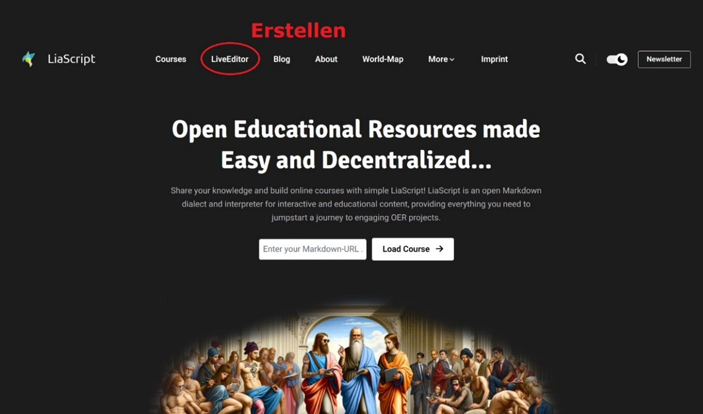
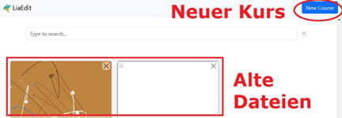
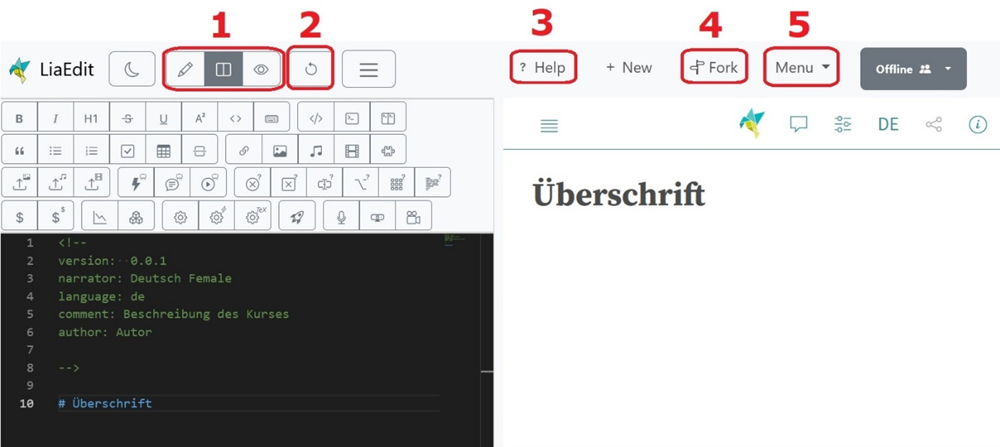

<!--
version: 0.0.1
language: de
narrator: Deutsch Female

persistent: true
edit: true

comment: Showcase
author: Martin Lommatzsch, André Dietrich, Sebastian Zug

-->


# "LiaScript in der Schule" - SchulLia - Eine Übersicht


LiaScipt ist eine Beschreibungssprache für Lehr-Lerninhalte, die an der TU Bergakademie Freiberg seit 2017 entwickelt und durch eine internationalen Community genutzt und erweitert wird. Das besondere daran ist, dass die Idee einer einfachen Syntax wie Markdown mit der Möglichkeit kombiniert wird, interaktive Elemente wie Quiz, Simulationen, Programmierumgebungen, Formeleditoren, Tabellenkalkulationen und vieles mehr einzubinden [Link](https://open-educational-resources.de/warum-braucht-offene-bildung-eine-eigene-sprache-warum-liascript/). Bislang werden diese Möglichkeiten aber eher in der universitären Lehre eingesetzt.

Ich, Martin Lommatzsch, bin Fachlehrer am Geschwister-Scholl-Gymnasium in Freiberg und nutze LiaScript intensiv in meinem Unterricht. Eine umfangreiche Aufgabensammlung, die natürlich beliebig genutzt, kopiert und angepasst werden darf, findet sich unter [https://mint-the-gap.github.io/Aufgabensammlung/].

Ich habe einen Link zu einer fächerbezogenen Demo vorbereitet, um das Potential der aktuellen Version aufzuzeigen: \

>[Link zur aktuellen LiaScript-Demonstration](https://liascript.github.io/course/?https://raw.githubusercontent.com/MINT-the-GAP/Wochenaufgabe/refs/heads/main/Sandkasten2026.md) [](https://liascript.github.io/course/?https://raw.githubusercontent.com/MINT-the-GAP/Wochenaufgabe/refs/heads/main/Sandkasten2026.md) 

> **ACHTUNG: DIE LADEZEIT IST BEIM ERSTEN MAL LÄNGER, DA DAS SCHRIFTERKENNUNGSMODUL EINMALIG GELADEN WERDEN MUSS.**
Dieser Link beinhaltet viele Beispiele von Möglichkeiten und auch eine kleine Übersicht über das Projekt.


Wir arbeiten in unserer Freizeit an der Weiterentwicklung von LiaScript (vorrangig: Martin Lommatzsch an den vorgefertigten Aufgabensets sowie Codepakete für die Schule, Dr. André Dietrich an der generellen Weiterentwicklung der Codebasis von LiaScript, Prof. Dr. Sebastian Zug am LLM-Assistenten). Wir wissen, dass wir aktuell noch nicht den Stand haben, den wir uns wünschen, aber wir kommen voran. \
Aktuelle Baustellen:

-	Integrierter URL-Shortener damit die Kurse leichter geteilt werden können

-	Automatische graphische Darstellung der Schrifterkennung für die Lösungseingabe

-	Automatische Aufgabengenerierung je nach Prompteingabenwunsch

-	Bessere automatische Einbettung über Drag&Drop von Inhalten

-	Verbesserung der intuitiven Nutzung

-	Rund 60 weitere offene Wunschvorstellungen


Ich freue mich über Rückmeldungen, Anregungen und Fragen. Kontaktieren Sie mich gern per Mail:\
`m.lommatzsch@gsg-freiberg.lernsax.de`

Viel Spaß damit!

Freiberg, Februar 2026

_PS: Vielen Dank bei den MitstreiterInnen aus der TU Bergakademie für die Unterstützung bei der Umsetzung!_


### Einfach selbst starten


1.	Gehe auf: https://liascript.github.io/ 


2.	Klicke auf LiveEditor



3.	Klicke auf „New Course“



4. Version 1: Tippe per Hand `lia-template-de` in den leeren Editor ein, klicke auf den angzeigten Vorschlag um einen Beispielkurs auf Deutsch automatisch generieren zu lassen.

4. Version 2: Füge Links im Editor folgenden Text ein:

```
<!--
version:  0.0.1
narrator: Deutsch Female
language: de
comment: Beschreibung des Kurses
author: Autorname
import: Hier können URLs von Paketen eingefügt werden
-->

# Überschrift
```


Nun kann begonnen werden.  \

Wichtige Buttons im LiveEditor: 



1.	Ansichtswechsel 

2.	Aktualisiert die Ansicht rechts aus dem Code links

3.	Öffnet die Dokumentation mit vielen Beispielen und Erklärungen

4.	Erstelle eine bearbeitbare Kopie für mich

5.	Gibt unter anderem über „data-URL“ einen Link zum Teilen für Lernende (Tipp: Verkürze die URL)

---

---

<h2>Minimalbeispiel mit Schrifterkennung</h2>

```
<!--
version:  0.0.1
import: https://raw.githubusercontent.com/liaTemplates/algebrite/master/README.md

import: https://raw.githubusercontent.com/MINT-the-GAP/Aufgabensammlung/main/README.md
-->

# Aufgabe 1: Bruchrechnung.

**Berechne** den Wert des Terms.

__$a)\;\;$__ $\frac{4}{5} + \frac{1}{4}$ = [[       21/20        ]]
@Algebrite.check(21/20)

@canvas

```


### Nützliche Links


**Aufgabensammlung Mathematik – PDF-Versionen:** \
• [https://wochenaufgaben.gsg-freiberg.de/](https://wochenaufgaben.gsg-freiberg.de/) 

**Aufgabensammlung Mathematik - LiaScript:** \
• [Aufgabensammlung](https://mint-the-gap.github.io/Aufgabensammlung/) (Über 700 Aufgaben) \
• [Repetitorium](https://liascript.github.io/course/?https://raw.githubusercontent.com/MINT-the-GAP/Aufgabensammlung/refs/heads/main/Repetitorium/00_Repetitorium.md) (Lehrwerk in der Entstehung)

**Einige Eingesetzte Vorbereitungsaufgaben** \
• [BLF Vorbereitung](https://liascript.github.io/course/?https://raw.githubusercontent.com/MINT-the-GAP/Aufgabensammlung/refs/heads/main/BLF_0001.md)  \
• [Probeklassenarbeit Mathematik Klasse 6 - Zuordnungen](https://liascript.github.io/nightly/?https://raw.githubusercontent.com/MINT-the-GAP/Wochenaufgabe/refs/heads/main/ProbeKAMathematik6_Zuordnung.md)  \
• [Probeklassenarbeit Mathematik Klasse 8 - Stochastik](https://liascript.github.io/course/?https://raw.githubusercontent.com/MINT-the-GAP/Wochenaufgabe/refs/heads/main/ProbeKA8Mathematik_Stochastik.md)  \
• [Probeleistungskontrolle Physik Klasse 10 - Wellen und Schwingungen](https://liascript.github.io/nightly/?https://raw.githubusercontent.com/MINT-the-GAP/Wochenaufgabe/refs/heads/main/ProbeLKPhysik10_Wellen.md) 

**Darstellungspakete für die Schule:** \
• [SchulLia - Pakete](https://liascript.github.io/nightly/?https://raw.githubusercontent.com/MINT-the-GAP/Aufgabensammlung/refs/heads/main/Showdummy.md) 

**Video für die LLM-Assistenten-Demo** \
• [YouTube Video](https://youtu.be/6VE-2vbKAE8?si=3vY4KxdPtepItFEE&t=306) 

**Deutschaufgaben-Demo** \
• [Digitale Unterrichtsversorgungsdemo - Deutsch](https://liascript.github.io/course/?https://raw.githubusercontent.com/MINT-the-GAP/Wochenaufgabe/refs/heads/main/5/Deutsch/Lia5_60.md) 


**Präsentationsfolien zu LiaScript** \
[Vollständige Präsentationsfolien](https://wochenaufgaben.gsg-freiberg.de/MINTtheGAP-PDF_2026_02_23.pdf)

