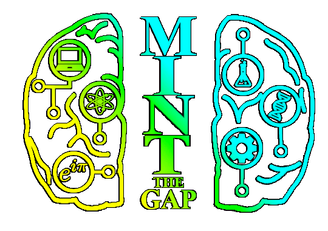
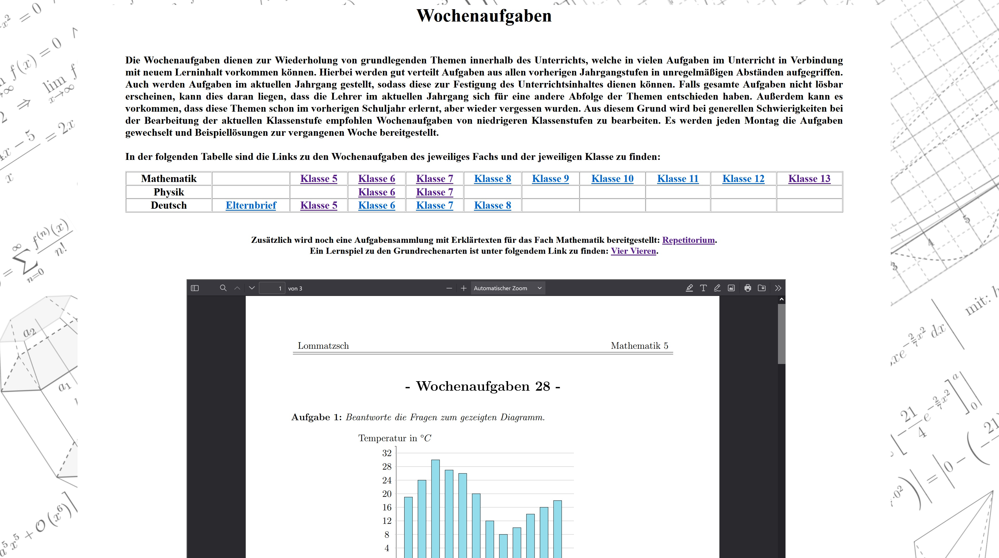
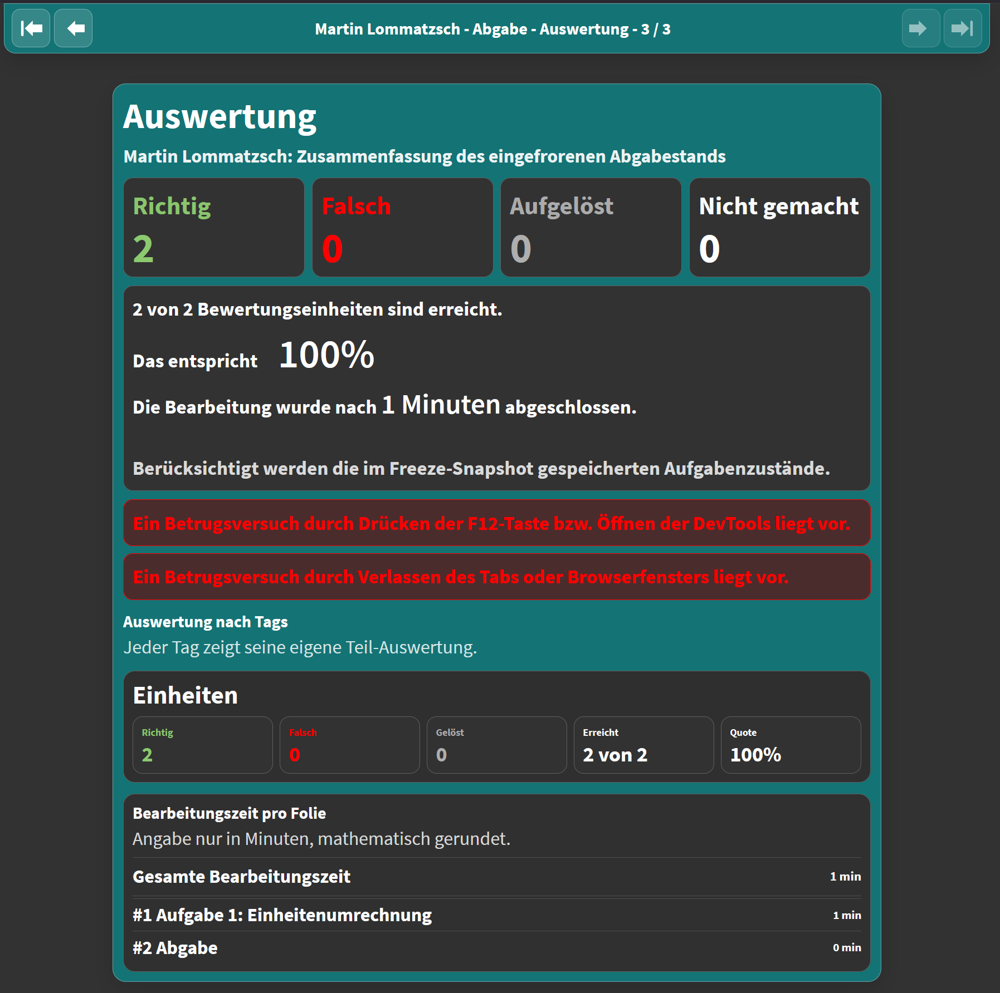

<!--
version:  0.0.2
language: de

narrator: Deutsch Female


tags: Vortrag
comment: 
author: Martin Lommatzsch, Sebastian Zug


import: https://cdn.jsdelivr.net/gh/LiaTemplates/algebrite@master/README.md
import: https://cdn.jsdelivr.net/gh/LiaTemplates/JSXGraph@main/README.md


import: https://raw.githubusercontent.com/MINT-the-GAP/lia-annotation/refs/heads/main/README.md
import: https://raw.githubusercontent.com/MINT-the-GAP/lia-board-mode/refs/heads/main/README.md
import: https://raw.githubusercontent.com/MINT-the-GAP/lia-marker/refs/heads/main/README.md
import: https://raw.githubusercontent.com/MINT-the-GAP/lia-DynFlex/refs/heads/main/README.md
import: https://raw.githubusercontent.com/MINT-the-GAP/lia-orthography/refs/heads/main/README.md
import: https://raw.githubusercontent.com/MINT-the-GAP/Aufgabensammlung/main/imports/NavigationREADME.md
import: https://raw.githubusercontent.com/MINT-the-GAP/lia-timer/refs/heads/main/README.md
import: https://raw.githubusercontent.com/MINT-the-GAP/lia-Mathe/refs/heads/main/README.md
import: https://raw.githubusercontent.com/MINT-the-GAP/Aufgabensammlung/main/imports/RedirecterREADME.md


import: https://raw.githubusercontent.com/MINT-the-GAP/lia-canvas-ocr/refs/heads/main/README.md
import: https://raw.githubusercontent.com/MINT-the-GAP/Aufgabensammlung/main/imports/KoordREADME.md


import: https://raw.githubusercontent.com/MINT-the-GAP/Aufgabensammlung/main/imports/FreezeREADME.md


import: https://raw.githubusercontent.com/liaTemplates/ABCjs/main/README.md
        https://raw.githubusercontent.com/LiaTemplates/Speech-Recognition-Quiz/refs/heads/main/README.md
        https://raw.githubusercontent.com/liaTemplates/AVR8js/main/README.md


persistent: true

edit: true


-->


# LiaScript in der Schule


---

---


<center>

> <h1>Herzlich Willkommen!</h1>
>
><h3> Vorstellung von LiaScript an der Schule, 10. Juni 2026</h3>

</center>


---

---


<section class="dynFlex" data-basis="32.5">

<div class="flex-child">



</div>
<div class="flex-child">

<center>

<h3> Prof. Dr. Sebastian Zug</h3> 
<small><small><small> Technische Universität Bergakademie Freiberg, Institut für Informatik </small></small></small>

<h3> und </h3> 

<h3> Martin Lommatzsch</h3>
<small><small><small> Geschwister-Scholl-Gymnasium Freiberg </small></small></small>

</center>

</div>
<div class="flex-child">


 erweitert um LiaScript Logo")
</div>

</section>

<center>

---

---

  $\;\qquad\;$
  $\;\qquad\;$
  $\;\qquad\;$
  $\;\qquad\;$
  $\;\qquad\;$
 

</center>


---

---


##  Intention hinter SchulLia


<section class="dynFlex" data-basis="49">


<div class="flex-child">


{{1}}
<h2> Beobachtungen als Lehrkraft </h2> 

{{2}}
<h3>   Vergessene Fachvokabeln </h3> 


{{3}}
<h3>  Vergessene Lösungsansätze und -strategien </h3> 


{{4}}
<h3>   eingerostete Algorithmen </h3> 


</div>


<div class="flex-child">


{{6}}



</div>

</section>


<section class="dynFlex" data-basis="49">


<div class="flex-child">


{{5}}
<h2> Lösungsansatz </h2> 

{{5}}
<h3>   Bereitstellung von Wiederholungsoptionen $\;\Rightarrow\;$ Idee der Wochenaufgaben </h3> 


</div>


<div class="flex-child">


{{6}}
<h3>   wochenaufgaben.gsg-freiberg.de </h3> 


{{7}}
<h3>   Über 6800 Seiten an Aufgaben mit Musterlösungen. </h3> 


{{7}}
<h3>   Repetitorium mit mehr als 1500 Seiten Erklärungen, Aufgaben und Lösungen. </h3> 


</div>

</section>


##  Problemanalyse


<section class="dynFlex" data-basis="49">


<div class="flex-child">


{{1}}
<h3>   PDFs bieten keine Interaktionsmöglichkeit. </h3> 


{{2}}
<h3>  keine Rückmeldung für die Lernenden. </h3> 

{{3}}
<h3>  keine Rückmeldung für die Lehrkräfte. </h3> 


{{4}}
<h3>  Entlastet im Unterricht nicht, da "Ist das richtig?"-Meldungen bleiben. </h3> 


</div>


<div class="flex-child">


{{5}}
<h3>  Es braucht interaktive digitale Aufgaben. </h3> 


</div>

</section>


##  Angebotsanalyse


{{1}}
<h2> Bekannte Anbieterprobleme </h2> 


<section class="dynFlex" data-basis="49">


<div class="flex-child">

{{1}}
<h3>   Proprietäre Anbieter </h3> 

{{3}}
<h3>   Es wird fast nur Anforderungsbereich 1 angeboten ("Gib an") </h3> 

{{5}}
<h3>   Beschränkung aufs Angebot durch Vorgabe des Unternehmens </h3> 

{{7}}
<h3>   Repetitiver Inhalt </h3> 

{{9}}
<h3>   Stellenweise müssen Antworten in einem speziellen Syntax eingegeben werden</h3> 


{{11}}
<h3>   Flipped-Classroom-Prinzip </h3> 


</div>


<div class="flex-child">

{{2}}
<h3> $\Rightarrow\;$  Bildung sollte kostenlos sein. </h3> 

{{4}}
<h3> $\Rightarrow\;$  Rechenwege, Erklären, Zeichen, Vernetzen, usw. und nicht nur üben. </h3> 

{{6}}
<h3> $\Rightarrow\;$  Unterricht muss auf Lerngruppe abgestimmt sein. </h3> 

{{8}}
<h3> $\Rightarrow\;$  Auswendige Ergebiseingaben statt denken. </h3> 

{{10}}
<h3> $\Rightarrow\;$  Es sollte das Fach und nicht das Programm unterrichtet werden. </h3> 

{{12}}
<h3> $\Rightarrow\;$  Keine Entlastung im Unterricht und Verstärkung der Herkunftsungleichheit. </h3> 


</div>

</section>


##  Bedarfe in der Schule {1}{und Lösungen} 


<section class="dynFlex" data-basis="49">


<div class="flex-child">

{{2}}
> <h3>   Bring-Your-Own-Device-Tauglichkeit </h3> 


{{3}}
<h3>LiaScript ist Open Education Resource und somit kostenlos </h3> 

{{4}}
<h3>LiaScript braucht keine Installation </h3> 

{{5}}
<h3>LiaScript ist DSGVO konform </h3> 


</div>


<div class="flex-child">


{{6}}
> <h3>   Dezentrale Klassengruppen </h3> 


{{7}}
<h3>LiaScript wird dezentral im eigenen Browser realisiert. </h3> 

{{8}}
<h3>Wurde ein Kurs einmal geladen ist alles offline abrufbar. </h3> 


</div>

</section>


##  Bedarfe in der Schule  {0}{und Lösungen} 


<section class="dynFlex" data-basis="49">


<div class="flex-child">

{{1}}
> <h3>  Mathematische Schrifterkennung </h3> 

{{2}}
<h3>LiaScript erkennt über den Browser mathematische Verschriftlichung. </h3> 

{{3}}
<h3>$\Rightarrow\;\;$ Es muss kein Eingabesyntax erlernt werden. </h3> 

{{4}}
---

{{4}}
Bespiel: **Gib** den Bruch $\dfrac{23}{35}$ **an**.
[[  23/35  ]] @canvas
@Algebrite.check(23/35)


</div>


<div class="flex-child">

{{5}}
> <h3>  Eingebettes Computer-Algebra-System </h3> 

{{6}}
<h3>LiaScript verfügt über ein CAS. </h3> 

{{7}}
---

{{7}}
Bespiel 1: **Gib** den Bruch $\dfrac{3}{5}$ als ein beliebiges Vielfaches **an**.
[[  3/5  ]] @canvas
@Algebrite.check(3/5)


{{7}}
---

{{7}}
Bespiel 2: **Gib** den Term $x^2-2x+1$ in einer beliebigen Umformung in das Lösungsfeld **ein**.
[[  x ^ 2 - 2 * x + 1  ]]
@Algebrite.check(x^2-2*x+1)


</div>

</section>


##  Bedarfe in der Schule  {0}{und Lösungen} 


<section class="dynFlex" data-basis="49">


<div class="flex-child">

{{1}}
> <h3>  Intuitiver Umgang ohne Syntax-Schulungen </h3> 

</div>

<div class="flex-child">


{{2}}
> <h3>  Bildschirm als echter Ersatz für das Papier </h3> 

</div>

</section>


<section class="dynFlex" data-basis="49">


<div class="flex-child">

{{3}}
**************************
@Koordinatensystem(`xmin=-7;xmax=7;ymin=-5;ymax=5;width=800;id=A9`)

@AchsenBeschriftung(`id=A9;xlabel=$x$;ylabel=$y$`)

@Regression(`A9`)
**************************


</div>

<div class="flex-child">


{{4}}
**************************
__$a)\;\;$__ **Gib** den Funktionsterm **an**, um den Graphen darstellen zulassen.

@PlotEingabeLatex(`A9;g;#b41f65`)
**************************


{{5}}
---


{{5}}
---

{{5}}
__$b)\;\;$__ **Zeichne** drei beliebe Punkte in das Koordinatensystem **ein** und **führe** die Regression **durch**.


{{6}}
---


{{6}}
---

{{6}}
**************************
__$c)\;\;$__ Rekonstruiere oder zeichne die Funktion $f(x) = 2x -1$.

<!--   data-solution-button="2" -->
@Rekonstruktion(`A9;2x-1;0.1`)
**************************

</div>

</section>

---

---

{{7}}
> <h3>  Hochwertige individualisierbare Aufgabengenerierung </h3> 


{{8}}
<h3>  Aufgabensammlung ist in der Entstehung: mint-the-gap.github.io/Aufgabensammlung/ </h3> 


{{9}}
<h3>   Automatisierte Zusammenstellung und Generierung in der Bearbeitung </h3> 


##  Bedarfe in der Schule  {0}{und Lösungen} 


<section class="dynFlex" data-basis="49">


<div class="flex-child">

{{1}}
> <h3>  Rückmeldung für den Lernenden um den individuellen Lernpfad anzupassen </h3> 

{{2}}
??[Freeze](https://liascript.github.io/nightly/?https://raw.githubusercontent.com/MINT-the-GAP/Wochenaufgabe/refs/heads/main/Zeug/VortragBPSA.md)

</div>

<div class="flex-child">


{{3}}
> <h3>  Statistische Analyse der Lerngruppe für die Lehrkraft um den Unterricht anzupassen </h3>


{{4}}
<!-- style="max-width:750px" -->



</div>

</section>


##  Beispielhafte Einblicke in andere Fachbereiche 


<section class="dynFlex" data-basis="49">

<div class="flex-child">


{{1}}
****************************
> <h3> Musik </h3>

__Aufgabe 1:__ Klicke auf die beiden Noten und gib die Kadenz an.

``` abc  @ABCJS.render
X: 1
L: 1/2
K: C
[|\
G  C:|
```

Kadenz: [[  Quinte  ]]
****************************

</div>

<div class="flex-child">


{{2}}
****************************
> <h3> Fremsprachen </h3>


@SpeechRecognition.support


__$a)\;\;$__ Sprich 'Danke' auf französisch.

<!-- data-solution-button="off" -->
[[!]]
@SpeechRecognition(fr-FR,`Merci`)


---

---


__$b)\;\;$__ Sprich 'Danke' auf spanisch.

<!-- data-solution-button="off" -->
[[!]]
@SpeechRecognition(es-ES,`Gracias`)

****************************


</div>

<div class="flex-child">


{{3}}
****************************
> <h3> Deutsch</h3>


__$a)\;\;$__ **Hör** dir den Satz gut **an** und **schreibe** ihn korrekt nieder.


<!-- data-solution-timer="600s" data-solution-timer-start="oncheck" data-solution-timer-badge="off" -->
@diktat(`Die Katze schläft.`)


---

---


__$b)\;\;$__  **Markiere** das Subjekt.

<div class="markerquiz">
Am Morgen @mark(die Kinder) spielen auf dem Schulhof.

<!-- data-solution-timer="600s" data-solution-timer-start="oncheck" data-solution-timer-badge="off" -->
@TextmarkerQuiz
</div>

****************************


</div>

<div class="flex-child">


{{4}}
****************************
> <h3> Differenzierungshilfe </h3>


<!-- style="max-width:400px" -->


{{|>}} Und man kann jeden Text vorlesen lassen.

****************************

</div>

</section>


{{5}}
> <h3>  Es gibt noch viele weitere verschiedene Arten von möglichen Aufgabenstellungen.  </h3>


##  Ausblick


<section class="dynFlex" data-basis="49">

<div class="flex-child">

{{1}}
> <h3>  Bedienung für Lehrkräfte extrem vereinfachen </h3>

{{2}}
> <h3>  Erweiterung der Rückmeldeoptionen </h3>

{{3}}
> <h3>  Weitere Aufgabentypen erschließen </h3>

</div>

<div class="flex-child">


{{4}}
> <h3>  Ausbau der Classroom-Funktion </h3>

{{5}}
> <h3>  Integration in Systeme wie LernSax, Opal, usw. </h3>

{{6}}
> <h3>  Stetige iterative Verbesserung der bestehenden Angebote </h3>


</div>


</section>


---

---

{{7}}
<center>

> <h1> Vielen Dank für die Aufmerksamkeit. </h1>
>
> {8}{<h1> Haben Sie Fragen? </h1>}

</center>


{{7}}
<center>

---

---

  $\;\Longleftrightarrow\;$
  $\;\Longleftrightarrow\;$
  $\;\Longleftrightarrow\;$
  $\;\Longleftrightarrow\;$
  $\;\Longleftrightarrow\;$
  

</center>


---

---