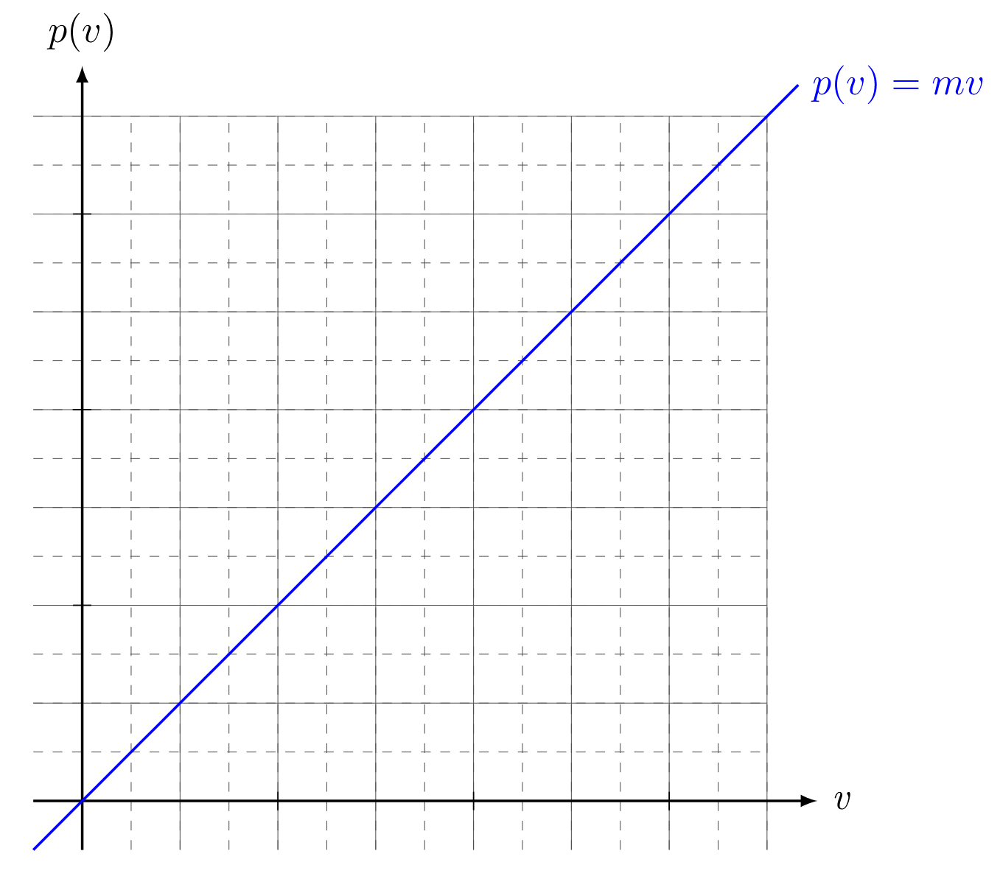
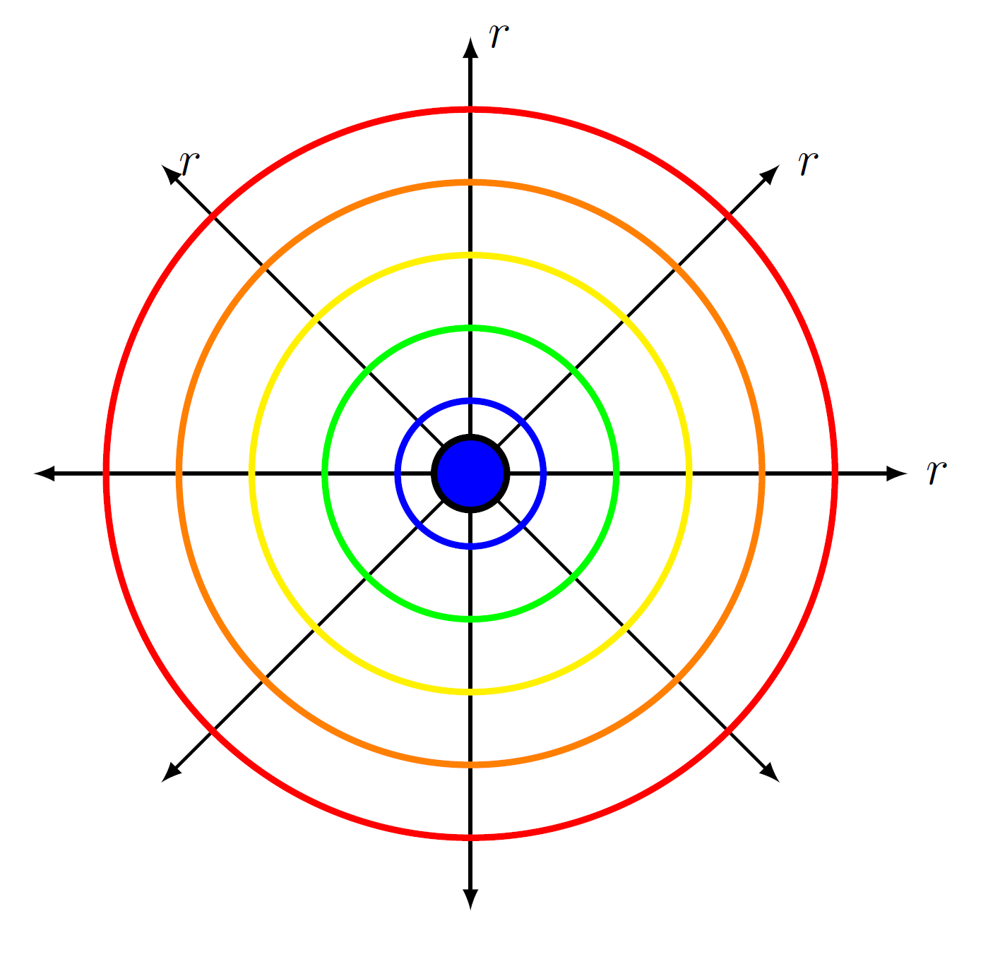
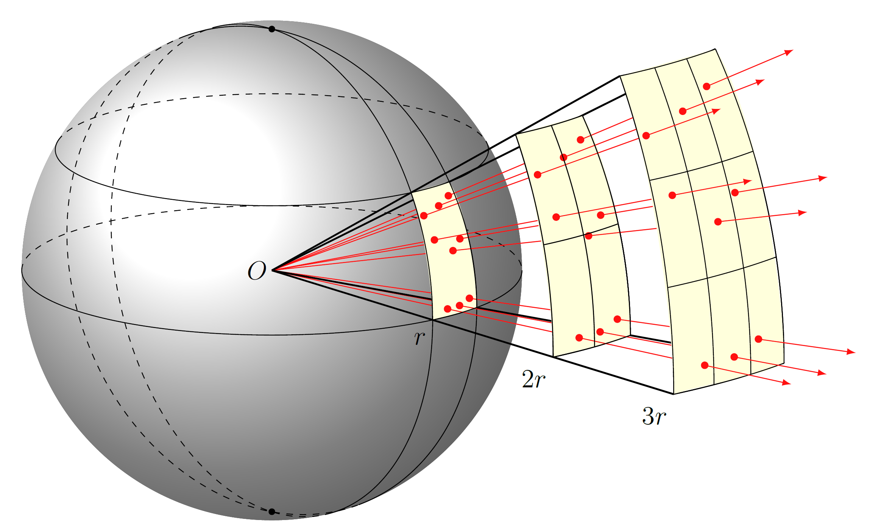
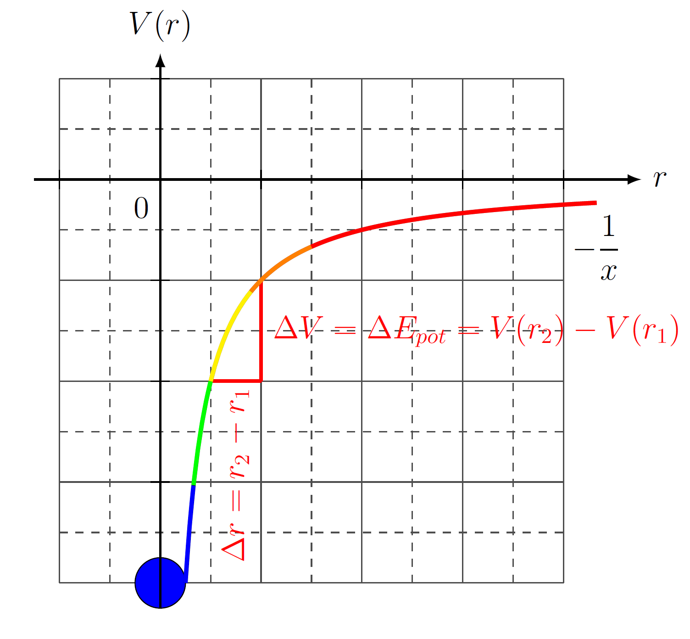
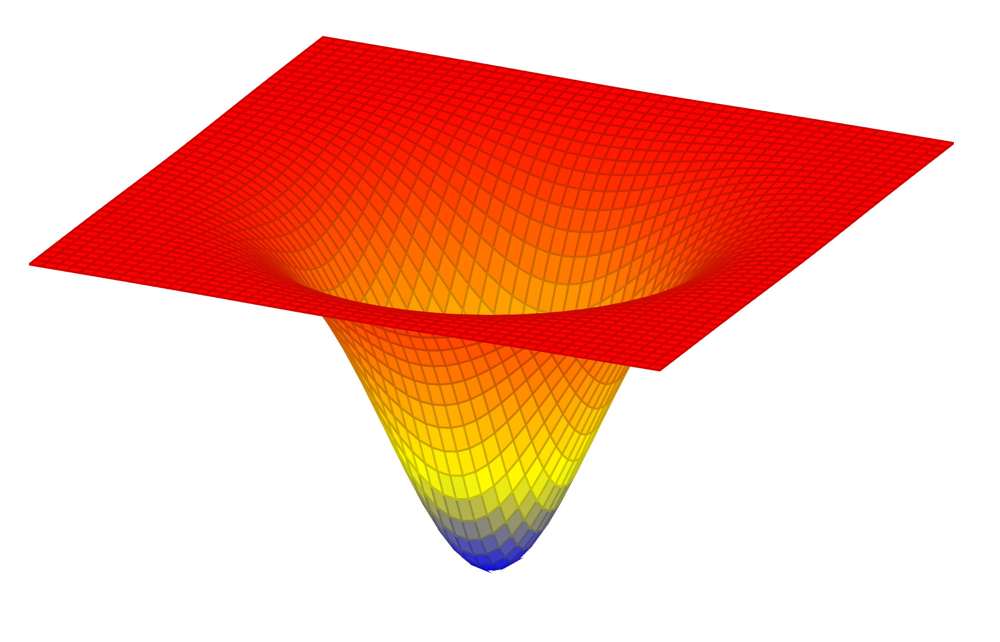

<!--
version:  0.0.1

narrator: Deutsch Female

language: de

@style
input {
    text-align: center;
}

.flex-container {
    display: flex;
    flex-wrap: wrap;
    align-items: stretch;
    gap: 20px;
}

.flex-child {
    flex: 1;
    min-width: 350px;
    margin-right: 20px;
}

@media (max-width: 400px) {
    .flex-child {
        flex: 100%;
        margin-right: 0;
    }
}

@end

formula: \carry   \textcolor{red}{\scriptsize #1}
formula: \digit   \rlap{\carry{#1}}\phantom{#2}#2
formula: \permil  \text{‰}

import: https://raw.githubusercontent.com/liaTemplates/algebrite/master/README.md
import: https://raw.githubusercontent.com/LiaTemplates/Tikz-Jax/main/README.md
import: https://raw.githubusercontent.com/LiaTemplates/mermaid_template/0.1.4/README.md
import: https://raw.githubusercontent.com/LiaTemplates/JSXGraph/0.0.1/README.md

script: https://cdn.jsdelivr.net/gh/LiaTemplates/Tikz-Jax@main/dist/index.js

tags: Profil, NaWi

comment: Der Profilunterricht Klasse 10 ist hier komplett aufgezeichnet. 

author: Martin Lommatzsch

-->

# Naturwissenschaftliches Profil Klasse 10 - Modellierung der Natur

> Letztes Update am 10.08.2025 gegen 18:00 Uhr

In diesem LiaScript findest du eine gesamte Zusammenfassung des Profilunterrichts der Klasse 10. Auch findest du hier Aufgaben und Lösungen zu den Aufgaben. Die Datei wird ständig aktualisiert.

## Naturwissenschaftliches Arbeiten in der Schule

{{0}}
__Aufgabe 1:__ **Beschreibe** den allgemeinen grundlegenden Ablauf deines vorherigen Unterrichts in den Fächern: Mathematik, Physik, Chemie, Biologie und dem naturwissenschaftlichen Profil. (Tipps: Was läuft in jedem Fach quasi gleich ab? Wie erarbeitet man neue Dinge im Unterricht?) \
 

{{1}}
__Aufgabe 2:__ **Begründe**, warum dieser Ablauf aus dem Unterricht nichts mit der wissenschaftlichen Realität zu tun haben kann. \
 

{{2}}
__Aufgabe 3:__ **Recherchiere** im Internet zu den folgenden Personen und beschreib, warum sie berühmt wurden.

{{2}}
<!-- data-type="none" data-sortable="false" -->
|             |             |             |
| Leonhard Euler| William Thomson Baron Kelvin | Bernhard Riemann | 
| Augustin-Louis Cauchy  | James Clerk Maxwell | Ludwig Boltzmann |
| Hendrik Antoon Lorentz  | Henri Poincaré | Max Planck |
| Emmy Noether  | Wolfgang Pauli | Enrico Fermi |
| Paul Dirac  | Richard Feynman | Steven Weinberg |

 

{{3}}
__Aufgabe 4:__ **Erörtere** mögliche Antworten auf die Frage: "Warum sind diese Personen nicht so berühmt, wie sie es sein sollten?"

## Naturwissenschaftliches Arbeiten in der Wissenschaft

{{|>}} In der schulischen Praxis naturwissenschaftlicher Fächer wird der Erkenntnisprozess häufig in der Reihenfolge „Experiment – Beobachtung – Theorie“ vermittelt. Zunächst werden einfache Versuche durchgeführt, an die sich eine gemeinsame Auswertung und anschließend die theoretische Erklärung anschließt. Diese didaktische Abfolge erleichtert das Verständnis, weil Beobachtungen zuerst sinnlich erfahrbar gemacht werden und abstrakte Modelle danach darauf aufbauen. In der wissenschaftlichen Forschung stellt sich die Reihenfolge jedoch in der Regel umgekehrt dar: Ausgangspunkt sind theoretische Überlegungen, Modelle und Berechnungen, denen erst in einem zweiten Schritt Experimente folgen.

{{|>}} Die Ursachen für diese Reihenfolge sind vielfältig. Zunächst ist der ökonomische Aspekt entscheidend. Moderne wissenschaftliche Experimente sind aufwendig und kostspielig. Forschungsanlagen wie der Large Hadron Collider am CERN in Genf erfordern Bau- und Betriebskosten in Milliardenhöhe. Der Einsatz solcher Ressourcen erfolgt nicht in einem offenen, ergebnislosen „Ausprobieren“, sondern wird erst dann unternommen, wenn theoretische Modelle konkrete Vorhersagen ermöglichen. Diese theoretischen Vorhersagen reduzieren das Risiko, dass ein Versuch ohne wissenschaftlichen Erkenntnisgewinn durchgeführt wird, und geben die Richtung für die Gestaltung und den Umfang eines Experiments vor.

{{|>}} Ein zweiter Grund liegt in der Komplexität naturwissenschaftlicher Fragestellungen. Ohne theoretischen Rahmen wäre die Vielzahl möglicher Beobachtungen kaum sinnvoll zu ordnen. Modelle und Hypothesen legen fest, welche Messgrößen relevant sind, welche Genauigkeiten notwendig sind und welche Daten einen Unterschied machen. Sie helfen, aus der Vielzahl der möglichen Phänomene die für die Fragestellung entscheidenden Aspekte auszuwählen. Experimente ohne eine solche theoretische Orientierung könnten zwar Beobachtungen liefern, würden aber kaum über Zufallsfunde hinausführen.

{{|>}} In der Praxis der Forschung folgt aus dieser Überlegung ein klarer Ablauf: Zunächst werden mathematische Modelle entwickelt und mit Hilfe von Simulationen überprüft. Daraus entstehen Hypothesen, die präzise Vorhersagen machen. Erst wenn diese Vorhersagen vorliegen, werden Versuchsaufbauten konzipiert, um die Hypothesen zu überprüfen. Die Durchführung der Experimente dient also vor allem der Bestätigung, der Präzisierung oder auch der Widerlegung vorher aufgestellter theoretischer Modelle.

{{|>}} Beispiele aus der Physik, der Astronomie oder der Medizin verdeutlichen diese Abfolge. So gingen der Messung der Lichtablenkung bei einer Sonnenfinsternis im Jahr 1919 theoretische Arbeiten von Albert Einstein aus dem Jahr 1915 voraus. Auch bei der Entwicklung neuer Medikamente stehen zunächst theoretische Untersuchungen und Computersimulationen am Anfang, bevor die eigentlichen Laborexperimente folgen. In der Teilchenphysik am CERN werden jahrzehntelange theoretische Arbeiten zusammengeführt, um anschließend Experimente zu entwerfen, die genau auf diese Vorhersagen zugeschnitten sind.

{{|>}} Der Gegensatz zu den Abläufen im Unterricht entsteht aus didaktischen Gründen. In der Schule werden die Experimente bewusst an den Anfang gestellt, um Lernprozesse anschaulicher zu machen. Experimente im Unterricht sind vergleichsweise einfach, kostengünstig und leicht zu wiederholen. Sie lassen sich gefahrlos durchführen und geben den Lernenden die Möglichkeit, sich aktiv einzubringen. Die eigentliche Erkenntnislogik der Wissenschaft wird dadurch allerdings verzerrt, denn in der realen Forschung sind Experimente in der Regel Ergebnis einer längeren theoretischen Vorarbeit.

{{|>}} Die ökonomischen Rahmenbedingungen spielen dabei eine große Rolle. Während schulische Experimente meist nur einfache Geräte oder Materialien erfordern, sind in der modernen Forschung viele Versuchsaufbauten hochspezialisiert und mit erheblichen Kosten verbunden. Große Beschleunigeranlagen, Teleskope oder Raumsonden werden über Jahre geplant und bauen vollständig auf den theoretischen Erwartungen auf, die zuvor entwickelt wurden. Selbst in kleineren Laboren wird vor der Durchführung einer Versuchsreihe genau kalkuliert, ob die benötigten Materialien, Geräte und die aufgewendete Arbeitszeit gerechtfertigt sind.

{{|>}} Darüber hinaus erfüllt Theorie eine wichtige Filterfunktion. Sie reduziert den Aufwand, indem sie den Blick auf das Wesentliche lenkt. Ohne diese theoretische Vorarbeit wäre es kaum möglich, die Fülle an möglichen Beobachtungen zu strukturieren. Theorie und Experiment stehen dabei nicht in einem Gegensatz, sondern bilden eine enge Wechselwirkung: Theorie erzeugt Hypothesen, Experimente überprüfen diese, und die Ergebnisse führen zu neuen theoretischen Überlegungen.

{{|>}} Die unterschiedliche Reihenfolge in Schule und Forschung ist somit Ausdruck zweier verschiedener Logiken. Die schulische Didaktik orientiert sich daran, Inhalte anschaulich und nachvollziehbar zu gestalten, während die Wissenschaft unter realen Bedingungen gezwungen ist, ihre Arbeitsschritte so zu planen, dass Ressourcen sinnvoll eingesetzt werden. Der im Unterricht oft gewählte Weg „erst Experiment, dann Theorie“ entspricht also nicht dem realen Ablauf wissenschaftlicher Arbeit, ist aber für den Lernprozess eine bewusst gewählte Vereinfachung.

# Theoretische Physik

{{|>}} Die theoretische Physik beschäftigt sich nicht in erster Linie mit Messungen, sondern mit der Entwicklung von Modellen, die grundlegende Strukturen und Gesetzmäßigkeiten der Natur beschreiben. Ausgangspunkt ist meist ein beobachtetes Phänomen oder ein bereits bekanntes Gesetz. Daraus werden Annahmen formuliert, aus denen sich mit Hilfe der Mathematik Gleichungen herleiten lassen. Diese Gleichungen stellen eine idealisierte Beschreibung der Wirklichkeit dar. Sie enthalten nicht nur bekannte Zusammenhänge, sondern erlauben es, aus wenigen Grundprinzipien eine Vielzahl von Folgerungen logisch abzuleiten.

{{|>}} Zentral ist dabei die Arbeit mit Abstraktionen. Anstatt mit konkreten Zahlen zu beginnen, arbeitet die theoretische Physik zunächst mit Symbolen, Variablen und Strukturen. Die Form der Gleichung ist wichtiger als ein einzelner Zahlenwert, denn sie legt fest, wie Größen zueinander in Beziehung stehen. Zahlenwerte treten erst dann in Erscheinung, wenn die Theorie durch Experimente überprüft oder mit konkreten Randbedingungen verbunden wird.

{{|>}} Die theoretische Physik versteht sich damit als gedanklicher Rahmen, der Orientierung bietet. Sie versucht, ein konsistentes Bild zu schaffen, das verschiedene Phänomene miteinander verknüpft und Widersprüche in den Beobachtungen auflöst. Nicht selten liefern ihre Modelle Vorhersagen für Effekte, die zu einem bestimmten Zeitpunkt noch gar nicht gemessen werden können. Erst in einem späteren Schritt werden Experimente entwickelt, um diese Vorhersagen zu überprüfen.

{{|>}} Die Arbeit der theoretischen Physik besteht also darin, Hypothesen zu formulieren, mathematisch präzise Modelle zu entwickeln, diese zu interpretieren und die Konsequenzen zu durchdenken. Erst wenn ein Modell Bestand hat, wird es zur Grundlage für weitere Forschung – sowohl theoretisch als auch experimentell.

## Nutzen von Analogien

{{|>}} Ein wesentliches Werkzeug in der Physik besteht darin, Analogien zwischen unterschiedlichen Bereichen zu erkennen und zu nutzen. Wenn sich in zwei verschiedenen Themengebieten ähnliche mathematische Strukturen zeigen, können Erkenntnisse aus dem einen Gebiet auf das andere übertragen werden. Auf diese Weise wird Wissen nicht nur auf einen Einzelfall beschränkt, sondern gewinnt an Allgemeinheit.

{{|>}} Ein einfaches Beispiel liefert die Bewegung bei konstanter Geschwindigkeit. Die Grundgleichung lautet

$$ x=v \cdot t $$

{{|>}} und beschreibt, dass der zurückgelegte Weg $x$ direkt proportional zur Zeit $t$ ist, wenn die Geschwindigkeit $v$ konstant bleibt. Diese Beziehung bedeutet: Verdoppelt sich die Zeit, so verdoppelt sich auch der Weg. In einem Diagramm ergibt das eine gerade Linie.

{{|>}} Eine sehr ähnliche mathematische Struktur findet sich in der Elektrizitätslehre bei der Definition der Stromstärke:

$$ Q=I \cdot t $$

{{|>}} Hier bezeichnet $Q$ die transportierte elektrische Ladung, $I$ die Stromstärke und $t$ die Zeit. Auch hier gilt: Bei konstantem $I$ wächst die transportierte Ladung linear mit der Zeit.

{{|>}} Diese beiden Gleichungen sind formal gleich aufgebaut. Der Weg $x$ spielt dabei die Rolle der elektrischen Ladung $Q$, und die Geschwindigkeit $v$ entspricht der Stromstärke $I$. Aus dieser Analogie folgt, dass viele Überlegungen, die für Bewegungen gelten, auch für den Stromtransport gelten: Ein größerer Strom „befördert“ in gleicher Zeit mehr Ladung, genauso wie eine größere Geschwindigkeit in gleicher Zeit mehr Strecke zurücklegt. Diagramme, die $x$ gegen $t$ oder $Q$ gegen $t$ darstellen, sehen nahezu identisch aus.

{{|>}} Solche Analogien sind nicht nur ein Hilfsmittel für das Verständnis, sondern können auch zur Vorhersage dienen. Wer die eine Struktur verstanden hat, kann sofort Aussagen über die andere machen, ohne diese erneut von Grund auf entwickeln zu müssen. Durch das Erkennen solcher Parallelen wird die Vielfalt der physikalischen Erscheinungen auf gemeinsame Prinzipien zurückgeführt, und Zusammenhänge werden klarer. Die Fähigkeit, Analogien zu erkennen, gehört daher zu den zentralen Denkweisen der Physik.

## Energieerhaltung

{{|>}} Die potentielle Energie $E_{pot}$ ist eine physikalische Größe bei der Kraft $F$ über eine gewisse Strecke $x$ angewendet wurde. Wenn sich eine Energie $E$ ändert, dann wird sogenannte Arbeit $W$ verrichtet. Die Energie $E$ ist dabei eine Größe, die einen Zustand zu einem einzigen Zeitpunkt beschreibt - eine sogenannte Zustandsgröße - auch als Observable bezeichnet. Jede Observable ist messbar, während eine Prozessgröße niemals messbar ist. Die Arbeit ist zum Beispiel so eine Prozessgröße, da sie den Unterschied zwischen zwei Zuständen von Energiezuständen beschreibt. Dabei ist jedoch nicht klar, ob die Arbeit gleichmäßig oder vollkommen willkürlich verrichtet wird. Zur ersten Vereinfachung wird erstmal angenommen, dass die Arbeit gleichmäßig verrichtet wird. Auf die Arbeit $W$ wird später noch genauer eingegangen. Da die Gravitation die für uns maßgebliche Kraft $F_{G} = m \cdot g$ ist und sie stets nach unten wirkt, kann die Strecke $x$ auch mit der Höhe $h$ gleich gesetzt werden.

$$
\begin{align*} 
E_{pot} & = \textcolor{red}{F} \cdot \textcolor{green}{x} \\
\Rightarrow E_{pot,G} & = \textcolor{red}{-m \cdot g}\cdot \textcolor{green}{h}
\end{align*}
$$

{{|>}} Während dessen ist die kinetische Energie $E_{kin}$ ebenso die Kraft $F$, die über eine Strecke $x$ wirkt. Hierbei wird nicht die explizite Beispielkraft verwendet, sondern das zweite Newton'sche Axiom: $F=m \cdot a$. Da es sich also um eine beschleunigte Bewegung handelt wird auch diese Bahnkurvengleichung verwendet.

 

{{1}}
__Aufgabe 1:__ **Leite** den allgemeinen mathematischen Ausdruck der kinetischen Energie $E_{kin}$ aus dem zweiten Newton'schen Axiom und einer beschleunigten Bewegungsgleichung über die Gleichung der Energie für konstante Kräfte her. \
 

{{2}}

$$
\begin{align*} 
E_{kin} & = \textcolor{red}{F} \cdot \textcolor{green}{x} \qquad \text{mit: } \textcolor{green}{x = \frac{1}{2}\cdot a\cdot t^2}  \\
& = \textcolor{red}{m\cdot a} \cdot \textcolor{green}{\frac{1}{2}\cdot a\cdot t^2} \\
& = \frac{1}{2}\cdot m\cdot (a\cdot t)^2 \qquad \text{mit: } v = a\cdot t \\
& = \frac{1}{2}\cdot m (\textcolor{cyan}{a \cdot t})^2 \qquad \text{mit: } v = \textcolor{cyan}{a\cdot t} \\
\Rightarrow E_{kin} & = \frac{1}{2}\cdot m\cdot v^2
\end{align*}
$$

{{3}}
> {{|>}} Die Energie $E$ ist eine Erhaltungsgröße. Das bedeutet, dass die Gesamtenergie in einem System bevor etwas passiert und nachdem etwas passiert ist stets gleich groß sein muss.

{{3}}
> $$
\begin{align*} 
\underbrace{E_{kin} + E_{pot}}_{\text{vorher}} & = \underbrace{E'_{kin} + E'_{pot}}_{\text{nachher}}
\end{align*}
$$

{{3}}
> {{|>}} Energie $E$ kann niemals verbraucht, erzeugt, produziert, verschwendet, erneuert oder ähnliches werden. Energie $E$ kann lediglich in andere Energieformen umgewandelt werden, was durch Arbeit $W$ passiert.

## Der Impuls $\vec{p}$

{{|>}} In vielen Situationen wirken Kräfte nicht gleichmäßig, sondern verändern sich mit der Zeit. Ein Beispiel sind Stöße oder Explosionen, bei denen innerhalb sehr kurzer Zeit große Kräfte auftreten, die sich ständig ändern. In solchen Fällen reicht es nicht aus, nur mit der Geschwindigkeit zu arbeiten. Um diese Vorgänge besser zu beschreiben, wird der physikalische Begriff des Impulses $\vec{p}$ eingeführt. Der Impuls $\vec{p}$ fasst die Wirkung einer Kraft über die gesamte Zeit ihres Einwirkens zusammen. Er ermöglicht es, auch bei schnell wechselnden oder sehr kurzzeitigen Kräften den Bewegungszustand von Körpern zu berechnen und Vorhersagen zu treffen.

{{|>}} Der Impuls ist wie die Geschwindigkeit $\vec{v}$ oder die Kraft $\vec{F}$ eine vektorielle Größe. Der Impuls $\vec{p}$ ist also eine Richtungsgröße und besitzt somit einen Betrag $|\vec{p}|$ - also einen Wert, der seine Stärke beschreibt - und eine Orientierung. Zur Vereinfachung wird zunächst die Orientierung weggelassen und die Schreibweise verkürzt: $|\vec{a}|=a$

$$
\begin{align*} 
\vec{p} & = \vec{F} \cdot t  \\
\text{Vereinfachung:} \;\;\;\; p & = F \cdot t
\end{align*}
$$

{{1}}
__Aufgabe 1:__ **Leite** einen Ausdruck des Impulses her, indem die Geschwindigkeit $v$ vorkommt. \
 

{{2}}
$$
\begin{align*} 
p & = \textcolor{red}{F} \cdot \textcolor{green}{t} \qquad \text{mit: } \textcolor{red}{F = m \cdot a}  \\
& = \textcolor{red}{m\cdot a} \cdot \textcolor{green}{t} \\
& = m\cdot \textcolor{cyan}{a \cdot  t}  \qquad \text{mit: } v = \textcolor{cyan}{a\cdot t}  \\
& = m \cdot \textcolor{cyan}{v} \\
\end{align*}
$$

{{1}}
__Aufgabe 2:__ **Interpretiere** die Gleichung $F = \dfrac{p}{t}$ und entwickle aus dieser Interpretation eine neue Beschreibung in Form eines Wortes für die Kraft $F$. \
 

{{2}}
{{|>}} Die Gleichung weist eine Analogie zur Geschwindigkeitsgleichung $v = \dfrac{x}{t}$ beziehungsweise zur Stromstärke $I = \dfrac{Q}{t}$ auf. Somit kann die Kraft auch als Impulsstrom bezeichnet werden.

 

{{3}}
> {{|>}} Der Impuls $\vec{p}$ ist eine Erhaltungsgröße. Das bedeutet, dass der Gesamtimpuls in einem System bevor etwas passiert und nachdem etwas passiert ist stets gleich groß sein muss.

{{3}}
> $$
\begin{align*} 
\underbrace{\vec{p}_1 + \vec{p}_2}_{\text{vorher}} & = \underbrace{\vec{p}'_1 + \vec{p}'_2}_{\text{nachher}}
\end{align*}
$$

{{3}}
> {{|>}} Impuls $\vec{p}$ kann niemals verbraucht, erzeugt, produziert, verschwendet, erneuert oder ähnliches werden. Impuls $\vec{p}$ kann lediglich in andere Teilimpulse zerglegt werden, was durch Kärfte $F$ passiert. Da der Impuls eine vektorielle Größe ist, muss auch immer die Orientierung mit erhalten bleiben.

 

## Superposition

{{|>}} Das Superpositionsprinzip beschreibt die Überlagerung mehrerer Wirkungen, die unabhängig voneinander betrachtet und anschließend vektoriell addiert werden können. Dieses Prinzip gilt nicht nur für Kräfte und Geschwindigkeiten, sondern ebenso für den Impuls.

{{|>}} Wird ein Impulsvektor (in der Abbildung $\vec{c}$) in mehrere Komponenten zerlegt, beispielsweise in eine horizontale (in der Abbildung $\vec{a}$) und eine vertikale (in der Abbildung $\vec{b}$) Richtung, so beeinflussen sich diese Komponenten nicht gegenseitig. Eine Änderung des Impulses in einer Richtung hat keinen Einfluss auf die orthogonale Komponente. Dadurch lassen sich komplexe Bewegungsabläufe in Teilprobleme zerlegen, die separat untersucht werden können.

<!-- style="width:400px" -->

{{|>}} Wirken mehrere Kräfte gleichzeitig auf einen Körper, so kann jede Kraft eine eigene Impulsänderung hervorrufen. Nach dem Superpositionsprinzip ergibt sich die gesamte Impulsänderung aus der vektoriellen Summe der einzelnen Impulsänderungen. Diese Überlagerung gilt unabhängig davon, ob die Kräfte zeitgleich oder nacheinander wirken, solange die einzelnen Beiträge korrekt erfasst werden. Die Beträge ergeben sich in der Interpretation aus der Länge der Vektoren.

 

{{1}}
__Aufgabe 1:__ **Gib** eine Gleichung **an**, die aus der horizontalen $\left|\vec{a}\right|$ und vertikalen Länge $\left|\vec{b}\right|$ die Länge von $\left|\vec{c}\right|$ berechnen lässt. \
 

{{2}} $$
\begin{align*} 
\left|\vec{c}\right| & = \sqrt{\left|\vec{a}\right|^2+\left|\vec{b}\right|^2}   \\ 
\end{align*}
$$

 
{{3}} 
{{|>}} Die Zerlegung des Impulses in Komponenten vereinfacht die Analyse, da jede Richtung separat berechnet werden kann. Nach der Bestimmung der Komponenten wird der Gesamtimpuls wieder durch Addition der Vektoren gewonnen. Dieses Vorgehen ist insbesondere bei Bewegungen in mehreren Dimensionen oder bei der gleichzeitigen Wirkung verschiedener Kräfte von Bedeutung, etwa bei Schrägwürfen oder zusammengesetzten Stoßvorgängen.

{{3}} 
{{|>}} Das Superpositionsprinzip stellt damit ein zentrales Werkzeug zur Behandlung komplexer Impulsänderungen dar und ermöglicht eine systematische und klare Analyse vielschichtiger physikalischer Prozesse.

{{3}} 
{{|>}} Addiert man die einzelnen Komponenten, dann bildet sich eine lange Diagonale eine Parallelogramms aus. Subtrahiert man die Komponenten, ergibt sich die kurze Diagonale:

{{3}} 

<!-- style="width:400px" -->

 

{{4}} 
{{|>}} Bei Zusammenstößen zwischen zwei Körpern ist der Winkel nach dem Zusammenprall interessant, welcher sich über das Teildreieck des Parallelogramms mit der kurzen Diagonale berechnen lässt.

{{4}} 

<!-- style="width:400px" -->

 

{{5}}
__Aufgabe 2:__ **Gib** eine Gleichung **an**, die die Länge von $\left|\vec{a}-\vec{b}\right|$ berechnen lässt. \
 

{{6}} $$
\begin{align*} 
\left|\vec{a}-\vec{b}\right| & = \sqrt{\left|\vec{a}\right|^2+\left|\vec{b}\right|^2-2\left|\vec{a}\right|\left|\vec{b}\right|\cos(\varphi)}   \\ 
\end{align*}
$$

 

{{7}}
__Aufgabe 3:__ **Löse** die Gleichung $\left|\vec{a}-\vec{b}\right| = \sqrt{\left|\vec{a}\right|^2+\left|\vec{b}\right|^2-2\left|\vec{a}\right|\left|\vec{b}\right|\cos(\varphi)}$ nach dem Winkel $\varphi$ **auf**. \
 

{{8}}
$$
\begin{align*} 
\left|\vec{a}-\vec{b}\right| & = \sqrt{\left|\vec{a}\right|^2+\left|\vec{b}\right|^2-2\left|\vec{a}\right|\left|\vec{b}\right|\cos(\varphi)}  \\ 
\Rightarrow\;\; \left|\vec{a}-\vec{b}\right|^2 & = \left|\vec{a}\right|^2+\left|\vec{b}\right|^2-2\left|\vec{a}\right|\left|\vec{b}\right|\cos(\varphi) \quad \left| - \left|\vec{a}\right|^2  - \left|\vec{b}\right|^2  \right.  \\ 
 \left|\vec{a}-\vec{b}\right|^2 - \left|\vec{a}\right|^2  - \left|\vec{b}\right|^2 & = -2\left|\vec{a}\right|\left|\vec{b}\right|\cos(\varphi) \quad \left|  \cdot (-1)  \right.  \\ 
 \left|\vec{a}\right|^2  + \left|\vec{b}\right|^2 -  \left|\vec{a}-\vec{b}\right|^2 & = 2\left|\vec{a}\right|\left|\vec{b}\right|\cos(\varphi) \quad \left|  : 2\left|\vec{a}\right|\left|\vec{b}\right|  \right.  \\ 
\dfrac{ \left|\vec{a}\right|^2  + \left|\vec{b}\right|^2 -  \left|\vec{a}-\vec{b}\right|^2}{ 2\left|\vec{a}\right|\left|\vec{b}\right| } & =  \cos(\varphi)    \\ 
\Rightarrow\;\;  \arccos\left(  \dfrac{ \left|\vec{a}\right|^2  + \left|\vec{b}\right|^2 -  \left|\vec{a}-\vec{b}\right|^2}{ 2\left|\vec{a}\right|\left|\vec{b}\right| } \right) & =   \varphi    \\ 
\end{align*}
$$

## Energie- und Impulserhaltung

{{0}}
__Aufgabe 1:__ **Leite** einen Ausdruck der kinetischen Energie her, indem der Impuls $p$ sowie die Geschwindigkeit $v$ vorkommen. \
 

{{1}} $$
\begin{align*} 
E_{kin} & = \dfrac{1}{2} m v^2   \qquad \text{mit: }  p = mv \;\;\Rightarrow\;\; m = \dfrac{p}{v}   \\
E_{kin} & = \dfrac{1}{2} \dfrac{p}{v} v^2 \\
E_{kin} & = \dfrac{1}{2} v p \\
\end{align*}
$$

{{0}}
__Aufgabe 2:__ **Leite** einen Ausdruck der kinetischen Energie her, indem der Impuls $p$ sowie die Masse $m$ vorkommen. \
 

{{1}}
$$
\begin{align*} 
E_{kin} & = \dfrac{1}{2} m v^2   \qquad \text{mit: }  p = mv \;\;\Rightarrow\;\; v = \dfrac{p}{m}   \\
E_{kin} & = \dfrac{1}{2} m \left( \dfrac{p}{m} \right)^2 \\
E_{kin} & = \dfrac{1}{2} m   \dfrac{p^2}{m^2}  \\
E_{kin} & =  \dfrac{p^2}{2m} \\
\end{align*}
$$

{{2}}
Unter der Annahme, dass sich die Masse $m$ eines betrachteten Objektes nicht verändert, kann der Impuls $p$ in Abhänigkeit von der Geschwindigkeit $v$ in einem $v$-$p$-Koordinatensystem dargestellt werden: 

{{2}}

<!-- style="width:600px" -->

{{2}}
__Aufgabe 3:__ **Beschreibe**, wo sich in diesem Diagramm die Energie wiederfindet und **begründe** deine Aussagen mit einer Herleitung. \

{{3}}
Der Flächeninhalt zwischen der Abszisse und dem Graphen entspricht dem Wert der Energie. Für die Herleitung wird eine beliebige Geschwindigkeit $v_0$ verwendet.

{{3}}

<!-- style="width:600px" -->

{{3}}
$$
\begin{align*} 
A & = \dfrac{1}{2} v_0 p(v_0)   \qquad \text{mit: }  p(v_0) = mv_0  \\
A & = \dfrac{1}{2} v_0 mv_0    \\
A & = \dfrac{1}{2} mv_0^2    \\
A & = E_{kin}    \\
\end{align*}
$$

{{2}}
__Aufgabe 4:__ **Beschreibe**, wo sich in diesem Diagramm die Masse wiederfindet und **begründe** deine Vermutung. \

{{3}}
Die Steigung der Geraden gibt die Masse an, da dies der einzige freie Parameter der allgemeinen Geradengleichung ist und dieser auch konstant ist. Würde sich der Massenwert verringern, würde der Flächeninhalt des Dreiecks auch kleiner werden und andersherum. Folglich ist der Energiewert abhängig von der Steigung der Geraden, welche also als Masse interpretiert werden kann.

### Übungen zu Erhaltungsgrößen

__Aufgabe 1:__ Zentraler elastischer Stoß auf einer Geraden

Zwei Körper mit den Massen $m_1$ und $m_2$ bewegen sich mit den Geschwindigkeiten $v_1$ und $v_2$ aufeinander zu.  
Nach einem elastischen Stoß besitzen sie die Geschwindigkeiten $v_1'$ und $v_2'$.

$a)\;\;$ **Gib** die Erhaltungsgleichungen für den Impuls und die kinetische Energie **an**.  

$b)\;\;$ **Leite** daraus allgemeine Ausdrücke für $v_1'$ und $v_2'$ in Abhängigkeit von $m_1, m_2, v_1, v_2$ **her**.

---

{{1}}
$a)\;\;$ **Schritt 1: Impuls- und Energieerhaltung**

{{1}}
$$
\begin{align*}
m_1 v_1 + m_2 v_2 &= m_1 v_1' + m_2 v_2' \quad &(1) \\
\frac12 m_1 v_1^2 + \frac12 m_2 v_2^2 &= \frac12 m_1 {v_1'}^{2} + \frac12 m_2 {v_2'}^{2} \quad &(2)
\end{align*}
$$

---

{{2}}
$b)\;\;$ **Schritt 2: Relativgeschwindigkeitsregel**

{{2}}
Gleichung (2) wird mit 2 multipliziert und mit (1) kombiniert.  
Nach Umformung folgt die Relativgeschwindigkeitsregel:

{{2}}
**********************
**Schritt 1: Impulserhaltung umstellen**

$$
m_1(v_1 - v_1') = m_2(v_2' - v_2). \qquad (A)
$$

---

**Schritt 2: Energieerhaltung als Differenz der Quadrate schreiben**

$$
\begin{align*}
m_1(v_1^2 - {v_1'}^{2}) + m_2(v_2^2 - {v_2'}^{2}) &= 0 \\
m_1(v_1 - v_1')(v_1 + v_1') + m_2(v_2 - v_2')(v_2 + v_2') &= 0. \qquad (B)
\end{align*}
$$

---

**Schritt 3: Vorzeichen anpassen und (A) einsetzen**

$$
m_1(v_1 - v_1')(v_1 + v_1') = m_2(v_2' - v_2)(v_2 + v_2').
$$

Aus (A) folgt:

$$
m_2(v_2' - v_2) = m_1(v_1 - v_1'),
$$

damit:

$$
m_1(v_1 - v_1')(v_1 + v_1') = m_1(v_1 - v_1')(v_2 + v_2').
$$

---

**Schritt 4: Gemeinsamen Faktor kürzen**

Für einen nichttrivialen Stoß ($v_1 \neq v_1'$) kürzen wir:

$$
v_1 + v_1' = v_2 + v_2'.
$$

Dies ist äquivalent zu:

$$
v_1 - v_2 = -\,(v_1' - v_2') \quad (3)
$$
**********************

---

{{3}}
**Schritt 3: Aus (3) $v_1'$ ausdrücken und in (1) einsetzen**

{{3}}
Aus (3) ergibt sich:

{{3}}
$$
v_1' = v_2' + v_2 - v_1
$$

{{3}}
In (1) eingesetzt:

{{3}}
$$
m_1 v_1 + m_2 v_2 = m_1 (v_2' + v_2 - v_1) + m_2 v_2'
$$

---

{{4}}
**Schritt 4: $v_2'$ bestimmen**

{{4}}
Nach Umformen:

{{4}}
$$
(m_1 + m_2) v_2' = 2 m_1 v_1 + (m_2 - m_1) v_2
$$

{{4}}
Damit:

{{4}}
$$
v_2' = \frac{2 m_1}{m_1 + m_2} v_1 + \frac{m_2 - m_1}{m_1 + m_2} v_2
$$

---

{{5}}
**Schritt 5: $v_1'$ bestimmen**

{{5}}
Einsetzen in $v_1' = v_2' + v_2 - v_1$:

{{5}}
$$
v_1' = \frac{m_1 - m_2}{m_1 + m_2} v_1 + \frac{2 m_2}{m_1 + m_2} v_2
$$

---

{{6}}
**Schritt 6: Präsentation der Lösung**

{{6}}
$$
\begin{align*}
v_1' &= \frac{m_1 - m_2}{m_1 + m_2} v_1 + \frac{2 m_2}{m_1 + m_2} v_2 \\
v_2' &= \frac{2 m_1}{m_1 + m_2} v_1 + \frac{m_2 - m_1}{m_1 + m_2} v_2
\end{align*}
$$

{{6}}
Damit liegen die allgemeinen Geschwindigkeitsausdrücke für den eindimensionalen elastischen Stoß vor.

---

---

__Aufgabe 2:__ Vollständig inelastischer Stoß (Verkleben)

Zwei Körper mit den Massen $m_1$ und $m_2$ bewegen sich mit den Geschwindigkeiten $v_1$ und $v_2$ aufeinander zu und bewegen sich nach dem Stoß gemeinsam mit der Geschwindigkeit $v'$.

$a)\;\;$ **Bestimme** $v'$ aus der Impulserhaltung.

$b)\;\;$ **Bestimme** die kinetische Energie vor und nach dem Stoß und leite den "Energieverlust" $\Delta E_{kin}$ her.

$c)\;\;$ **Gib** optional den relativen "Verlust" $\dfrac{\Delta E_{kin}}{E_{kin,\text{vor}}}$ **an**.

$d)\;\;$ **Erkläre**, wo die Energie aus dem relativen "Verlust" der kinetischen Energie hin ist.

---

{{7}}
$a)\;\;$ Schritt 1: Impulserhaltung und gemeinsame Geschwindigkeit

{{7}}
$$
\begin{align*}
m_1 v_1 + m_2 v_2 &= (m_1 + m_2) \, v' \\
\Rightarrow\quad
v' &= \frac{m_1 v_1 + m_2 v_2}{m_1 + m_2}
\end{align*}
$$

---

{{8}}
$b)\;\;$ Schritt 2: Kinetische Energien vor und nach dem Stoß

{{8}}
$$
\begin{align*}
E_{kin,\text{vor}} &= \dfrac12 m_1 v_1^2 + \dfrac12 m_2 v_2^2 \\
E_{kin,\text{nach}} &= \dfrac12 (m_1 + m_2)\,{v'}^{2}
= \dfrac{(m_1 v_1 + m_2 v_2)^2}{2 (m_1 + m_2)}
\end{align*}
$$

---

{{9}}
$c)\;\;$ Schritt 3: "Energieverlust" $\Delta E_{kin} =  E_{kin,\text{vor}} - E_{kin,\text{nach}}$

{{9}}
Nach Ausmultiplizieren und Zusammenfassen ergibt sich die Standardform:

{{9}}
$$
\Delta E_{kin}
= \dfrac12 \,\frac{m_1 m_2}{m_1 + m_2}\,(v_1 - v_2)^2
$$

{{9}}
Diese Darstellung macht die Abhängigkeit von der Relativgeschwindigkeit $(v_1 - v_2)$ und der reduzierten Masse $\mu = \dfrac{m_1 m_2}{m_1 + m_2}$ sichtbar.

---

{{10}}
Schritt 4 (optional): Relativer "Verlust"

{{10}}
$$ 
\frac{\Delta E_{kin}}{E_{kin,\text{vor}}}
= 1 - \frac{(m_1 v_1 + m_2 v_2)^2}{(m_1 + m_2)\,(m_1 v_1^2 + m_2 v_2^2)}
$$

---

{{10}}
Zusammenfassung

{{10}}
$$
\begin{align*}
v' &= \frac{m_1 v_1 + m_2 v_2}{m_1 + m_2} \\
\Delta E_{kin} &= \frac12 \,\frac{m_1 m_2}{m_1 + m_2}\,(v_1 - v_2)^2
\end{align*}
$$

---

{{11}}
$d)\;\;$ Diese Energie wird in Umformungs- und somit auch Wärmeenergie umgewandelt. Somit der erste Hauptsatz der Thermodynamik nicht verletzt.

---
 
---

__Aufgabe 3:__ Energieumwandlung beim freien Fall

Ein Körper der Masse $m$ wird aus der Höhe $h$ ohne Anfangsgeschwindigkeit fallen gelassen. Die aktuelle Höhe sei $y < h$. Luftwiderstand wird vernachlässigt, $g$ sei ortskonstant.

$a)\;\;$ **Gib** die Energieerhaltung zwischen den Höhen $h$ (Start) und $y$ (aktuell) **an**.

$b)\;\;$ **Leite** daraus $v(y)$ **her** und **zeige** die Unabhängigkeit von $m$.

$c)\;\;$ **Zeige** die Übereinstimmung mit der kinematischen Beziehung für gleichmäßige Beschleunigung.

---

{{12}}
$a)\;\;$ Schritt 1: Energieerhaltung

{{12}}
$$
\begin{align*}
E_{\text{pot}}(h) + E_{\text{kin}}(h) &= E_{\text{pot}}(y) + E_{\text{kin}}(y) \\
m g h + 0 &= m g y + \dfrac12 m v^2
\end{align*}
$$

---

{{13}}
$b)\;\;$ Schritt 2: Umformen auf $v(y)$

{{13}}
$$
\begin{align*}
\dfrac12 m v^2 &= m g (h - y) \\
v^2 &= 2 g (h - y) \\
v &= \sqrt{\,2 g (h - y)\,}
\end{align*}
$$

---

{{14}}
Schritt 3: Unabhängigkeit von der Masse

{{14}}
$$
\begin{align*}
\dfrac12 \,\cancel{m}\, v^2 &= \cancel{m}\, g (h - y)
\end{align*}
$$

{{14}}
Die Masse kürzt sich; $v$ hängt nicht von $m$ ab.

---

{{15}}
$c)\;\;$ Schritt 4: Konsistenz mit der Kinematik

{{15}}
Mit der Fallstrecke $s = h - y$ und konstanter Beschleunigung $g$ gilt kinematisch

{{15}}
$$
\begin{align*}
v^2 &= 2 g s = 2 g (h - y),
\end{align*}
$$

{{15}}
also identisch zum Ergebnis aus der Energieerhaltung.

---
 
---

__Aufgabe 4:__ Rückstoß (Rollbrett + Ball), Impulserhaltung

Eine Person der Masse $M$ steht reibungsfrei auf einem Rollbrett. Sie wirft einen Ball der Masse $m$ mit der zur Erde gemessenen Geschwindigkeit $u$ nach vorne. Das System war zuvor in Ruhe.

$a)\;\;$  **Gib** die Impulserhaltung **an** und **leite** die Geschwindigkeit $V'$ der Person nach dem Wurf **her**.

$b)\;\;$  **Gib** die Richtung und Betrag von $V'$ **an**.

---

{{16}}
$a)\;\;$ Schritt 1: Impulserhaltung (gesamter Anfangsimpuls ist null)

{{16}}
$$
\begin{align*}
0 \;=\; M\,V' \;+\; m\,u
\end{align*}
$$

{{16}}
Vorzeichenkonvention: $u>0$ in Wurfrichtung (nach vorne).

---

{{17}}
$b)\;\;$ Schritt 2: Auflösen nach $V'$

{{17}}
$$
\begin{align*}
M\,V' &= -\,m\,u \quad \left| : M  \right.\\
V' &= -\,\dfrac{m}{M}\,u
\end{align*}
$$

---

{{18}}
Schritt 3: Interpretation

{{18}}
Das Minuszeichen zeigt: Die Person bewegt sich **entgegen** der Wurfrichtung.  
Der Betrag lautet

{{18}}
$$
\begin{align*}
\lvert V' \rvert \;=\; \dfrac{m}{M}\,u \,.
\end{align*}
$$

---

{{19}}
Zusammenfassung

{{19}}
$$
\begin{align*}
V' \;=\; -\,\dfrac{m}{M}\,u, \qquad \lvert V' \rvert \;=\; \dfrac{m}{M}\,u \,.
\end{align*}
$$

{{19}}
Hinweis: Der Gesamtimpuls bleibt erhalten; die (später betrachtbare) Zunahme von $E_{\text{kin}}$ des Systems stammt aus der beim Wurf aufgewendeten inneren Arbeit.

---

---

__Aufgabe 5:__ Ein Körper der Masse $m$ befindet sich zunächst in Ruhe. In sehr kurzer Zeit wirken zwei Impulsstöße  
$\vec p_1$ und $\vec p_2$ auf den Körper. Die Beträge seien $p_1$ und $p_2$, der Winkel zwischen den Richtungen betrage $\varphi$.

$a)\;\;$ **Bestimme** den Betrag des resultierenden Impulses $\vec p = \vec p_1 + \vec p_2$.

$b)\;\;$ **Leite** daraus die Endgeschwindigkeit $v'$ des Körpers **her**.

$c)\;\;$ **Gib** die kinetische Energie $E_{\text{kin}}'$ nach den beiden Impulsstößen in Abhängigkeit von $p_1, p_2, \varphi$ und $m$ **an**.

---

{{20}}
$a)\;\;$ Schritt 1: Resultierenden Impulsbetrag via Kosinussatz

{{20}}
Die Vektorsumme $\vec p = \vec p_1 + \vec p_2$ bildet ein Dreieck mit eingeschlossenem Winkel $\varphi$ zwischen $\vec p_1$ und $\vec p_2$. Für die Beträge gilt:

{{20}}
$$
\begin{align*}
p^2 &= p_1^2 + p_2^2 + 2\,p_1 p_2 \cos(\varphi) \,.
\end{align*}
$$

---

{{21}}
$b)\;\;$ Schritt 2: Zusammenhang zwischen Impuls und Geschwindigkeit

{{21}}
Mit $\vec p' = \vec p$ und Anfangsruhe ($\vec p_0 = \vec 0$) gilt:

{{21}}
$$
\begin{align*}
v' &= \dfrac{p}{m}
= \dfrac{\sqrt{\,p_1^2 + p_2^2 + 2\,p_1 p_2 \cos(\varphi)\,}}{m} \,.
\end{align*}
$$

---

{{22}}
$c)\;\;$ Schritt 3: Kinetische Energie nach den Impulsstößen

{{22}}
Mit $E_{\text{kin}}' = \dfrac{p^2}{2m}$ und dem Ergebnis aus Schritt 1 folgt:

{{22}}
$$
\begin{align*}
E_{\text{kin}}' 
&= \dfrac{p_1^2 + p_2^2 + 2\,p_1 p_2 \cos(\varphi)}{2m} \,.
\end{align*}
$$

---

{{23}}
Zusatz (optional): Spezialfälle zur Interpretation

{{23}}
- Konstruktive Überlagerung ($\varphi = 0$):

{{23}}
$$
\begin{align*}
p = p_1 + p_2,\quad 
v' = \dfrac{p_1 + p_2}{m},\quad
E_{\text{kin}}' = \dfrac{(p_1 + p_2)^2}{2m}.
\end{align*}
$$

{{23}}
- Destruktive Überlagerung ($\varphi = \pi$):

{{23}}
$$
\begin{align*}
p = \lvert p_1 - p_2\rvert,\quad 
v' = \dfrac{\lvert p_1 - p_2\rvert}{m},\quad
E_{\text{kin}}' = \dfrac{(p_1 - p_2)^2}{2m}.
\end{align*}
$$

## Das Feld

In der Physik wird der Begriff Feld verwendet, um Kräfte zu beschreiben, die auf einen Körper wirken, ohne dass direkter Kontakt zu einer anderen Materie besteht. Ein klassisches Beispiel ist die Gravitation: Die Erde übt eine Kraft auf jeden Körper in ihrer Nähe aus, auch wenn dieser sie nicht berührt. Um dieses „Fernwirken“ zu verstehen, wurde das Konzept des Gravitationsfeldes eingeführt.

Ein Feld ordnet jedem Punkt im Raum eine bestimmte Größe zu. Im Fall der Gravitation ist dies die Gravitationsfeldstärke $g$, die angibt, wie groß die Kraft pro Kilogramm Masse an diesem Punkt ist. Damit kann die Wirkung der Schwerkraft auf einen Körper durch eine einfache Multiplikation bestimmt werden: $Kraft = Masse \cdot Feldstärke$. Die Feldvorstellung ersetzt somit das abstrakte Bild einer unmittelbaren Fernkraft durch die Vorstellung, dass der Raum selbst an jedem Punkt eine bestimmte physikalische Eigenschaft besitzt.

Die Feldstärke hängt von der Masse ab, die das Feld erzeugt, und nimmt mit wachsendem Abstand ab. In der Nähe der Erde beträgt sie ungefähr $9,81\,\dfrac{\text{N}}{\text{kg}} $ und wirkt immer in Richtung des Erdmittelpunkts. Auch der Mond, die Sonne oder andere Himmelskörper erzeugen solche Felder, die zusammenwirken.

Die Einführung des Feldbegriffs hat die Physik grundlegend verändert. Sie erlaubt nicht nur eine anschauliche Beschreibung der Gravitation, sondern bildet auch die Grundlage für andere Bereiche, etwa elektrische und magnetische Felder. Felder machen sichtbar, dass Kräfte nicht plötzlich und punktweise wirken, sondern durch den Raum verteilt sind. Dadurch lassen sich auch komplexe Situationen, in denen mehrere Quellen zusammenwirken, systematisch und präzise berechnen.

Es wird ersichtlich, dass bei der Division der Kraft durch die Ladung der betrachteten Kraft gleich der Feldstärke ist. 

$$
\begin{align*} 
Kraft & = \textcolor{red}{Ladung} \cdot Feldstärke  \\
F_C & = \textcolor{red}{q} \cdot  E   \quad \text{Elektrisches Feld (allgemein)}  \\  
\end{align*}
$$

{{0}}
__Aufgabe 1:__ **Gib** die Gleichung **an**, die die Feldstärke des erdnahen Graviationsfeld im Bezug zu seiner Ladung und Kraft setzt. \

{{1}} $$
\begin{align*}  
F_G & = \textcolor{red}{m} \cdot  g    \quad \text{Gravitation (Erdnah)} \\ 
\end{align*}
$$

{{2}}
Um das Feld sichtbar zu machen, wird zunächst eine zweidimensionale Draufsicht verwendet. Hierbei befindet sich eine Ladung in der Mitte, während in allen Richtungen gleichmäßig die sogeannten Feldlinien abgehen. 

{{2}}

<!-- style="width:500px" -->

{{2}}
Es wird deutlich, dass die Feldlinien mit wachsendem Abstand zur Quelle weiter auseinander liegen und somit immer längere Umfangsteilstrecken zwischen den Feldlinien sind. Die Feldliniendichte nimmt somit ab. Diese Feldliniendichte gibt somit Aufschluss auf die Stärke der Kraft. Die farbigen Linien beschreiben somit Bereiche gleicher potentieller Energie. \

{{3}}
Noch deutlicher wird dieses Feldlinienmodell in einer dreidimensionalen Darstellung. \

{{3}}

<!-- style="width:750px" -->

{{3}}
Es ist schnell zu erkennen, dass pro gleichgroßer Fläche immer weniger Feldlinien bei höherem Abstand die Flächen durchdringen. Somit gilt die Antiproportionalität, dass bei wachsender Kugeloberfläche $O = 4 \pi r^2$ die wirkende Kraft abnimmt. Somit ergeben sich für radialsymmetrische Felder folgende Gleichungen der Kräfte:

{{4}}
$$
\begin{align*} 
F & \propto \dfrac{1}{4 \pi r^2} \\
Kraft & = \textcolor{red}{Ladung} \cdot Feldstärke  \\
F_C & = \textcolor{red}{q} \cdot  \dfrac{1}{4 \pi \epsilon_0} \dfrac{Q}{r^2}   \quad \text{Elektrisches Feld}  \\  
\end{align*}
$$

{{5}}
__Aufgabe 2:__ **Gib** die Gleichung **an**, die die Feldstärke des allgemeinen Graviationsfeld im Bezug zu seiner Ladung und Kraft setzt. \

{{6}}
$$
\begin{align*} 
F_G & = \textcolor{red}{m} \cdot  \dfrac{1}{4 \pi \gamma} \dfrac{M}{r^2} \quad \text{Gravitation}    \\ 
\end{align*}
$$

{{6}}
wobei $\gamma$ und $\epsilon_0$ die Proportionalitätskonstanten sind, die die Einheiten auf die bereits bekannten Einheiten anpassen. Dabei unterscheiden sich die Gleichungen für die Gravitation und die der elektrischen Kraft strukturell nicht. Dieses Konzept kann auch auf die Intensität von Licht, radioaktiver Strahlung und vieles weiteres anwende. 

{{7}}
??

## Das Potential $\Phi$

Während das Gravitationsfeld beschreibt, wie groß die Kraft an einem Punkt im Raum ist, geht das Konzept des Potentials einen Schritt weiter. Ein Potential ordnet jedem Punkt nicht die Kraft selbst, sondern eine Energie pro Masseneinheit zu. Es beantwortet die Frage: Wie viel Energie besitzt ein Körper allein dadurch, dass er sich an einem bestimmten Ort im Feld befindet?

$$
\begin{align*} 
\Delta E_{pot} = F(r) \cdot \Delta r \\ 
\end{align*}
$$

Im Gravitationsfeld der Erde lässt sich diese Idee besonders einfach nachvollziehen. Hebt man einen Körper an, verrichtet man Arbeit gegen die Schwerkraft. Diese Arbeit wird als potenzielle Energie gespeichert. Befindet sich der Körper höher, so kann er beim Herunterfallen mehr Energie freisetzen. Das Potential gibt somit an, wie „hoch“ die Lageenergie pro Kilogramm an einem bestimmten Ort ist – unabhängig davon, ob sich dort gerade ein Körper befindet oder nicht.

> $$
\begin{align*} 
E_{pot} = \Phi(r) \cdot q \\ 
\end{align*}
$$

Das Potential ist eng mit der Feldstärke verknüpft: _Die Feldstärke entspricht dem Gefälle des Potentials_. Anschaulich bedeutet dies, dass ein Körper immer in Richtung abnehmenden Potentials beschleunigt wird – vergleichbar mit einem Ball, der auf einer schiefen Ebene in Richtung Tal rollt.

Das Konzept des Potentials spielt nicht nur in der Gravitation, sondern auch in der Elektrostatik eine zentrale Rolle. Es macht sichtbar, dass Felder nicht nur Kräfte beschreiben, sondern auch gespeicherte Energie in Raum und Position binden.

Oftmals kann bei einem genügend großen Abstand jedes Feld auf eine Punktquelle reduziert werden. Dies ist als Funktion in der folgenden Abbildung verdeutlicht:

<!-- style="width:500px" -->

Wenn man die Feldlinien in zwei Dimensionen betrachtet würde das Potential dazu die dritte Dimension darstellen.

<!-- style="width:500px" -->

In diesem Bild wird schon die Grunderkenntnis der allgemeinen Relativitätstheorie deutlich, da die Linien stets alle gerade sind, jedoch durch ihre Abbildung von der Draufsicht erscheinen die daraus resultierenden Flächen unterschiedlich groß. Das bedeutet, dass diese geometrischen Interpretationen in vielen Bereichen ähnlich sind und mächtige Vorhersagen treffen lassen können.

??

{{0}}
__Aufgabe 1:__ **Gib** eine Gleichung für das allgemeine Gravitationspotential **an**. \
 

{{1}}
$$
\begin{align*} 
E_{pot} & =  \Phi(r) q \quad \text{mit:}\;\; E_{pot} = F(r)  r \\ 
F(r)  r  & =  \Phi(r) q \quad \text{mit:}\;\;   F(r) = \dfrac{1}{4 \pi \gamma} \dfrac{m M}{r^2} \;\; \wedge \;\; q = m \\ 
\dfrac{1}{4 \pi \gamma} \dfrac{m M}{r^2}  r  & =  \Phi(r) m  \quad \left| : m  \right.  \\ 
\dfrac{1}{4 \pi \gamma} \dfrac{ M}{r}    & =  \Phi(r)       \\ 
\end{align*}
$$

## Differentiation

Im folgenden Video wird das Beschriebene aus diesem Thema nochmal anhand von Beispielen erklärt:  \

!?[Differentation](https://www.youtube.com/watch?v=quQtPwW04B0)

### Differentiation - Übungen - Einstieg

**Aufgabe 1:** Gib den Term nach der Verrechnung des Differentialoperators an.

<section class="flex-container">

__$a)\;\;$__ $ \dfrac{d}{dx} \; 5 $ = [[ 0       ]]
@Algebrite.check(0)
******************
$$
\begin{align*}
\dfrac{d}{dx} \; 5 &= 0
\end{align*}
$$
******************

__$b)\;\;$__ $ \dfrac{d}{dx} \; 7x $ = [[ 7       ]]
@Algebrite.check(7)
******************
$$
\begin{align*}
\dfrac{d}{dx} \; 7x &= 7 \cdot \dfrac{d}{dx}(x) \\
                    &= 7 \cdot 1 \\
                    &= 7
\end{align*}
$$
******************

__$c)\;\;$__ $ \dfrac{d}{dx} \; x^2 $ = [[ 2 x       ]]
@Algebrite.check(2*x)
******************
$$
\begin{align*}
\dfrac{d}{dx} \; x^2 &= 2x^{2-1} \\
                     &= 2x
\end{align*}
$$
******************

__$d)\;\;$__ $ \dfrac{d}{dx} \; 4x^2 $ = [[ 8 x       ]]
@Algebrite.check(8*x)
******************
$$
\begin{align*}
\dfrac{d}{dx} \; 4x^2 &= 4 \cdot \dfrac{d}{dx}(x^2) \\
                      &= 4 \cdot 2x \\
                      &= 8x
\end{align*}
$$
******************

__$e)\;\;$__ $ \dfrac{d}{dx} \; 9 $ = [[ 0       ]]
@Algebrite.check(0)
******************
$$
\begin{align*}
\dfrac{d}{dx} \; 9 &= 0
\end{align*}
$$
******************

__$f)\;\;$__ $ \dfrac{d}{dt} \; (2t + 4) $ = [[ 2       ]]
@Algebrite.check(2)
******************
$$
\begin{align*}
\dfrac{d}{dt} \; (2t + 4)
&= \dfrac{d}{dt}(2t) + \dfrac{d}{dt}(4) \\
&= 2 + 0 \\
&= 2
\end{align*}
$$
******************

__$g)\;\;$__ $ \dfrac{d}{dy} \; y^3 $ = [[ 3 y^2       ]]
@Algebrite.check(3*y^2)
******************
$$
\begin{align*}
\dfrac{d}{dy} \; y^3 &= 3y^{3-1} \\
                     &= 3y^2
\end{align*}
$$
******************

__$h)\;\;$__ $ \dfrac{d}{dz} \; (5z + 2) $ = [[ 5       ]]
@Algebrite.check(5)
******************
$$
\begin{align*}
\dfrac{d}{dz} \; (5z+2)
&= \dfrac{d}{dz}(5z) + \dfrac{d}{dz}(2) \\
&= 5 + 0 \\
&= 5
\end{align*}
$$
******************

__$i)\;\;$__ $ \dfrac{d}{dy} \; 12 $ = [[ 0       ]]
@Algebrite.check(0)
******************
$$
\begin{align*}
\dfrac{d}{dy} \; 12 &= 0
\end{align*}
$$
******************

</section>

---

---

**Aufgabe 2:** Gib den Term nach der Verrechnung des Differentialoperators an.

<section class="flex-container">

__$a)\;\;$__ $ \dfrac{d}{dx} \; (3x^2 + 5x) $ = [[ 6x + 5       ]]
@Algebrite.check(6*x+5)
******************
$$
\begin{align*}
\dfrac{d}{dx} \; (3x^2 + 5x)
&= \dfrac{d}{dx}(3x^2) + \dfrac{d}{dx}(5x) \\
&= 6x + 5
\end{align*}
$$
******************

__$b)\;\;$__ $ \dfrac{d}{dx} \; 7x^3 $ = [[ 21x^2       ]]
@Algebrite.check(21*x^2)
******************
$$
\begin{align*}
\dfrac{d}{dx} \; 7x^3
&= 7 \cdot \dfrac{d}{dx}(x^3) \\
&= 7 \cdot 3x^2 \\
&= 21x^2
\end{align*}
$$
******************

__$c)\;\;$__ $ \dfrac{d}{dx} \; (-4x^2 + 9) $ = [[ -8x       ]]
@Algebrite.check(-8*x)
******************
$$
\begin{align*}
\dfrac{d}{dx} \; (-4x^2 + 9)
&= \dfrac{d}{dx}(-4x^2) + \dfrac{d}{dx}(9) \\
&= -8x + 0 \\
&= -8x
\end{align*}
$$
******************

__$d)\;\;$__ $ \dfrac{d}{dx} \; x^4 $ = [[ 4x^3       ]]
@Algebrite.check(4*x^3)
******************
$$
\begin{align*}
\dfrac{d}{dx} \; x^4
&= 4x^{4-1} \\
&= 4x^3
\end{align*}
$$
******************

__$e)\;\;$__ $ \dfrac{d}{dt} \; (5t^3 + 2t^2) $ = [[ 15t^2 + 4t       ]]
@Algebrite.check(15*t^2+4*t)
******************
$$
\begin{align*}
\dfrac{d}{dt} \; (5t^3 + 2t^2)
&= \dfrac{d}{dt}(5t^3) + \dfrac{d}{dt}(2t^2) \\
&= 15t^2 + 4t
\end{align*}
$$
******************

__$f)\;\;$__ $ \dfrac{d}{dy} \; (-3y + 11) $ = [[ -3       ]]
@Algebrite.check(-3)
******************
$$
\begin{align*}
\dfrac{d}{dy} \; (-3y + 11)
&= \dfrac{d}{dy}(-3y) + \dfrac{d}{dy}(11) \\
&= -3 + 0 \\
&= -3
\end{align*}
$$
******************

__$g)\;\;$__ $ \dfrac{d}{dz} \; (2z^4 - z^2 + 7) $ = [[ 8z^3 - 2z       ]]
@Algebrite.check(8*z^3-2*z)
******************
$$
\begin{align*}
\dfrac{d}{dz} \; (2z^4 - z^2 + 7)
&= \dfrac{d}{dz}(2z^4) + \dfrac{d}{dz}(-z^2) + \dfrac{d}{dz}(7) \\
&= 8z^3 - 2z + 0 \\
&= 8z^3 - 2z
\end{align*}
$$
******************

__$h)\;\;$__ $ \dfrac{d}{dx} \; (6x^2 + 4x + 10) $ = [[ 12x + 4       ]]
@Algebrite.check(12*x+4)
******************
$$
\begin{align*}
\dfrac{d}{dx} \; (6x^2 + 4x + 10)
&= \dfrac{d}{dx}(6x^2) + \dfrac{d}{dx}(4x) + \dfrac{d}{dx}(10) \\
&= 12x + 4 + 0 \\
&= 12x + 4
\end{align*}
$$
******************

__$i)\;\;$__ $ \dfrac{d}{dt} \; 9 $ = [[ 0       ]]
@Algebrite.check(0)
******************
$$
\begin{align*}
\dfrac{d}{dt} \; 9 &= 0
\end{align*}
$$
******************

</section>

---

---

**Aufgabe 3:** Gib den Term nach der Verrechnung des Differentialoperators an.

<section class="flex-container">

__$a)\;\;$__ $ \dfrac{d}{dx} \; (4x^2 + 3y) $ = [[ 8x       ]]
@Algebrite.check(8*x)
******************
$$
\begin{align*}
\dfrac{d}{dx} \; (4x^2 + 3y)
&= \dfrac{d}{dx}(4x^2) + \dfrac{d}{dx}(3y) \\
&= 8x + 0 \quad (\text{weil } 3y \text{ für } x \text{ konstant ist}) \\
&= 8x
\end{align*}
$$
******************

__$b)\;\;$__ $ \dfrac{d}{dy} \; (5y^3 + 2x) $ = [[ 15y^2       ]]
@Algebrite.check(15*y^2)
******************
$$
\begin{align*}
\dfrac{d}{dy} \; (5y^3 + 2x)
&= \dfrac{d}{dy}(5y^3) + \dfrac{d}{dy}(2x) \\
&= 15y^2 + 0 \quad (\text{weil } 2x \text{ für } y \text{ konstant ist}) \\
&= 15y^2
\end{align*}
$$
******************

__$c)\;\;$__ $ \dfrac{d}{dt} \; (7t + 4x^2) $ = [[ 7       ]]
@Algebrite.check(7)
******************
$$
\begin{align*}
\dfrac{d}{dt} \; (7t + 4x^2)
&= \dfrac{d}{dt}(7t) + \dfrac{d}{dt}(4x^2) \\
&= 7 + 0 \quad (\text{weil } 4x^2 \text{ für } t \text{ konstant ist}) \\
&= 7
\end{align*}
$$
******************

__$d)\;\;$__ $ \dfrac{d}{dz} \; (2z^4 + 5) $ = [[ 8z^3       ]]
@Algebrite.check(8*z^3)
******************
$$
\begin{align*}
\dfrac{d}{dz} \; (2z^4 + 5)
&= \dfrac{d}{dz}(2z^4) + \dfrac{d}{dz}(5) \\
&= 8z^3 + 0 \\
&= 8z^3
\end{align*}
$$
******************

__$e)\;\;$__ $ \dfrac{d}{dx} \; (x^3 + 2t) $ = [[ 3x^2       ]]
@Algebrite.check(3*x^2)
******************
$$
\begin{align*}
\dfrac{d}{dx} \; (x^3 + 2t)
&= \dfrac{d}{dx}(x^3) + \dfrac{d}{dx}(2t) \\
&= 3x^2 + 0 \quad (\text{weil } 2t \text{ für } x \text{ konstant ist}) \\
&= 3x^2
\end{align*}
$$
******************

__$f)\;\;$__ $ \dfrac{d}{dy} \; (6y^2 - 3y + 9x) $ = [[ 12y - 3       ]]
@Algebrite.check(12*y-3)
******************
$$
\begin{align*}
\dfrac{d}{dy} \; (6y^2 - 3y + 9x)
&= \dfrac{d}{dy}(6y^2) + \dfrac{d}{dy}(-3y) + \dfrac{d}{dy}(9x) \\
&= 12y - 3 + 0 \quad (\text{weil } 9x \text{ für } y \text{ konstant ist}) \\
&= 12y - 3
\end{align*}
$$
******************

__$g)\;\;$__ $ \dfrac{d}{dt} \; (4 + t^2 + z^5) $ = [[ 2t       ]]
@Algebrite.check(2*t)
******************
$$
\begin{align*}
\dfrac{d}{dt} \; (4 + t^2 + z^5)
&= \dfrac{d}{dt}(4) + \dfrac{d}{dt}(t^2) + \dfrac{d}{dt}(z^5) \\
&= 0 + 2t + 0 \quad (\text{weil } z^5 \text{ für } t \text{ konstant ist}) \\
&= 2t
\end{align*}
$$
******************

__$h)\;\;$__ $ \dfrac{d}{dx} \; (yx + 10) $ = [[ y       ]]
@Algebrite.check(y)
******************
$$
\begin{align*}
\dfrac{d}{dx} \; (yx + 10)
&= \dfrac{d}{dx}(yx) + \dfrac{d}{dx}(10) \\
&= y + 0 \quad (\text{weil } y \text{ als Konstante wirkt und } yx = y \cdot x ) \\
&= y
\end{align*}
$$
******************

__$i)\;\;$__ $ \dfrac{d}{dz} \; (7 + 2x^4 - z^2) $ = [[ -2z       ]]
@Algebrite.check(-2*z)
******************
$$
\begin{align*}
\dfrac{d}{dz} \; (7 + 2x^4 - z^2)
&= \dfrac{d}{dz}(7) + \dfrac{d}{dz}(2x^4) + \dfrac{d}{dz}(-z^2) \\
&= 0 + 0 - 2z \quad (\text{weil } 2x^4 \text{ für } z \text{ konstant ist}) \\
&= -2z
\end{align*}
$$
******************

</section>

---

---

**Aufgabe 4:** Gib den Term nach der Verrechnung des Differentialoperators an.

<section class="flex-container">

__$a)\;\;$__ $ \dfrac{d}{dx} \; \dfrac{1}{x} $ = 

[[!]]

******************
$$
\begin{align*}
\dfrac{1}{x} &= x^{-1} \\
\dfrac{d}{dx} \; x^{-1} &= -1 \cdot x^{-2} \\
                        &= -\dfrac{1}{x^2}
\end{align*}
$$
******************

__$b)\;\;$__ $ \dfrac{d}{dx} \; \sqrt{x} $ = 

[[!]]

******************
$$
\begin{align*}
\sqrt{x} &= x^{\tfrac{1}{2}} \\
\dfrac{d}{dx} \; x^{\tfrac{1}{2}}
&= \tfrac{1}{2} \, x^{-\tfrac{1}{2}} \\
&= \dfrac{1}{2\sqrt{x}}
\end{align*}
$$
******************

__$c)\;\;$__ $ \dfrac{d}{dx} \; \dfrac{4}{x^2} $ = 

[[!]]

******************
$$
\begin{align*}
\dfrac{4}{x^2} &= 4x^{-2} \\
\dfrac{d}{dx} \; 4x^{-2}
&= 4 \cdot (-2)x^{-3} \\
&= -8x^{-3} \\
&= -\dfrac{8}{x^3}
\end{align*}
$$
******************

__$d)\;\;$__ $ \dfrac{d}{dy} \; \dfrac{3}{\sqrt{y}} $ = 

[[!]]

******************
$$
\begin{align*}
\dfrac{3}{\sqrt{y}} &= 3 \cdot y^{-\tfrac{1}{2}} \\
\dfrac{d}{dy} \; 3y^{-\tfrac{1}{2}}
&= 3 \cdot \left(-\tfrac{1}{2}\right) y^{-\tfrac{3}{2}} \\
&= -\dfrac{3}{2} \, y^{-\tfrac{3}{2}} \\
&= -\dfrac{3}{2\,y^{3/2}}
\end{align*}
$$
******************

__$e)\;\;$__ $ \dfrac{d}{dt} \; \left( t + \dfrac{5}{t} \right) $ = 

[[!]]

******************
$$
\begin{align*}
t + \dfrac{5}{t}
&= t + 5t^{-1} \\
\dfrac{d}{dt} (t + 5t^{-1})
&= \dfrac{d}{dt}(t) + \dfrac{d}{dt}(5t^{-1}) \\
&= 1 + 5(-1)t^{-2} \\
&= 1 - 5t^{-2} \\
&= 1 - \dfrac{5}{t^2}
\end{align*}
$$
******************

__$f)\;\;$__ $ \dfrac{d}{dz} \; \left( 7 + \dfrac{2}{z^3} \right) $ = 

[[!]]

******************
$$
\begin{align*}
7 + \dfrac{2}{z^3}
&= 7 + 2z^{-3} \\
\dfrac{d}{dz} \left(7 + 2z^{-3}\right)
&= 0 + 2 \cdot (-3) z^{-4} \\
&= -6 z^{-4} \\
&= -\dfrac{6}{z^4}
\end{align*}
$$
******************

__$g)\;\;$__ $ \dfrac{d}{dx} \; \left( \dfrac{5}{\sqrt{x}} + x^2 \right) $ = 

[[!]]

******************
$$
\begin{align*}
\dfrac{5}{\sqrt{x}} + x^2
&= 5 x^{-\tfrac{1}{2}} + x^2 \\
\dfrac{d}{dx} \left(5 x^{-\tfrac{1}{2}} + x^2\right)
&= 5 \cdot \left(-\tfrac{1}{2}\right) x^{-\tfrac{3}{2}} + 2x \\
&= -\dfrac{5}{2} x^{-\tfrac{3}{2}} + 2x \\
&= -\dfrac{5}{2\,x^{3/2}} + 2x
\end{align*}
$$
******************

__$h)\;\;$__ $ \dfrac{d}{dx} \; \left( \dfrac{a}{x} \right) $ = 

[[!]]

******************
$$
\begin{align*}
\dfrac{a}{x} &= a \cdot x^{-1} \\
\dfrac{d}{dx} \left(a x^{-1}\right)
&= a \cdot (-1) x^{-2} \quad (\text{weil } a \text{ konstant ist}) \\
&= -a x^{-2} \\
&= -\dfrac{a}{x^2}
\end{align*}
$$
******************

__$i)\;\;$__ $ \dfrac{d}{dy} \; \sqrt{y} + \dfrac{d}{dy} \; \left(\dfrac{4}{y}\right) $ = 

[[!]]

******************
$$
\begin{align*}
\sqrt{y} &= y^{\tfrac{1}{2}}, \quad
\dfrac{4}{y} = 4y^{-1} \\[6pt]
\dfrac{d}{dy} \left( y^{\tfrac{1}{2}} \right)
&= \tfrac{1}{2} y^{-\tfrac{1}{2}}
= \dfrac{1}{2\sqrt{y}} \\[6pt]
\dfrac{d}{dy} \left( 4y^{-1} \right)
&= 4 (-1) y^{-2}
= -4 y^{-2}
= -\dfrac{4}{y^2} \\[6pt]
\Rightarrow \dfrac{d}{dy} \sqrt{y} + \dfrac{d}{dy} \left(\dfrac{4}{y}\right)
&= \dfrac{1}{2\sqrt{y}} - \dfrac{4}{y^2}
\end{align*}
$$
******************

</section>

---

---

### Differentiation - Übungen - Erste Anwendungen

**Aufgabe 5:** Gegeben sind verschiedene Potentiale $\Phi(r)$. Berechne jeweils die zugehörige Kraft

$$
F(r) \;=\; -q \, \dfrac{d\Phi(r)}{dr}. \\
$$

<section class="flex-container">

__$a)\;\;$__ Konstantes Potential

$ \Phi(r) = \Phi_0 $

$ F(r) = $ 

[[!]]

******************
$$
\begin{align*}
\Phi(r) &= \Phi_0 \quad (\text{konstant}) \\[4pt]
\dfrac{d\Phi}{dr} &= 0 \\[4pt]
F(r) &= -q \cdot 0 \\
     &= 0
\end{align*}
$$
******************

__$b)\;\;$__ Lineares Potential

$ \Phi(r) = -E_0 \, r $  

$ F(r) = $ 

[[!]]

******************
$$
\begin{align*}
\Phi(r) &= -E_0 \, r \\[4pt]
\dfrac{d\Phi}{dr}
&= -E_0 \cdot \dfrac{d}{dr}(r) \\
&= -E_0 \cdot 1 \\
&= -E_0 \\[6pt]
F(r)
&= -q \, \dfrac{d\Phi}{dr} \\
&= -q \, (-E_0) \\
&= qE_0
\end{align*}
$$
******************

__$c)\;\;$__ Coulomb-Potential einer Punktladung

$ \Phi(r) = \dfrac{1}{4\pi\varepsilon_0} \dfrac{Q}{r} $

$ F(r) = $ 

[[!]]

******************
$$
\begin{align*}
\Phi(r)
&= \frac{1}{4\pi\varepsilon_0} Q \, r^{-1} \\[4pt]
\dfrac{d\Phi}{dr}
&= \frac{1}{4\pi\varepsilon_0} Q \cdot (-1) r^{-2} \\
&= - \frac{1}{4\pi\varepsilon_0} \frac{Q}{r^{2}} \\[6pt]
F(r)
&= -q \, \dfrac{d\Phi}{dr} \\
&= -q \left( - \frac{1}{4\pi\varepsilon_0} \frac{Q}{r^{2}} \right) \\
&= \frac{1}{4\pi\varepsilon_0} \frac{qQ}{r^{2}}
\end{align*}
$$
******************

__$d)\;\;$__ Gravitations-Potential einer Punktmasse

$ \Phi(r) = - \dfrac{GM}{r} $

$ F(r) = $ 

[[!]]

******************
$$
\begin{align*}
\Phi(r)
&= -GM \, r^{-1} \\[4pt]
\dfrac{d\Phi}{dr}
&= -GM \cdot (-1) r^{-2} \\
&= GM \, r^{-2} \\
&= \frac{GM}{r^2} \\[6pt]
F(r)
&= -q \, \dfrac{d\Phi}{dr} \\
&= -q \cdot \frac{GM}{r^2} \\
&= - \frac{G M q}{r^2}
\end{align*}
$$
******************

__$e)\;\;$__ Harmonischer Oszillator

$ \Phi(r) = \dfrac{1}{2} k r^2 $

$ F(r) = $ 

[[!]]

******************
$$
\begin{align*}
\Phi(r)
&= \frac{1}{2} k r^2 \\[4pt]
\dfrac{d\Phi}{dr}
&= \frac{1}{2} k \cdot \dfrac{d}{dr}(r^2) \\
&= \frac{1}{2} k \cdot 2r \\
&= k r \\[6pt]
F(r)
&= -q \, \dfrac{d\Phi}{dr} \\
&= -q \, (k r) \\
&= - q k r
\end{align*}
$$
******************

__$f)\;\;$__ Abschirmtes (Yukawa-artiges) Coulomb-Potential

$ \Phi(r) = A \, r^n $ 

$ F(r) = $ 

[[!]]

******************
$$
\begin{align*}
\Phi(r)
&= A \, r^n \\[4pt]
\dfrac{d\Phi}{dr}
&= A \cdot \dfrac{d}{dr}(r^n) \\
&= A \cdot n r^{n-1} \\[6pt]
F(r)
&= -q \, \dfrac{d\Phi}{dr} \\
&= -q \, (A n r^{n-1}) \\
&= - q A n r^{n-1}
\end{align*}
$$
******************

</section>

---

---

**Aufgabe 6:** In der Mechanik gilt für die (resultierende) Kraft:
$$
F(t) \;=\; \dfrac{dp(t)}{dt}
$$
wobei $ p(t) $ der Impuls ist. Bestimme für jede Situation $ F(t) $ aus dem gegebenen Impulsverlauf $ p(t) $.

<section class="flex-container">

__$a)\;\;$__ Gegeben: $ p(t) = p_0 $ 

$ F(t) = $ 

[[!]]

******************
$$
\begin{align*}
p(t) &= p_0 \quad (\text{konstant}) \\[4pt]
\dfrac{dp}{dt} &= 0 \\[4pt]
F(t) &= 0
\end{align*}
$$
******************

__$b)\;\;$__ Eine Masse $m$ bewege sich mit $v(t)=v_0 + a t$.  

$ F(t) = $ 

[[!]]

******************
$$
\begin{align*}
p(t) &= m (v_0 + a t) \\[4pt]
\dfrac{dp}{dt}
&= m \cdot \dfrac{d}{dt}(v_0 + a t) \\
&= m \cdot (0 + a) \\
&= m a \\[6pt]
F(t) &= m a
\end{align*}
$$
******************

__$c)\;\;$__ Gegeben: $ p(t) = k \, t^2 $

$ F(t) = $

[[!]]

******************
$$
\begin{align*}
p(t) &= k \, t^2 \\[4pt]
\dfrac{dp}{dt}
&= k \cdot \dfrac{d}{dt}(t^2) \\
&= k \cdot 2t \\
&= 2kt \\[6pt]
F(t) &= 2kt
\end{align*}
$$
******************

__$d)\;\;$__ Gegeben: $ p(t) = \dfrac{A}{t} $

$ F(t) = $ 

[[!]]

******************
$$
\begin{align*}
p(t) &= A \, t^{-1} \\[4pt]
\dfrac{dp}{dt}
&= A \cdot \dfrac{d}{dt}(t^{-1}) \\
&= A \cdot (-1)t^{-2} \\
&= -A t^{-2} \\
&= -\dfrac{A}{t^2} \\[6pt]
F(t)
&= -\dfrac{A}{t^2}
\end{align*}
$$
******************

__$e)\;\;$__ Eine Masse $m$ habe die Geschwindigkeit $v(t)=b t^2$.  

$ F(t) = $ 

[[!]]

******************
$$
\begin{align*}
p(t) &= m b t^2 \\[4pt]
\dfrac{dp}{dt}
&= m b \cdot \dfrac{d}{dt}(t^2) \\
&= m b \cdot 2t \\
&= 2mbt \\[6pt]
F(t)
&= 2mbt
\end{align*}
$$
******************

__$f)\;\;$__ Gegeben: $ p(t) = B \sqrt{t}  $

$ F(t) = $ 

[[!]]

******************
$$
\begin{align*}
p(t) &= B \, t^{\tfrac{1}{2}} \\[4pt]
\dfrac{dp}{dt}
&= B \cdot \dfrac{d}{dt}\left(t^{\tfrac{1}{2}}\right) \\
&= B \cdot \tfrac{1}{2} t^{-\tfrac{1}{2}} \\
&= \dfrac{B}{2} \, t^{-\tfrac{1}{2}} \\
&= \dfrac{B}{2 \sqrt{t}} \\[6pt]
F(t)
&= \dfrac{B}{2 \sqrt{t}}
\end{align*}
$$
******************

</section>

---

---

### Differentiation - Übungen - Vertiefung

**Aufgabe 7:** Wende den Differentialoperator zweimal an.  
Bestimme also die zweite Ableitung

$$
\frac{d}{dx} \left( \frac{d}{dx} f(x) \right)
= \frac{d^2 f(x)}{dx^2}.
$$

<section class="flex-container">

__$a)\;\;$__ $ f(x) = x^4 $

$ \dfrac{d^2 f(x)}{dx^2} = $ [[ 12 x^2       ]]
@Algebrite.check(12*x^2)
******************
$$
\begin{align*}
f(x) &= x^4 \\[4pt]
f'(x) &= \dfrac{d}{dx}(x^4) = 4x^3 \\[4pt]
f''(x) &= \dfrac{d}{dx}(4x^3) = 12x^2
\end{align*}
$$
******************

__$b)\;\;$__ $ f(x) = 3x^3 + 2x $

$ \dfrac{d^2 f(x)}{dx^2} = $ [[ 18 x       ]]
@Algebrite.check(18*x)
******************
$$
\begin{align*}
f(x) &= 3x^3 + 2x \\[4pt]
f'(x) &= \dfrac{d}{dx}(3x^3 + 2x)
      = 9x^2 + 2 \\[4pt]
f''(x) &= \dfrac{d}{dx}(9x^2 + 2)
       = 18x + 0 \\
       = 18x
\end{align*}
$$
******************

__$c)\;\;$__ $ f(x) = \dfrac{5}{x} $

$ \dfrac{d^2 f(x)}{dx^2} = $ [[ \dfrac{10}{x^3}       ]]
@Algebrite.check(10/x^3)
******************
$$
\begin{align*}
f(x) &= 5x^{-1} \\[4pt]
f'(x) &= \dfrac{d}{dx}(5x^{-1})
      = 5 \cdot (-1)x^{-2}
      = -5x^{-2}
      = -\dfrac{5}{x^2} \\[8pt]
f''(x) &= \dfrac{d}{dx}(-5x^{-2})
       = -5 \cdot (-2)x^{-3} \\
       &= 10x^{-3} \\
       &= \dfrac{10}{x^3}
\end{align*}
$$
******************

__$d)\;\;$__ $ f(x) = \sqrt{x} $

$ \dfrac{d^2 f(x)}{dx^2} = $ 

[[!]]

******************
$$
\begin{align*}
f(x) &= x^{\tfrac{1}{2}} \\[4pt]
f'(x) &= \dfrac{d}{dx}\left(x^{\tfrac{1}{2}}\right)
      = \tfrac{1}{2} x^{-\tfrac{1}{2}}
      = \dfrac{1}{2\sqrt{x}} \\[8pt]
f''(x) &= \dfrac{d}{dx}\left(\tfrac{1}{2} x^{-\tfrac{1}{2}}\right)
       = \tfrac{1}{2} \cdot \left(-\tfrac{1}{2}\right) x^{-\tfrac{3}{2}} \\
       &= -\tfrac{1}{4} x^{-\tfrac{3}{2}} \\
       &= -\dfrac{1}{4 x^{3/2}}
\end{align*}
$$
******************

__$e)\;\;$__ $ f(x) = 7x^2 - 4x + 9 $

$ \dfrac{d^2 f(x)}{dx^2} = $ [[ 14       ]]
@Algebrite.check(14)
******************
$$
\begin{align*}
f(x) &= 7x^2 - 4x + 9 \\[4pt]
f'(x) &= \dfrac{d}{dx}(7x^2 - 4x + 9)
      = 14x - 4 + 0
      = 14x - 4 \\[8pt]
f''(x) &= \dfrac{d}{dx}(14x - 4)
       = 14 - 0
       = 14
\end{align*}
$$
******************

__$f)\;\;$__ $ f(x) = \dfrac{2}{x^2} + x \;=\; 2x^{-2} + x $

$ \dfrac{d^2 f(x)}{dx^2} = $ [[ \dfrac{12}{x^4}       ]]
@Algebrite.check(12/x^4)
******************
$$
\begin{align*}
f(x) &= 2x^{-2} + x \\[4pt]
f'(x) &= \dfrac{d}{dx}(2x^{-2} + x)
      = 2(-2)x^{-3} + 1 \\
      &= -4x^{-3} + 1 \\
      &= 1 - \dfrac{4}{x^3} \\[10pt]
f''(x) &= \dfrac{d}{dx}\left(-4x^{-3} + 1\right)
       = -4 \cdot (-3)x^{-4} + 0 \\
       &= 12x^{-4} \\
       &= \dfrac{12}{x^4}
\end{align*}
$$
******************

</section>

---

---

**Aufgabe 8:** Wende den Differentialoperator zweimal an.  
Bestimme jeweils die zweite Ableitung  
$$
\frac{d}{d\;\text{Variable}} \left( \frac{d}{d\;\text{Variable}} f(\text{Variable}) \right).
$$
Achte darauf, **nach welcher Variablen abgeleitet wird**. Andere Buchstaben gelten als Konstanten.

<section class="flex-container">

__$a)\;\;$__ Gegeben: $ f(x) = A \, x^2 $

$ \dfrac{d^2 f(x)}{dx^2} = $ [[ 2 A       ]]
@Algebrite.check(2*A)
******************
$$
\begin{align*}
f(x) &= A x^2 \\
f'(x) &= \dfrac{d}{dx}(A x^2)
     = A \cdot 2x
     = 2Ax \\
f''(x) &= \dfrac{d}{dx}(2Ax)
      = 2A
\end{align*}
$$
******************

__$b)\;\;$__ Gegeben: $ g(t) = B \, t^3 + C $

$ \dfrac{d^2 g(t)}{dt^2} = $ [[ 6 B t       ]]
@Algebrite.check(6*B*t)
******************
$$
\begin{align*}
g(t) &= B t^3 + C \\
g'(t) &= \dfrac{d}{dt}(B t^3 + C)
     = 3B t^2 + 0
     = 3B t^2 \\
g''(t) &= \dfrac{d}{dt}(3B t^2)
      = 6B t
\end{align*}
$$
******************

__$c)\;\;$__ Gegeben: $ h(y) = \dfrac{D}{y}  $

$ \dfrac{d^2 h(y)}{dy^2} = $ [[ 2 D / y^3       ]]
@Algebrite.check(2*D/y^3)
******************
$$
\begin{align*}
h(y) &= D y^{-1} \\
h'(y) &= \dfrac{d}{dy}(D y^{-1})
     = D \cdot (-1) y^{-2}
     = -D y^{-2}
     = -\dfrac{D}{y^2} \\[6pt]
h''(y) &= \dfrac{d}{dy} \left( -D y^{-2} \right)
      = -D \cdot (-2) y^{-3} \\
      &= 2D y^{-3}
      = \dfrac{2D}{y^3}
\end{align*}
$$
******************

__$d)\;\;$__ Gegeben: $ p(z) = E \sqrt{z}  $

$ \dfrac{d^2 p(z)}{dz^2} = $ 

[[!]]

******************
$$
\begin{align*}
p(z) &= E z^{\tfrac{1}{2}} \\
p'(z) &= \dfrac{d}{dz}\left(E z^{\tfrac{1}{2}}\right)
      = E \cdot \tfrac{1}{2} z^{-\tfrac{1}{2}}
      = \dfrac{E}{2} \, z^{-\tfrac{1}{2}}
      = \dfrac{E}{2\sqrt{z}} \\[8pt]
p''(z) &= \dfrac{d}{dz}\left(\dfrac{E}{2} z^{-\tfrac{1}{2}}\right)
       = \dfrac{E}{2} \cdot \left(-\tfrac{1}{2}\right) z^{-\tfrac{3}{2}} \\
       &= -\dfrac{E}{4} z^{-\tfrac{3}{2}} \\
       &= -\dfrac{E}{4 z^{3/2}}
\end{align*}
$$
******************

__$e)\;\;$__ Gegeben: $ q(u) = \dfrac{F}{u^2} + G u  $

$ \dfrac{d^2 q(u)}{du^2} = $ [[ 6 F / u^4       ]]
@Algebrite.check(6*F/u^4)
******************
$$
\begin{align*}
q(u) &= F u^{-2} + G u \\
q'(u) &= \dfrac{d}{du}(F u^{-2}) + \dfrac{d}{du}(G u) \\
     &= F \cdot (-2) u^{-3} + G \cdot 1 \\
     &= -2F u^{-3} + G
     = G - \dfrac{2F}{u^3} \\[8pt]
q''(u) &= \dfrac{d}{du} \left(G - 2F u^{-3}\right) \\
      &= 0 + (-2F)\cdot(-3) u^{-4} \\
      &= 6F u^{-4}
      = \dfrac{6F}{u^4}
\end{align*}
$$
******************

__$f)\;\;$__ Gegeben: $ r(v) = H \, v^{n} $

$ \dfrac{d^2 r(v)}{dv^2} = $ 

[[!]]

******************
$$
\begin{align*}
r(v) &= H v^{n} \\
r'(v) &= \dfrac{d}{dv}(H v^n)
     = H \cdot n v^{n-1}
     = H n v^{n-1} \\[8pt]
r''(v) &= \dfrac{d}{dv}(H n v^{n-1})
      = H n \cdot (n-1) v^{n-2} \\
      &= H n (n-1) v^{n-2}
\end{align*}
$$
******************

</section>

---

---

**Aufgabe 9:** Wir leiten nacheinander nach zwei UNTERSCHIEDLICHEN Variablen ab.   

Beispiel-Schreibweise:
$$
\frac{d}{dt}\left(\frac{d}{dx} f(t,x)\right)
$$

<section class="flex-container">

__$a)\;\;$__ Gegeben: $ f(t,x) = A \, t \, x $

Bestimme $ \dfrac{d}{dt}\left(\dfrac{d}{dx} f(t,x)\right) $.

$ = $ [[ A       ]]
@Algebrite.check(A)
******************
$$
\begin{align*}
f(t,x) &= A \, t \, x \\[4pt]
\frac{d}{dx} f(t,x)
&= A \, t \quad (\text{$t$ wie Konstante behandelt}) \\[6pt]
\frac{d}{dt} \big(A \, t \big)
&= A
\end{align*}
$$
******************

__$b)\;\;$__ Gegeben: $ g(t,x) = B \, t^2 \, x^3 $

Bestimme $ \dfrac{d}{dx}\left(\dfrac{d}{dt} g(t,x)\right) $.

$ = $ [[ 6 B t x^2       ]]
@Algebrite.check(6*B*t*x^2)
******************
$$
\begin{align*}
g(t,x) &= B \, t^2 \, x^3 \\[4pt]
\frac{d}{dt} g(t,x)
&= 2 B \, t \, x^3 \\[6pt]
\frac{d}{dx} \big(2 B \, t \, x^3 \big)
&= 2 B \, t \cdot 3 x^2 \\
&= 6 B \, t \, x^2
\end{align*}
$$
******************

__$c)\;\;$__ Gegeben: $ h(x,y) = C \, x^2 \, y + D \, y^2 $

Bestimme $ \dfrac{d}{dy}\left(\dfrac{d}{dx} h(x,y)\right) $.

$ = $ [[ 2 C x       ]]
@Algebrite.check(2*C*x)
******************
$$
\begin{align*}
h(x,y) &= C \, x^2 \, y + D \, y^2 \\[4pt]
\frac{d}{dx} h(x,y)
&= 2 C \, x \, y + 0 \\[6pt]
\frac{d}{dy} \big(2 C \, x \, y \big)
&= 2 C \, x
\end{align*}
$$
******************

__$d)\;\;$__ Gegeben: $ p(u,v) = E \, u^3 \, v^2 $

Bestimme $ \dfrac{d}{dv}\left(\dfrac{d}{du} p(u,v)\right) $.

$ = $ [[ 6 E u^2 v       ]]
@Algebrite.check(6*E*u^2*v)
******************
$$
\begin{align*}
p(u,v) &= E \, u^3 \, v^2 \\[4pt]
\frac{d}{du} p(u,v)
&= 3 E \, u^2 \, v^2 \\[6pt]
\frac{d}{dv} \big(3 E \, u^2 \, v^2 \big)
&= 3 E \, u^2 \cdot 2 v \\
&= 6 E \, u^2 \, v
\end{align*}
$$
******************

__$e)\;\;$__ Gegeben: $ q(y,z) = F \, \dfrac{y}{z}  $

Bestimme $ \dfrac{d}{dz}\left(\dfrac{d}{dy} q(y,z)\right) $.

$ = $ [[ - F / z^2       ]]
@Algebrite.check(-F/z^2)
******************
$$
\begin{align*}
q(y,z) &= F \, y \, z^{-1} \\[4pt]
\frac{d}{dy} q(y,z)
&= F \, z^{-1}
= \frac{F}{z} \\[8pt]
\frac{d}{dz} \left( \frac{F}{z} \right)
&= F \cdot \frac{d}{dz}(z^{-1}) \\
&= F \cdot (-1) z^{-2} \\
&= - \frac{F}{z^2}
\end{align*}
$$
******************

__$f)\;\;$__ Gegeben: $ r(a,b) = G \, a^{n} \, b^{m} $

Bestimme $ \dfrac{d}{db}\left(\dfrac{d}{da} r(a,b)\right)  = $ 

[[!]]

******************
$$
\begin{align*}
r(a,b) &= G \, a^{n} \, b^{m} \\[4pt]
\frac{d}{da} r(a,b)
&= G \, n \, a^{n-1} \, b^{m} \\[8pt]
\frac{d}{db} \big( G \, n \, a^{n-1} \, b^{m} \big)
&= G \, n \, a^{n-1} \cdot m \, b^{m-1} \\
&= G \, m \, n \, a^{n-1} \, b^{m-1}
\end{align*}
$$
******************

__$g)\;\;$__ Gegeben: $ M(p,q) = H \, p \, q^2 + J \, q $

Bestimme $ \dfrac{d}{dp}\left(\dfrac{d}{dq} M(p,q)\right) $.

$ = $ [[ 2 H q       ]]
@Algebrite.check(2*H*q)
******************
$$
\begin{align*}
M(p,q) &= H \, p \, q^2 + J \, q \\[4pt]
\frac{d}{dq} M(p,q)
&= H \, p \cdot 2 q + J
= 2 H \, p \, q + J \\[8pt]
\frac{d}{dp} \big(2 H \, p \, q + J \big)
&= 2 H \, q + 0 \\
&= 2 H \, q
\end{align*}
$$
******************

__$h)\;\;$__ Gegeben: $ N(s,t) = K \, \sqrt{s} \, t^2 = K \, s^{1/2} \, t^2 $

Bestimme $ \dfrac{d}{ds}\left(\dfrac{d}{dt} N(s,t)\right) =$

[[!]]

******************
$$
\begin{align*}
N(s,t) &= K \, s^{\tfrac{1}{2}} \, t^2 \\[4pt]
\frac{d}{dt} N(s,t)
&= K \, s^{\tfrac{1}{2}} \cdot 2 t
= 2 K \, t \, s^{\tfrac{1}{2}} \\[8pt]
\frac{d}{ds} \big( 2 K \, t \, s^{\tfrac{1}{2}} \big)
&= 2 K \, t \cdot \tfrac{1}{2} s^{-\tfrac{1}{2}} \\
&= K \, t \, s^{-\tfrac{1}{2}} \\
&= \frac{K \, t}{\sqrt{s}}
\end{align*}
$$
******************

__$i)\;\;$__ Gegeben: $ S(m,u) = L \, \dfrac{1}{m \, u} = L \, m^{-1} u^{-1} $

Bestimme $ \dfrac{d}{du}\left(\dfrac{d}{dm} S(m,u)\right) =$

[[!]]

******************
$$
\begin{align*}
S(m,u) &= L \, m^{-1} u^{-1} \\[4pt]
\frac{d}{dm} S(m,u)
&= L \cdot (-1) m^{-2} u^{-1}
= - L \, m^{-2} u^{-1}
= - \frac{L}{m^2 u} \\[10pt]
\frac{d}{du} \left( - \frac{L}{m^2 u} \right)
&= - \frac{L}{m^2} \cdot \frac{d}{du}(u^{-1}) \\
&= - \frac{L}{m^2} \cdot (-1) u^{-2} \\
&= \frac{L}{m^2 u^2}
\end{align*}
$$
******************

</section>

---

---

### Differentiation - Übungen - Vertiefende Anwendungen

**Aufgabe 10:** Gegeben ist jeweils die Ortsfunktion $ x(t) $.  
Nutze
$$
v(t) = \frac{d x(t)}{dt}
\quad\text{und}\quad
a(t) = \frac{d^2 x(t)}{dt^2} = \frac{d}{dt} v(t).
$$

Achte: manchmal sollst du nur $ v(t) $ bestimmen, manchmal direkt $ a(t) $.

<section class="flex-container">

__$a)\;\;$__ Gegeben: $ x(t) = A \, t^2 $

Bestimme die Geschwindigkeit $v(t)$.

$ v(t) = $ [[ 2 A t       ]]
@Algebrite.check(2*A*t)
******************
$$
\begin{align*}
x(t) &= A t^2 \\[4pt]
v(t) &= \frac{dx}{dt}
     = \frac{d}{dt}(A t^2)
     = A \cdot 2t
     = 2At
\end{align*}
$$
******************

__$b)\;\;$__ Gegeben: $ x(t) = B \, t^3 + C $

Bestimme die Beschleunigung $a(t)$.

$ a(t) = $ [[ 6 B t       ]]
@Algebrite.check(6*B*t)
******************
$$
\begin{align*}
x(t) &= B t^3 + C \\[4pt]
v(t) &= \frac{dx}{dt}
     = \frac{d}{dt}(B t^3 + C)
     = 3B t^2 + 0
     = 3B t^2 \\[8pt]
a(t) &= \frac{dv}{dt}
     = \frac{d}{dt}(3B t^2)
     = 6B t
\end{align*}
$$
******************

__$c)\;\;$__ Gegeben: $ x(t) = D \, t + E $

Bestimme die Geschwindigkeit $v(t)$.

$ v(t) = $ [[ D       ]]
@Algebrite.check(D)
******************
$$
\begin{align*}
x(t) &= D t + E \\[4pt]
v(t) &= \frac{dx}{dt}
     = \frac{d}{dt}(D t + E)
     = D + 0
     = D
\end{align*}
$$
******************

__$d)\;\;$__ Gegeben: $ x(t) = F \, t^2 + G \, t^4 $

Bestimme die Beschleunigung $a(t)$.

$ a(t) = $ [[ 2 F + 12 G t^2       ]]
@Algebrite.check(2*F+12*G*t^2)
******************
$$
\begin{align*}
x(t) &= F t^2 + G t^4 \\[4pt]
v(t) &= \frac{dx}{dt}
     = \frac{d}{dt}(F t^2 + G t^4)
     = 2F t + 4G t^3 \\[8pt]
a(t) &= \frac{dv}{dt}
     = \frac{d}{dt}(2F t + 4G t^3) \\
     &= 2F + 12G t^2
\end{align*}
$$
******************

__$e)\;\;$__ Gegeben: $ x(t) = H \,\sqrt{t}  $

Bestimme die Geschwindigkeit $v(t)$.

$ v(t) = $ 

[[!]]

******************
$$
\begin{align*}
x(t) &= H \, t^{\tfrac{1}{2}} \\[4pt]
v(t) &= \frac{dx}{dt}
     = \frac{d}{dt}\left(H \, t^{\tfrac{1}{2}}\right)
     = H \cdot \tfrac{1}{2} t^{-\tfrac{1}{2}} \\
     &= \frac{H}{2} \, t^{-\tfrac{1}{2}} \\
     &= \frac{H}{2 \sqrt{t}}
\end{align*}
$$
******************

__$f)\;\;$__ Gegeben: $ x(t) = \dfrac{K}{t}  $

Bestimme die Beschleunigung $a(t)$.

$ a(t) = $ [[ 2 K / t^3       ]]
@Algebrite.check(2*K/t^3)
******************
$$
\begin{align*}
x(t) &= K \, t^{-1} \\[4pt]
v(t) &= \frac{dx}{dt}
     = \frac{d}{dt}(K t^{-1})
     = K \cdot (-1) t^{-2} \\
     &= -K t^{-2}
     = - \frac{K}{t^2} \\[8pt]
a(t) &= \frac{dv}{dt}
     = \frac{d}{dt}\left(-K t^{-2}\right)
     = -K \cdot (-2) t^{-3} \\
     &= 2K t^{-3}
     = \frac{2K}{t^3}
\end{align*}
$$
******************

</section>

---

---

**Aufgabe 11:** In der Elektrotechnik gilt
$$
I(t) = \frac{dQ(t)}{dt}
$$
wobei $Q(t)$ die transportierte Ladung (in Coulomb) ist und $I(t)$ die Stromstärke (in Ampere).

Außerdem gilt für Energie und Leistung
$$
P(t) = \frac{dE(t)}{dt}
$$
wobei $E(t)$ die aufgenommene/abgegebene Energie (in Joule) ist und $P(t)$ die Leistung (in Watt).

<section class="flex-container">

__$a)\;\;$__ Gegeben: $ Q(t) = A \, t $

Bestimme die Stromstärke $ I(t) $.

$ I(t) = $ [[ A       ]]
@Algebrite.check(A)
******************
$$
\begin{align*}
Q(t) &= A \, t \\[4pt]
I(t) &= \frac{dQ}{dt}
     = \frac{d}{dt}(A \, t)
     = A
\end{align*}
$$
******************

__$b)\;\;$__ Gegeben: $ Q(t) = B \, t^2 + C $

Bestimme die Stromstärke $ I(t) $.

$ I(t) = $ [[ 2 B t       ]]
@Algebrite.check(2*B*t)
******************
$$
\begin{align*}
Q(t) &= B \, t^2 + C \\[4pt]
I(t) &= \frac{dQ}{dt}
     = \frac{d}{dt}(B \, t^2 + C)
     = 2B t + 0
     = 2B t
\end{align*}
$$
******************

__$c)\;\;$__ Gegeben: $ Q(t) = \dfrac{D}{t} $

Bestimme die Stromstärke $ I(t) $.

$ I(t) = $ [[ - D / t^2       ]]
@Algebrite.check(-D/t^2)
******************
$$
\begin{align*}
Q(t) &= D \, t^{-1} \\[4pt]
I(t) &= \frac{dQ}{dt}
     = \frac{d}{dt}( D \, t^{-1} )
     = D \cdot (-1) t^{-2} \\
     &= - D \, t^{-2} \\
     &= - \frac{D}{t^2}
\end{align*}
$$
******************

__$d)\;\;$__ Gegeben: $ E(t) = F \, t $

Bestimme die Leistung $ P(t) $.

$ P(t) = $ [[ F       ]]
@Algebrite.check(F)
******************
$$
\begin{align*}
E(t) &= F \, t \\[4pt]
P(t) &= \frac{dE}{dt}
     = \frac{d}{dt}(F \, t)
     = F
\end{align*}
$$
******************

__$e)\;\;$__ Gegeben: $ E(t) = G \, t^2 + H \, t $

Bestimme die Leistung $ P(t) $.

$ P(t) = $ [[ 2 G t + H       ]]
@Algebrite.check(2*G*t+H)
******************
$$
\begin{align*}
E(t) &= G \, t^2 + H \, t \\[4pt]
P(t) &= \frac{dE}{dt}
     = \frac{d}{dt}(G \, t^2 + H \, t) \\
     &= 2G t + H
\end{align*}
$$
******************

__$f)\;\;$__ Gegeben: $ E(t) = \dfrac{K}{\sqrt{t}} $

Bestimme die Leistung $ P(t) $.

$ P(t) = $ 

[[!]]

******************
$$
\begin{align*}
E(t) &= K \, t^{-\tfrac{1}{2}} \\[4pt]
P(t) &= \frac{dE}{dt}
     = \frac{d}{dt} \left( K \, t^{-\tfrac{1}{2}} \right) \\
     &= K \cdot \left( -\tfrac{1}{2} \right) t^{-\tfrac{3}{2}} \\
     &= - \frac{K}{2} \, t^{-\tfrac{3}{2}}
\end{align*}
$$
******************

</section>

---

---

## Integration

Im folgenden Video wird das Beschriebene aus diesem Thema nochmal anhand von Beispielen erklärt:  \

!?[Integration](https://www.youtube.com/watch?v=ppdwq_KDMoE)

### Integration - Übungen - Einstieg

**Aufgabe 1:** Gib den Term nach der Verrechnung des Integrals an.

<section class="flex-container">

<!-- data-solution-button="5"-->
__$a)\;\;$__ $ \int x^5 \, dx $ = [[  1/6 * x^6 + C  ]]
@Algebrite.check(1/6*x^6 + C)
******************
$$
\begin{align*}
    \int x^5 \, dx  &= \frac{1}{6} x^{6} + C
\end{align*}
$$
******************

<!-- data-solution-button="5"-->
__$b)\;\;$__ $ \int 3x^2 \, dx $ = [[  x^3 + C  ]]
@Algebrite.check(x^3 + C)
******************
$$
\begin{align*}
    \int 3x^2 \, dx &= 3 \cdot \frac{1}{3} x^{3} = x^{3} + C
\end{align*}
$$
******************

<!-- data-solution-button="5"-->
__$c)\;\;$__ $ \int t^4 \, dt $ = [[  1/5 * t^5 + C  ]]
@Algebrite.check(1/5*t^5 + C)
******************
$$
\begin{align*}
    \int t^4 \, dt &= \frac{1}{5} t^{5} + C
\end{align*}
$$
******************

<!-- data-solution-button="5"-->
__$d)\;\;$__ $ \int 7y^6 \, dy $ = [[  1 * y^7 + C  ]]
@Algebrite.check(y^7 + C)
******************
$$
\begin{align*}
    \int 7y^6 \, dy &= 7 \cdot \frac{1}{7} y^{7} = y^{7} + C
\end{align*}
$$
******************

<!-- data-solution-button="5"-->
__$e)\;\;$__ $ \int 5 \, dx $ = [[  5*x+C  ]]
@Algebrite.check(5*x + C)
******************
$$
\begin{align*}
    \int 5 \, dx &= 5x + C
\end{align*}
$$
******************

<!-- data-solution-button="5"-->
__$f)\;\;$__ $ \int 9s \, ds $ = [[  9/2 * s^2 + C  ]]
@Algebrite.check(9/2*s^2 + C)
******************
$$
\begin{align*}
    \int 9s \, ds &= 9 \cdot \frac{1}{2} s^2 = \frac{9}{2}s^{2} + C
\end{align*}
$$
******************

<!-- data-solution-button="5"-->
__$g)\;\;$__ $ \int \left(4u^3 + 2u\right) \, du $ = [[  u^4 + u^2 + C  ]]
@Algebrite.check(u^4 + u^2 + C)
******************
$$
\begin{align*}
    \int (4u^3 + 2u) \, du
    &= 4 \cdot \frac{1}{4} u^4 \;+\; 2 \cdot \frac{1}{2} u^2 + C \\
    &= u^4 + u^2 + C
\end{align*}
$$
******************

<!-- data-solution-button="5"-->
__$h)\;\;$__ $ \int \left(2x^3 - 8\right) \, dx $ = [[  1/2 * x^4 - 8*x + C  ]]
@Algebrite.check(1/2*x^4 - 8*x + C)
******************
$$
\begin{align*}
    \int (2x^3 - 8) \, dx
    &= 2 \cdot \frac{1}{4} x^4 \;-\; 8x + C \\
    &= \frac{1}{2} x^4 - 8x + C
\end{align*}
$$
******************

<!-- data-solution-button="5"-->
__$i)\;\;$__ $ \int \left(6z^2 + 4\right) \, dz $ = [[  2*z^3 + 4*z + C  ]]
@Algebrite.check(2*z^3 + 4*z + C)
******************
$$
\begin{align*}
    \int (6z^2 + 4) \, dz
    &= 6 \cdot \frac{1}{3} z^3 \;+\; 4z + C \\
    &= 2 z^3 + 4z + C
\end{align*}
$$
******************

</section>

---

---

**Aufgabe 2:** Gib den Term nach der Verrechnung des Integrals an.

<section class="flex-container">

<!-- data-solution-button="5"-->
__$a)\;\;$__ $ \int x^4 \, dx $ = [[  1/5 * x^5 + C  ]]
@Algebrite.check(1/5*x^5 + C)
******************
$$
\begin{align*}
    \int x^4 \, dx &= \frac{1}{5} x^5 + C
\end{align*}
$$
******************

<!-- data-solution-button="5"-->
__$b)\;\;$__ $ \int 4x^3 \, dx $ = [[  x^4 + C  ]]
@Algebrite.check(x^4 + C)
******************
$$
\begin{align*}
    \int 4x^3 \, dx &= 4 \cdot \frac{1}{4} x^4 = x^4 + C
\end{align*}
$$
******************

<!-- data-solution-button="5"-->
__$c)\;\;$__ $ \int (2t + 3) \, dt $ = [[  t^2 + 3*t + C  ]]
@Algebrite.check(t^2 + 3*t + C)
******************
$$
\begin{align*}
    \int (2t + 3) \, dt
    &= 2 \cdot \frac{1}{2} t^2 + 3t + C \\
    &= t^2 + 3t + C
\end{align*}
$$
******************

<!-- data-solution-button="5"-->
__$d)\;\;$__ $ \int y^2 \, dy $ = [[  1/3 * y^3 + C  ]]
@Algebrite.check(1/3*y^3 + C)
******************
$$
\begin{align*}
    \int y^2 \, dy &= \frac{1}{3} y^3 + C
\end{align*}
$$
******************

<!-- data-solution-button="5"-->
__$e)\;\;$__ $ \int (5 - 10x) \, dx $ = [[  5*x - 5*x^2 + C  ]]
@Algebrite.check(5*x - 5*x^2 + C)
******************
$$
\begin{align*}
    \int (5 - 10x) \, dx
    &= 5x - 10 \cdot \frac{1}{2} x^2 + C \\
    &= 5x - 5x^2 + C
\end{align*}
$$
******************

<!-- data-solution-button="5"-->
__$f)\;\;$__ $ \int 7 \, du $ = [[  7*u + C  ]]
@Algebrite.check(7*u + C)
******************
$$
\begin{align*}
    \int 7 \, du &= 7u + C
\end{align*}
$$
******************

<!-- data-solution-button="5"-->
__$g)\;\;$__ $ \int (6z^2 - 4z) \, dz $ = [[  2*z^3 - 2*z^2 + C  ]]
@Algebrite.check(2*z^3 - 2*z^2 + C)
******************
$$
\begin{align*}
    \int (6z^2 - 4z) \, dz
    &= 6 \cdot \frac{1}{3} z^3 \;-\; 4 \cdot \frac{1}{2} z^2 + C \\
    &= 2 z^3 - 2 z^2 + C
\end{align*}
$$
******************

<!-- data-solution-button="5"-->
__$h)\;\;$__ $ \int 9w^4 \, dw $ = [[  9/5 * w^5 + C  ]]
@Algebrite.check(9/5*w^5 + C)
******************
$$
\begin{align*}
    \int 9w^4 \, dw
    &= 9 \cdot \frac{1}{5} w^5 + C \\
    &= \frac{9}{5} w^5 + C
\end{align*}
$$
******************

<!-- data-solution-button="5"-->
__$i)\;\;$__ $ \int (4 + 8s^3) \, ds $ = [[  4*s + 2*s^4 + C  ]]
@Algebrite.check(4*s + 2*s^4 + C)
******************
$$
\begin{align*}
    \int (4 + 8s^3) \, ds
    &= 4s + 8 \cdot \frac{1}{4} s^4 + C \\
    &= 4s + 2s^4 + C
\end{align*}
$$
******************

</section>

---

---

**Aufgabe 3:** Gib den Term nach der Verrechnung des Integrals an.

<section class="flex-container">

<!-- data-solution-button="5"-->
__$a)\;\;$__ $ \int \sqrt{x} \, dx $ = 

[[!]]

******************
$$
\begin{align*}
    \int x^{1/2} \, dx
    &= \frac{x^{1/2+1}}{1/2+1} + C \\
    &= \frac{x^{3/2}}{3/2} + C \\
    &= \frac{2}{3} x^{3/2} + C
\end{align*}
$$
******************

<!-- data-solution-button="5"-->
__$b)\;\;$__ $ \int \dfrac{4}{\sqrt[3]{x}} \, dx $ = 

[[!]]

******************
$$
\begin{align*}
    \int 4 x^{-1/3} \, dx
    &= 4 \cdot \frac{x^{-1/3+1}}{-1/3+1} + C \\
    &= 4 \cdot \frac{x^{2/3}}{2/3} + C \\
    &= 4 \cdot \frac{3}{2} x^{2/3} + C \\
    &= 6 x^{2/3} + C
\end{align*}
$$
******************

<!-- data-solution-button="5"-->
__$c)\;\;$__ $ \int \left(5x^{3/2} - 2x^{1/2}\right) dx $ = 

[[!]]

******************
$$
\begin{align*}
    \int \left(5x^{3/2} - 2x^{1/2}\right) dx
    &= 5 \cdot \frac{x^{3/2+1}}{3/2+1} \;-\; 2 \cdot \frac{x^{1/2+1}}{1/2+1} + C \\
    &= 5 \cdot \frac{x^{5/2}}{5/2} \;-\; 2 \cdot \frac{x^{3/2}}{3/2} + C \\
    &= 2 x^{5/2} \;-\; \frac{4}{3} x^{3/2} + C
\end{align*}
$$
******************

<!-- data-solution-button="5"-->
__$d)\;\;$__ $ \int \dfrac{3}{y^4} \, dy$ = 

[[!]]

******************
$$
\begin{align*}
    \int 3y^{-4} \, dy
    &= 3 \cdot \frac{y^{-4+1}}{-4+1} + C \\
    &= 3 \cdot \frac{y^{-3}}{-3} + C \\
    &= - y^{-3} + C
    \;=\; -\frac{1}{y^3} + C
\end{align*}
$$
******************

<!-- data-solution-button="5"-->
__$e)\;\;$__ $ \int \left(7t^{-1/2} + 2t^{3}\right) dt $ = 

[[!]]

******************
$$
\begin{align*}
    \int \left(7t^{-1/2} + 2t^{3}\right) dt
    &= 7 \cdot \frac{t^{-1/2+1}}{-1/2+1} \;+\; 2 \cdot \frac{t^{3+1}}{3+1} + C \\
    &= 7 \cdot \frac{t^{1/2}}{1/2} \;+\; 2 \cdot \frac{t^{4}}{4} + C \\
    &= 14 t^{1/2} \;+\; \frac{1}{2} t^4 + C
\end{align*}
$$
******************

<!-- data-solution-button="5"-->
__$f)\;\;$__ $ \int \left(5u^{-3/2} - 4u^{2}\right) du $ = 

[[!]]

******************
$$
\begin{align*}
    \int \left(5u^{-3/2} - 4u^{2}\right) du
    &= 5 \cdot \frac{u^{-3/2+1}}{-3/2+1}
    \;-\; 4 \cdot \frac{u^{2+1}}{2+1} + C \\
    &= 5 \cdot \frac{u^{-1/2}}{-1/2}
    \;-\; 4 \cdot \frac{u^{3}}{3} + C \\
    &= -10 u^{-1/2} \;-\; \frac{4}{3} u^{3} + C
\end{align*}
$$
******************

<!-- data-solution-button="5"-->
__$g)\;\;$__ $ \int \left(6x^{-2} + 9x^{4}\right) dx $ = 

[[!]]

******************
$$
\begin{align*}
    \int \left(6x^{-2} + 9x^{4}\right) dx
    &= 6 \cdot \frac{x^{-2+1}}{-2+1}
    \;+\; 9 \cdot \frac{x^{4+1}}{4+1} + C \\
    &= 6 \cdot \frac{x^{-1}}{-1}
    \;+\; 9 \cdot \frac{x^{5}}{5} + C \\
    &= -6 x^{-1} + \frac{9}{5} x^{5} + C \\
    &= -\frac{6}{x} + \frac{9}{5} x^{5} + C
\end{align*}
$$
******************

<!-- data-solution-button="5"-->
__$h)\;\;$__ $ \int \left(\dfrac{4}{\sqrt{z}} - \dfrac{2}{z^{2}}\right) dz $ = 

[[!]]

******************
$$
\begin{align*}
    \int \left(4z^{-1/2} - 2z^{-2}\right) dz
    &= 4 \cdot \frac{z^{-1/2+1}}{-1/2+1}
    \;-\; 2 \cdot \frac{z^{-2+1}}{-2+1} + C \\
    &= 4 \cdot \frac{z^{1/2}}{1/2}
    \;-\; 2 \cdot \frac{z^{-1}}{-1} + C \\
    &= 8 z^{1/2} \;+\; 2 z^{-1} + C \\
    &= 8\sqrt{z} + \frac{2}{z} + C
\end{align*}
$$
******************

<!-- data-solution-button="5"-->
__$i)\;\;$__ $ \int \dfrac{5}{3} w^{2/3} \, dw $ = 

[[!]]

******************
$$
\begin{align*}
    \int \frac{5}{3} w^{2/3} \, dw
    &= \frac{5}{3} \cdot \frac{w^{2/3+1}}{2/3+1} + C \\
    &= \frac{5}{3} \cdot \frac{w^{5/3}}{5/3} + C \\
    &= w^{5/3} + C
\end{align*}
$$
******************

</section>

### Integration - Übungen - Erste Anwendungen

**Aufgabe 1:** **Gib** die Gleichung zur Beschreibung der potentiellen Energie durch die gegebene Kraft **an**. Zwischen der potentiellen Energie und der Kraft existiert der folgende Zusammenhang:

$$
\begin{align*}
\Delta E_{\mathrm{pot}}(r) = \displaystyle \int F(r)\,dr
\end{align*}
$$

<section class="flex-container">

__$a)\;\;$__ (Konstante Kraft) 
Gegeben: $ F(r) = -F_0 $ mit $F_0>0$.  

<!-- data-solution-button="5"-->
$\Delta E_{\mathrm{pot}}(r)=$ 

[[!]]

******************
$$
\begin{align*}
\int (-F_0)\,dr = -F_0\,r + C.
\end{align*}
$$
******************

__$b)\;\;$__ (Lineare Feder) 
Gegeben: $ F(r) = -k\,(r-r_0) $ mit $k>0$.  

<!-- data-solution-button="5"-->
$\Delta E_{\mathrm{pot}}(r)=$ 

[[!]]

******************
$$
\begin{align*}
\int -k\,(r-r_0)\,dr
&= -k \int (r-r_0)\,dr \\
&= -k \left(\tfrac{1}{2}(r-r_0)^2\right) + C \\
&= -\tfrac{k}{2}\,(r-r_0)^2 + C.
\end{align*}
$$
******************

__$c)\;\;$__ (Nichtlineare Feder) 
Gegeben: $ F(r) = -(k\,r + \alpha r^3 + \beta r^5) $ mit $k,\alpha,\beta>0$.  

<!-- data-solution-button="5"-->
$\Delta E_{\mathrm{pot}}(r)=$ 

[[!]]

******************
$$
\begin{align*}
\int \!-\big(k r+\alpha r^3+\beta r^5\big)\,dr
&= -\left(\tfrac{k}{2}r^2+\tfrac{\alpha}{4}r^4+\tfrac{\beta}{6}r^6\right)+C \\
&= -\tfrac{k}{2}\,r^2 - \tfrac{\alpha}{4}\,r^4 - \tfrac{\beta}{6}\,r^6 + C.
\end{align*}
$$
******************

__$d)\;\;$__ (radial) 
Gegeben: $ F(r) = -\dfrac{\kappa}{r^2} $ mit $\kappa>0$ und $r\neq 0$.  

<!-- data-solution-button="5"-->
$\Delta E_{\mathrm{pot}}(r)=$ 

[[!]]

******************
$$
\begin{align*}
\int -\kappa r^{-2}\,dr
&= -\kappa \int r^{-2}\,dr \\
&= -\kappa \left(-\,r^{-1}\right) + C \\
&= \frac{\kappa}{r} + C.
\end{align*}
$$
******************

__$e)\;\;$__
Gegeben: $ F(r) = -A\,\sqrt{r} $ mit $A>0$ und $r\ge 0$.  

<!-- data-solution-button="5"-->
$\Delta E_{\mathrm{pot}}(r)=$ 

[[!]]

******************
$$
\begin{align*}
\int -A\,\sqrt{r}\,dr
&= -A \int r^{1/2}\,dr \\
&= -A \cdot \frac{2}{3}\,r^{3/2} + C \\
&= -\frac{2A}{3}\,r^{3/2} + C.
\end{align*}
$$
******************

__$f)\;\;$__
Gegeben: $ F(r) = -\dfrac{B}{r^3} $ mit $B>0$ und $r>0$.  

<!-- data-solution-button="5"-->
$\Delta E_{\mathrm{pot}}(r)=$ 

[[!]]

******************
$$
\begin{align*}
\int -\frac{B}{r^3}\,dr
&= -B \int r^{-3}\,dr \\
&= -B \left( \frac{r^{-2}}{-2} \right) + C \\
&= \frac{B}{2}\,r^{-2} + C \\
&= \frac{B}{2\,r^{2}} + C.
\end{align*}
$$
******************

</section>

---

---

**Aufgabe 2:** **Gib** die Gleichung zur Beschreibung der Energie durch die gegebene Leistung **an**. Zwischen der Energie und der Leistung existiert der folgende Zusammenhang:

$$
\begin{align*}
\Delta E = \displaystyle \int P(t)\,dt
\end{align*}
$$

<section class="flex-container">

__$a)\;\;$__ *(Solarzelle unter wandernder Wolke – Parabelverlauf um Mittag)*  
Gegeben: $ P(t) = \alpha\,t - \beta\,t^{2} $ mit $\alpha,\beta>0$ und $t\ge 0$.  

<!-- data-solution-button="5"-->
$E(t)=$ 

[[!]]

******************
$$
\begin{align*}
E(t) \;=\; \int \big(\alpha\,t - \beta\,t^{2}\big)\,dt
&= \frac{\alpha}{2}\,t^{2} - \frac{\beta}{3}\,t^{3} + C.
\end{align*}
$$
******************

__$b)\;\;$__ *(Windturbine im Anlauf – kubischer Hochlauf)*  
Gegeben: $ P(t) = k\,t^{3} $ mit $k>0$ und $t\ge 0$.  

<!-- data-solution-button="5"-->
$E(t)=$ 

[[!]]

******************
$$
\begin{align*}
E(t) \;=\; \int k\,t^{3}\,dt
&= \frac{k}{4}\,t^{4} + C.
\end{align*}
$$
******************

__$c)\;\;$__ *(Akku-Entladung mit linearer Leistungsabnahme)*  
Gegeben: $ P(t) = P_0 - a\,t $ mit $P_0,a>0$.  

<!-- data-solution-button="5"-->
$E(t)=$ 

[[!]]

******************
$$
\begin{align*}
E(t) \;=\; \int \big(P_0 - a\,t\big)\,dt
&= P_0\,t - \frac{a}{2}\,t^{2} + C.
\end{align*}
$$
******************

__$d)\;\;$__ *(E-Motor mit Softstart – Wurzelanstieg)*  
Gegeben: $ P(t) = A\,t^{1/2} $ mit $A>0$ und $t\ge 0$.  

<!-- data-solution-button="5"-->
$E(t)=$ 

[[!]]

******************
$$
\begin{align*}
E(t) \;=\; \int A\,t^{1/2}\,dt
&= \frac{2A}{3}\,t^{3/2} + C.
\end{align*}
$$
******************

__$e)\;\;$__ *(Lüfter mit Grundlast und quadratischer Regelung)*  
Gegeben: $ P(t) = P_{\mathrm{b}} + c\,(t - t_0)^{2} $ mit $P_{\mathrm{b}},c>0$.  

<!-- data-solution-button="5"-->
$E(t)=$ 

[[!]]

******************
$$
\begin{align*}
E(t) \;=\; \int \big(P_{\mathrm{b}} + c\,(t - t_0)^{2}\big)\,dt
&= P_{\mathrm{b}}\,t + \frac{c}{3}\,(t - t_0)^{3} + C.
\end{align*}
$$
******************

__$f)\;\;$__ *(Regeneratives Bremsen – abklingende Leistung)*  
Gegeben: $ P(t) = \dfrac{B}{\sqrt{t}} $ mit $B>0$ und $t>0$.  

<!-- data-solution-button="5"-->
$E(t)=$ 

[[!]]

******************
$$
\begin{align*}
E(t) \;=\; \int B\,t^{-1/2}\,dt
&= 2B\,t^{1/2} + C
\;=\; 2B\,\sqrt{t} + C.
\end{align*}
$$
******************

</section>

---

---

**Aufgabe 3:** **Gib** die Gleichung zur Beschreibung des Potentials durch die gegebene Feldstärke **an**. Zwischen der Feldstärke und dem Potential existiert der folgende Zusammenhang:

$$
\begin{align*}
\Phi(x) = -\displaystyle \int E(r)\,dr
\end{align*}
$$

<section class="flex-container">

__$a)\;\;$__ *(Homogenes Feld – z. B. Plattenkondensator näherungsweise)*  
Gegeben: $ E(r) = E_0 $ mit $E_0>0$.  

<!-- data-solution-button="5"-->
$\Phi(r)=$ 

[[!]]

******************
$$
\begin{align*}
\Phi(r) \;=\; -\int E_0\,dr
&= -E_0\,r + C.
\end{align*}
$$
******************

__$b)\;\;$__ *(Linear räumlich variierendes Feld – inhomogenes Medium)*  
Gegeben: $ E(r) = a\,r + b $ mit Konstanten $a,b$.  

<!-- data-solution-button="5"-->
$\Phi(r)=$ 

[[!]]

******************
$$
\begin{align*}
\Phi(r) \;=\; -\int \big(a\,r + b\big)\,dr
&= -\left(\frac{a}{2}\,r^2 + b\,r\right) + C \\
&= -\frac{a}{2}\,r^2 - b\,r + C.
\end{align*}
$$
******************

__$c)\;\;$__ *(Quadratische Feldverteilung um eine Referenzlage)*  
Gegeben: $ E(r) = c\,(r - r_0)^{2} $ mit $c>0$.  

<!-- data-solution-button="5"-->
$\Phi(r)=$ 

[[!]]

******************
$$
\begin{align*}
\Phi(r) \;=\; -\int c\,(r-r_0)^2\,dr
&= -c\,\frac{(r-r_0)^3}{3} + C \\
&= -\frac{c}{3}\,(r-r_0)^3 + C.
\end{align*}
$$
******************

__$d)\;\;$__ *(Radialfeld einer Punktladung – Betragsmodell entlang $r$)*  
Gegeben: $ E(r) = \dfrac{K}{r^{2}} $ mit $K>0$ und $r>0$.  

<!-- data-solution-button="5"-->
$\Phi(r)=$ 

[[!]]

******************
$$
\begin{align*}
\Phi(r) \;=\; -\int \frac{K}{r^{2}}\,dr
&= -K \int r^{-2}\,dr
= -K\left(-\,r^{-1}\right) + C \\
&= \frac{K}{r} + C.
\end{align*}
$$
******************

__$e)\;\;$__ *(Fernfeld-Anteil eines Dipols – einfache Potenznäherung)*  
Gegeben: $ E(r) = \dfrac{B}{r^{3}} $ mit $B>0$ und $r>0$.  

<!-- data-solution-button="5"-->
$\Phi(r)=$ 

[[!]]

******************
$$
\begin{align*}
\Phi(r) \;=\; -\int \frac{B}{r^{3}}\,dr
&= -B \int r^{-3}\,dr
= -B\left(\frac{r^{-2}}{-2}\right) + C \\
&= \frac{B}{2}\,r^{-2} + C
= \frac{B}{2\,r^{2}} + C.
\end{align*}
$$
******************

__$f)\;\;$__ *(Ansteigendes Feld zum Rand – Wurzelprofil)*  
Gegeben: $ E(r) = A\,\sqrt{r} = A\,r^{1/2} $ mit $A>0$ und $r\ge 0$.  

<!-- data-solution-button="5"-->
$\Phi(r)=$ 

[[!]]

******************
$$
\begin{align*}
\Phi(r) \;=\; -\int A\,r^{1/2}\,dr
&= -A \cdot \frac{2}{3}\,r^{3/2} + C \\
&= -\frac{2A}{3}\,r^{3/2} + C.
\end{align*}
$$
******************

</section>

---

---

**Aufgabe 4:** **Gib** die Gleichung zur Beschreibung der Geschwindigkeit durch die gegebene Beschleundigung **an**. Zwischen der Beschleundigung und der Geschwindigkeit existiert der folgende Zusammenhang:

$$
\begin{align*}
v(t) = \displaystyle \int a(t)\,dt
\end{align*}
$$

<section class="flex-container">

__$a)\;\;$__ *(Schulbus: Grundbeschleunigung mit stärkerem Schub später)*  
Gegeben: $ a(t) = a_0 + b\,t^{2} $ mit $a_0,b>0$.  

<!-- data-solution-button="5"-->
$v(t)=$ 

[[!]]

******************
$$
\begin{align*}
v(t)\;=\;\int \big(a_0 + b\,t^{2}\big)\,dt
&= a_0\,t + \frac{b}{3}\,t^{3} + C.
\end{align*}
$$
******************

__$b)\;\;$__ *(Straßenbahn: sanftes Ausblenden der Beschleunigung)*  
Gegeben: $ a(t) = k\,(t_1 - t) $ mit Konstanten $k,t_1$.  

<!-- data-solution-button="5"-->
$v(t)=$

[[!]]

******************
$$
\begin{align*}
v(t)\;=\;\int k\,(t_1 - t)\,dt
&= k\left(t_1\,t - \frac{t^{2}}{2}\right) + C.
\end{align*}
$$
******************

__$c)\;\;$__ *(Aufzug: weiches Start/Stop-Profil)*  
Gegeben: $ a(t) = A - B\,t^{2} $ mit $A,B>0$.  

<!-- data-solution-button="5"-->
$v(t)=$

[[!]]

******************
$$
\begin{align*}
v(t)\;=\;\int \big(A - B\,t^{2}\big)\,dt
&= A\,t - \frac{B}{3}\,t^{3} + C.
\end{align*}
$$
******************

__$d)\;\;$__ *(Bremsmanöver: zunehmende Bremswirkung)*  
Gegeben: $ a(t) = -\dfrac{B}{t^{2}} $ mit $B>0$.  

<!-- data-solution-button="5"-->
$v(t)=$

[[!]]

******************
$$
\begin{align*}
v(t)\;=\;\int -B\,t^{-2}\,dt
&= -B\cdot \frac{t^{-1}}{-1} + C \\
&= \frac{B}{t} + C.
\end{align*}
$$
******************

__$e)\;\;$__ *(Roboterarm: S-Kurven-Anlauf als Quadratik)*  
Gegeben: $ a(t) = c\,t\,(T - t) $ mit $c>0$ und $T>0$.  

<!-- data-solution-button="5"-->
$v(t)=$

[[!]]

******************
$$
\begin{align*}
v(t)\;=\;\int c\,t\,(T - t)\,dt
&= c\int (Tt - t^{2})\,dt \\
&= c\left(\frac{T}{2}\,t^{2} - \frac{1}{3}\,t^{3}\right) + C.
\end{align*}
$$
******************

__$f)\;\;$__ *(Schlitten auf Teppich: Bremskraft wächst leicht mit Zeit)*  
Gegeben: $ a(t) = -D\,t^{1/3} $ mit $D>0$ und $t\ge 0$.  

<!-- data-solution-button="5"-->
$v(t)=$

[[!]]

******************
$$
\begin{align*}
v(t)\;=\;\int -D\,t^{1/3}\,dt
&= -D\cdot \frac{t^{4/3}}{4/3} + C \\
&= -\frac{3D}{4}\,t^{4/3} + C.
\end{align*}
$$
******************

</section>

## Euler-Lagrange-Gleichungen

Die Bahn $x(t)$ auf dem Intervall $[t_0,t_1]$ werde durch die Wirkung

$$
\begin{align*}
S[x] \;=\; \int_{t_0}^{t_1} L\!\big(x(t),\,\dot x(t),\,t\big)\,dt ,
\end{align*}
$$

bewertet, wobei $L$ hinreichend glatt in ihren Argumenten sei und $\dot x=\tfrac{dx}{dt}$ gilt. Ein Extremum der Wirkung wird über zulässige Variationen charakterisiert. Hierzu wird eine gestörte Bahn $x_\varepsilon(t)=x(t)+\varepsilon\,\eta(t)$ mit glatter Testfunktion $\eta$ eingeführt, die feste Randwerte realisiert, d. h. $\eta(t_0)=\eta(t_1)=0$. Die zugehörige Geschwindigkeitsstörung lautet $\dot x_\varepsilon(t)=\dot x(t)+\varepsilon\,\dot\eta(t)$. Die erste Variation der Wirkung wird als

$$
\begin{align*}
\delta S \;\coloneqq\; \left.\frac{d}{d\varepsilon}\,S[x_\varepsilon]\right|_{\varepsilon=0}
\end{align*}
$$

definiert. Unter Verwendung der linearen Entwicklung erster Ordnung in $\varepsilon$ ergibt sich

$$
\begin{align*}
L\big(x+\varepsilon\eta,\,\dot x+\varepsilon\dot\eta,\,t\big)
&= L(x,\dot x,t)
\;+\;\varepsilon\!\left(\frac{\partial L}{\partial x}\,\eta \;+\; \frac{\partial L}{\partial \dot x}\,\dot\eta\right) \;+\; o(\varepsilon) ,
\end{align*}
$$

woraus nach Differentiation nach $\varepsilon$ bei $\varepsilon=0$ folgt:

$$
\begin{align*}
\delta S \;=\; \int_{t_0}^{t_1}\!\left(\frac{\partial L}{\partial x}\,\eta \;+\; \frac{\partial L}{\partial \dot x}\,\dot\eta\right)\,dt .
\end{align*}
$$

Zur Eliminierung der Zeitableitung auf $\eta$ wird einmal partiell integriert:

$$
\begin{align*}
\int_{t_0}^{t_1}\frac{\partial L}{\partial \dot x}\,\dot\eta\,dt
&=\;\Big[\tfrac{\partial L}{\partial \dot x}\,\eta\Big]_{t_0}^{t_1}
\;-\;\int_{t_0}^{t_1}\frac{d}{dt}\!\left(\frac{\partial L}{\partial \dot x}\right)\eta\,dt .
\end{align*}
$$

Der Randterm verschwindet aufgrund $\eta(t_0)=\eta(t_1)=0$. Somit ergibt sich

$$
\begin{align*}
\delta S
\;=\;
\int_{t_0}^{t_1}\!\left(
\frac{\partial L}{\partial x}
\;-\;
\frac{d}{dt}\frac{\partial L}{\partial \dot x}
\right)\eta(t)\,dt .
\end{align*}
$$

Damit $\delta S=0$ für alle glatten $\eta$ mit verschwindenden Randwerten gilt (Extremalbedingung), muss der Integrand identisch verschwinden; formal handelt es sich um das grundlegende Argument der Variationsrechnung, dass die Nullheit eines Integrals für alle derartigen Testfunktionen die Nullheit des Integranden erzwingt. Es resultiert die Euler–Lagrange-Gleichung

$$
\begin{align*}
\frac{d}{dt}\!\left(\frac{\partial L}{\partial \dot x}\right)
\;-\;
\frac{\partial L}{\partial x}
\;=\;0 .
\end{align*}
$$

Für Systeme mit mehreren generalisierten Koordinaten $q_i(t)$ entsteht dieselbe Beziehung komponentenweise unter denselben Glattheits- und Randvoraussetzungen:

$$
\begin{align*}
\frac{d}{dt}\!\left(\frac{\partial L}{\partial \dot q_i}\right)
\;-\;
\frac{\partial L}{\partial q_i}
\;=\;0,
\qquad i=1,\dots,n \, .
\end{align*}
$$

### Euler-Lagrange-Gleichungen - Übungen

$$
\begin{align*}
 \frac{\partial L}{\partial q} \;-\; \frac{d}{dt}\!\left(\frac{\partial L}{\partial \dot{q}}\right) \;=\;0 
\end{align*}
$$

**Aufgabe 1:** Es ist jeweils ein Lagrangian gegeben. Bestimme die Terme.  

<section class="flex-container">

$a)\;\; L = c \dot{q}^3 - 4rq $ 

$\dfrac{\partial L}{\partial q}  =   $ \

$\dfrac{\partial L}{\partial \dot{q}}  =  $ \

[[!]]

******************************

$$
\begin{align*}
\frac{\partial L}{\partial x} & =  -4r   \\
\frac{\partial L}{\partial \dot{x}} & =  3 c \dot{q}^2  \\
\end{align*}
$$

******************************

$b)\;\; L = a \dot{z}^2 - 5 b z^4 $ 

$\dfrac{\partial L}{\partial z}  =   $ \

$\dfrac{\partial L}{\partial \dot{z}}  =  $ \

[[!]]

******************************

$$
\begin{align*}
\frac{\partial L}{\partial z} & = -20 b z^3  \\
\frac{\partial L}{\partial \dot{z}} & = 2 a \dot{z}  \\
\end{align*}
$$

******************************

$c)\;\; L = \frac{1}{2} m \dot{n}^2 + k n^2 $ 

$\dfrac{\partial L}{\partial n}  =   $ \

$\dfrac{\partial L}{\partial \dot{n}}  =  $ \

[[!]]

******************************

$$
\begin{align*}
\frac{\partial L}{\partial n} & = 2 k n  \\
\frac{\partial L}{\partial \dot{n}} & = m \dot{n}  \\
\end{align*}
$$

******************************

$d)\;\; L = \alpha a^2 \dot{a} - \beta a $ 

$\dfrac{\partial L}{\partial a}  =   $ \

$\dfrac{\partial L}{\partial \dot{a}}  =  $ \

[[!]]

******************************

$$
\begin{align*}
\frac{\partial L}{\partial a} & = 2 \alpha a \dot{a} - \beta  \\
\frac{\partial L}{\partial \dot{a}} & = \alpha a^2  \\
\end{align*}
$$

******************************

$e)\;\; L = \lambda \dot{s}^3 + \mu s^3 $ 

$\dfrac{\partial L}{\partial s}  =   $ \

$\dfrac{\partial L}{\partial \dot{s}}  =  $ \

[[!]]

******************************

$$
\begin{align*}
\frac{\partial L}{\partial s} & = 3 \mu s^2  \\
\frac{\partial L}{\partial \dot{s}} & = 3 \lambda \dot{s}^2  \\
\end{align*}
$$

******************************

$f)\;\; L = p r \dot{r}^2 - s r^2 $ 

$\dfrac{\partial L}{\partial r}  =   $ \

$\dfrac{\partial L}{\partial \dot{r}}  =  $ \

[[!]]

******************************

$$
\begin{align*}
\frac{\partial L}{\partial r} & = p \dot{r}^2 - 2 s r  \\
\frac{\partial L}{\partial \dot{r}} & = 2 p r \dot{r}  \\
\end{align*}
$$

******************************

</section>

**Aufgabe 2:** Es ist jeweils ein Lagrangian gegeben. Stelle die Euler-Lagrange-Gleichung für diesen Lagrangian auf.  \

<section class="flex-container">

$a)\;\; L = ktx^2 + z\dot{x}^2 $

[[!]]

******************************
$$
\begin{align*}
\frac{\partial L}{\partial x} & = 2ktx  \\
\frac{\partial L}{\partial \dot{x}} & = 2z\dot{x}  \\
\frac{d}{dt} \frac{\partial L}{\partial \dot{x}} & = 2z\ddot{x}   \\
0 = 2ktx - 2z\ddot{x}
\end{align*}
$$
******************************

$b)\;\; L = a t^2 z^2 + b\dot{z}^2 $

[[!]]

******************************
$$
\begin{align*}
\frac{\partial L}{\partial z} & = 2 a t^2 z  \\
\frac{\partial L}{\partial \dot{z}} & = 2 b \dot{z}  \\
\frac{d}{dt} \frac{\partial L}{\partial \dot{z}} & = 2 b \ddot{z}   \\
0 = 2 a t^2 z - 2 b \ddot{z}
\end{align*}
$$
******************************

$c)\;\; L = c w e^3 + d\dot{e}^2 $

[[!]]

******************************
$$
\begin{align*}
\frac{\partial L}{\partial e} & = 3 c w e^2  \\
\frac{\partial L}{\partial \dot{e}} & = 2 d \dot{e}  \\
\frac{d}{dt} \frac{\partial L}{\partial \dot{e}} & = 2 d \ddot{e}   \\
0 = 3 c w e^2 - 2 d \ddot{e}
\end{align*}
$$
******************************

$d)\;\; L = e d^3 y^2 + f\dot{y}^2 $

[[!]]

******************************
$$
\begin{align*}
\frac{\partial L}{\partial y} & = 2 e d^3 y  \\
\frac{\partial L}{\partial \dot{y}} & = 2 f \dot{y}  \\
\frac{d}{dt} \frac{\partial L}{\partial \dot{y}} & = 2 f \ddot{y}   \\
0 = 2 e d^3 y - 2 f \ddot{y}
\end{align*}
$$
******************************

$e)\;\; L = g k^2 r^4 + h\dot{r}^2 $

[[!]]

******************************
$$
\begin{align*}
\frac{\partial L}{\partial r} & = 4 g k^2 r^3  \\
\frac{\partial L}{\partial \dot{r}} & = 2 h \dot{r}  \\
\frac{d}{dt} \frac{\partial L}{\partial \dot{r}} & = 2 h \ddot{r}   \\
0 = 4 g k^2 r^3 - 2 h \ddot{r}
\end{align*}
$$
******************************

$f)\;\; L = p \cos(t)\, x^2 + q\dot{x}^2 $

[[!]]

******************************
$$
\begin{align*}
\frac{\partial L}{\partial x} & = 2 p \cos(t)\, x  \\
\frac{\partial L}{\partial \dot{x}} & = 2 q \dot{x}  \\
\frac{d}{dt} \frac{\partial L}{\partial \dot{x}} & = 2 q \ddot{x}   \\
0 = 2 p \cos(t)\, x - 2 q \ddot{x}
\end{align*}
$$
******************************

</section>

